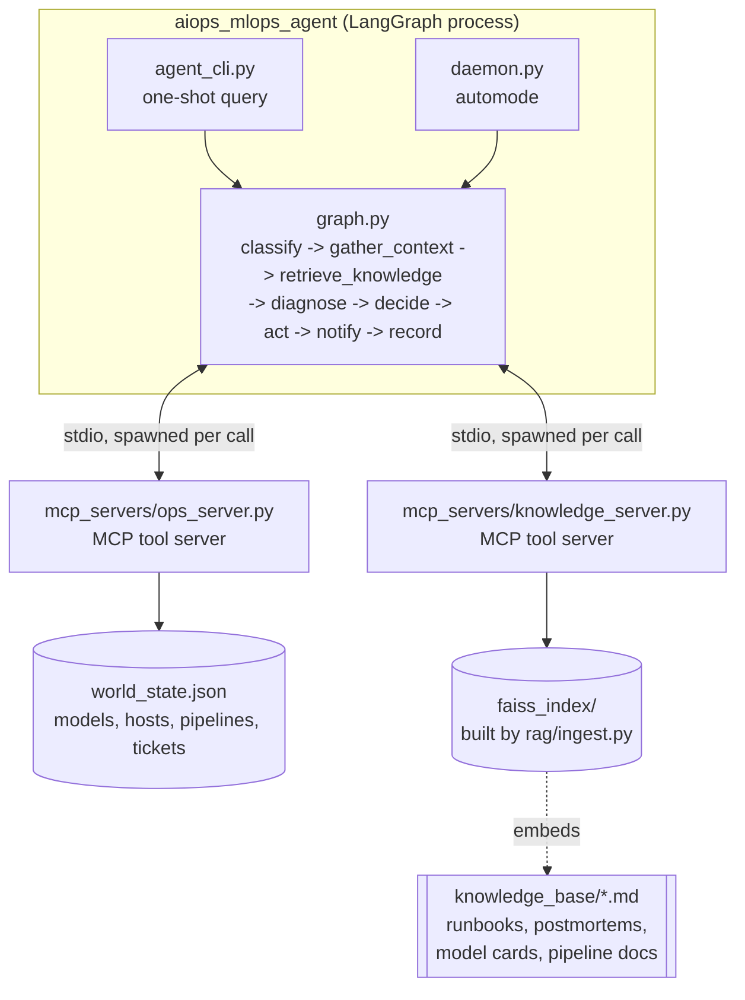
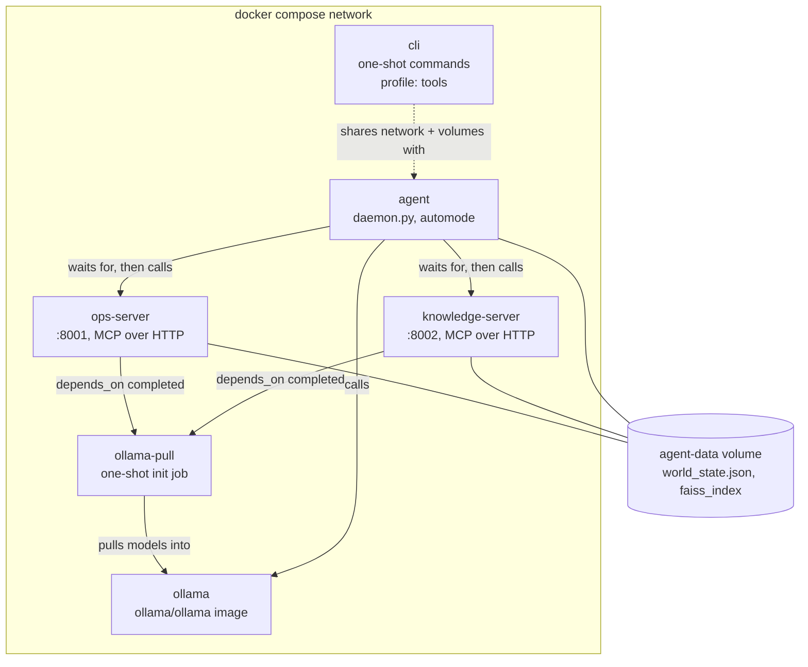

# AIOps/MLOps Incident Copilot

A self-contained agent that triages three real MLOps/AIOps incident classes through one
LangGraph pipeline:

- **Model drift** — a deployed model's predictions degrade (data drift, performance/AUC drift)
- **Infra anomalies** — a host/service runs hot, leaks memory, or falls short of its desired
  capacity
- **Pipeline failures** — a CI/CD or data pipeline run fails (stale upstream data, schema drift,
  OOM, or a transient blip)

For each incident it gathers live signals, retrieves grounding from a knowledge base of
runbooks/postmortems/model cards via **RAG**, diagnoses root cause with an LLM, decides whether
to auto-remediate or escalate to a human, and — if it acts — calls a real (mocked) system through
**MCP** tools, gated behind a dry-run-by-default safety switch.

Runs on a **local Ollama model by default** (no API key) with **Claude as a one-line config
swap**. Nothing here talks to a real MLflow, Prometheus, or CI system — `state.py`'s JSON file is
the entire mock world.

See [`purpose.md`](purpose.md) for why this project exists and the reasoning behind its key
design choices, and [`docs/AGENT_TYPES_AND_ACCESS.md`](docs/AGENT_TYPES_AND_ACCESS.md) for where
this agent sits in the broader landscape of agent designs and every way (implemented or not) it
can be reached.

## Architecture



Two MCP servers, two different concerns: `ops_server.py` exposes 18 tools across the three
domains (read tools + six mutating ones), `knowledge_server.py` exposes exactly one —
`search_knowledge_base`, backed by a local FAISS index. Both are spawned as **stdio
subprocesses** by `mcp_client.py` via `langchain-mcp-adapters`, not run as long-lived network
servers — there's no port to configure, no auth, nothing to leave running.

## The graph

| Node | Job | Calls the LLM? |
|---|---|---|
| `classify` | Map a free-text query to `(domain, entity)`. Automode events skip this — they already carry both. | Only for free-text queries |
| `gather_context` | Domain-specific MCP tool calls to pull live signals (model status/drift, host metrics/logs, pipeline run) | No |
| `retrieve_knowledge` | Search the knowledge base for relevant runbook/postmortem/model-card passages | No (embeds, no generation) |
| `diagnose` | Root cause, recommended action, confidence, escalate flag — grounded in both the live context and the retrieved passages | **Yes** |
| `decide` | Deterministic: confidence ≥ threshold and not escalating and action ≠ `monitor` → auto-remediate; sets severity | No |
| `act` | Calls the recommended mutating MCP tool if auto-remediating, else no-ops | No |
| `notify` | Prints/logs a notification | No |
| `record` | Files an incident ticket via MCP, auto-resolves it if the action was actually applied, appends one line to `audit_log.jsonl` | No |

Only two nodes touch the model. Everything else is deterministic Python that knows which tools a
given domain needs — there's no reason to spend a model call re-deriving that a `model_drift`
event needs `check_data_drift`.

## Safety model: dry-run by default, `--apply` to actually act

Six tools mutate world state: `rollback_model`, `trigger_retrain`, `restart_service`,
`scale_service`, `retry_pipeline`, `rollback_deployment`. All six check `APPLY_CHANGES` before
doing anything.

Because the ops server is a **separate process**, spawned fresh per run, `APPLY_CHANGES` can't be
an in-process flag the way a single-process agent would do it — `mcp_client.py` bakes it into the
subprocess's environment at spawn time, based on the `--apply` flag `agent_cli.py`/`daemon.py`
were started with:

- **Without `--apply` (default)**: mutating tools return `DRY RUN: would ...` and change nothing.
- **With `--apply`**: they actually mutate `world_state.json`.

Ticket filing (`create_incident_ticket`/`resolve_incident_ticket`) is *not* gated — filing a
record isn't a change to a production system, the same distinction most on-call tooling draws
between mutating and informational actions.

## Setup

```bash
python3 -m venv .venv
source .venv/bin/activate
pip install -r requirements.txt

brew install ollama
ollama serve
ollama pull qwen3.5:latest          # chat model (any tool-calling-capable model works)
ollama pull qwen3-embedding:0.6b    # embedding model for RAG
```

Build the mock world and the RAG index once:

```bash
python seed.py
python rag/ingest.py
```

## Run — interactive one-shot queries

```bash
python seed.py --model-drift fraud-detection
python agent_cli.py "why is fraud-detection showing degraded predictions?"
```

Investigate **and** remediate:

```bash
python agent_cli.py --apply "fraud-detection model seems to be predicting badly, please investigate and fix"
```

Any free-text on-call question works — the model, host/service, or pipeline just needs to be one
of the ones seeded in `state.py` (`fraud-detection`/`churn-prediction`/`recsys-ranker`,
`checkout-api`/`model-serving`, `pl-daily-etl`/`pl-feature-refresh`/`pl-model-retrain`).

## Run — automode (AIOps: reacts without a human prompting it)

Terminal 1 — start the daemon (dry-run by default):

```bash
python daemon.py                 # poll forever, Ctrl-C to stop
python daemon.py --apply         # remediation actions actually mutate world_state.json
python daemon.py --once          # drain whatever's queued right now and exit
```

Terminal 2 — feed it events (each one also seeds the matching incident into `world_state.json`,
so what the daemon investigates is real):

```bash
python events/simulate.py --scenario model-drift --model fraud-detection
python events/simulate.py --scenario infra-incident --host host-infer-01
python events/simulate.py --scenario pipeline-failure --pipeline pl-feature-refresh --reason upstream_stale
python events/simulate.py --scenario mixed             # one of each, touching all 3 domains
```

Watch terminal 1 react in real time — each event is picked up from `events/inbox/`, processed
through the full graph, and moved to `events/processed/` (or `events/failed/` if something threw).

### With `make`

```bash
make install
make pull
make reset
make ingest
make ask Q="why is fraud-detection showing degraded predictions?"
make fix Q="checkout-api is throwing errors, please fix it"     # --apply
make daemon                        # dry-run, foreground
make simulate SCENARIO=model-drift
make tail-audit                    # tail -f audit_log.jsonl in another terminal
make clean
```

## Swapping to Claude

Everything above runs on Ollama with zero configuration. To use Claude instead for the two LLM
calls (`classify` and `diagnose` — embeddings stay on Ollama regardless, since Anthropic has no
embeddings endpoint):

```bash
# .env
LLM_PROVIDER=claude
ANTHROPIC_API_KEY=sk-ant-...
ANTHROPIC_MODEL=claude-sonnet-5
```

No code changes — every node asks `llm.get_chat_model()` for a model rather than importing a
provider directly (`llm.py`). Verified: `LLM_PROVIDER=claude` without a key raises a clear
`RuntimeError` telling you what to set, rather than failing deep inside a LangChain call; with a
key set, `ChatAnthropic` constructs correctly.

## Docker / production simulation

Local dev runs everything in one Python process talking to two subprocesses over stdio and a
shared filesystem. `docker-compose.yml` simulates what this looks like as an actual
multi-service deployment — every process becomes its own container on a real Docker network:



Three things change compared to local stdio mode, on purpose — this is the part of "production
simulation" that's actually load-bearing, not just "put it in containers":

1. **MCP moves from stdio to network (`MCP_TRANSPORT=http`).** `ops_server.py`/`knowledge_server.py`
   serve over `streamable-http` instead of being spawned per tool call; `mcp_client.py` connects
   by URL (`http://ops-server:8001/mcp`) instead of spawning a subprocess. Verified locally before
   touching Docker at all: started `knowledge_server.py` with `MCP_TRANSPORT=http`, connected a
   bare `MultiServerMCPClient` over `streamable_http`, called `search_knowledge_base` — identical
   result shape to the stdio path.
2. **The dry-run gate moves from a client flag to a server property.** `ops-server` is a shared,
   long-running service now, not a subprocess spawned fresh per `agent_cli.py` invocation — so
   `--apply` can no longer flip `APPLY_CHANGES` per request (a client granting itself write access
   to a shared service on request would be a real safety hole, not just a code simplification).
   `APPLY_CHANGES` is fixed for the container's lifetime instead: `make docker-apply` restarts
   `ops-server` with it set, `make docker-dry-run` restarts it back. `docker compose run --rm cli
   python agent_cli.py --apply "..."` against a stack running dry-run prints a warning and does
   *not* mutate anything — `mcp_client.py`'s `build_client()` is the one place this is decided.
3. **State moves from "same filesystem" to "shared volume, explicit ownership."** `world_state.json`
   and `faiss_index/` live in the `agent-data` named volume; `docker/ops_entrypoint.sh` and
   `docker/knowledge_entrypoint.sh` seed/build them exactly once (checking the file exists first)
   so restarting a container to flip `APPLY_CHANGES` doesn't wipe accumulated ticket history.

### Running it

```bash
make docker-build       # build all three images (agent/ops-server/knowledge-server share one Dockerfile)
make docker-up          # ollama + both MCP servers + the automode agent, detached
make docker-logs                    # tail all services
make docker-logs SERVICE=agent      # tail just the agent
make docker-ask Q="why is fraud-detection showing degraded predictions?"
make docker-simulate SCENARIO=infra-incident
make docker-apply       # restart ops-server with APPLY_CHANGES=true
make docker-dry-run     # restart it back
make docker-down        # stop everything, keep volumes (models, state)
make docker-clean       # stop and delete volumes -- next docker-up re-pulls both models
```

First `docker-up` pulls both Ollama models inside the container's own volume (`ollama-models`) —
this is a genuine ~9GB download (`qwen3.5:latest` 6.6GB + `qwen3-embedding:0.6b` 639MB)
independent of any models you already have locally via native Ollama, and realistically takes
15-20+ minutes depending on bandwidth. `ollama-pull` is a one-shot init job (`depends_on:
condition: service_completed_successfully`) that every other service waits on; watch its progress
with `docker compose logs -f ollama-pull`.

### Real problems found running this in Docker (worth knowing before you hit them)

Verifying this stack surfaced two real bugs — both fixed, both worth understanding if you're
containerizing a similar Python agent:

- **Container logs looked completely empty for over a minute after every service clearly started.**
  `docker compose logs agent` showed the entrypoint's dependency-wait messages, then nothing —
  no `daemon.py` startup line, no per-event processing output — even though the daemon was
  running and (per a later check) had already picked up and failed on a queued event. Root cause:
  Python block-buffers stdout when it isn't a TTY, which is always true for a containerized
  process's stdout under `docker compose logs`. Fixed with one line in the `Dockerfile`:
  `ENV PYTHONUNBUFFERED=1`. If a containerized Python service's logs seem to lag reality or go
  silent for long stretches, check this before assuming the process is stuck.
- **`ollama`'s `llama-server` gets OOM-killed mid-diagnosis under a constrained Docker VM.** After
  fixing the buffering issue, `docker compose logs agent` showed the real failure:
  `FAILED: llama-server process has terminated: signal: killed (status code: 500)`. Docker
  Desktop's VM had 7.75GiB of memory allocated — not enough headroom to load a 9.7B model
  (`qwen3.5:latest`, ~6.6GB quantized on disk) plus its KV cache plus four other containers
  (`ollama`, `ops-server`, `knowledge-server`, `agent`) sharing the same VM. **This is an
  infrastructure requirement, not a code bug**: give Docker Desktop at least 12-16GB of memory
  (Settings → Resources → Memory) before running this stack with the default model. If you hit
  this and can't allocate more memory, `OLLAMA_MODEL`/`OLLAMA_EMBED_MODEL` in `.env` (or as
  compose environment overrides) accept any smaller Ollama model as a drop-in swap — nothing else
  in the stack needs to change.

## Verified example run

Real output, `qwen3.5:latest`, `python seed.py --model-drift fraud-detection` followed by:

```
$ python agent_cli.py "why is fraud-detection showing degraded predictions?"

Domain: model_drift    Entity: fraud-detection    Severity: medium

Root cause:
  Model v3 has experienced genuine distribution shift causing AUC degradation from 0.863 to
  0.727 (delta -0.136), with transaction_amount and device_type features showing significant
  drift scores above the 0.3 threshold, indicating real feature distribution change rather than
  pipeline staleness given healthy recent pipeline status.

Reasoning:
  Analyzing live context against knowledge base guidance: (1) Model drift shows AUC delta of
  -0.136, which exceeds the critical threshold of -0.10 from model card; (2) Data drift detected
  with transaction_amount (0.403) and device_type (0.564) both above 0.3 threshold per runbook;
  (3) Feature pipeline shows last_status "succeeded" ... no stale/failed indicators visible in
  current context, unlike the postmortem incident where failures went unnoticed initially but
  were later discovered by direct status check; (4) Latency p95 is 52ms below target of 60ms from
  model card, indicating serving infrastructure not under pressure. Per runbook decision guide:
  "Confidence high, feature-pipeline healthy, AUC delta worse than -0.10 -> roll back to previous
  deployed version immediately (rollback_model), then trigger retrain."

Recommended action: rollback_model (confidence 0.85, escalate=False)
Auto-remediated: True

Action result:
  DRY RUN: would roll back fraud-detection from v3 to v2. Re-run the agent with --apply to execute.

Knowledge sources used: ['model_cards/fraud_detection_card.md', 'runbooks/model_drift_response.md',
'postmortems/postmortem_fraud_detection_drift_2026_03.md', 'model_cards/recsys_ranker_card.md']

Ticket: INC-0001 (open, medium)
```

This is genuine RAG grounding, not decoration: the diagnosis quotes the exact decision rule from
`runbooks/model_drift_response.md` ("Confidence high, feature-pipeline healthy, AUC delta worse
than -0.10...") and explicitly checks the feature pipeline first — the specific lesson from
`postmortems/postmortem_fraud_detection_drift_2026_03.md` — before concluding the drift is real
rather than a stale-pipeline artifact.

Re-running with `--apply` on a freshly seeded incident: the same reasoning fired, `rollback_model`
returned `APPLIED: roll back fraud-detection from v3 to v2.`, and `world_state.json` afterward
showed `deployed_version: 2`, `error_rate` down from `0.0192` to `0.0022`, and the ticket
auto-resolved (`INC-0001`, status `resolved`) — the loop is closed end to end, no human touched
`world_state.json` directly.

### Automode, a genuine escalation

```
$ python events/simulate.py --scenario infra-incident --host host-web-01
-> wrote evt-8155c250.json: infra_anomaly/checkout-api -- Host host-web-01 degraded: cpu=93% mem=96%

$ python daemon.py --once
Daemon started (apply_changes=False). Watching events/inbox ...

=== processing evt-8155c250.json: infra_anomaly/checkout-api -- Host host-web-01 degraded: cpu=93% mem=96% ===
[notify] [CRITICAL] infra_anomaly/checkout-api: Traffic-driven load spike causing fleet-wide
memory pressure and connection exhaustion on checkout-api, with host-web-01 crossing threshold
first while traffic continues to distribute across the under-provisioned fleet. Restarting would
create capacity gap during restart duration without fixing underlying undersized pool for current
QPS. -- Escalated to human review; no automated action taken.
    ticket: INC-0001 (open)
```

Only `host-web-01` was actually seeded as degraded — `host-web-02` was healthy (24% CPU, 40%
mem) the whole time, confirmed by reading `world_state.json` directly. The model chose to
escalate anyway, citing `postmortems/postmortem_checkout_api_oom_2026_02.md`'s specific warning
that a traffic-driven spike tends to hit every host on a service at once, and that restarting one
host of a two-host fleet under real load removes capacity a fleet already near its limit can't
spare. That's a defensible, cautious read of the postmortem given `running_count: 1` against a
`desired_count: 3` — genuine evidence of capacity loss — even though it slightly overstates
"fleet-wide" pressure that, in this particular run, was really still confined to one host. Worth
knowing before trusting an escalation reason at face value: it's grounded, not fabricated, but
grounded reasoning can still generalize a passage's warning slightly further than the literal
data in front of it supports.

## Reliability notes (read this)

- **`.with_structured_output(method="function_calling")` occasionally returns `None` instead of
  raising** when a local model answers without making the expected tool call — observed on
  `qwen3.5:latest` against the longer `diagnose` prompt (full context + retrieved passages), even
  after raising `num_ctx` to 16384 (see below), so it isn't purely a truncation artifact. One real
  captured instance, verbatim from `audit_log.jsonl` during testing:
  ```json
  {"domain": "pipeline_failure", "entity": "pl-feature-refresh",
   "diagnosis": {"reasoning": "Structured diagnosis output failed after retries; escalating instead of guessing.",
                 "root_cause": "Diagnosis unavailable -- the model did not return a parseable structured response.",
                 "recommended_action": "monitor", "confidence": 0.0, "escalate": true},
   "auto_remediate": false}
  ```
  `graph.py`'s `_invoke_structured()` retries up to twice before giving up; `diagnose_node` treats
  a persistent `None` as exactly this fallback rather than crashing the graph or `daemon.py`'s
  poll loop on a bad response. `classify_node` degrades to `domain="unknown"` the same way. If
  you're using `with_structured_output` against a local model anywhere else, check whether you're
  actually handling a `None` return or just assuming a `BaseModel` always comes back.
- **Ollama defaults to a 4096-token context window regardless of what the model supports.**
  `diagnose`'s prompt (live context + several retrieved passages) blows past that easily, and the
  failure mode isn't a clean error — it's silent truncation plus, observed directly during
  testing, a several-times slowdown from `llama.cpp`'s `--context-shift` re-processing older
  context as new tokens arrive. `llm.py` sets `num_ctx=16384` (`OLLAMA_NUM_CTX` in `.env`) for
  exactly this reason. If a local-model project feels inexplicably slow or gives shallow
  responses on long prompts, check `num_ctx` before assuming it's a model-quality problem.
- **The same infra scenario didn't always get the same recommendation across separate runs** —
  one run of `host-infer-01` degraded (single host, sibling healthy) recommended `restart_service`
  at 0.85 confidence and auto-remediated; a near-identical run on the same scenario recommended
  `scale_service` and escalated instead, both citing the same runbook. The runbook itself holds
  two true things in tension (a single degraded host with healthy siblings usually just needs a
  restart; `running_count < desired_count` is itself evidence of a capacity problem) and doesn't
  fully resolve which wins when both apply at once — the model's inconsistency here is a fair
  reflection of a genuinely underspecified decision boundary in the source document, not pure
  noise. Worth tightening the runbook's guidance, not just the prompt, if this matters for a real
  deployment.
- **`function_calling` was the deliberate choice over the default JSON-schema-prompting mode**
  for the Ollama path (see `llm.structured_output_method()`) — it routes structured output
  through the model's native tool-calling instead of asking it to emit raw JSON prose, which is
  more reliable on a 9.7B local model for a schema with an enum field (`recommended_action`)
  and a boolean (`escalate`). Claude's tool-calling is reliable enough either way, so the switch
  only affects the Ollama path.
- **Each MCP tool call opens a fresh stdio subprocess.** `langchain-mcp-adapters` documents this
  directly (`MultiServerMCPClient.get_tools`: "a new session will be created for each tool
  call") — it's not a bug in this project, it's how the adapter is designed to work. It means a
  single `diagnose` cycle (3-4 context calls + 1 retrieval call + 1-2 action/ticket calls) spawns
  and tears down several Python processes, which is the main reason a single `agent_cli.py`
  invocation takes several seconds even though the actual LLM calls are fast. Fine for a project
  at this scale; a production version pinning long-lived MCP sessions would remove this
  overhead.
- **A stale upstream pipeline can look exactly like model drift** — this isn't a model quirk, it's
  the whole point of `postmortems/postmortem_fraud_detection_drift_2026_03.md` being in the
  knowledge base and `gather_context_node`'s `model_drift` branch always pulling
  `pl-feature-refresh`'s status alongside the drift checks. Delete that postmortem from the
  knowledge base and re-run the same scenario to see the diagnosis get shallower — a decent way
  to sanity-check that retrieval is actually influencing the outcome, not just being retrieved
  and ignored.

## Extending it

- **Add a domain**: add tools to `mcp_servers/ops_server.py`, an entry to `ACTIONS_BY_DOMAIN` in
  `schemas.py`, a branch in `gather_context_node`, an arg-builder in `_ACTION_ARG_BUILDERS`, and
  a doc or two under `knowledge_base/` so `diagnose` has something to ground against.
- **Point it at a real backend**: replace `state.py`'s functions with real MLflow/Prometheus/CI
  API calls behind the same signatures the tools already call. The graph, the dry-run gate, and
  the MCP boundary don't need to change — only what's on the other side of `ops_server.py` does.
  Do this deliberately: least-privilege credentials for whatever the server authenticates as,
  human approval on mutating actions in production, and real audit logging beyond
  `audit_log.jsonl` before this touches anything real.
- **Grow the knowledge base**: drop more markdown into `knowledge_base/` and re-run
  `python rag/ingest.py` (it fully rebuilds — no incremental update path, fine at this scale).
- **Swap the chat model**: `OLLAMA_MODEL` in `.env` for any tool-calling-capable Ollama model, or
  flip `LLM_PROVIDER=claude` — see [Swapping to Claude](#swapping-to-claude).
- **Persist conversation state across turns**: there's no session/checkpointer here on purpose —
  every `agent_cli.py` call and every automode event is independent. If you want a multi-turn
  chat on top of this, a `langgraph-checkpoint-sqlite` checkpointer on `build_graph()`'s
  `.compile()` call is the natural place to add it.

## Troubleshooting

- **`FileNotFoundError: world_state.json does not exist yet`** — run `python seed.py` first.
- **`No index at faiss_index/index.faiss`** — run `python rag/ingest.py` first.
- **`Could not reach Ollama at http://127.0.0.1:11434`** — `ollama serve` isn't running, or a
  model referenced in `.env` hasn't been pulled (`ollama pull <model>`).
- **Diagnosis looks unusually shallow / low confidence with `escalate=True` and no real
  reasoning** — check for `"Structured diagnosis output failed after retries"` in `root_cause`;
  see [Reliability notes](#reliability-notes-read-this) above.
- **`daemon.py --once` says "Nothing queued"** — run `events/simulate.py` first; events land in
  `events/inbox/`, and `--once` only drains what's there at the moment it runs.
- **A file appears in `events/failed/`** — the graph raised while processing it; check the
  daemon's stderr for the actual exception (malformed event JSON is the most common cause).
- **`LLM_PROVIDER=claude` fails immediately** — confirm `ANTHROPIC_API_KEY` is set in `.env`;
  `llm.py` raises a clear `RuntimeError` naming the missing variable rather than failing deep
  inside a LangChain call.
- **(Docker) `docker compose logs agent` shows the entrypoint's wait messages and then nothing,
  for a long time** — this is almost certainly Python's stdout buffering, not a stuck process;
  confirm the `Dockerfile` has `ENV PYTHONUNBUFFERED=1` and rebuild if you've modified it. See
  [Docker / production simulation](#docker--production-simulation) above.
- **(Docker) an event fails with `llama-server process has terminated: signal: killed`** — Docker
  Desktop doesn't have enough memory allocated for the model; give it at least 12-16GB (Settings
  → Resources → Memory) or switch to a smaller `OLLAMA_MODEL`. Not specific to this project —
  any containerized Ollama workload hits this the same way.
