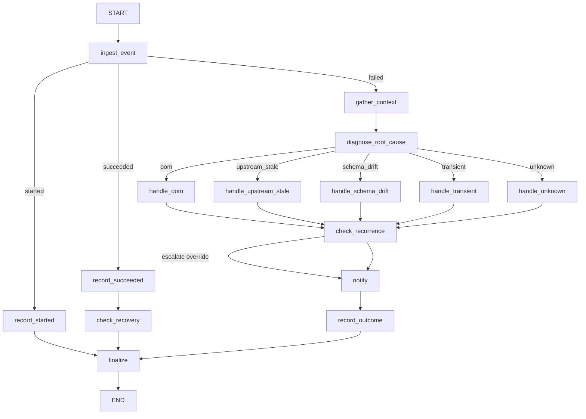

# Databricks Pipeline Autopilot (LangGraph, automode)

A self-contained agentic project for a real data-platform use case: an autonomous agent that
watches a stream of Databricks job-run events and reacts to each one **without a human prompting
it** — diagnosing failures, deciding on and (optionally) applying remediation, escalating what it
can't fix, and closing the loop when a job recovers. It keeps running and keeps responding to
events for as long as the process is alive: this is "automode," as distinct from every other
project in this repo, which answers one request and exits.

Runs against a **mock Databricks-shaped world** (jobs, clusters, upstream tables) and a **local
Ollama model**. No Databricks SDK, no workspace credentials, nothing real touched. Read
[`../docs/Agentic_Concepts/13-trusted-tools-landscape.md`](../docs/Agentic_Concepts/13-trusted-tools-landscape.md)
first — it's the reference this project's architecture choices (LangGraph for the chain, a
lightweight polling loop instead of Temporal/Kafka for automode, dry-run-by-default for safety)
were made against.

## Why this is "very complex" and why LangGraph

Earlier projects in this repo use one tool-calling loop (`../langgraph_ollama_agent`) or a
handful of agent handoffs (`../devops_sre_agent`). This one is a single **15-node graph** with two
conditional routers and a cross-cutting override, because a real pipeline-reliability chain
genuinely branches that much: what happened (started/succeeded/failed) determines the first fork;
for a failure, *why* it failed determines a second fork into one of five different remediation
strategies; and regardless of which strategy ran, a job that keeps failing gets escalated anyway.
LangGraph is the right tool here for the same reason it's used in
[Chapters 1–12](../docs/Agentic_Concepts/00-agentic-concepts.md): the branching is easier to read,
test, and extend as an explicit graph than as an implicit loop.



| Node | Job |
|---|---|
| `ingest_event` | Normalize the event, pull recent run history |
| `record_started` / `record_succeeded` | Log the run; the short path for non-failures |
| `check_recovery` | If a job that just succeeded has an open ticket, auto-resolve it |
| `gather_context` | Pull cluster config, upstream table freshness, run history — the only tool-style I/O before diagnosis |
| `diagnose_root_cause` | **The only LLM call in the graph.** Structured output classifies the failure |
| `handle_oom` / `handle_upstream_stale` / `handle_schema_drift` / `handle_transient` / `handle_unknown` | Five different remediation strategies, chosen by the diagnosis |
| `check_recurrence` | Cross-cutting override: 3+ failures in the last 5 runs escalates regardless of what the handler above decided |
| `notify` | One notification per failed run, severity-tagged |
| `record_outcome` | Files (or reuses) an incident ticket if escalated |
| `finalize` | Appends one structured line to `audit_log.jsonl`, whatever path was taken |

Only `diagnose_root_cause` calls the model — every other node is plain, testable Python, per
[Chapter 10](../docs/Agentic_Concepts/10-best-practices.md#separate-deterministic-logic-from-llm-calls).

## Automode: the event loop

```
event_simulator.py  --writes-->  events/inbox/*.json  --watched-by-->  daemon.py  --moves-to-->  events/processed/ (or events/failed/)
```

`daemon.py` polls `events/inbox/` every `POLL_INTERVAL_SECONDS`, runs the graph once per event
file (oldest first), and moves the file to `processed/` or `failed/` when done — then goes back to
polling, forever, until you Ctrl-C it. `event_simulator.py` stands in for a real event source
(Databricks job webhooks, EventBridge, a Kafka topic) by dropping realistic event files into the
same directory; run it in one terminal and `daemon.py` in another to watch the agent react live.
This is the concrete meaning of "keeps responding to events" — no per-event human prompt, just a
loop that reacts to whatever shows up.

Per [Chapter 13](../docs/Agentic_Concepts/13-trusted-tools-landscape.md#durable--event-driven-orchestration),
a watched directory + polling loop is a deliberately light choice over Temporal/Kafka: the durable
state that actually matters (run history, open tickets) lives in `pipeline_state.json` and
`audit_log.jsonl`, not in the loop itself, so the loop is disposable and safe to restart — the
right trade-off for this project's event volume, not necessarily for a production system's.

## Safety model: read by default, mutate only with `--apply`

Same pattern as `../devops_sre_agent`: `resize_cluster` (inside `handle_oom`) and the retry action
(inside `handle_transient`) check `config.APPLY_CHANGES` before doing anything. Without `--apply`
they report `DRY RUN: would ...` and change nothing; with it, they actually mutate
`pipeline_state.json`. Notifications and ticket filing are not gated — they're informational, not
destructive, so they always happen (the same distinction `../docs/Agentic_Concepts/13-trusted-tools-landscape.md#guardrails-and-safety`
draws between mutating actions needing a guardrail and read/record actions that don't).

## Setup

```bash
python3 -m venv .venv
source .venv/bin/activate
pip install -r requirements.txt

brew install ollama
ollama serve
ollama pull qwen3.5:latest
```

## Run

Terminal 1 — start the daemon (dry-run by default):

```bash
python reset_state.py
python daemon.py            # or: python daemon.py --apply
```

Terminal 2 — feed it events:

```bash
python event_simulator.py --scenario recurring-oom     # one job, 3 consecutive OOM failures
python event_simulator.py --scenario schema-drift
python event_simulator.py --scenario upstream-delay
python event_simulator.py --scenario transient-then-recover
python event_simulator.py --scenario mixed              # touches all 3 jobs, all 4 categories
python event_simulator.py --forever                     # random events until Ctrl-C
```

Watch terminal 1 react in real time. `python daemon.py --once` drains whatever's currently queued
and exits instead of polling forever — useful for scripted testing (what the transcripts below
were captured with).

### With `make`

```bash
make install
make pull
make reset
make watch                          # daemon, dry-run, foreground
make simulate SCENARIO=recurring-oom
make tail-audit                     # tail -f audit_log.jsonl in another terminal
make clean
```

## Verified example runs

Three real runs against the local model, `--once` mode, unedited except for trimming repeated
`ingested`/log lines for length.

**1. Recurrence override** — the same job fails with OOM three times in a row:

```
$ python event_simulator.py --scenario recurring-oom --job job-daily-sales-etl
$ python daemon.py --once
[notify] [WARNING] daily_sales_etl: oom — DRY RUN: would resize cluster-prod-etl from 4 to 8 workers.
  - diagnosed category=oom confidence=0.95 ... 1 failures in last 5 runs, below escalation threshold
[notify] [WARNING] daily_sales_etl: oom — DRY RUN: would resize cluster-prod-etl from 4 to 8 workers.
  - diagnosed category=oom confidence=1.00 ... 2 failures in last 5 runs, below escalation threshold
[notify] [CRITICAL] daily_sales_etl: oom — DRY RUN: would resize cluster-prod-etl from 4 to 8 workers.
  - diagnosed category=oom confidence=0.95
  - RECURRENCE OVERRIDE: 3 failures in the last 5 runs for job-daily-sales-etl — escalating regardless of category handler decision.
  - sent critical notification
  - filed ticket INC-0001
```

First two failures: proposed the same fix (dry-run), no ticket — a single OOM isn't yet an
incident. Third failure: `check_recurrence` overrides the category handler's normal "just warn"
behavior and escalates, because three failures in five runs is a pattern, not a blip.

**2. Auto-resolve on recovery** — continuing the same job, a transient failure hits the retry
cap (recurrence was already active) and escalates, then the *next* run succeeds:

```
$ python event_simulator.py --scenario transient-then-recover --job job-daily-sales-etl
$ python daemon.py --once
[notify] [CRITICAL] daily_sales_etl: transient — Exceeded 2 automatic retries for job-daily-sales-etl; escalating instead of retrying again.
  - RECURRENCE OVERRIDE: 3 failures in the last 5 runs ...
  - reusing open ticket INC-0001
...
[notify] RECOVERED: daily_sales_etl succeeded after incident INC-0001 — ticket auto-resolved.
  - job recovered, auto-resolved INC-0001
```

`record_outcome` reused the still-open ticket instead of filing a duplicate; `check_recovery`
closed it out the moment the job succeeded again — no human touched a ticket system either time.

**3. Mixed fleet** — 12 events across all 3 jobs and all 4 failure categories in one run:

```
$ python event_simulator.py --scenario mixed
$ python daemon.py --once
job-churn-features succeeded                          -> recorded, no action
job-daily-sales-etl failed (transient)                 -> diagnosed transient, DRY RUN retry 1/2
job-inventory-sync succeeded                           -> recorded, no action
job-churn-features failed (oom)                        -> diagnosed oom, DRY RUN resize cluster-prod-ml 2->4
job-daily-sales-etl failed (schema_drift)              -> diagnosed schema_drift, escalated, filed INC-0001
job-inventory-sync failed (upstream_stale)             -> diagnosed upstream_stale, notified owner, no ticket
```

All four categories were classified correctly against their seeded error message this run — see
Reliability notes below for why that's not guaranteed every time.

## Reliability notes (read this)

Building this surfaced one finding worth knowing before you trust `with_structured_output` on a
local model for anything routing-critical:

- **`method="json_schema"` (LangChain's default) was unreliable here.** Testing the same 4
  failure-category prompts, the default method got 2/4 categories right and threw an
  `OutputParserException` (invalid JSON) on a 3rd. Switching to **`method="function_calling"`**
  (routes structured output through the model's native tool-calling instead of asking it to emit
  raw JSON prose) got 3/4 right with zero parse failures. `graph.py`'s `build_diagnosis_llm()`
  uses `function_calling` for this reason — if you're using `with_structured_output` anywhere
  else in a LangChain project against a local model, it's worth checking which method you're
  actually getting and whether the default is the reliable one for your model.
- **Field order in the Pydantic schema matters less than expected.** `schemas.py`'s `Diagnosis`
  puts `reasoning` before `category` specifically to force a "think, then answer" ordering within
  the same structured call — a lower-effort fix worth trying before reaching for anything fancier.
  It didn't fully close the gap on its own (see above); switching `method` did the heavy lifting.
- **The one remaining misclassification was a defensible ambiguity, not nonsense**: an
  `upstream_stale`-seeded error was classified as `transient` with 0.75 confidence — genuinely
  lower confidence than the other three (0.95+), which is itself a usable signal. A production
  version of this pattern should treat low `diagnosis.confidence` as its own routing case (e.g.
  escalate for human review below some threshold) rather than trusting every classification
  equally regardless of confidence.

Combined with `../devops_sre_agent/README.md#reliability-notes-read-this`'s finding (a model
claiming an action it never took), the pattern across both projects: **local models are reliable
enough to build real agentic systems on, but only if you keep independent, structural checks on
what they actually did** (tool-call logs, an audit log, confidence thresholds) — never just the
model's own prose account of itself.

## Extending it

- **Add a failure category**: add a value to `Category` in `schemas.py`, a `handle_<category>`
  node in `graph.py`, and a branch in `route_by_category`'s path map.
- **Add a job or cluster**: extend `_BASELINE` in `pipeline_state.py` — no code changes needed
  elsewhere, `gather_context` reads jobs/clusters generically.
- **Point it at a real Databricks workspace**: replace `pipeline_state.py`'s functions with real
  Databricks SDK calls (`list_runs`, `get_cluster`, `resize`, `repair_run`, ...) behind the same
  signatures, and swap `event_simulator.py` for a real webhook receiver. The graph, routing, and
  dry-run gate don't need to change — same boundary `../devops_sre_agent/README.md#extending-it`
  draws for pointing that project at real AWS.
- **Swap the polling loop for something durable**: if event volume or reliability requirements
  outgrow a watched directory, `../docs/Agentic_Concepts/13-trusted-tools-landscape.md#durable--event-driven-orchestration`
  is the reference for what to reach for (Temporal for crash-recoverable workflows, Kafka/SQS for
  real event transport) — `daemon.py`'s `process_one()` is already the natural unit to hand to
  whichever one you pick.

## Troubleshooting

- **`FileNotFoundError: pipeline_state.json does not exist yet`** — run `python reset_state.py`
  first.
- **Daemon exits immediately** — you passed `--once` with nothing in `events/inbox/`; run
  `event_simulator.py` first, or drop the flag to poll continuously.
- **A file appears in `events/failed/`** — the daemon hit an exception processing it (check
  stderr); malformed JSON or an unrecognized `job_id` are the two most likely causes with the
  bundled jobs.
- **Diagnosis category looks wrong** — see [Reliability notes](#reliability-notes-read-this); check
  `diagnosis.confidence` and `diagnosis.reasoning` in the console trace, not just the category.
- **Two jobs seem to share ticket/recurrence state** — they shouldn't; recurrence and open tickets
  are tracked per `job_id`. If you see this, check `pipeline_state.json` directly rather than
  trusting a notification message alone.
