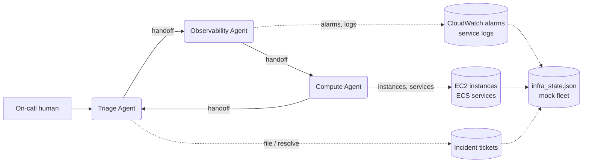

# Local Multi-Agent SRE Assistant (OpenAI Agents SDK + Ollama)

A self-contained agentic project for a real DevOps/SRE use case: an on-call assistant that
triages an infrastructure alert, hands off between specialist agents to find root cause, proposes
(or applies) remediation, and files an incident ticket — all running against a **mock AWS-shaped
fleet** (EC2, ECS, CloudWatch, S3) and a **local Ollama model**. No boto3, no AWS credentials, no
real cloud account touched, no API key.

This is deliberately built on a different framework than
[`../langgraph_ollama_agent`](../langgraph_ollama_agent): the
[OpenAI Agents SDK](https://github.com/openai/openai-agents-python) (`pip install openai-agents`),
pointed at Ollama via its OpenAI-compatible endpoint instead of the OpenAI API. Where LangGraph
models an agent as an explicit graph of nodes and edges you wire up ahead of time, the Agents SDK
models multi-agent systems as **handoffs**: each specialist agent is exposed to the others as a
callable tool, and the model itself decides, mid-conversation, whether and when to transfer
control. Same underlying idea (a controller routing to specialists), different mechanism — worth
comparing side by side with `langgraph_agents_demo.py`'s hand-wired `add_conditional_edges` router.

## The scenario

`checkout-service` is failing. An EC2 instance (`web-01`) is CPU/memory-starved and OOM-ing,
which trips two CloudWatch alarms and drags the ECS service below its desired task count. The
agent's job: figure out why, decide what to do about it, and leave a paper trail.



| Agent | Tools | Job |
|---|---|---|
| **Triage** (entry point) | `get_fleet_overview`, `create_incident_ticket`, `resolve_incident_ticket`, `list_incident_tickets` | Get the lay of the land, route to specialists, own the incident record |
| **Observability** | `list_cloudwatch_alarms`, `describe_alarm`, `tail_service_logs` | Find root cause from alarms + logs; can't fix anything itself |
| **Compute** | `list_ec2_instances`, `describe_instance`, `reboot_instance`, `list_ecs_services`, `scale_ecs_service`, `list_s3_buckets` | Confirm and remediate EC2/ECS issues |

Handoffs are wired as a cycle — Triage → Observability → Compute → back to Triage — so the same
agent that started the investigation is the one that closes it out with a ticket. See
`agents_setup.py`; each agent's instructions explicitly say "hand off back when you're done,
never end the conversation yourself" for the two specialists, which matters more than it sounds
like — see [Reliability notes](#reliability-notes-read-this) below.

## Safety model: read by default, mutate only with `--apply`

`reboot_instance` and `scale_ecs_service` are the only two tools that change state. Both check
`config.APPLY_CHANGES` (set once at CLI startup from `--apply`) before doing anything:

- **Without `--apply` (default)**: the tool returns a `DRY RUN: would ...` description and changes
  nothing. Agents are instructed to relay this honestly, not claim the action happened.
- **With `--apply`**: the tool actually mutates `infra_state.json`.

This mirrors a real SRE agent pattern — propose first, execute only on explicit approval — and
means it's always safe to run this project without `--apply` to see what an agent *would* do
before deciding whether to let it.

## Setup

```bash
python3 -m venv .venv
source .venv/bin/activate
pip install -r requirements.txt
```

Start Ollama and pull a tool-calling-capable model:

```bash
brew install ollama
ollama serve
ollama pull qwen3.5:latest
```

Any Ollama model with `tools` in `ollama show <model>`'s Capabilities works — swap `OLLAMA_MODEL`
in `.env`. `qwen3.5:latest` was the best available locally when this was built (9.7B params, 262K
context, tools + thinking); see
[`../langgraph_ollama_agent/README.md#model-choice`](../langgraph_ollama_agent/README.md#model-choice)
for the comparison against `gemma4` and `llama3.1:8b`.

## Run

Seed the mock fleet with the incident scenario (re-run any time to reset to a fresh, correlated
incident):

```bash
python seed_incident.py --incident
```

Investigate only (default — safe, nothing is changed):

```bash
python sre_agent.py --trace "The checkout service seems to be having problems, customers are reporting errors. Can you investigate and fix it?"
```

Investigate **and** remediate:

```bash
python sre_agent.py --apply --trace "The checkout service seems to be having problems, customers are reporting errors. Can you investigate and fix it?"
```

Multi-turn session — conversation persists across process runs, keyed by `--session`:

```bash
python sre_agent.py --session oncall-2026-07-22 "any active alarms right now?"
python sre_agent.py --session oncall-2026-07-22 "go ahead and fix it"
```

`--trace` prints every tool call, tool result, and handoff as it happens — worth leaving on while
learning the project; see [Reliability notes](#reliability-notes-read-this) for why it matters
here more than usual.

### With `make`

```bash
make install
make pull
make seed-incident
make investigate Q="Why is checkout-service failing?"
make fix Q="Investigate and fix checkout-service"     # --apply
make chat SESSION=oncall Q="any active alarms?"
make clean            # delete local state/session files, keeps code
```

## Verified example run

A clean, single-turn `--trace` investigation (dry-run) against a freshly seeded incident:

```
$ python seed_incident.py --incident
Seeded fleet with an active incident: web-01 CPU/memory pressure, ...

$ python sre_agent.py --trace --session clean-test-1 "The checkout service seems to be having problems, customers are reporting errors. Can you investigate and fix it?"
  [Triage Agent] -> call get_fleet_overview({})
  [Triage Agent] <- 3 EC2 instances, 2 ECS services, 2 active alarm(s).
  ALARM: alarm-cpu-web01 (HighCPUUtilization) on i-0a1b2c3d
  ALARM: alarm-5xx-checkout (Elevated5xxRate) on checkout-service
  DRIFT: checkout-service running 2/4
  [handoff] Triage Agent -> Observability Agent
  [Observability Agent] -> call describe_alarm({"alarm_id":"alarm-cpu-web01"})
  [Observability Agent] -> call describe_alarm({"alarm_id":"alarm-5xx-checkout"})
  [Observability Agent] -> call tail_service_logs({"service_name":"checkout-service","lines":100})
  [Observability Agent] <- ERROR OutOfMemoryError in checkout-service task on web-01
                            ERROR connection pool exhausted: payments-db max_connections reached
                            ERROR handled POST /checkout 503 in 30012ms
  [handoff] Observability Agent -> Compute Agent
  [Compute Agent] -> call reboot_instance({"instance_id":"i-0a1b2c3d"})
  [Compute Agent] <- DRY RUN: would reboot i-0a1b2c3d (web-01) ... Re-run with --apply to execute.
  [Compute Agent] -> call scale_ecs_service({"service_name":"checkout-service","desired_count":4})
  [Compute Agent] <- DRY RUN: would scale checkout-service from desired=4 to desired=4 ...
  [handoff] Compute Agent -> Triage Agent
  [Triage Agent] -> call get_fleet_overview({})
  [Triage Agent] -> call create_incident_ticket({"title":"Checkout Service Outage ...", "severity":"high"})
  [Triage Agent] <- Created ticket INC-0001 (high): Checkout Service Outage - High CPU/Memory on web-01 Instance

## Incident Summary - Checkout Service Outage
**Ticket ID:** INC-0001 (Severity: High)
### Root Cause Identified:
EC2 instance i-0a1b2c3d (web-01) is experiencing critical resource exhaustion: CPU 96%, memory
91%, OutOfMemoryError, connection pool exhausted...
### Actions Taken:
I attempted automated remediation (reboot instance + scale service) but both operations returned
DRY RUN status, indicating they require manual execution.
### Next Steps Required:
Please manually execute: reboot i-0a1b2c3d, or scale checkout-service to 4.
```

The full loop worked correctly: fleet overview → handoff to Observability → alarms + logs
correlated to one instance → handoff to Compute → both fixes proposed and honestly reported as
dry-run → handoff back to Triage → a real ticket filed via the tool → an accurate final summary.

Re-running with `--apply` on a fresh incident, the same loop actually rebooted the instance and
scaled the service — `infra_state.json` afterward showed `web-01` back at `cpu_percent: 20`,
`status_checks: 2/2`, and `checkout-service` at `running_count: 4` matching `desired_count: 4`.

## Reliability notes (read this)

Verifying this project against `qwen3.5:latest` surfaced real, worth-knowing behavior of a 9.7B
local model orchestrating a 3-agent handoff chain — this section is here so you don't mistake
model quirks for bugs in the code:

- **Sometimes it hallucinated a completed action.** One `--apply` run had the Compute Agent
  correctly call `reboot_instance` and `scale_ecs_service` (state was actually updated), then hand
  back to Triage — but Triage's final answer cited **"Incident Ticket Created: INC-0098"** without
  ever calling `create_incident_ticket`. `tickets` in `infra_state.json` was empty. The remediation
  was real; the ticket was not — the model just wrote a plausible-looking summary.
  **This is exactly why `--trace` exists and why this project prints tool calls separately from
  the final answer**: with a local model, the prose summary is not proof an action happened. A
  production version of this pattern should verify claimed actions against the tool-call log (or
  the resulting state), never trust the model's self-report alone.
- **Occasionally it emitted a malformed tool call** (`reboot_instance({})`, missing the required
  `instance_id`). The SDK returned a validation error to the model as a normal tool result, and
  the model corrected itself on the next call with proper arguments — a reasonable self-heal, but
  worth watching for in `--trace` output on models smaller than this one.
- **Handoff routing varies run to run.** Sometimes Triage goes straight to Compute when EC2 data
  alone is enough to act; sometimes it goes through Observability first. Both are defensible; the
  instructions in `agents_setup.py` nudge toward Observability-first without forcing it, and the
  SDK's own guardrail ("Multiple handoffs detected, ignoring this one") prevents a single turn from
  transferring control to two agents at once.

None of this is a reason to distrust the pattern — it's a reason to keep tool-call tracing and
state verification in the loop, exactly as you would with a junior on-call engineer.

## Extending it

- **Add a new domain** (e.g. a Databricks specialist for job/cluster failures): add tools to
  `tools.py`, build a new `Agent` in `agents_setup.py`, and add it to the Triage agent's
  `handoffs` list plus a handoff back to Triage from the new agent.
- **Swap the model**: change `OLLAMA_MODEL` in `.env`. Nothing else needs to change — the SDK
  talks to Ollama purely over the OpenAI-compatible `/v1` endpoint.
- **Point it at a real cloud**: replace `infra_state.py`'s functions with real `boto3` calls
  (`describe_instances`, `describe_alarms`, `update_service`, ...) behind the same function
  signatures the tools already call — the agents, handoffs, and dry-run gate don't need to change.
  Do this deliberately and with real guardrails (least-privilege IAM, human approval on mutating
  actions in production, audit logging) — the dry-run pattern here is a starting point, not a
  complete safety story for touching real infrastructure.
- **Add guardrails**: the Agents SDK has first-class `input_guardrails`/`output_guardrails` hooks
  (see the SDK docs) for e.g. blocking a remediation on a production-tagged resource without a
  human sign-off — a natural next step before this pattern touches anything real.

## Troubleshooting

- **`FileNotFoundError: infra_state.json does not exist yet`** — run `python seed_incident.py`
  (or `--incident`) first.
- **`Error: ... Connection refused`** — `ollama serve` isn't running, or `OLLAMA_BASE_URL` is
  wrong (note it needs the `/v1` suffix here, unlike the LangGraph project).
- **Model never calls a tool, just answers from general knowledge** — confirm the model supports
  tool calling (`ollama show <model>`, look for `tools` under Capabilities).
- **Agent claims it did something it didn't** — see [Reliability notes](#reliability-notes-read-this)
  above; check `--trace` output and `infra_state.json`, not just the final answer.
- **Conversation doesn't persist** — confirm the same `--session` value is passed on both runs;
  omitting it defaults to `"default"`, so two default runs *do* share history.
