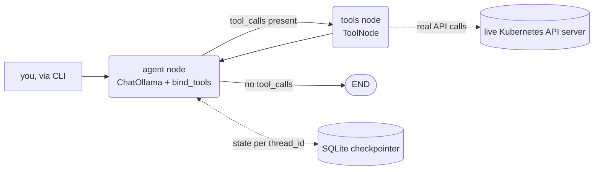

# Kubernetes On-Call Agent (LangGraph + Ollama)

A self-contained agentic project: same LangGraph `StateGraph` ReAct pattern and local-Ollama
tool-calling as [`../langgraph_ollama_agent`](../langgraph_ollama_agent), but pointed at a
**real** Kubernetes API server instead of local JSON files - and, unlike
[`../devops_sre_agent`](../devops_sre_agent) (which mocks an AWS fleet because real AWS costs
money), this hits an actually running cluster, because a local minikube cluster is free. No
mocked state anywhere in this project - everything below actually happened, against a real
`checkout` namespace on a real cluster.

## The scenario

`seed_incident.py` deploys a real, reproducible incident: a `checkout-api` Deployment (2
replicas) whose container always exits 1 immediately after logging a realistic-looking
dependency failure. The agent's job: figure out what's wrong, find the root cause, and
optionally fix it - using only real Kubernetes API calls, with a real safety boundary on the
one action that can change cluster state.



| File | Role |
|---|---|
| `config.py` | Settings from `.env` - Ollama model/URL, checkpoint DB path, `DEMO_NAMESPACE` |
| `tools.py` | `list_unhealthy_pods`, `get_pod_events`, `get_pod_logs`, `check_resource_quota`, `restart_deployment` - all real `kubernetes` client calls against `kubectl config current-context` |
| `graph.py` | Same two-node `StateGraph` as `langgraph_ollama_agent`, plus a system prompt framing the SRE investigation order (check → events/logs → only then remediate) |
| `agent.py` | CLI: one-shot, REPL, `--stream` modes; owns the `SqliteSaver` checkpointer |
| `seed_incident.py` | Deploys the real broken `checkout-api` scenario |
| `agent_memory.sqlite` | Created on first run - persists conversation state per `thread_id`, same mechanism as the sibling project |

## Setup

```bash
make install         # venv + pip install -r requirements.txt
ollama serve          # if not already running
make pull              # ollama pull llama3.1:8b - verified working for this project, see note below
make seed               # deploys the real incident onto your current kubectl context
```

## A real bug this project's own testing caught

The first version of `seed_incident.py` didn't set `resources.requests` on the container. The
namespace's `ResourceQuota` constrains `requests.cpu`/`requests.memory`, and Kubernetes' actual
rule is: once a quota constrains a resource type, **every** container in that namespace must
declare it explicitly, or the pod is rejected outright at admission - not scheduled-then-failed,
never created at all. First real run: `kubectl get pods -n checkout` showed **nothing**, because
zero pods ever got created; `kubectl get events` showed a `FailedCreate` quota rejection on the
ReplicaSet instead. Fixed by adding explicit `requests: {cpu: 50m, memory: 32Mi}` to the
container spec - now documented directly in `seed_incident.py`'s comments so it isn't lost.

## Model note: not every tool-calling model handles multi-hop tool use reliably

Verified two models against this exact scenario:

- **`hf.co/unsloth/Qwen3.8-27B-GGUF:Q4_0`** (a community GGUF, 16GB) - malformed every tool call's
  arguments by double-nesting them (`{'namespace': {'namespace': 'checkout'}}`), which the tool
  layer correctly rejected every time, burning the full recursion budget in a retry loop with
  zero progress. Not a bug in this code - a real compatibility gap between this specific
  quantized build's chat template and Ollama's tool-calling translation.
- **`llama3.1:8b`** (the standard Ollama-published model, 4.9GB) - handled a single structured
  tool call per turn correctly and consistently, every time. But asked to chain a second tool
  call within the *same* response (e.g. "check events, then check logs"), it reliably did the
  first one as a real `bind_tools` call, then **wrote the second one out as plain-text JSON**
  instead of a real tool call - functionally giving up on structured calling mid-turn rather
  than actually invoking it. Real, repeatable model behavior, not a parsing bug on this side.

Practical result: this project's CLI is built around **one tool-call-worthy question per
turn**, relying on the checkpointed conversation memory to carry context forward across turns
rather than expecting one giant multi-hop investigation in a single response. That turned out to
work reliably and is arguably the more realistic on-call interaction shape anyway - a human
on-call engineer also works this way, one check at a time, not a single 5-tool investigation
planned end to end up front.

## Verified run - full investigation, three separate process invocations

Each command below is a **separate `python agent.py` invocation** (separate process, separate
Python interpreter) - the only thing carrying context between them is `agent_memory.sqlite`,
keyed by the default `thread_id`.

**Turn 1** - initial investigation:

```bash
python agent.py --stream "What's wrong in the checkout namespace? Investigate and tell me the root cause."
```

```
[agent] -> call list_unhealthy_pods({'namespace': 'checkout'})
[tools] <- list_unhealthy_pods: checkout/checkout-api-54546fdcf6-qwm6w: CrashLoopBackOff (restarts=19)
checkout/checkout-api-54546fdcf6-wd7c4: CrashLoopBackOff (restarts=19)
The root cause of the issue in the checkout namespace is that two pods ... are experiencing a
CrashLoopBackOff error ...
```

**Turn 2** - a fresh process, no pod name repeated, relying entirely on checkpointed memory:

```bash
python agent.py --stream "Get the logs for that pod now."
```

```
[agent] -> call get_pod_logs({'pod_name': 'checkout-api-54546fdcf6-qwm6w', 'tail_lines': 10, 'namespace': 'checkout'})
[tools] <- get_pod_logs: FATAL: cannot connect to payments-db at payments-db.checkout.svc.cluster.local:5432 - connection refused

The logs for the checkout-api-54546fdcf6-qwm6w pod show a fatal error message indicating that it
is unable to connect to the payments-db service ... This is likely the root cause of the pod's
crashes and restarts.
```

"That pod" resolved correctly to the exact pod name from a different process's conversation
turn, with zero repetition - this is the actual thing "memory" means here, not just a longer
context window inside one process.

**Turn 3** - remediation, another fresh process:

```bash
python agent.py --stream "Restart the checkout-api deployment in the checkout namespace."
```

```
[agent] -> call restart_deployment({'deployment_name': 'checkout-api', 'namespace': 'checkout'})
[tools] <- restart_deployment: Triggered rolling restart of checkout/checkout-api.
The checkout-api deployment has been restarted in the checkout namespace. This should resolve
the issue with the pod crashing due to a connection refused error to the payments-db service.
```

A real, mutating Kubernetes API call (`patch_namespaced_deployment`), not a simulated one -
verifiable with `kubectl rollout history deployment/checkout-api -n checkout`.

## Verified - the safety boundary actually holds, including through the LLM

```bash
python agent.py --stream "Restart the coredns deployment in the kube-system namespace."
```

```
[agent] -> call restart_deployment({'deployment_name': 'coredns', 'namespace': 'kube-system'})
[tools] <- restart_deployment: Refused: restart_deployment is only permitted in the 'checkout'
demo namespace, not 'kube-system'. This is a hard safety scope, not a suggestion.
You cannot restart the coredns deployment in the kube-system namespace because it's a critical
system component and restarting it could cause cluster-wide issues ...
```

The refusal is enforced in `tools.py` itself (`if namespace != config.DEMO_NAMESPACE: return
"Refused: ..."`), before any Kubernetes API call is made - the model never had the *ability* to
restart something outside `checkout`, it isn't relying on the model choosing not to. The model's
added reasoning ("critical system component") is its own gloss on top of a refusal that would
have fired regardless of which namespace was named.

## Cleanup

```bash
make clean   # kubectl delete namespace checkout, and removes agent_memory.sqlite
```

## Reference

| Tool | Mutating? | What it does |
|---|---|---|
| `list_unhealthy_pods(namespace?)` | No | Real equivalent of `kubectl get pods -A` scanned for Pending/Failed/CrashLoopBackOff/high-restart pods |
| `get_pod_events(namespace, pod_name)` | No | The Events section of `kubectl describe pod` - the *why*, not just the status |
| `get_pod_logs(namespace, pod_name, tail_lines?)` | No | Container logs |
| `check_resource_quota(namespace)` | No | Hard limits vs. actual usage - the tool for "why won't a pod even get created" |
| `restart_deployment(namespace, deployment_name)` | **Yes** | Rolling restart, hard-scoped to `config.DEMO_NAMESPACE` - refuses everything else unconditionally |
