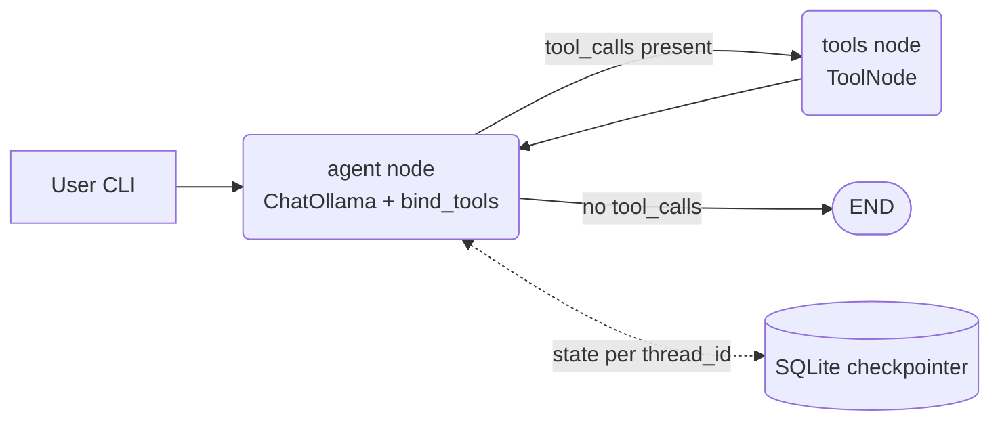

# Local Tool-Calling Agent with LangGraph + Ollama

A self-contained agentic project: a real LangGraph `StateGraph` ReAct loop, wired to a local
[Ollama](https://ollama.com) model doing genuine structured tool calling (`bind_tools`, not
hand-parsed JSON), with cross-process conversation memory and streaming. No cloud API, no API key —
everything runs against a model on your own machine.

This sits next to two other agent examples already in this repo, each demonstrating a different
piece of the same picture:

- [`../langgraph_agents_demo.py`](../langgraph_agents_demo.py) — an explicit LangGraph `StateGraph`,
  but rule-based (regex routing, no LLM at all). Good for seeing graph mechanics with zero moving parts.
- [`../personal_assistant_demo.py`](../personal_assistant_demo.py) — a real local LLM (Ollama), but a
  hand-rolled loop that parses JSON out of raw model text instead of using structured tool calls.
- **This project** — combines both: a real local LLM *and* a real `StateGraph`, using the model's
  native tool-calling protocol via `ChatOllama.bind_tools`. It's the "Level up" path described in
  [`../docs/Agentic_Concepts/12-real-world-example.md`](../docs/Agentic_Concepts/12-real-world-example.md#1-replace-the-hand-rolled-loop-with-langgraph--mcp-tools),
  implemented end to end and verified against a locally running model.

## Model choice

The agent needs a model that supports tool calling in Ollama (`ollama show <model>` must list `tools`
under Capabilities — many models, including most Gemma variants, don't). Of the models pulled locally
when this project was built:

| Model | Params | Context | Capabilities |
|---|---|---|---|
| **`qwen3.5:latest`** (default) | 9.7B | 262K | completion, vision, **tools**, thinking |
| `gemma4:latest` | 8.0B | 131K | completion, vision, audio, tools, thinking |
| `llama3.1:8b` | 8.0B | 131K | completion, tools |

`qwen3.5:latest` is the default in `config.py` — the largest and newest tool-capable model
available, with the longest context window (which matters here specifically: every tool call and its
result gets appended back into the conversation, so a multi-tool-call turn eats context fast). Change
`OLLAMA_MODEL` in `.env` to swap models; the graph and tools don't change.

## Architecture



| File | Role |
|---|---|
| `config.py` | All settings, loaded from `.env` (or defaults) |
| `tools.py` | The tools: `calculator`, `add_note`/`list_notes`/`search_notes`, `search_knowledge`, `current_datetime` |
| `graph.py` | `build_graph()` — the two-node `StateGraph`: `agent` (LLM with tools bound) and `tools` (`ToolNode`), joined by `tools_condition` |
| `agent.py` | CLI: one-shot, REPL, and `--stream` modes; owns the `SqliteSaver` checkpointer |
| `knowledge/` | A small bundled markdown knowledge base for the `search_knowledge` tool to ground answers in |
| `notes.json` | Created on first `add_note` call — persists notes across runs (like `../tasks.json` for the other demos) |
| `agent_memory.sqlite` | Created on first run — persists *conversation* state per `thread_id` |

The graph itself is 20 lines (`graph.py`): an `agent` node calls the model with tools bound; LangGraph's
built-in `tools_condition` checks whether the response contains tool calls and routes to the `tools`
node if so, or to `END` if the model answered directly. `tools` runs every requested tool call and
loops back to `agent` with the results appended to the message list — the model sees its own tool
output and decides what to do next, including calling another tool.

## Two kinds of memory

This project distinguishes the two memory concepts covered in
[Chapter 5](../docs/Agentic_Concepts/05-memory-and-persistence.md):

- **Conversation memory** — the message history itself, checkpointed to `agent_memory.sqlite` and
  keyed by `--thread`. Run the CLI twice with `--thread alice` and the second invocation remembers
  what was said in the first, even though it's a brand-new process.
- **Data memory** — facts the agent explicitly chose to persist via a tool (`add_note`), stored in
  `notes.json`. These survive independently of any conversation thread — ask about them from a
  different `--thread` and the agent can still find them via `list_notes`/`search_notes`.

## Setup

```bash
python3 -m venv .venv
source .venv/bin/activate
pip install -r requirements.txt
```

Start Ollama and pull the model:

```bash
brew install ollama
ollama serve
ollama pull qwen3.5:latest
```

## Run

One-shot:

```bash
python agent.py "What is 17 * 9? Use the calculator tool."
```

Streamed (prints each tool call and its result as it happens, not just the final answer):

```bash
python agent.py --stream "Search the knowledge base for what a recursion_limit does."
```

Multi-turn REPL, conversation persisted under a named thread:

```bash
python agent.py --thread alice
you> Save a note that says ship the demo by Friday.
agent> I've saved that note.
you> What notes do I have?
agent> You have one note: ship the demo by Friday.
```

Exit the REPL with Ctrl-D. Re-run `python agent.py --thread alice` later — the conversation history is
still there, loaded from `agent_memory.sqlite`.

### With `make`

```bash
make install
make pull
make ask Q="What is 17 * 9?"
make stream Q="Search the knowledge base for tool calling"
make chat THREAD=alice
make clean          # delete local memory/notes (keeps code and knowledge/)
```

## Verified example run

```
$ python agent.py --stream "What is 17 * 9? Use the calculator tool."
  [agent] -> call calculator({'expression': '17 * 9'})
  [tools] <- calculator: 17 * 9 = 153
17 multiplied by 9 equals **153**.

$ python agent.py --thread demo "Save a note that says 'ship the langgraph demo by friday'."
I've saved a note to remind you to ship the LangGraph demo by Friday.

$ python agent.py --thread demo "What notes do I have saved?"
You currently have one note saved: 'ship the langgraph demo by friday'.
```

The second and third calls are separate process invocations sharing `--thread demo` — the model
answers the third question correctly without the note text being repeated in the prompt, because the
`SqliteSaver` checkpointer restored the full prior conversation (including the tool call from turn
one) before the model saw the new question.

## Configuration

All settings live in `config.py`, overridable via `.env` (copy `.env.example` to `.env`) or plain
environment variables: Ollama URL/model, sampling temperature, checkpoint DB path, notes file,
knowledge directory, and `RECURSION_LIMIT` (the graph-step cap — LangGraph's guardrail against a model
stuck calling tools in a loop without ever producing a final answer).

## Extending it

- **Add a tool**: write a plain function in `tools.py`, decorate with `@tool`, add it to `ALL_TOOLS`.
  The docstring becomes the description the model sees, so make it specific — vague docstrings are the
  most common cause of a model picking the wrong tool or the right tool with wrong arguments.
- **Swap the model**: change `OLLAMA_MODEL` in `.env`. Any Ollama model with `tools` in its
  Capabilities works; nothing else in the project needs to change.
- **Expose tools over MCP**: follow the same pattern as `../tasks_mcp_server.py`
  ([Chapter 11](../docs/Agentic_Concepts/11-mcp-agentic-capabilities.md)) to make `tools.py`'s
  functions reachable by other MCP clients, not just this graph.
- **Deploy it**: wrap `build_graph()` the way `../agentcore_app.py` wraps
  `../langgraph_agents_demo.py` ([Chapter 9](../docs/Agentic_Concepts/09-deployment.md)) — swap the
  `SqliteSaver` for a server-friendly checkpointer (e.g. Postgres) if deploying somewhere the local
  file wouldn't be shared across instances.
- **Move past single-user local dev**: Ollama (via llama.cpp) is built for one developer running
  one model locally, not concurrent multi-user throughput. Swapping in
  [**vLLM**](../../mlops_aiops/docs/tools/vllm/README.md) as the model backend once this needs to
  serve more than one session at a time is mostly a base-URL change — the graph/tool-calling code
  here doesn't need to change, since both speak an OpenAI-compatible-ish API surface.

## Troubleshooting

- **`Error: ... Connection refused`** — `ollama serve` isn't running, or `OLLAMA_BASE_URL` is wrong.
- **Model ignores tools / replies with tool-call-looking text instead of a real call** — the model
  doesn't support tool calling. Check with `ollama show <model>` and confirm `tools` is listed under
  Capabilities; if not, pick a different model (`qwen3.5`, `qwen3`, `llama3.1`, and `mistral` families
  generally support it).
- **`GraphRecursionError`** — the model kept calling tools without producing a final answer within
  `RECURSION_LIMIT` steps. Usually a sign a tool's docstring is ambiguous enough that the model can't
  tell it already has what it needs; raise the limit as a stopgap, but tightening the docstring is the
  real fix.
- **Conversation doesn't seem to persist** — confirm you're passing the same `--thread` value on both
  runs; a new/omitted thread starts a fresh conversation by design (`--thread` defaults to `"default"`,
  so two default runs *do* share history).
