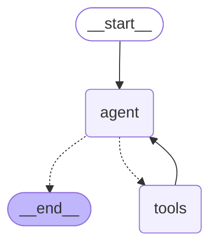

# Local Ops Agent

A small LangGraph + OpenAI tool-calling agent that plans multi-step tasks out loud,
answers real questions about *this machine* — disk space, memory, running processes,
directory/file contents — and can create directories, write files, and run arbitrary
shell commands, gated by human approval for anything that changes state. Same graph
shape as [`../langgraph_ollama_agent/`](../langgraph_ollama_agent/) (`StateGraph`,
`MessagesState`, `tools_condition`, `ToolNode`), swapped to OpenAI instead of local
Ollama.

## The graph

Generated directly from the compiled graph (`app.get_graph().draw_mermaid()`), not
hand-drawn — this is the real structure, not an approximation of it. A nicer-looking,
annotated version of the same diagram (legend, node-by-node walkthrough) is at
[`docs/agent-graph.html`](docs/agent-graph.html) — open it directly in a browser.



Dotted arrows out of `agent` are the **conditional edge** (`tools_condition`, decided
fresh every time `agent` runs); solid arrows are fixed. The single `agent ⇄ tools`
cycle is what lets the model chain as many tool calls as a task needs (see
`create_plan` below) — the diagram doesn't show *how many* times it can loop, only
that the loop exists, which is genuinely unbounded until `tools_condition` returns
`END` or `RECURSION_LIMIT` (`main.py`) is hit.

## Files

| File | Role |
|---|---|
| [`tools.py`](tools.py) | The nine tools (see below) — each a plain function decorated with `@tool` |
| [`graph.py`](graph.py) | Wires the tools into the actual `StateGraph` (`START → agent → tools → agent → END`), plus the system prompt |
| [`config.py`](config.py) | `OPENAI_MODEL` / `MODEL_TEMPERATURE`, loaded from `.env` |
| [`main.py`](main.py) | The CLI — single-shot, multi-turn REPL, or `--stream` — including the approval prompt loop |

## Tools

| Tool | What it does | Needs approval? |
|---|---|---|
| `create_plan(steps)` | Records a numbered plan for a multi-step task — doesn't execute anything itself | No |
| `check_disk_usage` | `df -h /` | No |
| `check_memory` | `free -h` | No |
| `check_process_running(name)` | `pgrep -fl <name>` | No |
| `list_directory(path=".")` | `ls -la <path>` | No |
| `read_file(path, max_lines=200)` | Reads up to `max_lines` of a text file | No |
| `create_directory(path)` | `mkdir -p <path>` — refuses if `path` exists as a file | **Yes, always** |
| `write_file(path, content, overwrite=False)` | Writes `content` to a new file; refuses to overwrite an existing one unless `overwrite=True` | **Yes, always** |
| `run_command(command, cwd=".")` | Runs **any** shell command, in directory `cwd` | **Only if not on the safe list** — see below |

## Human approval for `run_command`

`run_command` checks the command's leading tokens against a small allowlist of
known-safe, read-only prefixes (`ls`, `cat`, `df`, `free`, `git status`, `kubectl get`,
...) in `tools.py`'s `SAFE_COMMAND_PREFIXES`. Anything **not** on that list — most
notably infrastructure-mutating commands like `terraform apply` or `terraform plan` —
calls LangGraph's `interrupt()`, which **pauses the entire graph mid-tool-call** and
returns control to `main.py`, which prints the pending command and asks for approval.
Answering blocks until you respond; `y`/`yes`/`approve`/`approved` resumes the graph
with `Command(resume=answer)` and the command actually runs; anything else resumes with
the command reported back to the agent as declined, never executed.

This is an **allowlist, not a denylist** — deliberately: an unrecognized command fails
closed into "ask a human" rather than silently running. Extend `SAFE_COMMAND_PREFIXES`
in `tools.py` as you find more commands that are genuinely safe to auto-run.

`run_command` never uses `shell=True` (`shlex.split` instead) — no `cd path && ...`,
pipes, or `$()` substitution work. Run one command per call, using the `cwd` argument
to target a specific directory (e.g. a Terraform project) instead.

## From CLI to production: how approval works without a blocking prompt

`main.py`'s approval loop (`_prompt_for_approval`, `ask`) works by literally blocking on
`input()` — the whole process sits idle until a human types `y`. That's fine for a CLI,
but impossible on a server: nothing can afford to have a request thread block for hours
waiting on someone to click "approve" tomorrow morning. The mechanism that makes this
work at server scale is already here, though — it's just used differently.

**The key fact: pausing is not the same as blocking.** When `interrupt()` fires inside a
tool (`tools.py`, `create_directory`/`write_file`/`run_command`), LangGraph doesn't
suspend a thread in memory — it writes the *entire graph state* (message history, which
node was about to run, the pending tool call) to the checkpointer (`SqliteSaver` here)
and `app.invoke(...)` **returns immediately** with `{"__interrupt__": [...]}`, exactly
what `main.py`'s `while "__interrupt__" in result` loop is checking. The process is free
to do anything else — including exit completely. Resuming, even minutes or days later,
from a *different* process that has never seen this conversation, is just:

```python
app.invoke(Command(resume="approve"), config={"configurable": {"thread_id": "deploy-test"}})
```

The checkpointer reloads that exact paused state and the `interrupt()` call inside the
tool returns `"approve"` as if no time had passed — the tool function has no idea it was
ever paused. This is the whole answer to "how does a server not block forever": a paused
agent costs zero compute. It's a row in a database saying *"thread `deploy-test` is
sitting at the `tools` node waiting for an answer."*

**What replaces `input()` in production** is two independent events instead of one
blocking call:

1. Something triggers the agent (webhook, cron, Slack command, API call). It runs until
   `interrupt()`, and the caller gets back `{"__interrupt__": [...]}` and responds with
   something like `202 Accepted, {"thread_id": ..., "pending": {...}}` — no blocking.
2. Something surfaces that pending approval to a human — a Slack message with
   Approve/Deny buttons, a dashboard row, a page. Fired at the moment of interrupt, not
   polled for.
3. The human acts whenever they get to it. That action hits its own endpoint
   (`POST /threads/{thread_id}/resume`) which does exactly what `ask()` does manually —
   calls `Command(resume=answer)` against that `thread_id` — from a process that started
   nothing here.

**Infra pieces that actually change** for this to work across multiple server instances:

- **Checkpointer**: `SqliteSaver` is one file on one machine — fine for this local CLI,
  wrong for a server with multiple instances. Production swaps in
  `langgraph-checkpoint-postgres` (or similar) so whichever instance handles the resume
  request reaches the same durable state.
- **A resume endpoint, auth-checked** — not everyone should be able to approve a
  `terraform apply` on prod; that check sits in front of `Command(resume=...)`, entirely
  outside LangGraph.
- **LangGraph Platform / LangGraph Server** — LangChain's own hosted runtime for exactly
  this: durable checkpointing over HTTP, `interrupt()` mapping directly onto "this run is
  now waiting," instead of hand-rolling the queue/notification plumbing.

**Different shapes of human-in-the-loop, in practice:**

- **Live/synchronous** (closest to what's here) — a human is present now, in a chat UI,
  and approves within the same session, just without literally blocking a thread.
- **Async/queued** (the common one for ops automation) — the agent runs unattended off a
  trigger, pauses, and waits indefinitely; a human approves hours later, from a
  dashboard, on a different device.
- **Policy-based pre-approval** — a richer version of `SAFE_COMMAND_PREFIXES`: a team
  defines rules upfront ("prod network changes need 2 reviewers," "dev applies
  auto-approve") so most decisions never need a live human — only exceptions do.
- **Post-hoc / revert-based** — for lower-risk mutations, let the agent act immediately
  but log everything and make undo fast, trading "approve before" for "catch and roll
  back fast."

**Two gotchas a real deployment has to handle that this CLI doesn't:**

- **Expiry** — LangGraph doesn't auto-expire a paused thread; if nobody ever approves, it
  waits forever. Production needs its own job: "auto-deny (or escalate) anything pending
  longer than N hours."
- **Multiple simultaneous interrupts** — `main.py`'s loop only ever reads
  `result["__interrupt__"][0]` (`ask()`, both the streaming and non-streaming branches).
  If the model ever requests two mutating tool calls in parallel — the same parallel
  tool-calling behavior already seen with `check_memory` (three calls in one message) —
  a production resume path needs to handle *every* pending interrupt for that thread, not
  just the first, or one of them silently never gets resumed. Not yet fixed here; flagged
  as a known gap.

## `create_directory` and `write_file` — the gap `run_command` can't cover

Because `run_command` never uses `shell=True`, there's no way to redirect output into
a file through it (`echo "..." > file.txt` needs shell redirection; `touch` alone works,
writing actual content does not). `create_directory` and `write_file` exist specifically
to fill that gap, as their own dedicated tools rather than trying to make `run_command`
support shell operators (which would reopen exactly the injection risk `shlex.split`
was chosen to avoid).

Both are **mutating by definition** — there's no "safe, read-only" version of creating a
directory or writing a file — so unlike `run_command`, they don't check an allowlist at
all: **every** call to either one goes through `interrupt()` unconditionally. Both also
refuse to clobber something that already exists before ever asking for approval:
`create_directory` is a no-op (not an error) if the directory already exists, and
`write_file` refuses an existing file unless you pass `overwrite=True` explicitly —
which itself still requires a fresh approval, since it's a distinct, higher-risk call.

## Getting the agent to actually *act*, not just describe

**Real bug, found and fixed**: asked to *"deploy this /path/to/terraform-project"*,
the first version of this agent responded with a 5-step manual guide (`cd`, `terraform
init`, `terraform plan`, `terraform apply`, ...) instead of ever calling `run_command`.
Nothing was wrong with the tool — the model just had no system prompt telling it to use
its own tools proactively, so it defaulted to "explain how a human would do this."

Fixed with a `SystemMessage` in `graph.py`'s `agent_node` (re-added fresh on every call,
not stored in the checkpointed conversation), explicitly telling the model: you have
real tools, call them directly for action requests; `run_command`'s own approval gate
already handles anything risky, so don't ask for confirmation in chat first — just call
the tool.

## Setup

Needs an OpenAI API key. Create `.env` in this folder (see `.env.example`):

```
OPENAI_API_KEY=sk-your-real-key
```

`uv run` manages its own isolated `.venv` right here from `pyproject.toml` — no manual
install step needed, it resolves and installs on first run:

```bash
uv run python main.py "How much free disk space do I have?"
```

## Running it

```bash
# Single-shot
uv run python main.py "How much free disk space do I have?"

# Multi-turn REPL -- conversation persists across process restarts, keyed by --thread
uv run python main.py
uv run python main.py --thread checks

# Streaming -- print each tool call/result as it happens, not just the final answer
uv run python main.py --stream "Is api_server.py running, and do I have enough RAM for a 1.7B model?"

# Triggers the approval gate (run_command isn't on the safe list for this one)
uv run python main.py --stream "Run 'terraform plan' in the current directory"
```

## Real, actually-observed output

```
$ python main.py "How much free disk space do I have?"
You have 869 GB of free disk space available on your root filesystem.

$ python main.py "Is there a process called api_server.py running right now?"
Yes, there are processes related to `api_server.py` currently running.

$ python main.py "Do I have enough free RAM to load a 1.7B parameter model in float32?"
To determine if you have enough free RAM to load a 1.7 billion parameter model in
float32, we can calculate the memory requirement:
- Each float32 parameter requires 4 bytes.
- Therefore: 1.7 billion x 4 bytes = 6.8 billion bytes ~ 6.8 GB
You currently have approximately 1.8 GB of free RAM available. Since 6.8 GB is
required to load the model, you do not have enough free RAM to load the model.
```

That last one is the real test: the agent called `check_memory()`, read the actual
free-RAM number back, and reasoned over it correctly — not a guess, an answer grounded
in a real tool call.

**The full approval gate, verified against a real Terraform project and real Azure
credentials** (`cloud-practice/azure/terraform/storage-account`, a different project in
this repo) — approving `init` and `plan` (both safe, read-only) but explicitly
*declining* `apply`, to confirm nothing real actually gets touched without consent:

```
$ uv run python main.py --stream --thread deploy-test \
    "Can you deploy this /home/surendra/.../cloud-practice/azure/terraform/storage-account"

  [agent] -> call run_command({'command': 'terraform init', 'cwd': '.../storage-account'})
⚠  Approval needed: terraform init
   In directory: .../storage-account
   Approve? [y/N] y
  [tools] <- run_command: Terraform has been successfully initialized!

  [agent] -> call run_command({'command': 'terraform plan', 'cwd': '.../storage-account'})
⚠  Approval needed: terraform plan
   In directory: .../storage-account
   Approve? [y/N] y
  [tools] <- run_command: Plan: 4 to add, 0 to change, 0 to destroy.
              (real Azure plan output: a resource group, storage account, container, random_string)

  [agent] -> call run_command({'command': 'terraform apply -auto-approve', 'cwd': '.../storage-account'})
⚠  Approval needed: terraform apply -auto-approve
   In directory: .../storage-account
   Approve? [y/N] n
  [tools] <- run_command: Command NOT approved by a human -- not executed: terraform apply -auto-approve
The `terraform apply` command requires human approval before execution...
```

Confirmed afterward with `az group exists --name rg-storage-demo` → `false` — nothing
was actually created. Three things worth noting from this one real run:

- The system-prompt fix worked: it called `run_command` directly for a "deploy this"
  request instead of printing manual steps, and correctly used `cwd` to target the
  right project directory instead of trying (and failing) to `cd` there.
- It ran all three steps (`init`, `plan`, `apply`) in order without being told the exact
  sequence — that's the system prompt's "call once per step, report each result"
  instruction working as intended.
- It added `-auto-approve` to the `apply` call on its own (reasonable: this subprocess
  has no terminal for Terraform's own interactive "yes" prompt to work) — **and it made
  no difference**, because our approval gate is a completely separate mechanism from
  Terraform's own confirmation prompt. `-auto-approve` skips Terraform asking; it does
  nothing to `run_command`'s own `interrupt()` check, which still fired and still
  blocked until a human answered.

**`create_directory`/`write_file`, also actually run, all three cases:**

```
you> Create a directory at /tmp/agent-test-dir and write a file .../hello.txt
     containing the text 'Hello from the agent'

  [agent] -> call create_plan({'steps': [...]})
  [agent] -> call create_directory({'path': '/tmp/agent-test-dir'})
⚠  Approval needed: create_directory(/tmp/agent-test-dir)      Approve? y
  [tools] <- create_directory: Created directory: /tmp/agent-test-dir
  [agent] -> call write_file({'path': '.../hello.txt', 'content': 'Hello from the agent'})
⚠  Approval needed: write_file(.../hello.txt, 20 chars, overwrite=False)   Approve? y
  [tools] <- write_file: Wrote 20 characters to .../hello.txt
```

Confirmed on disk afterward: `cat .../hello.txt` → `Hello from the agent`, exactly as
written — not just claimed in the response.

Re-running `create_directory` on the same path afterward correctly no-ops instead of
asking again (`'...' already exists as a directory -- nothing to do.`), and asking it to
overwrite `hello.txt` without `overwrite=True` was refused **before** any approval
prompt at all (`'...' already exists -- refusing to overwrite`) — only retrying with
`overwrite=True` explicit triggered a fresh approval, which then genuinely replaced the
file's contents on disk when approved.

## Notes

- `agent_memory.sqlite` (created on first run) is the conversation checkpoint database,
  keyed by `--thread` — gitignored, safe to delete to reset all conversation history.
- `check_process_running(name)` matches against the full command line via `pgrep -fl`,
  not just the process's own binary name — so `"api_server.py"` works even though the
  actual binary running is `python`.
- `run_command` parses with `shlex.split`, not `shell=True` — deliberately: no pipes,
  `&&`, `;`, or `$()` command substitution work, which also means those can't be used
  to smuggle a second, unapproved command alongside an approved-looking one.
- `interrupt()` requires a checkpointer to work at all (it's what persists the paused
  state across the pause) — this project already had `SqliteSaver` wired in for
  conversation memory, which is exactly what makes the approval gate possible with no
  other structural change to `graph.py`.
