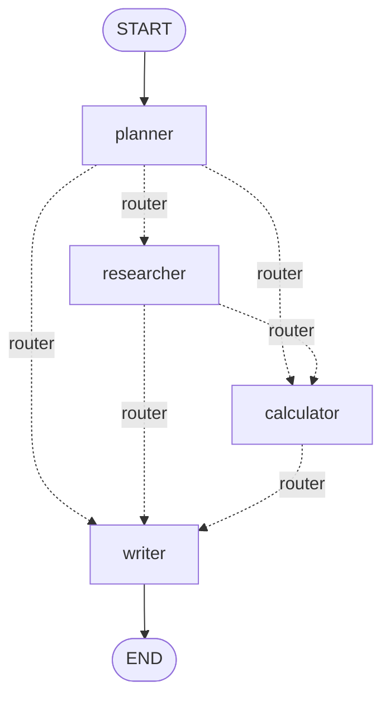

# 3. Conditional Routing

Static edges (`add_edge("a", "b")`) are fine for linear pipelines. Real agents need to branch: "if the
question needs math, go to the calculator; otherwise skip it." That's what conditional edges are for.

## `add_conditional_edges`

```python
graph.add_conditional_edges(source_node, routing_function, path_map=None)
```

- `source_node`: the node whose output triggers the routing decision.
- `routing_function`: `(state) -> str` (or a list of strings for parallel fan-out). It returns the name of
  the next node to run.
- `path_map` *(optional)*: a dict mapping the routing function's return values to actual node names, useful
  when the routing function returns something other than a literal node name.

## Example: a router that also implements a loop

`langgraph_agents_demo.py` uses one router function to send control to whichever agent is next in a queue,
and loops back to that *same* router after each agent runs — until the queue is empty:

```python
from typing import Literal


def router(state: AgentState) -> Literal["researcher", "calculator", "writer"]:
    if not state["remaining_agents"]:
        return "writer"
    return state["remaining_agents"][0]


graph.add_edge(START, "planner")
graph.add_conditional_edges("planner", router)
graph.add_conditional_edges("researcher", router)
graph.add_conditional_edges("calculator", router)
graph.add_edge("writer", END)
```

Here's the trick: `planner_agent` populates `state["remaining_agents"]` with whichever specialist nodes are
needed (e.g. `["researcher", "calculator"]`). After `planner` runs, `router` is called — it sees a
non-empty queue and sends control to `"researcher"`. The `researcher_agent` node pops itself off the front
of the queue and returns. `router` runs again (because `researcher` also routes through `router`), sees
`"calculator"` next, and so on — until the queue is empty and `router` returns `"writer"`.

This is a **dynamic loop implemented entirely with conditional edges** — no special "loop" construct
needed. The graph looks like this:



Run it yourself and watch the "Workflow trace" in the output to see exactly which path was taken for a
given question:

```bash
python langgraph_agents_demo.py "What is 5 + 5?"           # calculator only
python langgraph_agents_demo.py "What is LangGraph?"        # researcher only
python langgraph_agents_demo.py "What is LangGraph and 17*9?"  # both
```

## Using `path_map` for readability

If your routing function returns semantic labels instead of literal node names, map them explicitly:

```python
def route_by_intent(state: State) -> str:
    if state["needs_tool"]:
        return "use_tool"
    return "respond"


graph.add_conditional_edges(
    "agent",
    route_by_intent,
    path_map={"use_tool": "tools", "respond": END},
)
```

This decouples your routing logic's return values from your node names — handy when you rename nodes later
and don't want to touch the routing function.

## Conditional entry points

You can also make the *first* node dynamic:

```python
graph.add_conditional_edges(START, choose_starting_node)
```

Useful when the very first thing your graph does is decide "cold start" vs. "resume" behavior.

## Common pitfall: forgetting a path

If your routing function can return a value that has no corresponding edge or `path_map` entry, LangGraph
raises an error at run time (not at compile time, since the return value is dynamic). Always make sure your
routing function's possible outputs are a `Literal[...]` type — as in `router` above — so your type checker
catches missing cases before you do.

Next: [Chapter 4 — Tools & Agents](04-tools-and-agents.md).
