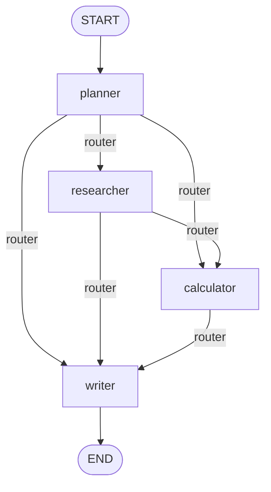

# 8. Advanced Patterns

## Fan-out / fan-in

Sometimes you want several nodes to run **in parallel** off the same upstream node, then merge their
results. Add multiple edges from one node — LangGraph runs all of the targets as a "superstep":

```python
graph.add_edge("planner", "researcher")
graph.add_edge("planner", "calculator")
graph.add_edge("researcher", "writer")
graph.add_edge("calculator", "writer")
```

Compare this to `langgraph_agents_demo.py`, where `researcher` and `calculator` run **sequentially** (one
after another, via the shared `router`) rather than in parallel — because each specialist there mutates the
same `remaining_agents` queue, and running them concurrently would race on that field. Fan-out is safe
specifically when parallel branches write to **disjoint** state keys, or to a shared key protected by a
reducer:

```python
class State(TypedDict):
    question: str
    notes: Annotated[list[str], operator.add]  # safe to append from parallel branches
```

Without the `operator.add` reducer, two nodes finishing in the same superstep and both writing to `notes`
would conflict — LangGraph would raise an `InvalidUpdateError` rather than silently pick one.

`writer` here acts as the fan-in point: LangGraph waits for **all** its declared predecessors
(`researcher` and `calculator`) to finish before running it.

## The `Send` API: dynamic fan-out (map-reduce)

Static fan-out edges are fixed at graph-definition time. When you don't know how many parallel branches you
need until runtime — e.g. "run this sub-task once per item in a list" — use `Send`:

```python
from langgraph.types import Send


def dispatch(state: State) -> list[Send]:
    return [Send("process_item", {"item": item}) for item in state["items"]]


graph.add_conditional_edges("split", dispatch)
```

Each `Send` invokes the target node with its own isolated state, and LangGraph fans all of them in once
they've all completed — this is LangGraph's version of a map-reduce step.

## Custom reducers

`operator.add` is only one reducer. Write your own for domain-specific merge logic:

```python
def keep_highest_confidence(existing: dict, new: dict) -> dict:
    return new if new["confidence"] > existing.get("confidence", 0) else existing


class State(TypedDict):
    best_guess: Annotated[dict, keep_highest_confidence]
```

Any two-argument function `(current_value, new_value) -> merged_value` works as a reducer.

## Retries and error handling

Wrap a node's body in normal Python error handling, and consider a `RetryPolicy` for transient failures
(network hiccups calling an LLM or external API):

```python
from langgraph.pregel.retry import RetryPolicy

graph.add_node(
    "call_llm",
    call_llm_node,
    retry=RetryPolicy(max_attempts=3, initial_interval=1.0, backoff_factor=2.0),
)
```

For failures you want to *handle* rather than retry (e.g. a tool call that legitimately fails), catch the
exception inside the node and route to an error-handling branch via a conditional edge, the same way
`calculator_agent` in this repo catches evaluation errors and turns them into a descriptive `math_result`
string instead of raising:

```python
try:
    parsed = ast.parse(expr, mode="eval")
    value = _safe_eval(parsed.body)
    result = f"{expr} = {value:g}"
except Exception as exc:
    result = f"Could not evaluate expression '{expr}': {exc}"
```

This keeps the graph flowing to `writer` regardless of whether the calculation succeeded — the failure
becomes data in the state rather than an unhandled exception that kills the run.

## Visualizing bigger graphs

As graphs grow past a handful of nodes, generate a diagram instead of reasoning about `add_edge` calls in
your head:

```python
app.get_graph().draw_mermaid_png(output_file_path="graph.png")
```

or embed the Mermaid source directly in docs, as with this repo's planner/researcher/calculator/writer
graph:



## Recursion limits

Loops (like the repo's queue-draining router, or a ReAct tool loop) need a safety valve against runaway
recursion — e.g. a tool that always asks the model to call it again. Set a limit per invocation:

```python
app.invoke(state, {"recursion_limit": 25})
```

LangGraph raises `GraphRecursionError` if the limit is hit, which you should treat as a bug signal (an exit
condition isn't being reached) rather than something to silently catch and ignore.

Next: [Chapter 9 — Deployment](09-deployment.md).
