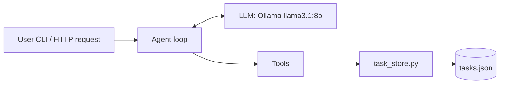

# 12. Real-World Example: A Deployable Personal Assistant

This chapter is the capstone — it doesn't introduce new mechanics, it combines everything from
[Chapter 0](00-agentic-concepts.md) through [Chapter 11](11-mcp-agentic-capabilities.md) into one coherent,
deployable system, using this repo's own files as the walkthrough. If you've read every chapter, this is
where it all clicks into one picture; if you jumped straight here, the "Next steps" links point back to
where each piece is taught in depth.

## What we're building

A personal assistant that manages a task list through natural-language requests ("Add a task to buy milk,
then show my tasks"), runs entirely on a local model, and can be deployed as an HTTP service. This repo
already has every piece:



| Layer | File | Concept |
|---|---|---|
| Agent loop | `personal_assistant_demo.py` | [Chapter 0](00-agentic-concepts.md) — model-directed loop, guardrails |
| Model | Ollama (local) | Swappable for any chat model |
| Tools | `task_store.py` | [Chapter 4](04-tools-and-agents.md) |
| Tool exposure (optional) | `tasks_mcp_server.py` | [Chapter 11](11-mcp-agentic-capabilities.md) |
| Persistence | `tasks.json` | [Chapter 5](05-memory-and-persistence.md) covers richer alternatives |
| Deployment | `agentcore_app.py` (pattern) | [Chapter 9](09-deployment.md) |

## Today's version: a hand-rolled agent, by design

`run_assistant()` in `personal_assistant_demo.py` implements the perceive → reason → act → observe loop
from [Chapter 0](00-agentic-concepts.md) *without* LangGraph, to make the mechanics impossible to hide
behind a framework:

1. **Perceive** — `build_prompt()` bundles the user's request, the tool catalog, and a running scratchpad
   of prior tool calls into one prompt.
2. **Reason** — `call_ollama()` asks the local model to respond with structured JSON: either
   `{"action":"tool", ...}` or `{"action":"final", ...}`.
3. **Act** — `parse_actions()` and `normalize_action()` turn that JSON into a dispatch against the `TOOLS`
   dict (`list_tasks`, `add_task`, `complete_task`), which delegates to `task_store.py`.
4. **Observe** — the result is appended to `scratchpad`, and the loop repeats — capped at 6 iterations, the
   guardrail described in [Chapter 0](00-agentic-concepts.md#guardrails-and-control).

This is a legitimate architecture, not just a teaching toy: no framework dependency, full control over the
prompt format, and it runs fully offline against a local model. It's also exactly the ReAct loop that
[Chapter 4](04-tools-and-agents.md) shows LangGraph automating with `ToolNode` and `create_react_agent` —
useful to have both side by side, since it makes clear what a framework buys you (less code, structured tool
calls, streaming, checkpointing) versus what you can build yourself if you'd rather not take the
dependency.

### Run it end to end

```bash
brew install ollama
ollama serve
ollama pull llama3.1:8b

pip install -r requirements.txt
python personal_assistant_demo.py "Add a task to buy milk and then show my tasks"
```

Tasks persist in `tasks.json` between runs — the simplest possible form of the memory concept from
[Chapter 5](05-memory-and-persistence.md): a file instead of a database, but the same idea of state
outliving a single invocation.

## Leveling it up to a production shape

Three concrete, independent upgrades turn this demo into something you'd actually ship — each one is a
direct application of an earlier chapter.

### 1. Replace the hand-rolled loop with LangGraph + MCP tools

Instead of hand-parsing JSON actions, source the tools from `tasks_mcp_server.py` (Chapter 11) and let
`create_react_agent` (Chapter 4) run the loop:

```python
from langchain_mcp_adapters.client import MultiServerMCPClient
from langchain_ollama import ChatOllama
from langgraph.prebuilt import create_react_agent

client = MultiServerMCPClient(
    {"tasks": {"command": "python", "args": ["tasks_mcp_server.py"], "transport": "stdio"}}
)
tools = await client.get_tools()
llm = ChatOllama(model="llama3.1:8b")

assistant = create_react_agent(llm, tools)
```

This buys three things the hand-rolled version doesn't have for free: structured tool-calling (no more
parsing JSON out of raw model text), the tools now being reachable by *any* MCP client (not just this
script — see [Chapter 11](11-mcp-agentic-capabilities.md)), and drop-in access to everything else LangGraph
provides (streaming, checkpointing, the routing patterns from Chapters 3 and 6).

### 2. Add real persistence

`tasks.json` persists the *data* the tools operate on, but not the *conversation* — every CLI invocation
starts a fresh scratchpad. Attach a checkpointer (Chapter 5) keyed by a user or session id so a multi-turn
conversation survives across separate invocations or HTTP requests, the same way a chat app remembers
earlier turns in a thread:

```python
from langgraph.checkpoint.sqlite import SqliteSaver

with SqliteSaver.from_conn_string("assistant.db") as checkpointer:
    assistant = create_react_agent(llm, tools, checkpointer=checkpointer)
    assistant.invoke({"messages": [("user", prompt)]}, config={"configurable": {"thread_id": user_id}})
```

### 3. Deploy it

Wrap the graph exactly the way `agentcore_app.py` wraps `langgraph_agents_demo.py` in
[Chapter 9](09-deployment.md) — the deployment glue doesn't care which graph it's serving:

```python
from bedrock_agentcore import BedrockAgentCoreApp

app = BedrockAgentCoreApp()


@app.entrypoint
def invoke(request):
    thread_id = request.get("user_id", "default")
    prompt = request.get("prompt", "")
    result = assistant.invoke(
        {"messages": [("user", prompt)]},
        config={"configurable": {"thread_id": thread_id}},
    )
    return {"result": result["messages"][-1].content}
```

```bash
agentcore configure -e assistant_app.py
agentcore launch
agentcore invoke '{"user_id":"surendra","prompt":"What are my tasks?"}'
```

### 4. Add guardrails and observability

Before calling this "production," close the loop on [Chapter 0](00-agentic-concepts.md#guardrails-and-control):

- Keep an explicit step/recursion limit (LangGraph's `recursion_limit`, or the 6-iteration cap the demo
  already has) so a broken tool-call loop fails fast instead of hanging.
- Validate tool arguments at the tool boundary (e.g. reject empty task titles, non-positive `task_id`s)
  rather than trusting the model's output — `task_store.py`'s functions currently trust their inputs, which
  is fine for a local demo but not for anything reachable by untrusted users.
- Log every tool call and its result (`scratchpad` already captures this — ship it to structured logs
  instead of discarding it after the run).
- Use `stream_mode="updates"` ([Chapter 7](07-streaming.md)) in the deployed version so a slow multi-tool
  request can show progress instead of one long blocking call.

## Before / after

| | Today (`personal_assistant_demo.py`) | Production version (this chapter) |
|---|---|---|
| Tool dispatch | Hand-parsed JSON, in-process `TOOLS` dict | MCP server, reusable by any client |
| Loop | Hand-rolled `for` loop with a 6-step cap | `create_react_agent`, `recursion_limit` |
| Memory | `tasks.json` (data only) | Checkpointer keyed by session (data + conversation) |
| Interface | CLI (`sys.argv`) | HTTP via AgentCore (or any wrapper from Chapter 9) |
| Model | Local Ollama, hardcoded | Same — swap `ChatOllama` for any LangChain chat model |

## The full arc

Zoom out and this is the whole tutorial in miniature: a **loop** ([Chapter 0](00-agentic-concepts.md)) that
calls **tools** ([Chapter 4](04-tools-and-agents.md)) reachable over a standard **protocol**
([Chapter 11](11-mcp-agentic-capabilities.md)), with **memory** across turns
([Chapter 5](05-memory-and-persistence.md)), wired up as a **graph**
([Chapters 2](02-core-concepts.md)–[3](03-conditional-routing.md)) that could grow into a
**multi-agent system** ([Chapter 6](06-multi-agent-systems.md)), shipped behind a real endpoint
([Chapter 9](09-deployment.md)) with the discipline from [Chapter 10](10-best-practices.md). Everything past
this point is applying that same shape to a different problem. Go build something real.
