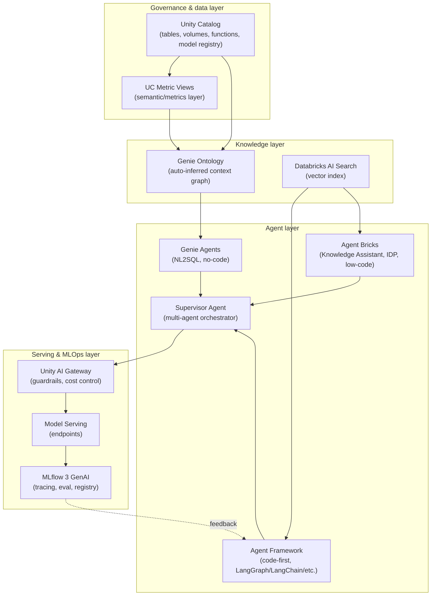

# 0. Platform Map & Naming

Read this chapter first. Databricks renamed almost every product this tutorial touches at some
point in 2025-2026. Knowing the current name, while recognizing the old one, matters for reading
docs, forum posts, and older tutorials without getting confused about whether they're describing
the same thing.

## The rename table

| Old name | Current name (as of 2026-08-13) | What changed |
|---|---|---|
| AI/BI Genie (GA June 2025) | **Genie Agents** (the config unit) + **Genie One** (the umbrella app) | Docs state explicitly: "Genie Agents were formerly known as Genie Spaces." Genie One (June 2026) is a new layer *above* Genie Agents — chat interface, Slack/Teams embedding, mobile, schedules/alerts, MCP support. |
| Genie Spaces | **Genie Agents** | Same rename as above — don't say "Genie Spaces" in 2026. |
| Mosaic AI Vector Search | **Databricks AI Search** | Explicit rename confirmed in current docs. Algorithm underneath (HNSW, L2 distance) is unchanged — see [`Similarity_Search_Methods/08_Databricks_Vector_Search.md`](../Similarity_Search_Methods/08_Databricks_Vector_Search.md). |
| Mosaic AI Agent Framework | **Agent Framework** (code-first) / **Agent Bricks** (low-code) | "Mosaic AI" branding is fading through 2026 but not fully retired — you'll still see it in some doc titles. Agent Framework and Agent Bricks are siblings, not the same thing (Chapter 3). |
| Agent Evaluation (standalone product) | Folded into **MLflow 3 GenAI** | The migration guide is literally titled "Migrate to MLflow 3 from Agent Evaluation" — that title alone confirms the old product is legacy terminology now. |
| Mosaic AI Gateway | **Unity AI Gateway** | Both names still appear in 2026 material; Unity AI Gateway is the more current branding. |
| — (new in June 2026) | **Genie Ontology** | Not a rename — a genuinely new product. Covered in Chapter 2. |

**Source:** [Create and manage a Genie Agent](https://docs.databricks.com/aws/en/genie-agents/set-up)
(updated 2026-07-30), [Introducing Genie One, Genie Ontology, and Genie Agents](https://www.databricks.com/blog/introducing-genie-one-genie-ontology-and-genie-agents)
(2026-06-16), [Databricks AI Search](https://docs.databricks.com/aws/en/ai-search/ai-search),
[Migrate to MLflow 3 from Agent Evaluation](https://docs.databricks.com/aws/en/mlflow3/genai/agent-eval-migration).

## The end-to-end map

Everything in this tutorial is one of four layers. Keep this picture in mind — the later chapters
each expand one node or one edge of it, and Chapter 9 puts it back together as a single diagram.

Read it as: **governed data → an inferred knowledge/semantic layer on top of it → agents that
consume that layer → a serving/ops layer that governs, runs, and measures those agents in
production.** Every chapter that follows is one node or one edge in this diagram.

## What each remaining chapter answers

- Chapter 1-2: what sits in the **Knowledge** and **Agents** layers under the "Genie" name
- Chapter 3: the rest of the **Agents** layer — Agent Framework, Agent Bricks, Supervisor Agent
- Chapter 4-5: the **Knowledge** layer for unstructured data and graphs
- Chapter 6: the **Ops** layer end to end
- Chapter 7-8: two concrete builds traced through the whole diagram
- Chapter 9: the full picture, and the questions that come up once you try to build on it
