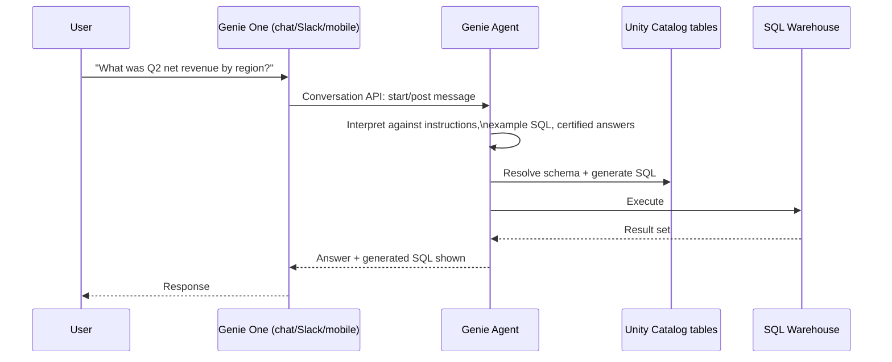

# 1. Genie Agents & Genie One

## What it is

Genie is Databricks' conversational-analytics surface: natural-language questions over governed
Unity Catalog tables, answered with generated SQL and a result, not a canned dashboard. The unit
you configure is called a **Genie Agent** — as of the 2026-07-30 docs, this is explicitly the
current name for what used to be called a **Genie Space**: *"Genie Agents were formerly known as
Genie Spaces."*

Above that sits **Genie One** (new, June 2026) — an umbrella "agentic coworker" product: a chat
interface, Slack/Teams embedding, mobile apps, scheduled questions/alerts, and MCP support. Genie
One is the *application* a business user opens; a Genie Agent is the *configured unit* underneath
it that knows how to answer questions about a given set of tables.

**Source:** [Create and manage a Genie Agent](https://docs.databricks.com/aws/en/genie-agents/set-up),
[Genie overview](https://docs.databricks.com/aws/en/genie/), [Introducing Genie One, Genie
Ontology, and Genie Agents](https://www.databricks.com/blog/introducing-genie-one-genie-ontology-and-genie-agents).

## What you configure on a Genie Agent

This is the part an architect needs to be able to describe concretely, because it's the difference
between a Genie Agent giving governed, repeatable answers versus guessing at schema:

- **Data objects** — up to 30 tables/views per Genie Agent, pulled from Unity Catalog, each with a
  description and sample data so the model has more than a raw schema to reason from.
- **Instructions** — free-text guidance ("always filter out test accounts", "revenue means net,
  not gross unless asked").
- **Example SQL queries** — added manually, or pulled in from the workspace's existing suggested
  queries, to show the model the house style for a given question shape.
- **Genie Code** — a feature that reads your data and auto-suggests instructions/context for you,
  rather than you writing every instruction by hand.
- **Certified / verified answers** — a specific question phrasing gets a locked-in, known-good
  answer instead of a fresh generation every time. This is the main lever for taming
  non-determinism on high-stakes or frequently-asked questions.
- **Warehouse binding** — which SQL warehouse actually executes the generated query.
- Tags and a Markdown description, for discoverability.

**Source:** [Create and manage a Genie Agent](https://docs.databricks.com/aws/en/genie-agents/set-up).

## Genie as a programmatic surface, not just a chat UI

A Genie Agent is not a dead-end chat box — it's a callable component that other systems can invoke
programmatically:

- **Genie Agents API** — programmatic create/import/export of Genie Agent configuration.
- **Genie Conversation API** — REST endpoints to start a conversation, post a message, poll for
  the answer, and list/delete conversation threads (`startconversation`, `getmessage`,
  `listconversations`).
- **Supervisor Agent orchestration** — the Agent Framework's Supervisor Agent (Chapter 3)
  explicitly lists Genie Agents as one of the node types it can orchestrate, alongside agent
  endpoints, Unity Catalog functions, MCP servers, and custom agents. In practice: a Genie Agent
  can be a *tool call* inside a larger multi-agent system, not just a standalone destination.
- **Databricks Apps** can embed a Genie Agent as a resource directly.

**Source:** [Use the Genie Agents API](https://docs.databricks.com/aws/en/genie-agents/conversation-api),
[Genie REST API reference](https://docs.databricks.com/api/workspace/genie), [Build agents on
Databricks](https://docs.databricks.com/aws/en/agents/agent-framework/build-agents), [Add a Genie
Agent resource to a Databricks app](https://docs.databricks.com/aws/en/dev-tools/databricks-apps/genie).

## The mental model to hold

The governance boundary is Unity Catalog, not Genie — a Genie Agent can only see and query what
its Unity Catalog permissions already allow. That's the answer to "how do you stop Genie from
leaking data across teams": you don't configure that in Genie, you configure it upstream in UC
grants, and Genie inherits it.

## Where this fits the diagram in Chapter 0

Genie Agents sit in the **Agents** layer, consuming the **Governance** layer (Unity Catalog) and,
per Chapter 2, an inferred slice of the **Knowledge** layer (Genie Ontology) to ground its answers
better than raw schema alone would.
