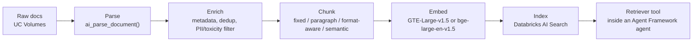

# 4. Knowledge Bases & Unstructured Doc Q&A

Two documented paths on Databricks answer "process unstructured docs with Q&A retrieval."
They're not competing — they trade engineering control for speed the same way Chapter 3's Agent
Framework vs. Agent Bricks choice does, because Knowledge Assistant and IDP *are* Agent Bricks.

## Path A — the custom, code-first pipeline

Databricks' own first-party tutorial for this is the **AI Cookbook**:
[Build an unstructured data pipeline for RAG](https://docs.databricks.com/aws/en/generative-ai/tutorials/ai-cookbook/quality-data-pipeline-rag).
The stages:

1. **Ingest** — raw PDFs/DOCX/PPT land in **Unity Catalog Volumes**; Lakeflow Connect for managed
   SaaS connectors if the source isn't a manual drop.
2. **Parse** — `ai_parse_document()`, a native Databricks SQL function, converts PDF/DOCX/PPT/images
   into structured elements (text, table, figure, title, caption, ...) returned as a `VARIANT`. It
   also supports exporting page images to a UC Volume for multimodal RAG. Non-native alternatives
   (`unstructured`, PyPDF2, Tesseract, cloud OCR) are mentioned in the cookbook too, but
   `ai_parse_document` is the Databricks-native default.
   **Source:** [`ai_parse_document` function reference](https://docs.databricks.com/aws/en/sql/language-manual/functions/ai_parse_document).
3. **Prep for retrieval** — `ai_prep_search()` (Beta) chunks the parsed output into semantic chunks
   already enriched with title/section/page context, pre-formatted for indexing — a native
   shortcut past manual chunking if you don't need a custom chunking strategy.
4. **Chunk** (if not using `ai_prep_search`) — the cookbook cites four strategies: fixed-size,
   paragraph-based (LangChain splitters), format-specific (Markdown/HTML header splitters), and
   semantic chunking (LangChain `SemanticChunker`). This repo's own
   [`RAG_Knowledge_Base_Starter/`](../RAG_Knowledge_Base_Starter/index.md) covers the tradeoffs
   between these vendor-neutrally, and [`Chunking_Strategies_In_Depth.md`](../RAG_Knowledge_Base_Starter/Chunking_Strategies_In_Depth.md)
   goes deeper — nothing here overrides that, this is just which of those options Databricks
   documents as first-class.
5. **Embed** — Databricks-hosted **GTE-Large-v1.5** (1024-dim, 8192-token window) or
   **bge-large-en-v1.5** (1024-dim, 512-token window) via Foundation Model APIs; external models
   (OpenAI `ada-002`/`text-embedding-3`) are also usable.
6. **Index** — **Databricks AI Search** (renamed from Vector Search), Delta-table-backed, kept in
   sync automatically. Algorithm-level detail (HNSW, the L2-to-cosine equivalence under
   normalization) is already covered in
   [`Similarity_Search_Methods/08_Databricks_Vector_Search.md`](../Similarity_Search_Methods/08_Databricks_Vector_Search.md) —
   this chapter doesn't repeat it, just tells you where it plugs into the pipeline.
7. **Wire into an agent** — the AI Search index becomes a retriever tool inside an Agent Framework
   agent (Chapter 3), the same tool-calling shape as any other tool.

## Path B — the low-code Agent Bricks path

**Knowledge Assistant** (GA'd 2026) — takes txt/pdf/md/ppt/pptx/doc/docx from a UC Volume, a table,
or directly from an AI Search index, and produces a source-citing chatbot without you assembling
steps 2-7 above by hand. It uses what Databricks calls an "Instructed Retriever" rather than plain
similarity search, with a claimed up to 70% higher answer quality than baseline RAG in Databricks'
own benchmark.
**Source:** [Use Knowledge Assistant to create a high-quality chatbot over your documents](https://docs.databricks.com/aws/en/generative-ai/agent-bricks/knowledge-assistant),
[GA announcement](https://www.databricks.com/blog/agent-bricks-knowledge-assistant-now-generally-available-turning-enterprise-knowledge-answers).

**Intelligent Document Processing (IDP)** — sits upstream of Knowledge Assistant: parsing + schema
extraction + 500+-label classification + retrieval prep, built on `ai_parse_document` as its
"bronze layer." Databricks positions this as the recommended integrated path over hand-rolling
steps 2-4 of Path A.
**Source:** [Intelligent document processing](https://docs.databricks.com/aws/en/agents/agent-bricks/intelligent-document-processing).

## Choosing between them

| Signal | Choose |
|---|---|
| Need a chatbot over a document set fast, with governance/citations by default | **Knowledge Assistant** (+ IDP upstream if docs need classification/extraction first) |
| Need custom chunking strategy, custom retrieval logic, or the retriever wired into a larger custom agent graph | **Path A**, code-first |
| Documents need structured field extraction, not just Q&A (e.g., pull specific fields off 500+ document types) | **IDP** specifically, whether or not Knowledge Assistant sits on top |

This is the exact tradeoff Chapter 8 walks through concretely for a real unstructured-doc Q&A
build.
