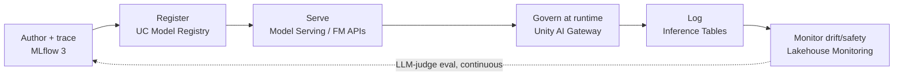

# 6. MLOps on Databricks

MLOps on Databricks covers both classic ML and GenAI/agent lifecycle — as of 2026 these run
through the same tool, **MLflow 3**, rather than separate products.

## MLflow 3 — the unifying layer

For GenAI/agents specifically, MLflow 3 folds tracing, evaluation, prompt registry, and governance
into one lifecycle tool. This absorbed what used to be a standalone product: the migration guide is
literally titled ["Migrate to MLflow 3 from Agent Evaluation"](https://docs.databricks.com/aws/en/mlflow3/genai/agent-eval-migration) —
"Agent Evaluation" as a standalone product name is legacy terminology now; the current answer is
that it's MLflow 3 GenAI eval.

**Source:** [MLflow 3 for GenAI](https://docs.databricks.com/aws/en/mlflow3/genai/).

### Tracing

Auto-instrumented across 20+ GenAI libraries — captures prompts, tool calls, retrievals, latency,
and cost per step, without manual instrumentation in most cases. New in 2026: traces can be stored
directly in **Unity Catalog** as OpenTelemetry-format Delta tables — no storage cap, SQL-queryable,
UC-governed — instead of being locked in the MLflow tracking store only.

**Source:** [MLflow Tracing — GenAI observability](https://docs.databricks.com/aws/en/mlflow3/genai/tracing),
[Trace agents deployed on Databricks](https://docs.databricks.com/aws/en/mlflow3/genai/tracing/prod-tracing).

### Evaluation

Built-in LLM judges (relevance, safety, groundedness, correctness) plus `make_judge()` for custom
scorers that return pass/fail, numeric, or categorical results. The same tooling runs pre-deployment
(offline eval on a test set) and post-deployment (continuous production quality monitoring) — one
mechanism, not two separate systems to maintain.

**Source:** [Evaluate and monitor agents](https://docs.databricks.com/aws/en/mlflow3/genai/eval-monitor/),
[Built-in LLM judges](https://docs.databricks.com/aws/en/mlflow3/genai/eval-monitor/concepts/judges/).

## Unity Catalog Model Registry

The recommended — and, as of 2026, effectively the only current — path for model lifecycle:
versioning, staging, governance, all centralized under Unity Catalog rather than a separate
registry with its own ACL model.

**Source:** [Manage model lifecycle in Unity Catalog](https://docs.databricks.com/aws/en/machine-learning/manage-model-lifecycle/).

## Model Serving

Standard serving endpoints for classic ML models, plus **Foundation Model APIs** for LLMs
(pay-per-token or provisioned throughput). Agents themselves deploy as serving endpoints too — and
because MLflow instrumentation is attached at authoring time, the same tracing/eval carries from
dev straight into prod without re-wiring anything at deploy time.

## Unity AI Gateway — guardrails and cost governance

The runtime control plane traffic to any model flows through: PII exposure, prompt injection,
jailbreak attempts, and unsafe content guardrails, plus cost/rate control, all from one place
regardless of which agent or model is calling out. Already introduced in Chapter 3 as the layer
underneath both Agent Framework and Agent Bricks — this is where it earns its place in the MLOps
story specifically.

**Source:** [AI governance with Unity AI Gateway](https://docs.databricks.com/aws/en/ai-gateway/),
[Safeguard AI workloads with guardrails](https://www.databricks.com/blog/how-safeguard-ai-workloads-unity-ai-gateway-guardrails).

## Lakehouse Monitoring

Inference is logged to **Inference Tables**, and **Lakehouse Monitoring** analyzes them over time
to track drift and safety — the production-observability half of the loop, distinct from
per-request eval.

## The end-to-end loop, stated as one sentence

Build and trace with MLflow 3 → register in the UC Model Registry → serve via Model Serving /
Foundation Model APIs → govern and guard at runtime via Unity AI Gateway → monitor drift and safety
over time via Lakehouse Monitoring on Inference Tables → close the loop with LLM-judge evaluation
running continuously in production, not just once before ship.

This is the loop worth having memorized as one coherent flow — Chapter 9 puts it back together
alongside the rest of the platform as a single end-to-end picture.
