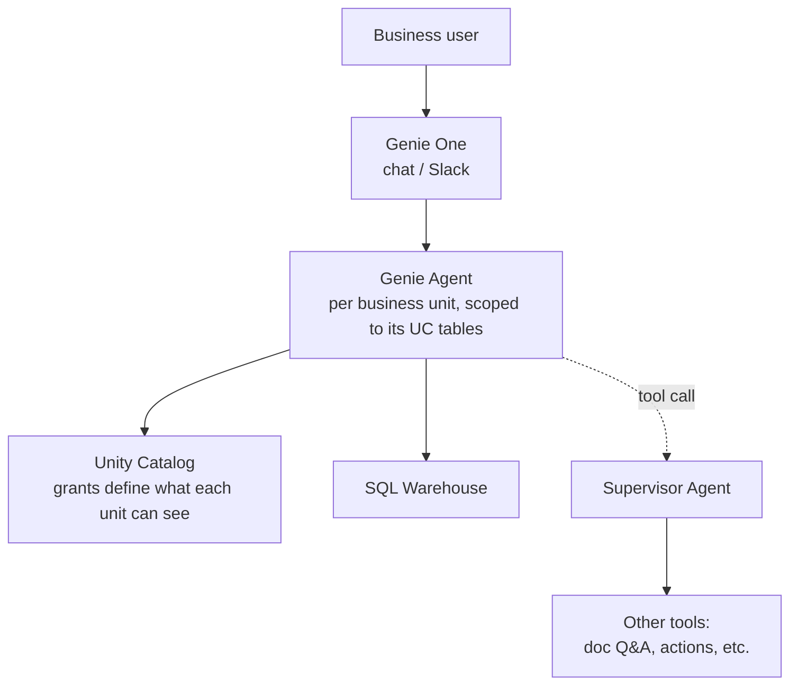

# 7. Use Case Walkthrough: NL2SQL Agent

Databricks doesn't have one canonical "the" NL2SQL pattern — its own docs support three distinct
paths, and knowing when each applies matters more than knowing any one of them in isolation.

## Path A — Genie Agent (no-code)

Point a Genie Agent (Chapter 1) at the relevant Unity Catalog tables, add instructions, example
SQL, and certified answers for the highest-stakes recurring questions. Governance is inherited from
UC grants automatically. This is the fast, managed answer — minutes to a working NL2SQL surface for
business users, no code deployed.

**When to choose it:** the audience is business users asking varied ad-hoc questions over a stable,
well-understood set of governed tables, and "good SQL most of the time, with certified answers for
the questions that must always be right" is an acceptable trust model.

## Path B — custom agent with Unity Catalog Functions

Build SQL-executing tools as UC Functions, wire them into an Agent Framework agent (Chapter 3) —
LangGraph, LangChain, or whatever your team standardizes on — typically through the managed MCP
endpoint (`https://<workspace-hostname>/api/2.0/mcp/functions/{catalog}/{schema}`) rather than
hand-writing tool schemas.

**When to choose it:** the requirement needs custom logic around the SQL step — multi-step
reasoning, non-SQL side effects triggered by the answer, tight control over retries/approval, or
integration into a larger agent graph that Genie alone can't express.

**Source:** [Create agent tools using Unity Catalog functions](https://docs.databricks.com/aws/en/agents/custom-agents/create-custom-tool),
[Integrate Unity Catalog tools with third-party frameworks](https://docs.databricks.com/aws/en/agents/agent-framework/unity-catalog-tool-integration).

## Path C — Genie as a tool inside a bigger agent

Don't rebuild text-to-SQL from scratch — call a Genie Agent from a custom multi-agent system via
the **Genie Conversation API**, orchestrated by a **Supervisor Agent** (Chapter 3) alongside other
tools/agents. This is the "reuse, don't reimplement" answer.

**When to choose it:** the NL2SQL capability is one component of a larger assistant that also needs
to do things Genie alone can't (doc Q&A, actions, other data sources) — build the bigger system in
Agent Framework and delegate the SQL-answering sub-task to Genie rather than re-solving it.

## The decision, summarized

Databricks' own answer is that it depends on trust and reuse, not just capability: Genie Agents
for governed, reusable, business-user-facing NL2SQL with minimal engineering. Custom Agent
Framework plus UC Functions when the requirement needs custom logic, non-SQL side effects, or
tighter control over the tool-calling loop. And the two aren't mutually exclusive — a Genie Agent
can be a callable tool inside a larger custom agent via the Conversation API, so a reasonable
default is to lean on Genie for the SQL part and only hand-roll it if there's a concrete reason
Genie can't do that part well enough.

(⚠️ A third-party comparison worth knowing exists, not to cite as Databricks doctrine but because
its structure mirrors this decision well: [Genie Spaces vs. Mosaic AI Agent Framework: Building a
Text-to-SQL Agent on Databricks](https://www.marvik.ai/blog/genie-spaces-vs-mosaic-ai-agent-framework-building-a-text-to-sql-agent-on-databricks)
(Marvik). Uses the old "Genie Spaces" name — mentally substitute "Genie Agents" per Chapter 0.)

## A reference architecture

For an NL2SQL agent serving an analytics team, governed and reusable across five business units:

One Genie Agent per business unit (not one global Genie Agent) is the answer to "how do you keep
answers accurate per-team" — scope the data objects and instructions per unit rather than trying to
make one Genie Agent's instructions cover five teams' different definitions of the same metric.
That's also exactly the ambiguity Genie Ontology (Chapter 2) is designed to help resolve when it
can't be avoided by scoping.
