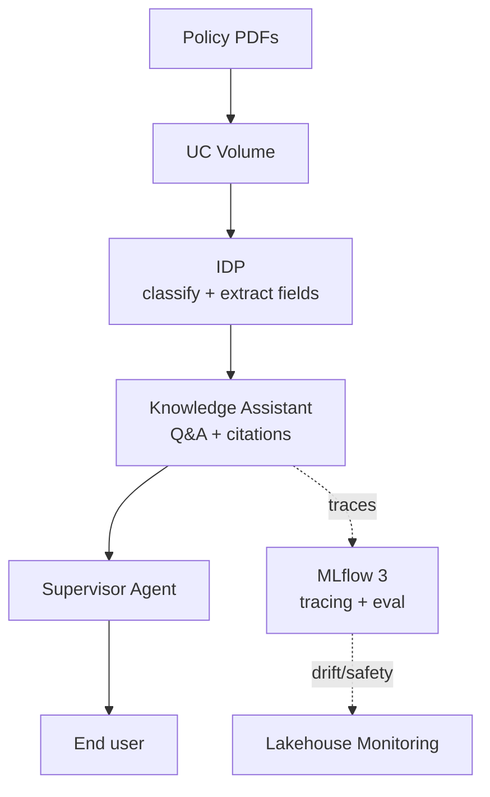

# 8. Use Case Walkthrough: Unstructured Doc Q&A

Databricks documents a genuine first-party end-to-end example for this — not something assembled
from scattered blog posts. Two ways to build it, same tradeoff shape as Chapter 4.

## The first-party reference

[Build an unstructured data pipeline for RAG](https://docs.databricks.com/aws/en/generative-ai/tutorials/ai-cookbook/quality-data-pipeline-rag),
part of Databricks' AI Cookbook series. Full pipeline, restated here in walkthrough form:

1. Land PDFs/DOCX/PPTs in a **UC Volume**
2. Parse with `ai_parse_document()` → structured elements as `VARIANT`
3. Enrich: metadata tagging, MinHash dedup, PII/toxicity filtering
4. Chunk: fixed / paragraph / format-aware / semantic — pick based on document structure
   consistency (see [`RAG_Knowledge_Base_Starter/Chunking_Strategies_In_Depth.md`](../RAG_Knowledge_Base_Starter/Chunking_Strategies_In_Depth.md)
   for the general tradeoffs)
5. Embed with GTE-Large-v1.5 or bge-large-en-v1.5 via Foundation Model APIs
6. Index in **Databricks AI Search**
7. Expose the index as a retriever tool inside an Agent Framework agent (Chapter 3)
8. Serve, trace, and evaluate via MLflow 3 (Chapter 6)

**Companion references:** [RAG on Databricks — conceptual overview](https://docs.databricks.com/aws/en/generative-ai/retrieval-augmented-generation),
[`ai_parse_document` reference](https://docs.databricks.com/aws/en/sql/language-manual/functions/ai_parse_document).

## Design rationale

**"Why UC Volumes and not straight into a vector store?"** — Volumes give you governed,
versioned, auditable raw storage before any transformation happens; you want the source-of-truth
documents under Unity Catalog access control before you've decided on a chunking strategy, not
after — chunking/embedding choices change, the source documents and who can see them shouldn't
have to be re-litigated when they do.

**"Why `ai_parse_document` over a general OCR library?"** — it's Databricks-native (no external
service call, runs where the data already is), returns a structured `VARIANT` you can query with
SQL directly, and supports page-image export for multimodal RAG if a doc set has meaningful
figures/tables that pure text extraction would lose. The cookbook doesn't claim it's strictly
better than `unstructured`/Tesseract/cloud OCR for every document type — it's the default because
it avoids an external dependency, not because it's universally more accurate.

**"Why AI Search instead of a self-hosted vector DB?"** — sync is automatic off the Delta table
(no separate ETL job to keep the index fresh), and it inherits Unity Catalog governance rather than
needing a parallel access-control system. The algorithmic tradeoff (HNSW, same as most self-hosted
options) is covered in [`Similarity_Search_Methods/08_Databricks_Vector_Search.md`](../Similarity_Search_Methods/08_Databricks_Vector_Search.md) —
the reason to choose it is operational, not "a better algorithm."

## The low-code alternative, and when it's the better call

**Knowledge Assistant** (Chapter 4) collapses steps 2-8 into a configured product: point it at a UC
Volume, table, or existing AI Search index, get a source-citing chatbot. If document *classification
or field extraction* is also needed (not just Q&A), **IDP** sits upstream of it.

**When to choose Knowledge Assistant over the custom pipeline:** the requirement is genuinely "Q&A
over these documents," speed-to-production and out-of-the-box citations/governance matter more than
control over the exact chunking/retrieval algorithm, and there's no need to wire the retriever into
a larger custom multi-tool agent graph. Databricks' own claim is up to 70% higher answer quality
than baseline RAG via its "Instructed Retriever" — worth citing, with the caveat that it's
Databricks' own benchmark, not independently verified.

**When to choose the custom pipeline instead:** a specific chunking strategy matters for this
document type (e.g., legal contracts need clause-aware chunking a generic splitter won't produce),
the retriever needs to be one tool among several inside a Supervisor Agent, or evaluation needs
custom scorers beyond what Knowledge Assistant exposes.

## A reference architecture

For a Q&A system over policy documents, with governance and audit:

IDP feeding Knowledge Assistant (rather than Knowledge Assistant alone) is the answer to "how do
you also know *what kind* of policy document this is, not just answer questions about it" — IDP's
classification step is what a plain RAG-over-chunks pipeline wouldn't give you for free.
