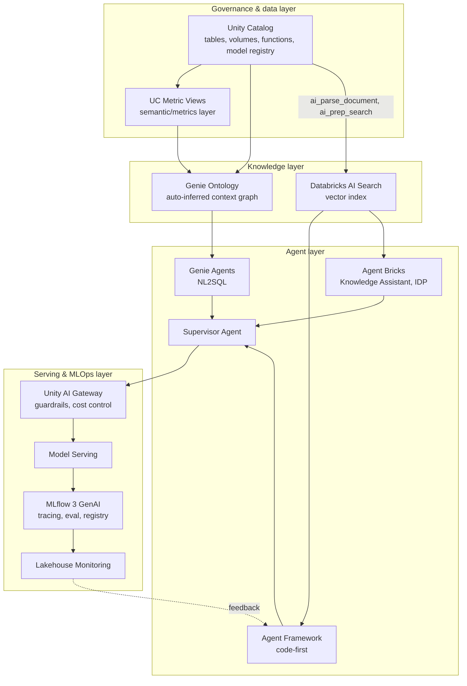

# 9. Putting It Together

The platform map from Chapter 0 and the two builds from Chapters 7-8 are pieces of one picture.
This chapter puts them back together, then works through the questions that come up once you try
to build on top of any of it.

## The full stack, end to end

Reading it top to bottom: governed data feeds a semantic/knowledge layer (Metric Views, Genie
Ontology, AI Search); agents — whether no-code Genie Agents, low-code Agent Bricks, or code-first
Agent Framework — consume that layer and get orchestrated together by a Supervisor Agent; and
everything runs through a serving/ops layer that governs, serves, traces, and monitors it in
production. The NL2SQL build in Chapter 7 and the doc Q&A build in Chapter 8 are both this same
diagram with a different subset of nodes lit up.

## Questions that come up once you try to build on this

**Is "Genie Ontology" something you can query directly?**
No, as documented it's an internal context/ranking layer that grounds Genie's own answers, not a
general graph database. See Chapter 2.

**Does Databricks have a native knowledge-graph product?**
No GA one. GraphFrames is graph analytics on Spark, not a semantic store. Genie Ontology is the
closest native thing but isn't an exposed graph API. Real knowledge-graph/GraphRAG work is
bring-your-own via a partner (PuppyGraph) or a Databricks Labs project (OntoBricks) — worth naming
the maturity tier explicitly rather than treating them as equivalent to a supported product. See
Chapter 5.

**What happened to Mosaic AI Vector Search?**
Renamed to Databricks AI Search. Same underlying HNSW algorithm, same L2-to-cosine equivalence
under normalization. See Chapter 0 and
[`Similarity_Search_Methods/08_Databricks_Vector_Search.md`](../Similarity_Search_Methods/08_Databricks_Vector_Search.md).

**What happened to Agent Evaluation as a standalone product?**
Folded into MLflow 3 GenAI eval/scorers. See Chapter 6.

**How do you stop a Genie Agent from leaking data across teams?**
You don't configure that in Genie — it's inherited from Unity Catalog grants. Genie is a read
layer over already-governed data, not a separate permission model. See Chapter 1.

**Genie Agent or a custom agent for NL2SQL — how do you choose?**
Genie Agents for governed, reusable, business-user-facing NL2SQL with minimal engineering; custom
Agent Framework plus UC Functions when the requirement needs custom logic, non-SQL side effects, or
tighter control over the tool-calling loop; and the two aren't mutually exclusive — a Genie Agent
can be a tool inside a larger custom agent via the Conversation API. See Chapter 7.

**Knowledge Assistant or a custom RAG pipeline for doc Q&A — how do you choose?**
Knowledge Assistant when speed-to-production and out-of-the-box citations/governance matter more
than control over the exact chunking/retrieval algorithm; a custom pipeline when a specific
chunking strategy matters for the document type, or the retriever needs to be one tool among
several inside a Supervisor Agent. See Chapter 8.

**How do you know answer quality hasn't regressed after a prompt or model change?**
MLflow 3 continuous evaluation running in production against Inference Tables, not just a one-time
offline eval before shipping. See Chapter 6.
