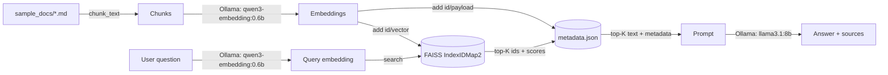

# Local Vector DB Lifecycle with FAISS

A self-contained, fully local project that implements the full vector database lifecycle — create,
insert, read, update, delete, persist, load, stats — on top of [FAISS](https://github.com/facebookresearch/faiss),
using a local [Ollama](https://ollama.com) model (`qwen3-embedding:0.6b`) for embeddings and
`llama3.1:8b` for generation. No external API keys, no cloud services, no Docker — FAISS is an in-process
library, not a server.

This is a standalone project — it has its own `requirements.txt`, independent of the rest of this
repository. It pairs with [`../docs/RAG_Knowledge_Base_Starter/04_Vector_Databases.md`](../docs/RAG_Knowledge_Base_Starter/04_Vector_Databases.md)
and [`../docs/Similarity_Search_Methods/10_FAISS_Index_Types.md`](../docs/Similarity_Search_Methods/10_FAISS_Index_Types.md)
— read those for the "why," this project is the "how." It also sits next to
[`../rag_pgvector_local`](../rag_pgvector_local), which implements the same RAG pipeline against a real
managed vector DB (Postgres + pgvector) instead of an in-process library — comparing the two `store.py`
vs `db.py` files is a good way to see what a managed vector DB gives you for free (persistence, payload
storage, concurrent access) versus what you have to build yourself with a library like FAISS.

## Why FAISS needs a `store.py`, not just the library

FAISS only knows `(id, vector)` pairs — it has no concept of your original text or metadata. So
`store.py`'s `FaissVectorStore` pairs a FAISS index with a JSON sidecar file (`data/metadata.json`)
holding `id -> {source, chunk_index, text}`. Every lifecycle operation below touches both halves.

## The lifecycle

| Stage | Method | Notes |
|---|---|---|
| **Create** | `FaissVectorStore.create(dim)` | Empty `IndexIDMap2(IndexFlatIP(dim))` — exact search, cosine similarity via normalized inner product, caller-assigned ids |
| **Insert** | `store.add(vectors, metadatas)` | Assigns sequential ids, adds normalized vectors to the index, stores payloads |
| **Read (by id)** | `store.get(id)` | Reconstructs the vector and returns it with its payload |
| **Read (search)** | `store.search(query_vector, top_k)` | Normalizes the query, returns top-K `{id, similarity, ...payload}` |
| **Update** | `store.update(id, vector, metadata)` | FAISS has no in-place update — this is `remove_ids` + `add_with_ids` under the same id |
| **Delete** | `store.delete(ids)` / `store.delete_by_source(source)` | Physically removes vectors (`IndexIDMap2.remove_ids`) and drops the payload |
| **Stats** | `store.stats()` | `ntotal`, dimension, metric, record count |
| **Persist** | `store.save(index_path, metadata_path)` | `faiss.write_index` + JSON dump |
| **Load** | `FaissVectorStore.load(index_path, metadata_path)` | `faiss.read_index` + JSON load, back into a fresh instance |

`lifecycle_demo.py` runs through every stage above, in order, against a scratch index.

## Architecture



| File | Role |
|---|---|
| `config.py` | All settings, loaded from `.env` (or defaults) |
| `store.py` | `FaissVectorStore` — the full lifecycle (create/insert/read/update/delete/persist/load/stats) |
| `embeddings.py` | Calls Ollama's `/api/embed` endpoint (default model `qwen3-embedding:0.6b`, 1024-dim) |
| `chunking.py` | Fixed-size, word-based chunking with overlap |
| `ingest.py` | Chunk + embed + load a folder of `.md`/`.txt` files into the FAISS index |
| `search.py` | Standalone similarity search (retrieval only, no LLM) |
| `rag.py` | Full pipeline: retrieve from FAISS, generate an answer with Ollama |
| `lifecycle_demo.py` | Scripted walkthrough of every lifecycle stage, end to end, on a scratch index |
| `sample_docs/` | A small demo corpus about FAISS and vector DBs themselves |
| `data/` | Generated at runtime: `index.faiss` + `metadata.json` (git-ignored) |

## Setup

```bash
python3 -m venv .venv
source .venv/bin/activate
pip install -r requirements.txt
```

Start Ollama and pull both models (one for embeddings, one for generation):

```bash
brew install ollama
ollama serve
ollama pull qwen3-embedding:0.6b
ollama pull llama3.1:8b
```

## Run

Walk through the full lifecycle (create, insert, read, update, delete, stats, persist, load) against a
throwaway index — the best starting point to see how `store.py` works:

```bash
python lifecycle_demo.py
```

Ingest the bundled sample corpus (or point it at any folder of `.md`/`.txt` files, including this repo's
own tutorial in `../docs`):

```bash
python ingest.py                # ingests ./sample_docs
python ingest.py ../docs        # e.g. index this repo's own agentic-development tutorial instead
```

Retrieval only, no LLM call — useful for sanity-checking the index:

```bash
python search.py "What index type does this project use, and why?"
```

Full RAG (retrieve + generate):

```bash
python rag.py "How does the update operation work in a FAISS-backed vector store?"
```

Re-ingesting a source (matched by relative file path) replaces its previous chunks via
`delete_by_source`, so `python ingest.py` is safe to re-run after editing a document.

### With `make`

```bash
make install
make demo
make ingest
make search Q="What is cosine similarity?"
make ask Q="What is a vector database?"
make clean   # deletes data/ (index + metadata + demo scratch files)
```

## Configuration

All settings live in `config.py`, overridable via `.env` (copy `.env.example` to `.env` to customize) or
plain environment variables — see `.env.example` for the full list (data dir, embedding model, Ollama
endpoint, chunk size/overlap, top-K).

Changing `EMBEDDING_MODEL` to a model with a different output dimension also requires updating
`EMBEDDING_DIM` in `.env`, then `make clean` and re-ingesting — a FAISS index has a fixed dimension set
at `create()` time and cannot be resized in place.

## Troubleshooting

- **`RuntimeError: Could not reach Ollama`** (from `embeddings.py` or `rag.py`) — confirm `ollama serve`
  is running and both `ollama pull qwen3-embedding:0.6b` and `ollama pull llama3.1:8b` completed.
- **`FileNotFoundError: No saved index at data/index.faiss / data/metadata.json`** — nothing has been
  ingested yet; run `python ingest.py` (or `python lifecycle_demo.py`, which uses its own scratch files)
  first.
- **`KeyError: 'embeddings'`** — your Ollama version may be old enough not to support `/api/embed`;
  upgrade Ollama, or fall back to the older `/api/embeddings` (singular, one string at a time, response
  key `embedding`) by adjusting `OLLAMA_EMBED_URL` and `embeddings.py` accordingly.
- **Search results look wrong after editing `store.py`'s index type** — if you swap `IndexFlatIP` for an
  approximate index (IVF, HNSW), make sure it still supports `reconstruct()` and `remove_ids()`, or
  `get()`/`update()`/`delete()` will raise `RuntimeError` from FAISS itself.
