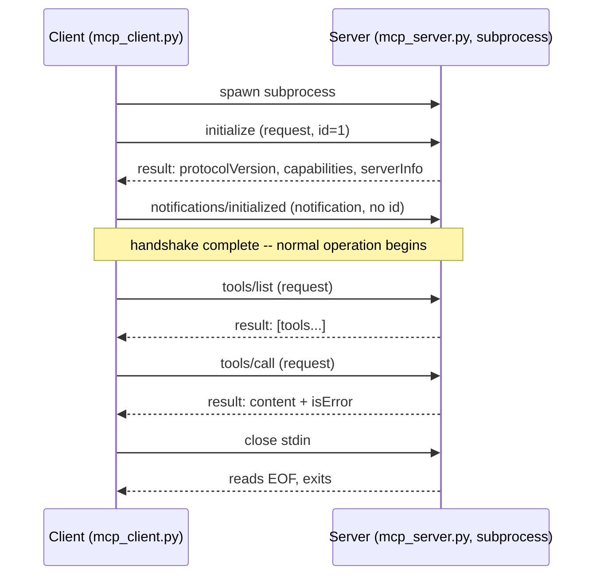

# MCP From Scratch

A from-scratch implementation of the [Model Context Protocol](https://modelcontextprotocol.io) —
no `mcp` package, no framework, just Python's standard library (`json`, `sys`, `subprocess`)
implementing the protocol's actual mechanics by hand. The goal isn't to build something
production-ready (use the real SDK for that, see [Chapter 11](../docs/Agentic_Concepts/11-mcp-agentic-capabilities.md)
and `../bedrock_agentcore_demo/tasks_mcp_server.py`) — it's to understand exactly what MCP *is*, at the level of the
bytes going over the wire, by building the smallest version that's still real.

## What MCP actually is

Strip away the framing and MCP is two things stacked together:

1. **[JSON-RPC 2.0](https://www.jsonrpc.org/specification)** — a message format for
   request/response/notification, invented in 2010, used by many things. MCP does not define its
   own message envelope; it just uses this one.
2. **A small, standardized set of methods** (`initialize`, `tools/list`, `tools/call`,
   `resources/list`, `resources/read`, and others this project doesn't implement) that any client
   and any server agree to speak, plus a couple of standard **transports** (stdio, and Streamable
   HTTP for network use) for actually moving those messages between processes.

That's the whole idea: instead of every AI application inventing its own bespoke way to expose
tools to a model, MCP standardizes the wire format and the method names, so one server (`../bedrock_agentcore_demo/tasks_mcp_server.py`,
or any of the hundreds of public MCP servers) works with any compliant client (this project's
`mcp_client.py`, Claude Desktop, an IDE, LangGraph via `langchain_mcp_adapters`, ...) without either
side knowing anything about the other's implementation. Everything below is building that idea up
piece by piece.

## Part 1 — JSON-RPC 2.0 (`jsonrpc.py`)

Four message shapes, and nothing MCP-specific about any of them yet:

```
request:      {"jsonrpc": "2.0", "id": 1, "method": "...", "params": {...}}
notification:  {"jsonrpc": "2.0", "method": "...", "params": {...}}            <- no "id"
response:      {"jsonrpc": "2.0", "id": 1, "result": {...}}
error:         {"jsonrpc": "2.0", "id": 1, "error": {"code": ..., "message": ...}}
```

The presence or absence of `"id"` is the entire mechanism: a message with an `id` expects exactly
one reply carrying that same `id` back; a message without one (a *notification*) is fire-and-forget
— the receiver must not reply, because there's no `id` for the reply to reference. See it run
standalone, no server or transport involved at all:

```bash
python jsonrpc.py
```

## Part 2 — The stdio transport (`stdio_transport.py`)

MCP's simplest transport: **one JSON-RPC message per line** of stdin/stdout, UTF-8, no message
containing a literal embedded newline. That's it — `readline()` on the receiving end is a complete
parser. This is deliberately different from the Language Server Protocol's `Content-Length: N`
header framing (MCP was designed by people who'd used LSP and wanted something simpler for the
common case). The trade-off: a message must fit on one line, which is exactly why every message in
this project is built with plain `json.dumps(message)`, never `json.dumps(message, indent=2)`.

The other rule, easy to violate by accident and fatal when you do: **stdout carries only protocol
messages.** A stray `print("debug")` in a real MCP server corrupts the stream — the client tries to
parse your debug text as JSON-RPC and the whole connection breaks. Every log line in
`mcp_server.py` goes to `stderr` for this reason; `stdio_transport.trace()` does too.

MCP's other standard transport, **Streamable HTTP**, isn't built here — it swaps stdin/stdout for
HTTP POST + Server-Sent Events and adds session management and (usually) auth on top. Worth
knowing it exists, not worth the added complexity for understanding the core protocol; see
[Chapter 13](../docs/Agentic_Concepts/13-trusted-tools-landscape.md#tool-exposure-standard).

## Part 3 — The lifecycle



Nothing can happen before `initialize`/`notifications/initialized` completes — a server that
receives `tools/list` before the handshake is technically within its rights to reject it (this
project's `dispatch()` doesn't enforce that for simplicity, but a spec-strict server would).
Shutdown for the stdio transport has no dedicated method: the client just closes stdin, the
server's `read_message` sees EOF, and the process exits — see `mcp_server.py`'s `main()` and
`mcp_client.py`'s `close()`.

## Part 4 — Primitives: tools and resources

MCP defines several primitives; this project implements two of them, which is enough to see the
shape they all share (a `*/list` method to discover what's available, a `*/call` or `*/read`
method to use one):

| Primitive | List method | Use method | What it's for |
|---|---|---|---|
| **Tools** | `tools/list` | `tools/call` | Actions a model can invoke — this project's `mcp_add_task`, etc. |
| **Resources** | `resources/list` | `resources/read` | Read-only content a client can pull in — this project's `tasks://all` |
| Prompts | `prompts/list` | `prompts/get` | Reusable prompt templates a server offers — not implemented here |
| Sampling | — | `sampling/createMessage` | Lets a *server* ask the *client's* LLM to generate something — inverts the usual direction, not implemented here |
| Roots | `roots/list` | — | Client tells the server which filesystem/URI roots it may operate on — not implemented here |

`TOOLS` and `RESOURCES` in `mcp_server.py` are plain Python data (name, description, and for tools
an `inputSchema` written as literal JSON Schema) — worth looking at directly, since that's *all* a
tool or resource definition actually is on the wire. The real SDK (`FastMCP`, used by
`../bedrock_agentcore_demo/tasks_mcp_server.py`) generates that JSON Schema for you from a function's type hints and
docstring; here it's written by hand once, specifically so the shape is visible.

## Part 5 — Error handling: two kinds, easy to conflate

This is the single most important subtlety this project exists to make concrete:

- **Protocol-level errors** (unknown method, unknown tool name, a missing required argument) are
  JSON-RPC `error` responses — `{"error": {"code": -32602, "message": "..."}}`. The *request*
  itself was invalid; nothing ran.
- **Tool execution failures** (business logic failed — e.g. `complete_task` given an id that
  doesn't exist) are JSON-RPC **success** responses with `isError: true` inside the `result`. The
  request was valid, the tool *ran*, and it reported failure as its output — which matters because
  it means the model sees the failure as a normal message in the conversation and can react to it
  (retry, apologize, try something else), rather than the whole tool call vanishing into an
  exception.

`mcp_server.py`'s `_call_tool` never raises for "task not found"-style failures — `task_store.py`
already returns a string like `"Task 7 not found."`, which flows back as ordinary tool output. The
`dispatch()` function only raises a JSON-RPC error for things that are wrong about the *call
itself* (unknown tool name, missing argument) — see `demo.py`'s sections 4 and 5 for both cases
triggered on purpose.

## File tour, in build order

| File | What it adds |
|---|---|
| `jsonrpc.py` | The four message shapes + standard error codes. No transport, no MCP semantics. |
| `stdio_transport.py` | Newline-delimited JSON framing over a file-like stream, plus a stderr trace helper. |
| `task_store.py` | The domain being exposed — a tiny standalone task list (mirrors `../bedrock_agentcore_demo/task_store.py`). |
| `mcp_server.py` | The dispatcher: `initialize`, `notifications/initialized`, `tools/list`, `tools/call`, `resources/list`, `resources/read`, and JSON-RPC error handling — the actual protocol implementation. |
| `mcp_client.py` | Spawns the server, does the handshake, exposes `list_tools()`/`call_tool()`/`list_resources()`/`read_resource()`. |
| `demo.py` | Exercises everything above against a live server, wire trace and all. |

## Setup and run

No dependencies, no venv strictly required — this project only imports the standard library.

```bash
python demo.py            # full wire trace (stderr) + results (stdout)
python demo.py --quiet    # suppress the client's trace lines (see note below)
python jsonrpc.py         # the four message shapes, standalone
python mcp_client.py      # a minimal handshake-only smoke test
```

Note: `mcp_server.py` traces every message it sees on its own `stderr` unconditionally (it's a
separate process and doesn't know about the client's `--quiet`), so even in quiet mode you'll see
one copy of the trace — from the server's side. That's expected, not a bug in the flag.

### With `make`

```bash
make jsonrpc-demo
make demo
make demo-quiet
make compare     # diff this project's server against ../bedrock_agentcore_demo/tasks_mcp_server.py
make clean
```

## Verified run

Real output from `python demo.py --quiet` against a fresh task list (trimmed to the interesting
parts — the full wire trace is much longer and is in the file if you run it yourself):

```
=== 1. initialize handshake ===
server: mcp-from-scratch-tasks v0.1.0, protocol 2025-06-18, capabilities ['tools', 'resources']

=== 2. tools/list ===
- mcp_list_tasks: Return all tasks and their completion state.
- mcp_add_task: Add a new task by title.
- mcp_complete_task: Mark a task as complete by id.

=== 3. tools/call -- happy path ===
Added task 1: understand MCP from scratch
Added task 2: compare against tasks_mcp_server.py
1. [open] understand MCP from scratch
2. [open] compare against tasks_mcp_server.py
Completed task 1: understand MCP from scratch
1. [done] understand MCP from scratch
2. [open] compare against tasks_mcp_server.py

=== 4. tools/call -- protocol-level error (unknown tool) ===
caught MCPError as expected: [-32602] Unknown tool 'mcp_delete_everything'

=== 5. tools/call -- protocol-level error (missing required argument) ===
caught MCPError as expected: [-32602] missing required argument 'title'

=== 6. resources/list and resources/read ===
- tasks://all: The full current task list as plain text.
1. [done] understand MCP from scratch
2. [open] compare against tasks_mcp_server.py

=== done ===
client closed stdin; server saw EOF and exited cleanly (see trace above)
```

And the raw wire trace for just the handshake, showing exactly what Part 3's sequence diagram
looks like as bytes:

```
--> {"jsonrpc": "2.0", "id": 1, "method": "initialize", "params": {"protocolVersion": "2025-06-18", "capabilities": {}, "clientInfo": {"name": "mcp-from-scratch-client", "version": "0.1.0"}}}
<-- {"jsonrpc": "2.0", "id": 1, "result": {"protocolVersion": "2025-06-18", "capabilities": {"tools": {}, "resources": {}}, "serverInfo": {"name": "mcp-from-scratch-tasks", "version": "0.1.0"}}}
--> {"jsonrpc": "2.0", "method": "notifications/initialized"}
```

## Compared to the real SDK

`../bedrock_agentcore_demo/tasks_mcp_server.py` exposes the identical three tools using `FastMCP` in 24 lines. Run
`make compare` to see the diff directly. What the ~350 lines in this project spell out by hand is
exactly what those 24 lines are doing for you:

| This project does it by hand | The real SDK (`FastMCP`) does it for you |
|---|---|
| `TOOLS` list with hand-written JSON Schema | Generated from function type hints + docstring via `@mcp.tool()` |
| `dispatch()`'s if/elif chain | Method routing built into the SDK |
| `stdio_transport.py`'s framing | Transport abstraction — same server code can run over stdio or Streamable HTTP |
| Manual `_validate_args` (required fields + basic type check) | Full JSON Schema validation |
| Hand-rolled `MCPClient` | `mcp.client.stdio` / `langchain_mcp_adapters.MultiServerMCPClient` (used in [Chapter 12](../docs/Agentic_Concepts/12-real-world-example.md#1-replace-the-hand-rolled-loop-with-langgraph--mcp-tools)) |
| No session/capability negotiation edge cases handled | Full spec compliance, version negotiation, capability checks |

Neither version is "wrong" — this repo already makes that same point about hand-rolled vs.
framework code in `../bedrock_agentcore_demo/personal_assistant_demo.py` vs. LangGraph's `create_react_agent`. Use the
real SDK for anything you'll actually run; build the from-scratch version (once) to know what it's
doing.

## What was deliberately left out

- **Prompts and sampling primitives** — reusable prompt templates and the server-asks-client's-LLM
  inversion. Different enough in shape that they'd roughly double this project's size for a third
  teaching point past the one this project focuses on (list/call, protocol vs. tool errors).
- **Streamable HTTP transport** — the network transport, with session ids and SSE. stdio is the
  right starting point because a subprocess's stdin/stdout needs no networking code at all to
  understand the message framing.
- **Real JSON Schema validation** — `_validate_args` checks required fields and basic types by
  hand; the spec expects full JSON Schema (nested objects, enums, patterns, ...).
- **Capability negotiation enforcement** — a spec-strict server rejects requests for capabilities
  it didn't advertise, and rejects everything except `initialize` before the handshake completes.
  This server is permissive about both, for less code to read.
- **Cancellation and progress notifications** — the spec defines `notifications/cancelled` and
  progress-reporting for long-running tool calls; nothing here runs long enough to need either.
- **Auth** — relevant only for the HTTP transport, out of scope alongside it.

## Exercises

Ideas to extend this yourself, roughly increasing in difficulty:

1. Add a fourth tool (e.g. `mcp_delete_task`) — touch only `task_store.py` and `TOOLS`/`_call_tool`
   in `mcp_server.py`; nothing else should need to change, which is itself the point of the
   list/call shape.
2. Add `prompts/list` and `prompts/get` for one canned prompt template, following the same
   list+use shape as tools and resources.
3. Make the server spec-strict: reject any method except `initialize` until
   `notifications/initialized` has been received, returning `INVALID_REQUEST`.
4. Swap real JSON Schema validation in for `_validate_args` using the `jsonschema` package, and
   compare error messages on a malformed call.
5. The ambitious one: build a minimal Streamable HTTP transport (a single-endpoint HTTP server
   using only `http.server` from the standard library) as an alternative to `stdio_transport.py`,
   reusing `jsonrpc.py` and `mcp_server.py`'s `dispatch()` unchanged — proof that the dispatcher
   really doesn't know or care which transport carried the message in.

## Troubleshooting

- **`json.decoder.JSONDecodeError` from the client** — almost always means something wrote to the
  server's stdout that wasn't a JSON-RPC message (a stray `print()`). Check `mcp_server.py` for
  any output not going through `write_message`/`trace` (which correctly targets stderr).
- **Client hangs forever** — the client is blocked in `readline()` waiting for a response the
  server never sent, usually because the server crashed on an unhandled exception before writing
  anything back. Run `python mcp_server.py` directly and pipe a single line of JSON at it by hand
  to isolate which method is misbehaving.
- **`expected response id N, got M`** — responses arrived out of order relative to requests, which
  shouldn't happen with this project's strictly synchronous one-at-a-time client, but would be the
  first thing to check if you ever make `mcp_client.py` pipeline multiple in-flight requests.
