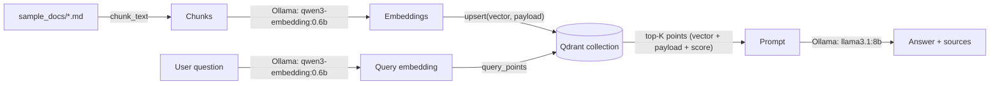

# Local Vector DB Lifecycle with Qdrant

A self-contained, fully local project that implements the full vector database lifecycle — create,
insert, read, update, delete, stats — on top of [Qdrant](https://qdrant.tech) running in Docker, using a
local [Ollama](https://ollama.com) model (`qwen3-embedding:0.6b`) for embeddings and `llama3.1:8b` for
generation. No external API keys, no cloud services.

This is a standalone project — it has its own `requirements.txt` and Docker setup, independent of the
rest of this repository. It sits next to two other implementations of the same RAG pipeline against
different kinds of vector stores:

- [`../faiss_vector_db`](../faiss_vector_db) — FAISS, an in-process library with no server and no native
  payload storage (needs its own JSON sidecar for text/metadata, and an explicit save/load step).
- [`../rag_pgvector_local`](../rag_pgvector_local) — pgvector, a vector type + index bolted onto Postgres.
- **This project** — Qdrant, a database built for vectors from the ground up: a real server, a JSON
  payload stored natively next to every vector, true upsert-by-id, and filtered search.

Comparing the three `store.py`/`db.py` files is a good way to see the same lifecycle stages implemented
three different ways, and what a purpose-built vector database gives you over a library or a bolted-on
extension. See also [`../docs/RAG_Knowledge_Base_Starter/04_Vector_Databases.md`](../docs/RAG_Knowledge_Base_Starter/04_Vector_Databases.md).

## The lifecycle

| Stage | Method | Notes |
|---|---|---|
| **Create** | `QdrantVectorStore.create_collection(client, name, dim)` | Creates the collection if it doesn't exist yet, cosine distance |
| **Insert** | `store.add(vectors, payloads)` | Assigns UUID ids, upserts points with their JSON payload |
| **Read (by id)** | `store.get(id)` | Returns the vector and payload for one point |
| **Read (search)** | `store.search(query_vector, top_k, source=None)` | Nearest-neighbor search, optionally filtered by payload field |
| **Update** | `store.update(id, vector, payload)` | A true in-place upsert under the same id — no delete+reinsert needed, unlike FAISS |
| **Delete** | `store.delete(ids)` / `store.delete_by_source(source)` | Delete by id list or by a payload filter |
| **Stats** | `store.stats()` | Point count, dimension, metric, collection status |

There's no explicit persist/load step: every write above is already durable in Qdrant's own storage (the
`qdrant_data` Docker volume) the moment it succeeds. `lifecycle_demo.py` runs through every stage, in
order, against a scratch collection.

## Architecture



| File | Role |
|---|---|
| `docker-compose.yml` | Runs `qdrant/qdrant`, REST API on 6333 (dashboard at `/dashboard`), gRPC on 6334 |
| `config.py` | All settings, loaded from `.env` (or defaults) |
| `store.py` | `QdrantVectorStore` — the full lifecycle, plus `get_client()` for a clear connection error |
| `embeddings.py` | Calls Ollama's `/api/embed` endpoint (default model `qwen3-embedding:0.6b`, 1024-dim) |
| `chunking.py` | Fixed-size, word-based chunking with overlap |
| `ingest.py` | Chunk + embed + load a folder of `.md`/`.txt` files into the collection |
| `search.py` | Standalone similarity search (retrieval only, no LLM) |
| `rag.py` | Full pipeline: retrieve from Qdrant, generate an answer with Ollama |
| `lifecycle_demo.py` | Scripted walkthrough of every lifecycle stage, end to end, on a scratch collection |
| `sample_docs/` | A small demo corpus about Qdrant and vector DBs themselves |

## Setup

```bash
python3 -m venv .venv
source .venv/bin/activate
pip install -r requirements.txt
```

Start Ollama and pull both models (one for embeddings, one for generation):

```bash
brew install ollama
ollama serve
ollama pull qwen3-embedding:0.6b
ollama pull llama3.1:8b
```

Start Qdrant in Docker:

```bash
docker compose up -d
```

## Run

Walk through the full lifecycle (create, insert, read, update, delete, stats) against a throwaway
collection — the best starting point to see how `store.py` works:

```bash
python lifecycle_demo.py
```

Ingest the bundled sample corpus (or point it at any folder of `.md`/`.txt` files, including this repo's
own tutorial in `../docs`):

```bash
python ingest.py                # ingests ./sample_docs
python ingest.py ../docs        # e.g. index this repo's own agentic-development tutorial instead
```

Retrieval only, no LLM call — useful for sanity-checking the collection:

```bash
python search.py "What does a payload filter do in Qdrant?"
```

Full RAG (retrieve + generate):

```bash
python rag.py "How does update work differently in Qdrant versus FAISS?"
```

Re-ingesting a source (matched by relative file path) replaces its previous chunks via
`delete_by_source`, so `python ingest.py` is safe to re-run after editing a document.

### With `make`

```bash
make up        # start Qdrant, wait for healthy
make install
make demo
make ingest
make search Q="What is cosine similarity?"
make ask Q="What is a vector database?"
make down      # stop Qdrant (keeps data)
make clean     # stop Qdrant and delete the volume
```

## Exploring the dashboard

With `docker compose up -d` running, open `http://localhost:6333/dashboard` to browse collections, run
ad-hoc searches, and inspect individual points' payloads in a UI — useful for confirming what `ingest.py`
actually wrote.

## Configuration

All settings live in `config.py`, overridable via `.env` (copy `.env.example` to `.env` to customize) or
plain environment variables — see `.env.example` for the full list (Qdrant host/port, collection name,
embedding model, Ollama endpoint, chunk size/overlap, top-K).

Changing `EMBEDDING_MODEL` to a model with a different output dimension also requires updating
`EMBEDDING_DIM` in `.env` and re-creating the collection (`make clean && make up`) — a Qdrant collection
has a fixed vector dimension set at creation time.

## Troubleshooting

- **`RuntimeError: Could not reach Qdrant`** (from `store.get_client()`) — Qdrant isn't up yet; run
  `docker compose ps` and check `docker compose logs qdrant`. `make up` waits for the healthcheck
  automatically.
- **`RuntimeError: Could not reach Ollama`** (from `embeddings.py` or `rag.py`) — confirm `ollama serve`
  is running and both `ollama pull qwen3-embedding:0.6b` and `ollama pull llama3.1:8b` completed.
- **`RuntimeError: Collection 'documents' does not exist yet`** — nothing has been ingested; run
  `python ingest.py` first.
- **`KeyError: 'embeddings'`** — your Ollama version may be old enough not to support `/api/embed`;
  upgrade Ollama, or fall back to the older `/api/embeddings` (singular, one string at a time, response
  key `embedding`) by adjusting `OLLAMA_EMBED_URL` and `embeddings.py` accordingly.
