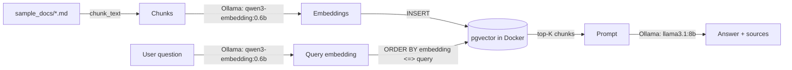

# Local RAG with pgvector

A self-contained, fully local Retrieval-Augmented Generation project: [pgvector](https://github.com/pgvector/pgvector)
running in Docker for vector storage/search, and local [Ollama](https://ollama.com) models for both
embeddings (`qwen3-embedding:0.6b`) and generation (`llama3.1:8b`). No external API keys, no cloud services
— Ollama is the only runtime dependency, for both steps.

This is a standalone project — it has its own `requirements.txt` and Docker setup, independent of the rest
of this repository. It pairs with the concepts in [`../docs/RAG_Knowledge_Base_Starter/`](../docs/RAG_Knowledge_Base_Starter/index.md)
(embeddings, similarity metrics, HNSW, vector databases) and the RAG-as-a-tool pattern described in
[`../docs/12-real-world-example.md`](../docs/12-real-world-example.md) — read those for the "why," this
project is the "how."

## Architecture



| File | Role |
|---|---|
| `docker-compose.yml` | Runs `pgvector/pgvector:pg16`, auto-applies `schema.sql` on first start |
| `schema.sql` | `documents` table (`VECTOR(1024)` column) + HNSW index |
| `config.py` | All settings, loaded from `.env` (or defaults) |
| `chunking.py` | Fixed-size, word-based chunking with overlap |
| `embeddings.py` | Calls Ollama's `/api/embed` endpoint (default model `qwen3-embedding:0.6b`, 1024-dim) |
| `db.py` | `psycopg2` connection with `pgvector` type registered |
| `ingest.py` | Chunk + embed + load a folder of `.md`/`.txt` files into pgvector |
| `search.py` | Standalone similarity search (retrieval only, no LLM) |
| `rag.py` | Full pipeline: retrieve from pgvector, generate an answer with Ollama |
| `sample_docs/` | A small demo corpus about vector search itself |
| `explore.ipynb` | Interactive notebook for exploring embeddings/retrieval by hand (optional, see below) |
| `explore_ollama.ipynb` | Interactive notebook for the Ollama API itself — models, generate/chat, sampling options (optional, see below) |
| `requirements-notebook.txt` | Jupyter Lab + notebook-only deps (not needed for the CLI scripts) |

## Setup

```bash
python3 -m venv .venv
source .venv/bin/activate
pip install -r requirements.txt
```

Start Ollama and pull both models (one for embeddings, one for generation):

```bash
brew install ollama
ollama serve
ollama pull qwen3-embedding:0.6b
ollama pull llama3.1:8b
```

Start pgvector in Docker:

```bash
docker compose up -d
```

`schema.sql` is mounted into `/docker-entrypoint-initdb.d/` and runs automatically the *first* time the
container initializes its data volume. If you change `schema.sql` after that, apply it manually:

```bash
docker compose exec -T pgvector psql -U rag -d rag < schema.sql
```

## Run

Ingest the bundled sample corpus (or point it at any folder of `.md`/`.txt` files, including this repo's
own tutorial in `../docs`):

```bash
python ingest.py                # ingests ./sample_docs
python ingest.py ../docs        # e.g. index this repo's own agentic-development tutorial instead
```

Retrieval only, no LLM call — useful for sanity-checking the index:

```bash
python search.py "What is cosine similarity?"
```

Full RAG (retrieve + generate):

```bash
python rag.py "How does this project decide which similarity metric to use, and why?"
```

Re-ingesting a source (matched by relative file path) replaces its previous chunks, so `python ingest.py`
is safe to re-run after editing a document.

### With `make`

```bash
make up        # start pgvector, wait for healthy
make install
make ingest
make ask Q="What is a vector database?"
make down      # stop pgvector (keeps data)
make clean     # stop pgvector and delete the volume
```

## Exploring interactively (Jupyter Lab)

Optional, on top of the base setup above — for poking at embeddings, retrieval, and the pgvector index by
hand rather than through the CLI scripts.

```bash
make install-notebook   # jupyterlab, pandas, matplotlib, scikit-learn + registers a project-scoped kernel
make lab                 # opens explore.ipynb at http://localhost:8890
```

(Port `8890`, not the Jupyter default `8888` — chosen to avoid colliding with other local notebook servers;
override with `jupyter lab --port=<N> explore.ipynb` if `8890` is also taken.) Select the **RAG pgvector
(local)** kernel if it isn't already active — it points at this project's `.venv`, not your system Python.

`explore.ipynb` covers: embedding a few sentences and inspecting pairwise similarity, running
`search.search()` interactively, comparing two different Ollama embedding models' retrieval rankings
side by side, raw SQL against the `documents` table (including confirming the HNSW index is actually used
via `EXPLAIN`), a 2D PCA plot of the corpus, and a chunking playground for trying different
`chunk_size`/`overlap` values.

## Configuration

All settings live in `config.py`, overridable via `.env` (copy `.env.example` to `.env` to customize) or
plain environment variables — see `.env.example` for the full list (DB connection, embedding model,
Ollama endpoint, chunk size/overlap, top-K).

Changing `EMBEDDING_MODEL` to a model with a different output dimension also requires updating
`EMBEDDING_DIM` in `.env` **and** the `VECTOR(1024)` column width in `schema.sql`, then re-creating the
table (`make clean && make up`) and re-ingesting — pgvector's `vector` column has a fixed dimension.

## Troubleshooting

- **`psycopg2.OperationalError: could not connect`** — pgvector isn't up yet; run `docker compose ps` and
  check `docker compose logs pgvector`. `make up` waits for the healthcheck automatically.
- **`relation "documents" does not exist`** — `schema.sql` only runs on a *fresh* data volume. If you
  started the container before adding/editing it, run
  `docker compose exec -T pgvector psql -U rag -d rag < schema.sql` manually, or `make clean && make up`
  to reinitialize from scratch (this deletes any already-ingested data).
- **`RuntimeError: Could not reach Ollama`** (from `embeddings.py` or `rag.py`) — confirm `ollama serve` is
  running and both `ollama pull qwen3-embedding:0.6b` and `ollama pull llama3.1:8b` completed.
- **`KeyError: 'embeddings'`** — your Ollama version may be old enough not to support `/api/embed`; upgrade
  Ollama, or fall back to the older `/api/embeddings` (singular, one string at a time, response key
  `embedding`) by adjusting `OLLAMA_EMBED_URL` and `embeddings.py` accordingly.
