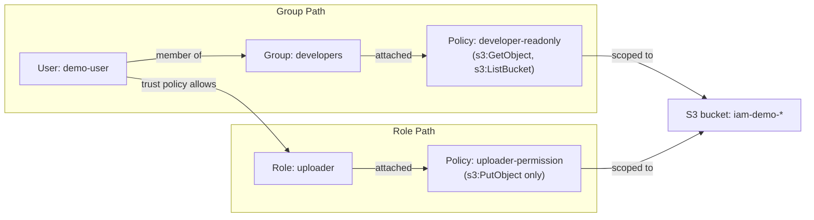

# IAM Architecture: Entities, Policies, and How a Permission Decision Actually Gets Made

## What IAM Actually Is

**[Documented]** IAM is a **global** service — there's no "IAM region."
A User, Group, Role, or Policy created in the console/API is visible and
usable from every region simultaneously; there's nothing to replicate.
IAM itself is free — you pay for the resources a principal's permissions
let it touch, never for the Users/Groups/Roles/Policies themselves.
IAM is also **eventually consistent** for some operations (a
freshly-created Role occasionally isn't immediately assumable
everywhere) — a real, if minor, operational gotcha worth knowing before
you assume a race condition in your own code.

## The Four Entities

| Entity | Has an ARN? | Has credentials? | Can be a policy's `Principal`? | What it's for |
|---|---|---|---|---|
| **User** | Yes | Yes — password (console) and/or long-lived access keys (API/CLI) | Yes | A specific human, or (discouraged) a specific application, that needs a persistent identity |
| **Group** | Yes | **No** | **No** | Purely an attachment convenience — "attach these policies to everyone in this bucket of Users." A Group cannot be assumed, cannot appear in a trust policy, and is not itself a security principal AWS's evaluation logic ever considers — it's sugar for "attach this policy to N users" |
| **Role** | Yes | **No permanent ones** — only ever temporary, minted on demand via STS | Yes | An identity *anything* (a User, another AWS account, an AWS service, a federated identity) can temporarily *become*, for exactly as long as a session lasts |
| **Policy** | Yes (if managed) | N/A | N/A | The actual JSON document listing what's allowed/denied. Not an identity at all — it's attached *to* one |

**The one distinction that matters more than the other three combined:
Users have permanent credentials, Roles never do.** A User's access key
pair is valid until someone manually rotates or deletes it — if it leaks,
it's live until acted on. A Role only ever produces temporary credentials
(default 1 hour, configurable up to the role's `max_session_duration`)
via `sts:AssumeRole` — even if a set of temporary credentials leaks, they
self-expire. This single fact is *why* "prefer Roles over Users for
anything that isn't a human logging into the console" is closer to a law
than a suggestion in AWS — and it's the exact reason EC2 instance
profiles, Lambda execution roles, and ECS task roles all work by handing
your code temporary, auto-rotated credentials rather than a static key
baked into an AMI or a Lambda environment variable.

## Policies: the Actual Document

A policy is JSON, `Version` + a `Statement` array, each statement:

```json
{
  "Version": "2012-10-17",
  "Statement": [
    {
      "Sid": "ReadOneBucket",
      "Effect": "Allow",
      "Action": ["s3:GetObject", "s3:ListBucket"],
      "Resource": [
        "arn:aws:s3:::iam-demo-bucket",
        "arn:aws:s3:::iam-demo-bucket/*"
      ],
      "Condition": {
        "StringEquals": { "aws:PrincipalTag/team": "data-eng" }
      }
    }
  ]
}
```

- **`Effect`**: `Allow` or `Deny` — that's the whole vocabulary, no
  "maybe."
- **`Action`**: the API call(s) this statement governs, `service:Verb`
  shape (`s3:GetObject`, `ec2:StartInstances`).
- **`Resource`**: which ARN(s) this applies to — `*` for "everything this
  action can touch," or a specific/wildcarded ARN pattern for narrower
  scope. This is AWS's version of Azure's `scope` — except here it's a
  string pattern *inside* the policy document itself, not a property of
  a separate assignment resource (see the Azure contrast at the bottom).
- **`Condition`**: optional, narrows further by request context — source
  IP, MFA presence, resource tags, time of day, the requester's own tags
  (`aws:PrincipalTag/...`, the mechanism behind **ABAC** — attribute-based
  access control, granting/denying based on tags matching between
  principal and resource rather than hardcoding every ARN).
- **`Principal`**: **only appears on resource-based policies and trust
  policies** (an S3 bucket policy, an SNS topic policy, a Role's trust
  policy) — it says *who* this statement applies to. An identity-based
  policy (attached to a User/Group/Role) never has a `Principal` field —
  attaching it *to* that identity is what already answers "who."

**Where a policy can live:**

| Kind | Attached to | Reusable? | Has `Principal`? |
|---|---|---|---|
| **AWS managed** | Any User/Group/Role | Yes — AWS owns/updates it (e.g. `AmazonS3ReadOnlyAccess`) | No |
| **Customer managed** | Any User/Group/Role | Yes — you own it, version it, can attach to many principals | No |
| **Inline** | Exactly one User/Group/Role, embedded in it | No — deleted with its principal, never reusable | No |
| **Resource-based** | The resource itself (S3 bucket, SNS topic, ...), not a principal at all | N/A | **Yes, required** |
| **Permission boundary** | A User/Role, as a ceiling | N/A | No |
| **Session policy** | Passed inline at `sts:AssumeRole` call time | No, one session only | No |

## Roles Have *Two* Policies, Not One — This Is the Part Worth Being Precise About

Every Role carries two entirely separate documents that answer two
entirely separate questions:

1. **Trust policy** (`AssumeRolePolicyDocument`) — *who is allowed to
   become this role.* This is itself a resource-based policy (it has a
   `Principal`), just attached to the Role instead of to an S3
   bucket/SNS topic. The `Principal` can be:
   - An IAM User/Role ARN (same account or another account — this is
     literally how cross-account access works)
   - `{"AWS": "arn:aws:iam::ACCOUNT_ID:root"}` — trust the whole account,
     any principal in it with `sts:AssumeRole` permission on their own
     side can assume it
   - An AWS service principal (`ec2.amazonaws.com`, `lambda.amazonaws.com`)
     — this is what makes an EC2 instance profile or Lambda execution
     role work: the *service* itself is the thing assuming the role on
     your code's behalf
   - A federated/OIDC/SAML provider — SSO, GitHub Actions OIDC, etc.
2. **Permission policy** (one or more identity-based policies, managed
   or inline, attached the normal way) — *what you can do once you've
   become this role.* Same shape as any other identity-based policy.

**Trust policy and permission policy are independent** — a Role trusted
by `ec2.amazonaws.com` and a Role trusted by another AWS account can
carry the exact same permission policy; who can *become* the role and
what the role *can do* vary completely orthogonally, the same "identity
vs permissions are two separate axes" idea Azure makes explicit by
literally using two different resource types (see the bottom section).

## STS and `AssumeRole`, Mechanically

`sts:AssumeRole` is the API call that turns "I'm allowed to become this
Role" into an actual usable, temporary credential set:
`AccessKeyId` + `SecretAccessKey` + `SessionToken`, all three required
together (unlike a User's static keys, which are just the first two).
STS checks the Role's trust policy for a matching `Principal` +
`Action: sts:AssumeRole`, and — if the caller has permission on their own
side too (`sts:AssumeRole` on that Role's ARN, an identity-based
permission) — mints credentials valid for up to `max_session_duration`
(1–12 hours, default 1). **This exact call is what's happening invisibly
underneath an EC2 instance profile and a Lambda execution role** — the
platform calls `AssumeRole` on your behalf on a timer, refreshing before
expiry, so your code (via the SDK's default credential chain) never
touches a long-lived secret at all. Structurally identical in spirit to
Azure's Managed-Identity token exchange against `IDENTITY_ENDPOINT` —
different wire protocol, same underlying promise: no persistent secret
ever lands in your process.

## Policy Evaluation: the Actual Algorithm

Given a request (a `Principal` trying an `Action` on a `Resource`), AWS
evaluates *every applicable policy* and reduces it to one decision:

1. **Default: implicit deny.** If nothing says `Allow`, the answer is no.
2. **An explicit `Deny` anywhere always wins**, full stop — it doesn't
   matter how many `Allow` statements exist elsewhere; one matching
   `Deny` (in an identity-based policy, a resource-based policy, an SCP,
   or a permission boundary) overrides all of them.
3. **Same-account access to a resource**: an identity-based policy
   *alone* is enough — you don't also need a matching resource-based
   policy if the resource and the principal are in the same account (an
   S3 bucket with no bucket policy at all is still readable by a User
   whose identity-based policy allows `s3:GetObject` on it).
4. **Cross-account access to a resource**: needs an explicit `Allow` on
   **both sides** — the identity-based policy in the *accessing*
   account, and the resource-based policy in the *resource's own*
   account, naming that external principal. Either one missing, and the
   answer is no, with no explicit Deny required to cause it.
5. **Permission boundaries and SCPs are ceilings, never grants.** A
   permission boundary on a User/Role, or an Organizations SCP on the
   whole account, can only *narrow* what an identity-based policy already
   allows (the effective permission is the *intersection*) — attaching
   one grants nothing by itself; it's purely a maximum.

## This Repo's Hands-On Module, as a Diagram

What [`terraform/iam/`](../../terraform/iam/README.md) actually builds
and verifies live:



Verified live: assuming `uploader` and calling `PutObject` succeeds;
calling `GetObject` with those same temporary credentials comes back
`AccessDenied` — the permission policy only ever granted `s3:PutObject`,
so STS handing out valid temporary credentials for the Role changes
nothing about what those credentials are actually allowed to do.

## The Azure Contrast, Briefly

Already covered in full, verified against a real Azure deployment, in
[`cloud-practice/azure/terraform/function-storage-rbac/README.md`](../../../azure/terraform/function-storage-rbac/README.md) —
the short version: Azure splits what a Role bundles into one resource
(identity + trust + permissions) into two independent resource types
(Managed Identity = who; Role Assignment = what, at a chosen scope), and
further splits AWS's single `Action` vocabulary into `Actions`
(control-plane) vs `DataActions` (actual data-plane operations) as two
separate arrays on the same Role Definition.
