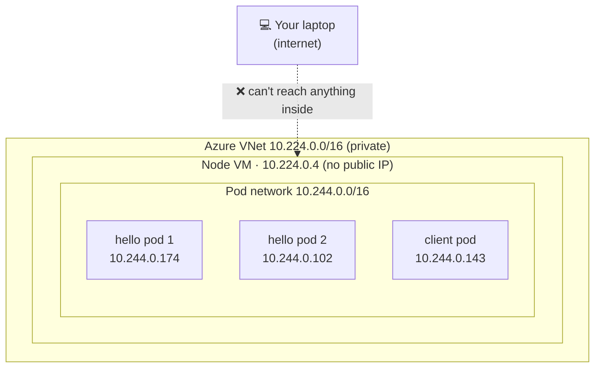
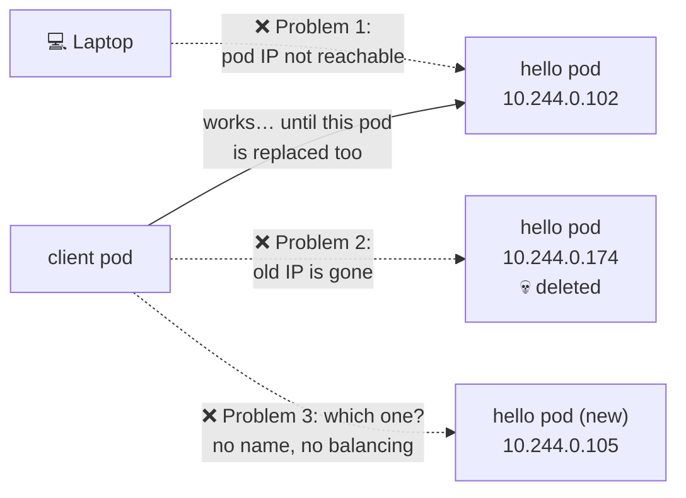
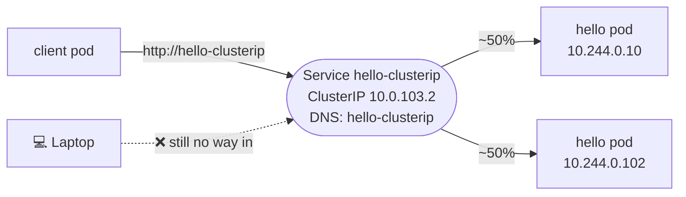
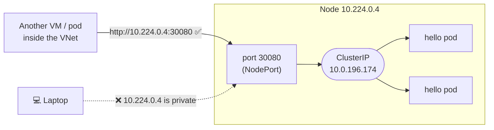
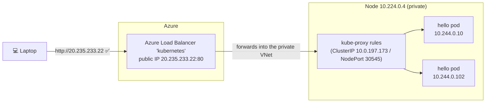
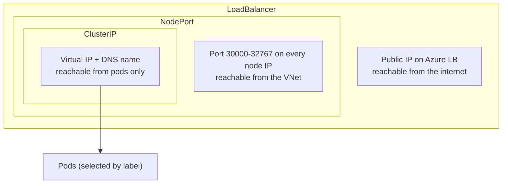

# Service Types Lab: See the Problem First, Then the Fix

A hands-on walkthrough on this AKS cluster. First we deploy an app **with no
Service** and hit the problems for real. Then we add **ClusterIP →
NodePort → LoadBalancer** one at a time and watch what each one fixes (and
what it still doesn't).

Every output below is real, captured on 2026-09-27 from cluster `aks-svc-lf508l`.
Your pod names and IPs will differ when you rerun it.

| File | What it creates |
|---|---|
| [`01-app.yaml`](01-app.yaml) | namespace `svc-lab`, Deployment `hello` (2 pods), and a `client` pod for testing from inside |
| [`02-clusterip.yaml`](02-clusterip.yaml) | Service `hello-clusterip` |
| [`03-nodeport.yaml`](03-nodeport.yaml) | Service `hello-nodeport` (port `30080`) |
| [`04-loadbalancer.yaml`](04-loadbalancer.yaml) | Service `hello-lb` |

The app `nginxdemos/hello:plain-text` replies with **its own pod name and
IP**, so every response shows exactly which pod answered.

---

## Stage 0: The setup, and the three kinds of IP address

This cluster has **three separate address ranges**. Mixing them up is the
main reason Services feel confusing:

| Range (CIDR) | Who gets addresses from it | Example here | Real network card? |
|---|---|---|---|
| `10.224.0.0/16`: **node subnet** (Azure VNet) | Nodes (VMs) | node `10.224.0.4` | ✅ yes, the VM's NIC |
| `10.244.0.0/16`: **pod CIDR** (overlay network) | Pods | `hello` pods `10.244.0.174`, `10.244.0.102` | virtual, inside the node |
| `10.0.0.0/16`: **service CIDR** | Services (ClusterIPs) | `hello-clusterip` `10.0.103.2` | ❌ no, only forwarding rules |

(A CIDR like `10.244.0.0/16` just means "all addresses starting with
`10.244.`": 65,536 of them.)

Plus, outside all of those: **your laptop**, somewhere on the internet.



The whole cluster sits inside a **private** network. Nothing inside has a
public address yet.

---

## Stage 1: Just a Deployment, no Service (the problems)

```bash
kubectl apply -f 01-app.yaml
kubectl get pods -n svc-lab -o wide
```

```
client                  10.244.0.143   aks-system-31524237-vmss000000
hello-6557b88f4-c9glm   10.244.0.174   aks-system-31524237-vmss000000
hello-6557b88f4-cpm55   10.244.0.102   aks-system-31524237-vmss000000
```

Every pod gets its own IP from the pod CIDR. Now let's try to use them.

### ❌ Problem 1: pod IPs can't be reached from outside

```
$ curl http://10.244.0.174/          # from the laptop
FAILED (timeout)
```

`10.244.x.x` only exists **inside** the cluster's pod network. Your laptop
has no route to it.

### ✅ But inside the cluster, pod-to-pod works

```
$ kubectl exec -n svc-lab client -- curl -s http://10.244.0.174/
Server address: 10.244.0.174:80
Server name: hello-6557b88f4-c9glm
$ kubectl exec -n svc-lab client -- curl -s http://10.244.0.102/
Server address: 10.244.0.102:80
Server name: hello-6557b88f4-cpm55
```

So pods *can* talk to each other directly by pod IP. So why not just do that?

### ❌ Problem 2: pod IPs change when pods are replaced

Pods are replaced all the time (deploys, crashes, node restarts). Simulate
one:

```
$ kubectl delete pod -n svc-lab hello-6557b88f4-c9glm      # Deployment creates a new one
$ kubectl get pods -n svc-lab -l app=hello -o wide
hello-6557b88f4-6ngxz   10.244.0.105     <- NEW pod, NEW IP
hello-6557b88f4-cpm55   10.244.0.102

$ kubectl exec -n svc-lab client -- curl -s --max-time 5 http://10.244.0.174/
FAILED: old pod IP 10.244.0.174 is gone
```

Any app that had `10.244.0.174` in its config is now **broken**.

### ❌ Problem 3: no name, and no single address for "the app"

```
$ kubectl exec -n svc-lab client -- curl -s http://hello/
FAILED (curl exit 6: could not resolve host)
```

There are **2** hello pods with **2** IPs. Which should the client call? Who
spreads the traffic? If one dies, who stops sending to it? Nothing does.
There's no name to call either.



**Summary of problems:**

| # | Problem | Who's affected |
|---|---|---|
| 1 | Pod IPs aren't reachable from outside the cluster | users, your laptop |
| 2 | Pod IPs change every time a pod is replaced | any app calling another app |
| 3 | Many pods, but no single name/address and no load balancing | any app calling another app |

---

## Stage 2: ClusterIP (fixes problems 2 and 3, inside the cluster)

```bash
kubectl apply -f 02-clusterip.yaml
```

```
NAME              TYPE        CLUSTER-IP   PORT(S)
hello-clusterip   ClusterIP   10.0.103.2   80/TCP
```

The Service picks pods by **label** (`selector: app=hello`) and gets:
- **a fixed virtual IP** from the service CIDR: `10.0.103.2`
- **a fixed DNS name**: `hello-clusterip` (full: `hello-clusterip.svc-lab.svc.cluster.local`)

```
$ kubectl get endpointslices -n svc-lab -l kubernetes.io/service-name=hello-clusterip
10.244.0.105 hello-6557b88f4-6ngxz     <- the pods currently behind it
10.244.0.102 hello-6557b88f4-cpm55

$ kubectl exec -n svc-lab client -- nslookup hello-clusterip.svc-lab.svc.cluster.local
Address: 10.0.103.2
```

### ✅ One name, traffic spread across pods

```
$ for i in 1 2 3 4 5 6; do kubectl exec -n svc-lab client -- curl -s http://hello-clusterip/ | grep "Server name"; done | sort | uniq -c
   3 Server name: hello-6557b88f4-6ngxz
   3 Server name: hello-6557b88f4-cpm55
```

### ✅ Pod replaced, and callers don't notice

```
$ kubectl delete pod -n svc-lab hello-6557b88f4-6ngxz
$ kubectl get endpointslices ...          # updated automatically
10.244.0.102 hello-6557b88f4-cpm55
10.244.0.10  hello-6557b88f4-9hjkq        <- new pod joined

$ for i in 1 2 3 4; do kubectl exec -n svc-lab client -- curl -s http://hello-clusterip/ | grep "Server name"; done | sort | uniq -c
   2 Server name: hello-6557b88f4-9hjkq
   2 Server name: hello-6557b88f4-cpm55
```

Same name, same `10.0.103.2`. The client never had to change anything.

### ❌ Still: not reachable from outside

```
$ curl http://10.0.103.2/                 # from the laptop
FAILED (timeout): ClusterIP is internal only
```



**How does `10.0.103.2` work if no machine owns it?** kube-proxy on the node
writes a rule: *"packets to `10.0.103.2:80` → rewrite to one of the hello
pod IPs"*. When pods change, kube-proxy updates the rule. (Proof with
`iptables` output: [`../SERVICES_AND_CLUSTER_IPS.md`](../SERVICES_AND_CLUSTER_IPS.md).)

✅ **Problem 2 fixed** (stable address) · ✅ **Problem 3 fixed** (name + load balancing) · ❌ **Problem 1 remains** (outside access)

---

## Stage 3: NodePort (opens a door on the node)

```bash
kubectl apply -f 03-nodeport.yaml
```

```
NAME             TYPE       CLUSTER-IP     PORT(S)
hello-nodeport   NodePort   10.0.196.174   80:30080/TCP
```

A NodePort Service = **a ClusterIP + port `30080` opened on every node's
IP**. Anything that can reach the **node** can now reach the app at
`<node-ip>:30080`.

### ✅ Works from inside the VNet (anything that can reach the node IP)

```
$ for i in 1 2 3 4; do kubectl exec -n svc-lab client -- curl -s http://10.224.0.4:30080/ | grep "Server name"; done | sort | uniq -c
   1 Server name: hello-6557b88f4-9hjkq
   3 Server name: hello-6557b88f4-cpm55
```

### ❌ But not from the laptop, because the node itself is private

```
$ curl http://10.224.0.4:30080/           # from the laptop
FAILED (timeout)

$ kubectl get node -o jsonpath='{.items[0].status.addresses}'
InternalIP=10.224.0.4                      <- no ExternalIP: AKS nodes have no public IP
```



**When is NodePort actually useful?**
- **minikube / kind / your own VMs with public IPs**: there the node IP *is*
  reachable, so `http://<node-ip>:30080` works from your machine.
- As the **building block** for LoadBalancer (next stage).
- Rarely used directly in cloud production. Ports are odd (30000–32767), and you
  must know node IPs, which change when nodes are replaced.

⚠️ **Problem 1 half-fixed**: reachable from the private network, but on AKS
still not from the internet.

---

## Stage 4: LoadBalancer (a public front door)

```bash
kubectl apply -f 04-loadbalancer.yaml
kubectl get svc -n svc-lab -w           # wait for EXTERNAL-IP (~20s)
```

```
NAME              TYPE           CLUSTER-IP     EXTERNAL-IP     PORT(S)
hello-clusterip   ClusterIP      10.0.103.2     <none>          80/TCP
hello-lb          LoadBalancer   10.0.197.173   20.235.233.22   80:30545/TCP
hello-nodeport    NodePort       10.0.196.174   <none>          80:30080/TCP
```

A LoadBalancer Service = **NodePort + ClusterIP + a public IP on an Azure
Load Balancer**. Kubernetes (the cloud-controller-manager) asked Azure to set it up.

### ✅ Works from the laptop, spread across pods

```
$ for i in 1 2 3 4 5 6; do curl -s http://20.235.233.22/ | grep "Server name"; done | sort | uniq -c
   2 Server name: hello-6557b88f4-9hjkq
   4 Server name: hello-6557b88f4-cpm55
```

### What got created in Azure

```
$ az network public-ip list -g MC_... --query "[?tags.\"k8s-azure-service\"=='svc-lab/hello-lb']"
kubernetes-ade21a753d7de4aa7a4ad85197eb3cc0   20.235.233.22   svc-lab/hello-lb

$ az network lb list -g MC_...
kubernetes   Frontends 3   Rules 2         <- the SAME shared LB, one more frontend
```

A new **public IP** plus a **frontend + rule** on the cluster's existing
`kubernetes` load balancer. Not a new load balancer (see
[`../README.md`](../README.md) for that experiment).



✅ **Problem 1 fixed**: reachable from the internet.

---

## The whole picture: each type builds on the previous one



| | No Service | ClusterIP | NodePort | LoadBalancer |
|---|---|---|---|---|
| Address you call | pod IP `10.244.x.x` | `hello-clusterip` / `10.0.103.2` | `10.224.0.4:30080` | `20.235.233.22` |
| Stable when pods change? | ❌ | ✅ | ✅ | ✅ |
| Name + load balancing? | ❌ | ✅ | ✅ | ✅ |
| From other pods | ✅ (until IP changes) | ✅ | ✅ | ✅ |
| From the VNet (other VMs) | ❌ | ❌ | ✅ | ✅ |
| From the internet / laptop | ❌ | ❌ | ❌ on AKS (private nodes) | ✅ |
| Azure cost | none | none | none | a public IP + LB rule |
| Use it for | quick tests only | **app-to-app inside the cluster** (most common) | minikube/bare metal; building block | **exposing an app publicly** |

**Real-world pattern:** most Services are **ClusterIP** (backend, database,
cache). You expose **one** thing publicly, usually an ingress controller
(nginx, App Gateway) behind a single LoadBalancer, which then routes to many
ClusterIP Services by URL path or hostname. gridwork's own chart supports this
(`ingress.enabled`), but it's off in this cluster.

---

## Rerun it yourself

```bash
cd cloud-practice/azure/terraform/aks-services/service-types-lab

kubectl apply -f 01-app.yaml
kubectl get pods -n svc-lab -o wide                      # note pod IPs
POD_IP=$(kubectl get pod -n svc-lab -l app=hello -o jsonpath='{.items[0].status.podIP}')
curl --max-time 5 http://$POD_IP/                         # laptop: fails
kubectl exec -n svc-lab client -- curl -s http://$POD_IP/ # inside: works

kubectl apply -f 02-clusterip.yaml
kubectl exec -n svc-lab client -- curl -s http://hello-clusterip/

kubectl apply -f 03-nodeport.yaml
NODE_IP=$(kubectl get node -o jsonpath='{.items[0].status.addresses[0].address}')
kubectl exec -n svc-lab client -- curl -s http://$NODE_IP:30080/   # inside VNet: works
curl --max-time 5 http://$NODE_IP:30080/                           # laptop: fails

kubectl apply -f 04-loadbalancer.yaml
kubectl get svc hello-lb -n svc-lab -w                             # wait for EXTERNAL-IP
curl http://<EXTERNAL-IP>/                                         # laptop: works
```

## Clean up

```bash
kubectl delete namespace svc-lab     # removes everything, incl. the public IP (after ~30s)
```
