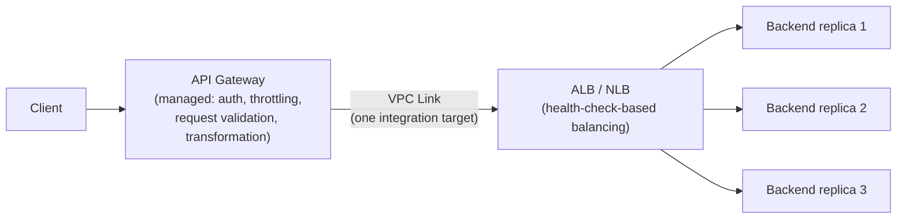

# Prerequisite Concepts, Part 22: Proxies — Forward, Reverse, and Why "Reverse Proxy vs. Load Balancer" Is a Trick Question

[Part 21](21_fr_nfr_framework_and_architecture_tools.md) closed out the FR/NFR framework and
the real-tools quick reference across the stack — but one box shows up in nearly every real
architecture diagram without ever getting its own first-principles treatment: the thing
sitting between a client and a server that isn't quite a load balancer, isn't quite a cache,
and isn't quite a firewall, yet does pieces of all three depending on which direction it's
facing. This part is that box, unpacked on its own — what a proxy actually is, why "forward"
and "reverse" name two genuinely different jobs despite sharing the word, and, because it's
one of the most reliably fumbled distinctions in a system design interview, exactly where a
reverse proxy and a load balancer are the same running process and where they are mechanically
not. It assumes [Part 19's load balancing mechanics](19_load_balancing.md) and [Part 15's
caching mechanics](15_caching.md) already — both get reused here, not re-derived.

## In Plain English

Imagine two very different errands. In the first, you don't want to walk into a particular
shop yourself — maybe you want your purchase to stay anonymous, maybe the shop is blocked by
your office's network policy, maybe you just don't have time — so you ask a friend to go in
and buy it for you. The shop only ever sees your friend's face; it has no idea you exist. Your
friend is acting **on your behalf**, as the client. That's a **forward proxy**.

In the second errand, you call a large company's main phone line with a billing question. You
never dial a specific employee's direct extension — you don't even know it exists. A
receptionist picks up, listens to what you need, and routes your call to whichever person or
department in the building actually handles billing today. If that person is out sick, the
receptionist quietly routes you to someone else instead, and you'd never know the difference.
The company's internal staff are shielded from ever having to publish a direct line to the
outside world at all. The receptionist is acting **on behalf of the business being called** —
that's a **reverse proxy**.

Both are proxies — a stand-in that relays a request instead of the two real endpoints talking
directly — but *whose interest they're standing in for* is exactly reversed, and that single
difference is the entire mechanism this doc unpacks.

## The Problem, Precisely

A direct connection between a client and a server exposes information and control to both
sides that isn't always wanted: the server sees exactly who's asking (an IP address, a
location, a pattern of requests), and the client sees exactly which physical machine answered.
Sometimes the party that wants to hide is the client — it doesn't want the destination to see
who's really asking, or an operator wants to control and log what its own users are allowed to
reach. Sometimes the party that wants to hide is the server — an operator wants to swap,
scale, or patch backend machines without any client-visible change, terminate encryption in
one controlled place instead of on every backend, or reject bad traffic before it ever reaches
real application code. A **proxy** is an intermediary process that sits in the request path and
solves exactly one of these two problems at a time — which one determines whether it's called
forward or reverse.

## Forward Proxy: Standing In For the Client

**The problem it solves**: a client wants to reach the internet through an intermediary that
controls, logs, filters, or masks its outbound traffic, rather than connecting directly.

**The mechanism**: a forward proxy sits between a client (or a whole fleet of clients, like
every laptop on a corporate network) and the wider internet. The client sends its request to
the proxy instead of directly to the destination; the proxy makes the actual outbound
connection on the client's behalf, receives the response, and relays it back. From the
destination server's point of view, the request came *from the proxy* — it never sees the
original client at all, unless the proxy chooses to reveal it.

**Real use cases**: a corporate network routes every employee's outbound traffic through a
forward proxy for **egress control** — blocking access to specific sites, logging what left
the network, and enforcing acceptable-use policy from one central choke point instead of
policing every laptop individually. A school or public network uses one for **content
filtering** on the same principle. A privacy-focused user or a service that needs to make
outbound requests without exposing its own operating IP (a scraper, a research tool) uses one
for **anonymizing/IP-masking** purposes — genuinely VPN-adjacent in outcome (the destination
sees a different IP than the real origin) but mechanically distinct from a VPN: a forward proxy
typically relays traffic for a specific application protocol (HTTP/HTTPS most commonly) and
doesn't necessarily encrypt the client-to-proxy leg the way a VPN tunnels and encrypts *all*
traffic at the network layer regardless of protocol.

### Anonymous vs. Transparent Forward Proxies

Forward proxies split on one axis: **does the client know the proxy is there, and does the
destination know a proxy was used at all?**

**Transparent proxy** — intercepts traffic at the network level (a router or firewall
redirects outbound connections into the proxy) with zero client-side configuration and zero
client awareness. The client believes it's talking directly to the destination; it isn't.
Corporate and ISP-level content filtering and caching commonly use transparent proxies
specifically *because* they require no per-device setup — the interception is mandatory and
invisible, which is also exactly why the pattern is controversial when used to inject ads or
monitor traffic without informed consent.

**Anonymous (explicit) proxy** — the client is deliberately configured (in the browser, OS
network settings, or application) to send traffic to the proxy's address. The proxy can then
choose how much of the original request to forward unchanged. A proxy is only genuinely
anonymizing if it strips or rewrites the headers that would otherwise reveal the original
client — most notably `X-Forwarded-For` (a header that records the originating client IP as a
request is relayed through one or more intermediaries) and `Via` (a header that records that a
proxy handled the request at all). A proxy that forwards those headers unmodified isn't
actually hiding anything — it's just adding a hop — which is the precise, mechanical reason
"I used a proxy" and "I'm anonymous to the destination" are not automatically the same claim.

**Squid** is the long-standing, still-widely-deployed open-source forward proxy used for
exactly this kind of corporate egress control and caching. Commercial "residential proxy" and
scraping-proxy services are the modern, IP-rotation-focused descendants of the same idea.

## Reverse Proxy: Standing In For the Backend

**The problem it solves**: an operator wants a single, controlled entry point in front of one
or more backend servers, so clients never connect to those backends directly.

**The mechanism**: a reverse proxy sits between the internet and an operator's own backend
infrastructure. A client sends a request to what looks like *the* server — a public domain
name and IP — but that request actually terminates at the reverse proxy, which then forwards
it to whichever real backend machine should handle it, and relays the response back to the
client. The client has no visibility into how many backend machines exist, which one actually
answered, or what their internal addresses are. This single positional flip — intermediary in
front of the *server* instead of the *client* — is the entire difference from a forward proxy;
everything else follows from it.

A reverse proxy typically owns four responsibilities at once, each solving a distinct problem:

- **Hiding backend topology.** Clients only ever see the reverse proxy's public identity.
  Backend machines can be added, removed, patched, or completely replaced without any
  client-visible change, and backends never need a public IP or an open port reachable from
  the internet at all — the reverse proxy is the only thing that has to be publicly exposed
  and hardened.
- **TLS termination**, covered precisely below.
- **Caching**, covered precisely in its own section below, reusing [Part 15](15_caching.md).
- **Rate limiting**, covered precisely below.

### TLS Termination, Precisely

**The problem**: encrypting and decrypting every request's TLS handshake is real CPU work, and
managing a certificate's private key on every one of dozens or hundreds of backend machines
multiplies both the attack surface and the operational burden of rotation and renewal.

**The mechanism**: the reverse proxy holds the TLS certificate and private key itself and
completes the [TLS handshake](03_communication_and_resilience.md#what-actually-happens-when-you-hit-enter)
directly with the client. This is **TLS termination** (also called **SSL offloading**): the
encrypted connection ends — terminates — at the proxy, not at the backend. What happens next is
a genuine design choice, not a footnote: the proxy can forward the now-decrypted request to the
backend over plain HTTP if the backend network is trusted and isolated (common inside a single
data center or VPC), or it can re-encrypt and open a *second*, independent TLS connection to the
backend — called **TLS bridging** — when the internal network itself isn't fully trusted (a
zero-trust posture, or traffic crossing between isolated network segments). Either way, because
the backend now sees the proxy's IP as the source of every request rather than the real
client's, the proxy has to explicitly forward the information it consumed: `X-Forwarded-For`
carries the original client IP, and `X-Forwarded-Proto` records whether the original client
connection was HTTP or HTTPS — without these, backend code has no way to reconstruct facts
about the original request that TLS termination otherwise erases.

### Rate Limiting, Precisely

**The problem**: a backend has a real capacity ceiling, and without an upstream control, a
single client (or a coordinated burst) can consume far more than its fair share, or overwhelm
the backend outright.

**The mechanism**: a reverse proxy enforces limits *before* a request ever reaches the backend,
using one of two closely related algorithms. A **token bucket** holds a fixed number of tokens
that refill at a steady rate; each request consumes one token, and a request that arrives when
the bucket is empty gets rejected or queued — this naturally allows short bursts up to the
bucket's size while capping the sustained average rate. A **leaky bucket** instead processes
requests out of a queue at a strictly constant rate regardless of how bursty their arrival was,
smoothing traffic rather than allowing bursts through. nginx's `limit_req` module implements a
leaky-bucket-style limiter; Envoy's rate-limiting filter typically delegates the decision to an
external token-bucket-based rate-limit service so the limit can be shared consistently across
many proxy instances rather than tracked independently per instance. Limits are almost always
keyed by something identifying the caller — client IP, an API key, an authenticated user ID —
so the bucket tracks "this caller's" consumption specifically, not global traffic as one
undifferentiated pool.

## The Trap: Reverse Proxy vs. Load Balancer

This is the distinction interview answers most often get fuzzy, so it's worth being exact
rather than reaching for a slogan.

**The overlap is real, and it happens at the L7 layer specifically.** [Part 19 already built
the L4/L7 mechanism in full](19_load_balancing.md#l4-vs-l7-the-mechanism-itself): an L7 load
balancer terminates the client's connection, parses the HTTP request, and *then* decides which
backend gets it. Terminating a connection and forwarding the request onward to a different
backend, on the client's behalf being none the wiser, is *also* the literal definition of what
a reverse proxy does. This is why the same software — nginx, Envoy, HAProxy, AWS ALB — runs
both jobs in the same process, on the same request, without contradiction: it terminates TLS,
parses the request, applies rate limiting and header rewriting (reverse-proxy jobs), and then
picks which of several backend instances handles it using round robin, least-connections, or
any [algorithm Part 19 already named](19_load_balancing.md#algorithms-how-the-routing-decision-actually-gets-made)
(a load-balancer job) — one pass through one piece of software, doing both.

**Where the distinction is still real, even at L7, is intent and topology.** A reverse proxy's
job is defined by what sits *behind* it, which can be a single logical backend just as easily
as a pool: an operator putting nginx in front of one origin server purely for TLS termination
and header rewriting is still running a reverse proxy, with nothing to "balance" at all. A load
balancer's job, by definition, assumes a *pool* of two or more interchangeable backends and
exists specifically to decide, per request, which member of that pool answers — take away the
pool and there's no load-balancing decision left to make, only proxying. So: every L7 load
balancer *is* also acting as a reverse proxy (it terminates and forwards), but not every reverse
proxy is doing load balancing (it might front exactly one backend). The claim "most modern load
balancers are reverse proxies" is precise for the L7 tier specifically, and it's precise
*because* both jobs happen to require the identical prerequisite mechanism — terminate the
connection, understand the request, forward it onward.

**Where the claim stops being true is true L4 packet forwarding.** [Part 19 already names
AWS NLB and IPVS/LVS](19_load_balancing.md#l4-vs-l7-the-mechanism-itself) as the L4 tier, and
the mechanism there is genuinely different, not just a cheaper version of the same thing. A
true L4 packet-forwarding balancer — IPVS running in NAT or Direct Server Return mode, or AWS
NLB's default flow-hash behavior — never terminates the TCP connection at all. It rewrites
packet headers (or, in Direct Server Return mode, doesn't even touch return traffic) and lets
packets flow through at the kernel/network level, with no second, independent connection ever
opened to the backend and no application-layer parsing happening anywhere in the path. That is
mechanically **forwarding**, not **proxying** — a proxy, by definition, is a full intermediary
that terminates one connection and originates a second, distinct one, which is exactly what
gives an L7 reverse proxy the ability to inspect, rewrite, cache, or reject a request before it
ever reaches a backend. A pure L4 forwarder can do none of that, because it never actually reads
the request — which is also, not coincidentally, exactly why it's cheap enough to [sit in front
of an L7 tier absorbing raw connection volume](09_dns_bgp_and_the_edge.md#beyond-caching-the-security-and-routing-layer-at-the-edge).
Worth noting HAProxy specifically breaks the pattern in the other direction: even when running
in plain TCP (L4) mode, HAProxy still terminates the incoming connection and opens a genuinely
separate outgoing one to the backend — it's a real proxy operating at L4, distinct from
IPVS-style packet forwarding, which is a useful reminder that "L4" describes what the balancer
looks at, not automatically whether it's proxying at all.

## Proxy vs. API Gateway

[Part 20 already named the API gateway as one of microservices' four already-covered
patterns](20_microservices_architecture_patterns.md#the-patterns-already-covered-reused-not-re-derived),
pointing to [Part 9's "API Gateway as a Shield" section](09_dns_bgp_and_the_edge.md#beyond-caching-the-security-and-routing-layer-at-the-edge)
for the full mechanism — worth connecting explicitly here rather than re-deriving it: an **API
gateway is a reverse proxy with an opinionated, API-shaped feature set layered on top.**
Everything a plain reverse proxy already does — terminate the connection, hide backend
topology, rate limit — an API gateway also does, but it adds capabilities that only make sense
once the traffic behind it is specifically *API* traffic rather than arbitrary HTTP: **authn/
authz** (validating a token or API key before a request is allowed through at all, rather than
leaving that check to each backend service individually), **per-client rate limiting keyed by
API key or plan tier** (not just per-IP), **request/response transformation** (translating
REST/JSON at the edge into gRPC or another internal protocol, exactly as Part 9 already names),
and **API versioning and routing** (sending `/v1/` and `/v2/` traffic to entirely different
backend deployments from one front door). Kong and Traefik are named specifically as API
gateways rather than generic reverse proxies because that feature set is their primary,
opinionated product surface — even though, mechanically, they're built on the same
terminate-and-forward foundation as nginx or Envoy.

**"API gateway" names a role, not a product — a common source of confusion worth clearing
up explicitly.** Hearing the term first as **Amazon API Gateway** (AWS's specific managed
service, launched 2015) makes it easy to assume the concept is AWS-specific; it isn't, and
the history runs the other way. **Apigee** — one of the earliest dedicated API-management
companies, founded 2004 as Sonoa Systems, later acquired by Google — and **Netflix's
Zuul** (open-sourced 2013, built because Netflix needed exactly this pattern in front of
its own microservices, years before any cloud vendor sold a packaged version) both predate
AWS's product. AWS didn't invent the pattern; it productized a role the industry already
had a name for — the same relationship "Lambda" has to "serverless function," not a novel
AWS concept. That's *why* the term gets used loosely: every major vendor, cloud or
otherwise, ended up shipping its own implementation of the identical role, so "put it
behind an API gateway" is a design decision independent of which product eventually
implements it — exactly the same [build-vs-buy question already worked through in full for
rate limiting](../../system_design_practice/07_design_rate_limiter_at_scale/build_vs_buy_and_tooling_landscape.md),
applied to this pattern instead of that one.

**Does an API gateway throttle requests? Yes — rate limiting is one of its standard,
expected functions, not an optional extra.** [The "Rate Limiting, Precisely" section
above](#rate-limiting-precisely) already covers the mechanism (token bucket, leaky bucket)
in full — an API gateway doesn't reinvent it, it just applies it with gateway-specific
*keying*: where a plain reverse proxy often rate-limits by source IP, a gateway typically
keys the limit by **API key or account/plan tier**, because it's already validated
identity via the authn/authz step above and can see who's actually calling, not just where
the packet came from. AWS API Gateway's own documentation literally calls this
**throttling** — steady-state rate plus a burst allowance, the exact token-bucket shape
[algorithms_all_iterations.md](../../system_design_practice/07_design_rate_limiter_at_scale/algorithms_all_iterations.md#iteration-4-token-bucket)
already covers — which is worth naming as confirmation that "throttling" and "rate
limiting" are the same mechanism, not two different features a gateway happens to offer.

### The Complete Function List

Gathering every capability named across this section and cross-referenced elsewhere into
one table — what an API gateway actually does, and where each one is covered in full:

| Function | What it does | Covered in full |
|---|---|---|
| Routing | Directs a request to the correct backend by path, host, or header | Same mechanism as L7 load balancing — [Part 19](19_load_balancing.md#algorithms-how-the-routing-decision-actually-gets-made) |
| Load balancing (when configured for it) | Distributes requests across a *pool* of backend instances | [Part 19](19_load_balancing.md), and [the section below](#api-gateway-vs-load-balancer-where-it-sits-and-do-you-need-both) on whether this is the same box or a separate one |
| TLS termination | Ends the client's encrypted connection at the gateway | [Above, this doc](#tls-termination-precisely) |
| Authentication & authorization | Validates a token/API key before any request reaches a backend | New here |
| Rate limiting / throttling | Per-client (API key, plan tier) request caps | [Above, this doc](#rate-limiting-precisely) + [the full algorithm landscape](../../system_design_practice/07_design_rate_limiter_at_scale/algorithms_all_iterations.md) |
| Request/response transformation | Reshapes payloads; translates REST/JSON at the edge into gRPC or another internal protocol | [Part 9](09_dns_bgp_and_the_edge.md#beyond-caching-the-security-and-routing-layer-at-the-edge) |
| Request validation | Rejects malformed or oversized requests cheaply, before app code ever runs | [Part 9's "shield" framing](09_dns_bgp_and_the_edge.md#beyond-caching-the-security-and-routing-layer-at-the-edge) |
| API composition / aggregation | One gateway call fans out to several backend calls and combines the results, so the client makes one round trip instead of several | New here — the network-level version of the Backend-for-Frontend pattern |
| Caching | Caches whole responses at the gateway to avoid repeat backend work | [Part 15](15_caching.md) |
| Versioning & routing | Sends `/v1/` and `/v2/` traffic to entirely different backend deployments from one public front door | Above, this doc |
| Observability | Centralized request logging, metrics, and correlation-ID injection so a request can be traced across services | [Part 16](16_observability.md) |
| Developer portal / API key issuance / usage-based billing | Self-service key management and monetization — the "API management" business layer some products add on top of the pure routing/security mechanism | New here — Apigee and AWS API Gateway's usage plans are the clearest examples |

### Why an API Gateway Exists — the Motivating Problem

**The problem**: in a system with many backend services, every one of them independently
needs auth checks, rate limiting, request logging, and versioning logic. Duplicating that
logic in each service wastes engineering effort and — worse — risks *inconsistency*: one
team's auth check has a subtly different bug than another's, and now the security posture
of the whole system depends on N independent implementations agreeing. Clients face the
mirror problem: calling N services directly means every client has to know each service's
address and be updated whenever that topology changes.

**The mechanism**: centralize all of that cross-cutting logic in one component sitting in
front of every service. Clients see one public endpoint and one stable contract; backend
teams stop re-implementing auth, rate limiting, and logging themselves, because the
gateway already did it before the request arrived.

**Why it matters**: this is the [Facade design pattern](https://en.wikipedia.org/wiki/Facade_pattern)
applied at the network layer, and it's exactly what decouples backend evolution from
client-visible contract — a service can be split, merged, rewritten, or migrated entirely
(the [strangler fig pattern Part 20 already covers](20_microservices_architecture_patterns.md#the-patterns-already-covered-reused-not-re-derived)
uses precisely this facade) without any client ever noticing, as long as the gateway's own
public surface stays stable. The [service-mesh/sidecar pattern](../../system_design_practice/01_distributed_systems_foundations/tutorial.md#service-mesh-cross-cutting-concerns-without-cross-cutting-code)
solves the identical "stop duplicating cross-cutting logic" problem for *service-to-service*
calls, behind the gateway; the gateway solves it for the *client-facing* edge — two
instances of the same underlying idea, applied at different points in the request path.

## API Gateway vs. Load Balancer: Where It Sits, and Do You Need Both?

**Short answer: you always need something doing L7 routing; you only need a *separate*
gateway box in addition to it when the gateway you picked is a managed product that
structurally can't also do fine-grained load balancing across your own replica pool. If
you're self-hosting the proxy layer, one properly configured box almost always covers
both roles — not two things stacked, one thing wearing two hats.**

**The default case: same box, more hats.** [The Trap section above](#the-trap-reverse-proxy-vs-load-balancer)
already established that an L7 load balancer *is* a reverse proxy — same terminate-and-
forward mechanism, one extra decision (which backend). An API gateway extends that exact
same chain one link further: Kong, Envoy (with its rate-limit and ext_authz filters), and
NGINX Plus can each terminate TLS, apply auth and rate limiting, transform the request,
*and* balance across a pool of backend instances — all in one pass, one process, one hop.
This is precisely what
[kubernetes_native_implementations.md](../../system_design_practice/07_design_rate_limiter_at_scale/kubernetes_native_implementations.md)
already shows in practice: `ingress-nginx` and Envoy are simultaneously "the load
balancer" (they pick a backend pod) and, once rate-limiting/auth is configured, "the API
gateway" for that traffic — never two separate deployed things.

**Where they genuinely do split into two hops: a managed cloud gateway in front of your
own compute.** AWS API Gateway, Azure API Management, and similar managed products are not
built to continuously health-check and balance traffic across a large, dynamically-scaling
pool of your own servers the way a dedicated load balancer is — their backend-integration
model is built to point at *one* target (a Lambda function, a single HTTP endpoint, or, via
a VPC Link, a load balancer). Illustrative AWS reference shape, not a universal rule:

Here, "do you need both" genuinely is **yes** — the managed gateway handles API-surface
concerns for the whole system, and hands off, through a single integration point, to a
load balancer whose actual job is picking among your live replicas. This is a *consequence*
of choosing a managed product over self-hosting the proxy layer, not an inherent property
of "API gateway" as a concept — swap the managed gateway for Kong or Envoy running in your
own cluster, and the two hops above collapse back into one, exactly as the default case
does.

**The decision, as three questions, in order:**

1. **Do I need only routing/balancing across a pool — no auth, no per-key throttling, no
   versioning or transformation?** A plain L7 (or even L4) load balancer alone is
   sufficient. There's no "gateway" to add at all.
2. **Do I need API-specific concerns (auth, per-key throttling, versioning,
   transformation) on top of routing, and am I self-hosting the proxy layer?** Configure
   that same L7 proxy (Envoy filters, Kong, NGINX Plus) with the extra feature set — one
   box, both roles, same pattern as The Trap section's reverse-proxy/load-balancer
   overlap, just with more jobs stacked on the same hop.
3. **Am I using a managed cloud API Gateway product specifically, in front of a backend
   fleet that needs its own replica-level balancing?** Then yes, both — as two distinct
   hops — because the managed product's own integration model isn't built to do the
   second job itself.

## Proxy Caching: The Same Mechanism, a Different Position in the Path

A reverse proxy sitting in the request path is a natural place to cache full responses, and the
mechanism is exactly [Part 15's caching machinery](15_caching.md) — nothing new gets invented
here, only repositioned. A reverse-proxy cache is functionally a **read-through cache**
([already defined in Part 15](15_caching.md#cache-placement-patterns)): the client only ever
talks to the proxy, and the proxy transparently serves a cached response on a hit or fetches
from the real backend on a miss, populating the cache for the next request. Everything Part 15
already covers still applies unmodified in this position: **eviction policy** decides what gets
dropped when the proxy's cache fills up, **[invalidation](15_caching.md#cache-invalidation-the-genuinely-hard-part)**
is still the genuinely hard part (a proxy cache is exactly as vulnerable to a stale value as any
other cache layer), and a popular cached response expiring under load can still trigger a
**[cache stampede](15_caching.md#cache-stampede-thundering-herd)** against the origin unless
single-flight or stale-while-revalidate is in place. nginx's `proxy_cache` directive and Varnish
are the classic reverse-proxy-as-cache tools; a forward proxy can cache too, for the mirrored
reason (Squid caching a popular file so it doesn't re-fetch it from the internet for the next
requesting client). And zooming out one more level: a CDN PoP, [already covered in
Part 9](09_dns_bgp_and_the_edge.md#the-edge-where-dns-anycast-and-bgp-meet-a-cdn), *is* exactly
this pattern — a globally distributed reverse proxy that caches — which is why "reverse proxy"
and "CDN edge node" describe overlapping mechanism at very different scales, not two unrelated
ideas.

## Real Tools, Modern Defaults

**Forward proxies**: Squid (the long-standing open-source default for corporate egress control
and caching), commercial residential/rotating-IP proxy services. **Reverse proxies / L7
load balancers (the same software doing both jobs)**: nginx, Envoy, HAProxy, AWS Application
Load Balancer (ALB) — all [already named in Part 19's L7 tier](19_load_balancing.md#real-tools-modern-defaults).
**API gateways (reverse proxies with an API-shaped feature set)** — self-hosted/open-source:
Kong, Traefik, Tyk, KrakenD, Apigee (originally standalone, now also offered as a Google
Cloud product); one cloud vendor's managed product each: AWS API Gateway, Azure API
Management (APIM), Google Cloud API Gateway; and, on Kubernetes specifically, the [Gateway
API standard's policy-attachment model already covered in the rate limiter's Kubernetes
deep-dive](../../system_design_practice/07_design_rate_limiter_at_scale/kubernetes_native_implementations.md#iteration-6-gateway-api-ratelimitpolicy-the-emerging-standard)
— all names for the same role, none of them the definitive one. **Reverse-proxy caching /
CDN-as-distributed-reverse-proxy**: Varnish, nginx
`proxy_cache`, Cloudflare, AWS CloudFront — the same names [Part 9 and Part 15 already
established](09_dns_bgp_and_the_edge.md#the-edge-where-dns-anycast-and-bgp-meet-a-cdn) for the
edge/CDN layer, reused here because the mechanism genuinely is the same one. **True L4 packet
forwarding, not proxying**: AWS Network Load Balancer (NLB), IPVS/LVS.

## Designing and Operating From First Principles

1. Am I building this to hide the client (forward proxy: egress control, filtering,
   anonymization) or to hide the server (reverse proxy: backend topology, TLS termination,
   caching, rate limiting) — have I actually named which problem this is before picking a tool?
2. If clients need to be genuinely anonymized, have I checked that `X-Forwarded-For` and `Via`
   are actually being stripped, or is the proxy just adding a hop while still leaking the real
   client identity?
3. Is my reverse proxy terminating TLS and forwarding plaintext internally, or bridging with a
   second TLS connection to the backend — and does my internal network's trust level actually
   justify the choice I made?
4. When I say "load balancer" here, am I describing an L7 tool that's also acting as a reverse
   proxy (nginx, Envoy, ALB), or a true L4 packet forwarder (NLB, IPVS) that never terminates a
   connection at all — have I checked which one this actually needs to be, given whether I need
   content-aware routing at all?
5. Is my API gateway doing gateway-specific work (authn/authz, per-key rate limiting, protocol
   translation, versioning), or would a plain reverse proxy already cover everything I'm
   actually using it for?
6. If this reverse proxy caches responses, have I named its placement pattern, eviction policy,
   and invalidation strategy explicitly — the same checklist [Part 15](15_caching.md#designing-and-operating-from-first-principles)
   already requires — rather than trusting whatever the proxy's cache defaults to?

## Key Takeaways

- **A forward proxy stands in for the client; a reverse proxy stands in for the server** — the
  entire distinction is a positional flip in the request path, and everything else (which
  problems each one solves) follows from that single difference.
- **A transparent forward proxy is invisible and unconfigured on the client side; an anonymous
  forward proxy is deliberately configured** — and a proxy only actually anonymizes a client if
  it strips identifying headers like `X-Forwarded-For` and `Via`, not just by existing.
- **A reverse proxy's core jobs are hiding backend topology, TLS termination, caching, and rate
  limiting** — TLS termination specifically means the proxy holds the cert/key and decrypts at
  that boundary, optionally re-encrypting (TLS bridging) to the backend depending on internal
  network trust.
- **"Reverse proxy vs. load balancer" overlaps completely at L7** — the same software (nginx,
  Envoy, HAProxy, ALB) terminates and forwards (proxying) while also distributing across a pool
  (load balancing), in the same process, on the same request.
- **The overlap breaks at true L4 packet forwarding** — IPVS/LVS and AWS NLB's default behavior
  never terminate a connection or read a request at all, which is mechanically forwarding, not
  proxying, even though both get casually called "load balancers."
- **An API gateway is a reverse proxy with an opinionated, API-specific feature set** —
  authn/authz, per-key rate limiting, protocol translation, and versioning layered on the same
  terminate-and-forward foundation, not a different mechanism.
- **"API gateway" is a role every major vendor implements, not an AWS invention** — Apigee
  (2004) and Netflix's Zuul (2013) predate Amazon API Gateway (2015); the term gets used
  loosely because the pattern, not any one product, is what's actually being referred to.
- **You need a separate gateway box in addition to a load balancer only when the gateway is
  a managed product that can't itself balance across your replica pool** — self-hosting the
  proxy layer (Envoy, Kong, nginx) almost always collapses both roles into one box, the same
  overlap the reverse-proxy/load-balancer point above already establishes, just with more
  jobs stacked on it.
- **Proxy caching is Part 15's caching mechanism, repositioned** — placement pattern, eviction,
  and invalidation all apply unmodified; a CDN PoP is this exact pattern at global scale.

## Quick Self-Check

- Explain, without using the words "forward" or "reverse," which party each type of proxy is
  actually acting on behalf of, and why that determines everything else about it.
- Why isn't using a forward proxy automatically the same as being anonymous to the destination
  server — what specifically has to be true about the headers for anonymity to actually hold?
- Walk through the difference between TLS termination and TLS bridging — what determines which
  one is the right choice for a given internal network?
- Why is it precise to say "most L7 load balancers are also reverse proxies" but imprecise to
  say "load balancers are reverse proxies" as a blanket claim — what specifically breaks that
  claim at L4?
- Why does HAProxy running in plain TCP mode still count as proxying, even though it's
  operating at L4 — what does it do differently from IPVS/LVS or AWS NLB's default forwarding?
- What does an API gateway do that a plain reverse proxy doesn't, and why does that extra
  feature set specifically require the traffic behind it to be API traffic?
- Does a system always need both an API gateway and a load balancer as two separately
  deployed components? Under what specific condition does the answer become "yes," and why
  does that condition not apply when self-hosting the proxy layer?

## Articulate It: Interview Framing & Vocabulary

### Three Ways to Explain This

- **Who's-hiding-from-whom framing (the default opener for "what's a reverse proxy"):** "The
  whole distinction collapses to one question — who is this thing hiding? A forward proxy
  hides the client from the destination; a reverse proxy hides the backend from the client.
  Everything else — egress control on one side, TLS termination and load distribution on the
  other — is just what falls out of solving whichever of those two problems you actually have."
- **Overlap-and-break framing (the right answer to the 'aren't those the same thing' trap):**
  "They overlap completely at L7 — nginx or Envoy terminating a connection and picking a
  backend is simultaneously proxying and load balancing, same process, same request. Where it
  stops overlapping is true L4 packet forwarding — something like AWS NLB or IPVS never
  terminates a connection or reads a request at all, so calling that a 'reverse proxy' is
  mechanically wrong, even though it's routinely called a load balancer."
- **Production-incident framing (good for demonstrating this isn't just theory):** "I'd bring
  up TLS termination specifically — the decision of whether to re-encrypt to the backend or
  trust the internal network with plaintext isn't cosmetic, it's a real security posture
  decision, and I've seen teams forget to forward `X-Forwarded-For` after adding a reverse
  proxy and then lose the ability to do per-client rate limiting or abuse detection because
  every request in their logs suddenly showed the proxy's IP instead of the real caller's."

### Vocabulary Builder

**Technical shorthand — use these instead of over-explaining the concept every time:**

- **forward proxy / reverse proxy** (n. phrases) — an intermediary acting on behalf of the
  client versus on behalf of the server; the positional flip that determines every other
  difference between them.
- **transparent proxy / anonymous proxy** (n. phrases) — a forward proxy intercepting traffic
  with no client-side configuration or awareness, versus one the client deliberately points its
  traffic at.
- **TLS termination / TLS bridging** (n. phrases) — decrypting at the proxy and forwarding
  plaintext internally, versus decrypting at the proxy and re-encrypting a second, independent
  connection to the backend.
- **`X-Forwarded-For` / `Via`** (n., HTTP header names) — headers a proxy uses to preserve the
  original client IP and to record that a request passed through a proxy at all, respectively.
- **token bucket / leaky bucket** (n. phrases) — rate-limiting algorithms that either allow
  bursts up to a refillable allowance or smooth requests to a strictly constant processing rate.
- **API gateway** (n. phrase) — a reverse proxy with an opinionated, API-specific feature set
  (authn/authz, per-key rate limiting, protocol translation, versioning) layered on the same
  terminate-and-forward foundation.
- **packet forwarding vs. proxying** (n. phrases) — rewriting/routing packets without
  terminating a connection (true L4, IPVS/NLB) versus fully terminating one connection and
  originating a second, distinct one (a proxy, at any layer that does it).

**Expressive phrases — for stating a trade-off fluently instead of listing pros/cons:**

- **"…hiding the client versus hiding the server"** — the fastest, most precise way to state
  the entire forward/reverse distinction in one breath.
- **"…the same code path, a different pool behind it"** — a fluent way to describe why L7
  reverse proxies and L7 load balancers overlap without implying they're identical concepts.
- **"…forwarding, not proxying"** — a precise, reusable correction for when a true L4 packet
  forwarder gets casually called a reverse proxy.

---

**Previous:** [Part 21: The FR/NFR Framework and a Real-Tools Quick Reference](21_fr_nfr_framework_and_architecture_tools.md)  |  **Next:** [Part 23: Long-Polling, WebSockets, and Server-Sent Events](23_realtime_communication_long_polling_websockets_sse.md)
