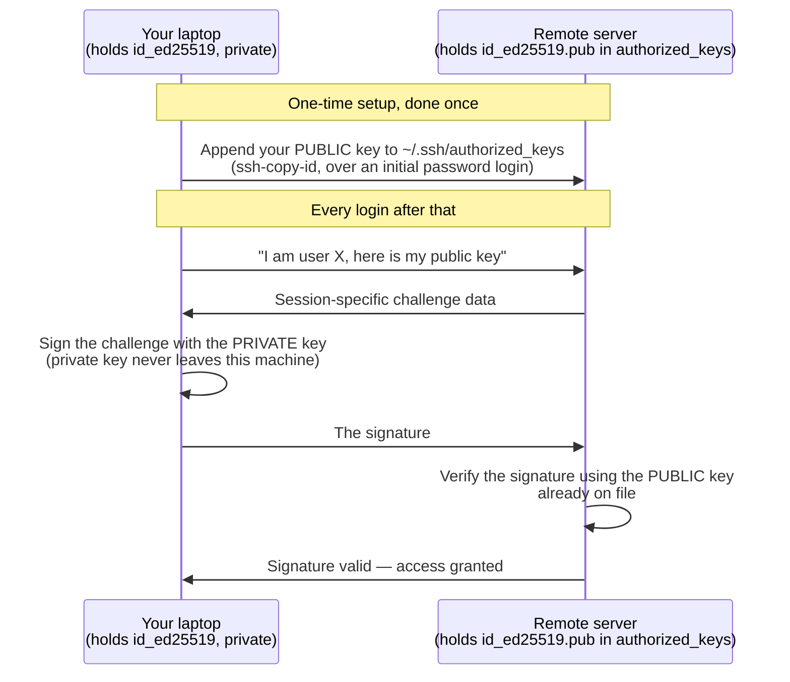
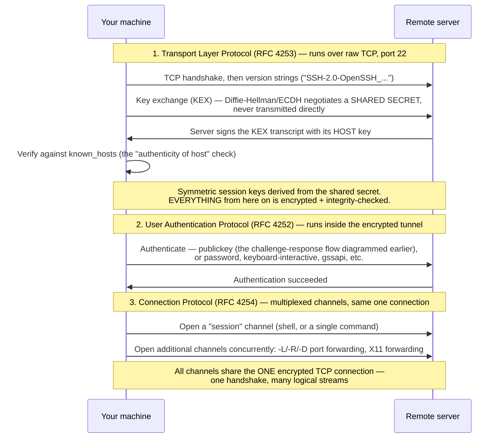

# Part 26: SSH Keys and Public-Key Cryptography — From `ssh-keygen` to GitHub to Your AWS `.pem` File

## In Plain English

Imagine a special kind of lock: you can manufacture and hand out unlimited copies of the
**lock** itself — mail it to anyone, post it publicly, staple it to a noticeboard, it
doesn't matter — but there exists exactly **one** matching **key**, and it never leaves
your pocket. This lock-and-key pair can do two different things, and mixing them up is the
single most common point of confusion for anyone learning this:

1. **Anyone can drop a sealed message into a box secured with your lock**, and only you,
   holding the one real key, can open that box and read it. This is **encryption** —
   hiding a message so only the key-holder can read it.
2. **You can press your one real key into wax to make a seal that anyone can verify came
   from you** — by checking the wax pattern against the lock they already have a copy of —
   without ever handing your key to anyone or letting it out of your sight. This is
   **signing** — proving *who you are* without revealing the secret that proves it.

**Logging into a server over SSH uses the second one, not the first** — a fact almost
everyone gets backwards on first exposure. SSH login isn't "the server encrypts a message
with your public key and you decrypt it" — it's "the server asks you to prove, right now,
that you hold the one real key, and you prove it by signing something, without that key
ever crossing the network." Holding that distinction precisely is worth more than
memorizing any command in this doc.

## The Problem, Precisely

Before SSH existed, remote login (`rlogin`, `telnet`, `rsh`) sent your password across the
network **in plain text** — anyone with access to the wire between you and the server
could simply read it off the connection. SSH (Secure Shell) was built in 1995 by Tatu
Ylönen at Helsinki University of Technology, directly in response to a password-sniffing
attack on his own university's network — a real incident, not a hypothetical design
exercise. Beyond eavesdropping, password-only login has a second, operational problem at
scale: a team managing hundreds of servers needs a way to prove identity that doesn't
require typing a memorized secret into every console, and doesn't require a central
password database to exist (and be defended) everywhere those servers live. Public-key
authentication solves both problems with the same mechanism.

## The Mechanism: A Mathematically Linked Pair, Generated Together

Running `ssh-keygen -t ed25519` produces **two files, generated in one step, mathematically
linked to each other**:

- **`id_ed25519`** — the **private key**. Never shared. Stays on your machine, ideally
  protected by a passphrase (a separate layer covered below).
- **`id_ed25519.pub`** — the **public key**. Completely safe to share, post publicly, email
  — this is literally the text you paste into GitHub's settings, or that gets appended to
  a server's `~/.ssh/authorized_keys` file.

**The mathematical relationship — the entire foundation this whole system rests on**: the
private key is used to *derive* the public key through a one-way function (elliptic-curve
math for Ed25519; historically, prime factorization for RSA). Computing the public key
*from* the private key is fast and trivial. Computing the private key *from* the public
key is, for an adequately sized modern key, computationally infeasible — not "hard," but
*infeasible within any practically meaningful amount of time even with significant
computing resources*, which is exactly what makes handing the public half out freely safe.
This one-way property — easy in one direction, infeasible in the other — is what
"asymmetric" in *asymmetric cryptography* actually refers to.

### What Actually Happens at Login — the Challenge-Response Flow

This is the sequence most explanations skip, and it's the part that resolves the
in-plain-English distinction above into something precise:

**The private key never crosses the network, ever, in this entire exchange.** The server
never asks for it, never receives it, never needs to. It only ever needs the public key —
which it already has, and which was never a secret in the first place. This is the single
most important practical fact in this whole document.

## What OpenSSH Actually Is, and the Protocol It Implements

**SSH is a protocol — a written specification. OpenSSH is the specific, dominant piece of
software that implements it.** The same relationship as HTTP (the protocol) to
nginx/Apache (implementations), or SMTP to Postfix/Sendmail. Every `ssh`/`ssh-keygen`
command used throughout this doc is OpenSSH specifically — by far the dominant
implementation, though not the only one (**Dropbear** is a lightweight alternative common
on routers/embedded Linux; **PuTTY** is a long-standing Windows client; **libssh** is a
library other tools embed rather than shelling out to `ssh`).

The published protocol version in use today is **SSH-2** — a complete redesign,
standardized by the IETF (RFC 4250–4254, finalized 2006). **SSH-1**, the original 1995
version, had known cryptographic weaknesses (weak integrity checking that permitted certain
tampering attacks) and is disabled by default everywhere; when people say "SSH" today they
always mean SSH-2. **OpenSSH itself** was forked in 1999 by the OpenBSD project from the
last freely-licensed release of the original commercial `ssh` (1.2.12), after Tatu
Ylönen's company moved subsequent versions to a more restrictive commercial license —
OpenSSH has been the open, freely available implementation ever since.

### OpenSSH's Toolkit — More Than Just `ssh-keygen`

| Program | What it does |
|---|---|
| `ssh` | The **client** — what you run to connect *out* to a remote host |
| `sshd` | The **server daemon** — listens on port 22, accepts and authenticates incoming connections; this is "the server" in every diagram in this doc |
| `ssh-keygen` | Generates key pairs (already covered in depth above) |
| `ssh-agent` / `ssh-add` | Holds a decrypted private key in memory for a session (already covered) |
| `ssh-copy-id` | Installs your public key into a remote `authorized_keys` (already covered) |
| `scp` | Secure Copy — file transfer tunneled through an SSH connection, based on the old `rcp` protocol; increasingly considered legacy |
| `sftp` | SSH File Transfer Protocol — a separate, more capable file-transfer protocol (resumable, browsable, its own permission model) that *also* rides over an SSH connection; the modern recommended choice over `scp` |
| `ssh-keyscan` | Bulk-fetches a server's host public key(s) — useful for pre-populating `known_hosts` across a fleet from automation, instead of accepting the "authenticity of host" prompt by hand on every box |

### The Protocol Itself: Three Layers, Each With Its Own RFC

Everything described so far in this document — the challenge-response signing flow, host
keys, `authorized_keys` — all happens *inside* a specific layer of a larger, three-layer
protocol stack. Naming which layer something belongs to is what separates a precise answer
from a hand-wavy one:

- **Layer 1, Transport**: establishes an encrypted, integrity-checked pipe and verifies the
  *server's* identity — this is exactly where the host-key half of the "two independent
  key-pair relationships" below happens. The **key exchange (KEX)** here uses
  Diffie-Hellman (or its elliptic-curve variant, ECDH) to agree on a shared secret that
  *itself* is never sent across the wire — a different asymmetric-math trick from, and
  easy to conflate with, the public-key *authentication* covered above. From that shared
  secret, fast **symmetric** keys (AES-256-GCM, ChaCha20-Poly1305) are derived — asymmetric
  operations are too slow for bulk data, so they're used only to bootstrap trust, exactly
  the trade-off [`security/00_foundations/tutorial.md`'s Crypto Essentials
  section](../../security/00_foundations/tutorial.md#crypto-essentials-what-you-actually-need-to-reason-about)
  already names for TLS — SSH makes the identical trade for the identical reason.
- **Layer 2, User Authentication**: runs entirely *inside* the tunnel Layer 1 already
  secured — this is where every method in this doc's earlier sections lives. `publickey`
  is one of several pluggable methods: `password` (safe here specifically *because* it's
  already inside an encrypted channel, unlike the pre-SSH plaintext problem this whole doc
  opened with), `keyboard-interactive` (flexible prompting, used for OTP/2FA and PAM
  integration), `hostbased` (trusts a claim based on the *client* machine's own host key —
  rare, mostly historical), and `gssapi-with-mic` (Kerberos-based, common in
  Windows-integrated enterprise environments). A server can require more than one method
  together (`AuthenticationMethods publickey,keyboard-interactive` in `sshd_config`) for a
  genuine two-factor SSH login.
- **Layer 3, Connection**: **multiplexes multiple logical channels over the one already-
  encrypted, already-authenticated TCP connection** — an interactive shell, a single
  command execution, and one or more port-forwarding tunnels can all run *concurrently*
  through the same connection, each its own channel. This is the exact mechanism behind
  `ssh -L 8000:localhost:8000 ...` (local forwarding), `-R` (remote forwarding), `-D`
  (dynamic/SOCKS forwarding), and X11 forwarding — and it's precisely what
  `infra/gcp-gpu-node`'s `make tunnel` target (forwarding the model API to
  `localhost:8000`) already used earlier in this session, without necessarily naming the
  mechanism at the time: one `-L`-style channel, riding the same SSH connection as
  everything else.

### OpenSSH's Configuration Files, Concretely

- **`/etc/ssh/sshd_config`** (server) — the file that actually decides which Layer-2
  methods are allowed at all: `PasswordAuthentication no`, `PermitRootLogin no`,
  `AuthenticationMethods publickey`, which port `sshd` listens on, and so on. This is what
  a security-hardening pass on a server actually edits.
- **`~/.ssh/config`** (client) — per-host shortcuts: aliases, which `IdentityFile` to use
  for which host, and **`ProxyJump`** (or the older `ProxyCommand`) — the clean, modern way
  to express "reach this private-subnet box by first connecting through a public bastion
  host," itself just another instance of Layer 3's channel multiplexing, tunneling one SSH
  connection through another.
- **Host keys**: `/etc/ssh/ssh_host_ed25519_key` etc. — the server's own Layer-1 identity,
  already introduced above.

## Two Independent Key-Pair Relationships, Not One — a Common Point of Confusion

Every SSH session actually involves **two separate identity checks**, each with its own
key pair, running in opposite directions:

| Direction | Whose identity is proven | Key pair involved | Where it's recorded |
|---|---|---|---|
| Server → You | The server proves *it* is really the server you meant to connect to | The server's own host key (e.g. `/etc/ssh/ssh_host_ed25519_key`) | Your local `~/.ssh/known_hosts`, after you accept the "authenticity of host … can't be established" prompt once |
| You → Server | You prove you're an authorized user | Your personal key pair (`~/.ssh/id_ed25519`) | The server's `~/.ssh/authorized_keys` |

The scary-looking first-connection warning ("the authenticity of host X can't be
established, are you sure you want to continue connecting?") is about the *first* row, not
the second — it's SSH telling you it has never seen this server's host key before, and
asking you to confirm you're connecting to who you think you are, not an impostor
intercepting the connection. Once accepted, that host key is cached in `known_hosts`, and
a *different* host key showing up for the same address on a later connection (a genuine
red flag — possible man-in-the-middle, or just the server having been rebuilt) is what
produces SSH's much louder `REMOTE HOST IDENTIFICATION HAS CHANGED` warning.

## Three Real-World Places You've Already Seen This — Same Mechanism, Different Packaging

### 1. Plain SSH server access

Exactly the mechanism above. `ssh-copy-id user@host` is the standard tool that appends
your public key to the remote `~/.ssh/authorized_keys` file, over one password-authenticated
connection — after that, password auth can (and, for anything internet-facing, should) be
disabled entirely.

### 2. AWS EC2's `.pem` file — why losing it feels catastrophic, and why it usually isn't

When EC2 has you "create a new key pair" at launch, AWS is doing something specific: it
**generates the key pair on your behalf**, injects the *public* half into the new
instance's `~/.ssh/authorized_keys` automatically during boot (via cloud-init reading
instance metadata), and gives you the *private* half as a **one-time download** — the
`.pem` file. **AWS deliberately does not keep a copy after that download** — by design,
not an oversight. The entire point of asymmetric crypto is that only the party who needs
to *prove* identity should ever hold the private half; if AWS retained a copy, that would
undermine the security property the whole scheme exists to provide. (The alternative
"import an existing public key" option at launch is the more rigorous choice precisely
because then AWS never even briefly touches your private key at all.)

This directly explains the fear behind the question that motivated this doc: **if you lose
the `.pem` file, you genuinely cannot SSH into that instance anymore** — not because AWS is
being unhelpful, but because the instance's `authorized_keys` entry can only ever verify a
signature produced by the one specific private key it was paired with, and no one,
including AWS, has a spare copy of that key to hand you.

**It is not, however, total game over — because you still control something SSH doesn't
touch at all: the AWS account itself**, a completely separate authentication system
(username/password, IAM, MFA — nothing to do with SSH key pairs). The real recovery path,
worth knowing because it demonstrates exactly *why* this is recoverable at the account
level and not at the SSH-protocol level:

1. Stop the locked-out instance.
2. Detach its root EBS volume.
3. Attach that volume as a *secondary* disk to a different instance you can already access.
4. Mount it, edit `authorized_keys` directly on the mounted filesystem — adding a *new*
   public key you control.
5. Detach, reattach the volume as root to the original instance, boot it again.

You've effectively used your account-level access to bypass a protocol-level lock — which
only works because the account layer and the SSH-key layer are genuinely independent
systems, exactly as the two-identity-checks table above should predict.

**A related, easy-to-miss fact**: SSH itself refuses to use a private key file with overly
permissive filesystem permissions (`Permissions 0644 for '...pem' are too open`) — this is
why `chmod 400 key.pem` is a required step, not a suggestion. A private key readable by
other users on the same machine defeats the entire purpose of it being *private*.

### 3. Git / GitHub — the same key pair, a different service on the other end

Pasting the exact same `id_ed25519.pub` content into GitHub's Settings → SSH and GPG Keys
authenticates *you* to GitHub over `git@github.com:...` URLs — the same challenge-response
signing flow diagrammed above, just against GitHub's servers instead of your own. This is
worth demystifying directly: **GitHub's SSH endpoint is a real SSH server**, running on
port 22 (with 443 available as a fallback for networks that block 22 outbound) — not a
custom protocol wearing SSH's name. What makes it feel different is that it runs
**`git-shell`** instead of a normal login shell: a real, named, reusable OpenSSH feature
that restricts an authenticated session to only git operations (`git-upload-pack`,
`git-receive-pack`) rather than an interactive shell. Same authentication mechanism,
deliberately narrowed capability on the far end.

**A separate, easy-to-conflate feature: commit signing.** GPG (or, since Git 2.34,
`gpg.format = ssh` — reusing an SSH key pair for this too) can sign individual commits and
tags, producing GitHub's "Verified" badge. This proves *authorship of that specific
content*, not *permission to push* — a different toggle from the SSH key that authenticates
your `git push`, even when both happen to be backed by the same key material. Losing a
signing key doesn't invalidate commits already signed with it (the signature was already
produced and is independently verifiable) — it only stops you from signing *new* ones
until a replacement key is registered.

## Where the Passphrase Fits — a Separate Layer, Often Conflated with the Key Pair Itself

A passphrase does **not** travel anywhere in the SSH protocol exchange described above —
it purely encrypts the **private key file at rest**, on your own disk, using a symmetric
cipher derived from the passphrase. It's a local "prove you're allowed to use this file
right now" gate that has to be cleared *before* `ssh`/`ssh-agent` can even attempt the
actual signing flow. Two practical consequences worth being precise about:

- Losing the passphrase with no other copy is exactly as fatal as losing the key file
  itself — an encrypted file you can't decrypt is functionally the same as not having it.
- Changing the passphrase later (`ssh-keygen -p`) re-encrypts the same private key file —
  it does **not** change the key pair itself, and doesn't require re-registering the public
  key anywhere it's already trusted.

`ssh-agent` exists specifically to make the passphrase tolerable in daily use: it holds the
*decrypted* private key in memory for the duration of a session (or until explicitly
locked/forgotten), so you unlock once and every subsequent `ssh`/`git push` reuses that
in-memory key instead of prompting again.

## Master Comparison Table

| System | Where the public key lives | What proves identity | If the private key is lost |
|---|---|---|---|
| Plain SSH server | `~/.ssh/authorized_keys` on the server | Signing a session challenge | Locked out; recover via console/other access, edit `authorized_keys` directly |
| AWS EC2 | Baked into `~/.ssh/authorized_keys` at boot, via cloud-init | The same SSH signing mechanism | Locked out of SSH specifically — recoverable via the EBS-volume-swap path, because the AWS *account* layer is independent of the SSH-key layer |
| GitHub, git over SSH | Account Settings → SSH Keys | The same SSH signing mechanism, against `git-shell` | Can't push/pull over SSH; recover via GitHub account login (a separate system) and register a new public key |
| GPG/SSH commit signing | Same account settings, a separate slot | Signs commit *content*, not a login session | Past signed commits remain verifiable; can't sign *new* ones until a replacement key is registered |

## Real, Current Tools — Which One Generates the Keys, Globally

Precise answer to "which tool do we actually use to generate these": **`ssh-keygen`, part
of OpenSSH** — not an AWS tool, not a GitHub tool, not a different tool per vendor at all.
**OpenSSH** is the open-source SSH implementation (the OpenBSD project, 1999, built after
the original commercial SSH's license terms changed) that ships by default on essentially
every Linux distribution, macOS, and — since Windows 10 (2018) — Windows itself. This is
exactly why the identical command works everywhere: `ssh-keygen -t ed25519` on a Mac, a
bare Linux box, AWS CloudShell, or a Windows terminal all invoke the same tool, producing
keys in the same standard format — which is why AWS, GCP, GitHub, GitLab, and Bitbucket all
just want you to paste the output of *this one command*, rather than each defining its own
proprietary key format.

**What `ssh-keygen` itself doesn't do**: implement the elliptic-curve or RSA math from
scratch. It links against an underlying cryptographic library — and OpenSSH's Ed25519
support specifically traces back to Daniel J. Bernstein's public-domain reference design
(the same lineage as `libsodium`/NaCl). The *tool you type* is universal; the *math
underneath it* is itself a widely reused, independently audited reference implementation,
not something OpenSSH invented from scratch either — the "don't roll your own crypto"
principle, one layer down.

**The interchange format that makes this all interoperate**: a `.pub` file's text
(`ssh-ed25519 AAAAC3N... user@host`) is a standardized wire format defined by the SSH
protocol itself (RFC 4253's original format; RFC 8709 for Ed25519 specifically) — exactly
why the same string can be pasted into GitHub's settings, AWS's "import key pair" flow, and
a server's `authorized_keys` interchangeably. One format, understood everywhere.

### Closing the loop on `.pem` — what the extension actually means

Worth resolving directly, since it's been implicit since the very first question in this
whole conversation: **PEM stands for Privacy-Enhanced Mail** — a largely obsolete 1993 IETF
email-encryption standard (RFC 1421) with essentially nothing to do with SSH or AWS. What
outlived the original standard is its **container format**: Base64-encoded data wrapped in
`-----BEGIN <TYPE>-----` / `-----END <TYPE>-----` header and footer lines. That container
turned out to be a convenient, human-copyable way to store *any* cryptographic key or
certificate on disk, and it became the de facto universal encoding — which is why OpenSSL
uses it everywhere, why AWS's downloaded EC2 private key is a PEM-wrapped file (classically
true for RSA keys specifically — AWS's newer Ed25519 key-pair option is still saved with a
`.pem` extension by convention/habit, even though its actual internal format is OpenSSH's
own, not literally the old PEM structure), and why this extension shows up throughout
cryptography tooling despite the word "Mail" having nothing to do with any of it.

### When You *Don't* Run `ssh-keygen` Yourself

Two situations already covered above where a cloud provider generates the pair *for* you:

- **AWS EC2, "create key pair"**: AWS's own backend generates the pair (functionally
  equivalent math, same RSA or Ed25519 options — just not literally your terminal running
  `ssh-keygen`) and hands you only the private half, once.
- **GCP OS Login**: when enabled, `gcloud compute ssh` handles generation/registration
  transparently, per session.

Both remain fully compatible with the same OpenSSH ecosystem regardless — a key AWS
generated for you works with a plain `ssh -i key.pem user@host` exactly like one you made
yourself, because the *format* is standardized even when the *tool that ran* wasn't
literally `ssh-keygen` on your own machine.

### Other Tools Worth Knowing Exist — Not the Dominant Standard

- **PuTTYgen** — the historical Windows equivalent, from the PuTTY SSH client project,
  predating Windows shipping OpenSSH natively. Produces `.ppk` (PuTTY's own format) by
  default, though it can export standard OpenSSH format too.
- **`openssl genpkey` / `openssl genrsa`** — OpenSSL's own key-generation commands, used
  constantly for TLS certificates, but producing raw PEM-encoded keys that need
  `ssh-keygen -i` to convert into the SSH wire format before they're usable for SSH
  specifically — a genuinely different tool for a genuinely related but distinct purpose.

**The rest of the everyday toolchain**: `ssh-copy-id` (install your public key on a remote
`authorized_keys`), `ssh-agent` + `ssh-add` (hold a decrypted key in memory for a session),
`gh` (GitHub CLI, can manage registered SSH keys from the command line). At real
organizational scale, raw `authorized_keys` files stop scaling operationally — see the
next section for what actually replaces them.

## The Most Famous Server-Level Tools on AWS and GCP — Beyond a Raw Key Pair

Everything above is the *mechanism*. Both major clouds also ship their own tools that
answer the same "who can get a shell on this box" question a different way: instead of a
long-lived key pair sitting in `authorized_keys` forever, access is gated **through IAM at
the moment of connection** — the underlying asymmetric-crypto idea doesn't go away, it just
stops being the *only* thing standing between an attacker and a shell.

### AWS

- **AWS Systems Manager (SSM) Session Manager** — the single most-reached-for modern
  answer on AWS, and the one worth naming first in an interview. No SSH key at all, no
  open port 22, works even on an instance with **no public IP**. The SSM Agent (installed
  by default on Amazon Linux/most current AMIs) makes an *outbound* connection to the
  Systems Manager service — the instance calls out, nothing has to call in — and an IAM
  policy decides who's allowed to `aws ssm start-session --target i-0123456789abcdef0`.
  Every session can be logged in full to S3/CloudWatch, which raw SSH access has no
  equivalent for without extra tooling. This is why "no bastion host, no open ports, no
  key management" is the pitch security teams reach for it with.
- **EC2 Instance Connect** — a narrower fix for the *key-management* problem specifically,
  while still using real SSH. Calling `aws ec2-instance-connect send-ssh-public-key` pushes
  a **temporary public key, valid for 60 seconds**, into the instance's metadata via the
  AWS API — the matching private key never needs to be a permanent file anyone has to
  protect long-term. This is what the "Connect" button in the EC2 Console actually does
  under the hood. **EC2 Instance Connect Endpoint** (added 2023) extends this further to
  remove the open-port/public-IP requirement too, converging toward what SSM already does.
- **IAM** underlies both — the actual trust boundary shifts from "do you hold this specific
  private key file" to "does your IAM identity currently have permission," which is exactly
  what makes instant, centralized revocation possible (remove the IAM permission, access is
  gone everywhere at once — no hunting down which servers have a stale key in
  `authorized_keys`).

### GCP

- **OS Login** — GCP's identity-tied answer, directly comparable to what IAM-gated SSH
  does on AWS. Enabling it (`enable-oslogin = TRUE` in instance/project metadata) makes
  `gcloud compute ssh` generate and push the SSH key automatically, tied to the caller's
  actual Google identity via `roles/compute.osLogin` (or `osAdminLogin`) — access is
  granted or revoked by IAM role assignment, not by editing `authorized_keys` files, and
  supports 2-Step Verification on top.
- **IAP (Identity-Aware Proxy) TCP forwarding** — GCP's direct equivalent to AWS SSM
  Session Manager, and **the exact mechanism already used earlier in this session's own
  GCP training infrastructure** (`enable_iap_ssh = true` in
  `infra/gcp-gpu-node/terraform.tfvars`, invoked as `gcloud compute ssh --tunnel-through-iap`
  or `make iap-ssh`). The SSH connection tunnels through Google's own edge network, gated
  by the caller holding `roles/iap.tunnelResourceAccessor` on their own identity — no
  public IP or open firewall port required on the instance at all. Worth noticing this
  wasn't a hypothetical example: it was already sitting in the Terraform this session ran.
- **Project/instance metadata SSH keys** — the more "raw" approach, mechanically close to
  a plain EC2 key pair: a public key is written into instance (or project-wide) metadata, a
  startup script on the box reads it and populates `authorized_keys` at boot. This is
  exactly what `gcp-gpu-node`'s `public_key_path` variable feeds into — the *basic* layer
  this doc otherwise describes, with OS Login and IAP as the identity-gated upgrades on top
  of it, not a replacement mechanism from scratch.

### Comparison

| | AWS | GCP | What changes vs. a raw key pair |
|---|---|---|---|
| No open port / no public IP | SSM Session Manager | IAP TCP forwarding | Connection tunnels through the cloud provider's own network instead of a direct inbound port |
| Ephemeral key, still real SSH | EC2 Instance Connect | — | The private key exists for seconds, not indefinitely |
| Identity-tied, centrally revocable | IAM policy (via SSM) | OS Login | Access is an IAM permission, not a line in a file on every server |
| The "basic" layer this doc mostly covers | EC2 key pair (`.pem`) | Metadata SSH keys | A long-lived key pair, manually distributed, manually revoked |

## Designing and Operating From First Principles

- **`ed25519` over `RSA` as the modern default.** Both are asymmetric algorithms; Ed25519
  (elliptic-curve based) produces much smaller keys for equivalent-or-better security and
  signs/verifies faster than RSA, which needs a much larger key (3072–4096 bits) to reach
  comparable strength today. RSA remains universally supported for compatibility with older
  systems, but `ssh-keygen -t ed25519` is the right default absent a specific reason not to.
- **One key per device, not one key reused everywhere.** Reusing a single key pair across a
  laptop, a work desktop, and a CI server means one compromised device forces rotating
  access *everywhere* that key was trusted. Separate keys per device limit the blast radius
  of any single compromise to just that device's access.
- **Raw `authorized_keys` files don't scale to thousands of servers** — editing a file on
  every box individually, per person, per hire/departure, is an operational liability at
  real scale. The production answer is **SSH certificates**: a trusted Certificate
  Authority signs a user's (or a device's) public key with an expiry, and servers are
  configured to trust *any* key signed by that CA rather than an explicit per-key allowlist.
  Revocation becomes "stop re-signing," not "hunt down and edit every server's file."
  HashiCorp Vault's SSH secrets engine and Facebook/Netflix-scale internal tooling both
  build on exactly this pattern — worth naming as the answer to "how would you manage SSH
  access across 10,000 servers," since the raw-key-pair model this doc otherwise describes
  genuinely doesn't scale past a modest fleet size on its own.

## Key Takeaways

- **SSH is a protocol (a spec); OpenSSH is the dominant software implementing it** — three
  stacked layers, each its own RFC: Transport (encrypts the pipe, verifies the *server*),
  User Authentication (verifies *you* — `publickey` is one of several pluggable methods),
  and Connection (multiplexes shell/exec/port-forwarding as concurrent channels over the
  one already-secured TCP connection).
- **Key exchange (Diffie-Hellman/ECDH) and public-key authentication are two different
  uses of asymmetric math in the same session** — KEX bootstraps a shared secret that's
  never transmitted; the fast symmetric keys derived from it do the actual bulk encryption,
  since asymmetric crypto itself is too slow for that.
- **A key pair is generated together, in one step, and is mathematically one-way**:
  deriving the public key from the private key is trivial; the reverse is computationally
  infeasible — this asymmetry is the entire foundation of the system.
- **SSH login is a signing operation, not an encryption operation** — the private key
  proves identity by signing a challenge; it never crosses the network.
- **Every SSH session has two independent identity checks running in opposite
  directions** — the server proving itself via its host key (`known_hosts`), and you
  proving yourself via your personal key pair (`authorized_keys`) — conflating the two is
  the most common source of confusion.
- **An AWS `.pem` file is a one-time-issued private key AWS never retains a copy of** —
  losing it locks you out of SSH specifically, but not out of the instance, because the AWS
  account layer (a separate authentication system) still lets you recover access via an
  EBS-volume swap.
- **GitHub's SSH endpoint is a real SSH server running `git-shell`**, a genuine OpenSSH
  feature restricting the session to git operations — not a different protocol wearing
  SSH's name.
- **A passphrase protects the private key file at rest, locally — it never enters the
  protocol exchange**, and is a separate concern from the key pair itself.
- **Both clouds' modern tools (SSM Session Manager, IAP tunneling) don't eliminate
  asymmetric crypto — they move the trust boundary to IAM**, so revocation is "remove a
  permission" instead of "hunt down and delete a key from every server it was ever added
  to."
- **`ssh-keygen` (OpenSSH) is the one universal tool behind nearly every key pair in this
  doc** — AWS, GCP, GitHub, and every Linux/Mac/Windows terminal all speak the same
  OpenSSH wire format, which is why one command's output pastes interchangeably into all
  of them.
- **`.pem` is a 1993 email-encryption standard's leftover container format, not an
  AWS-specific thing** — "Privacy-Enhanced Mail" is long obsolete; its Base64-plus-header
  wrapper outlived it and became cryptography's generic way to store a key on disk.

## Quick Self-Check

- Name SSH's three protocol layers in order, and which one the `publickey`
  challenge-response flow actually belongs to — is it the same layer that verifies the
  *server's* identity, or a different one?
- `ssh -L 8000:localhost:8000 user@host` and an interactive shell over that same `ssh`
  invocation both work at once. Which protocol layer makes that possible, and what's the
  underlying mechanism called?
- Explain, without saying "encrypt," what actually proves your identity to an SSH server —
  what does your private key do, specifically, and what does it never do?
- Two different key pairs are in play during a single SSH connection. Name both, whose
  identity each one proves, and where each is recorded locally or remotely.
- Someone loses their AWS EC2 `.pem` file. Is the instance's data gone? Is SSH access gone?
  What's actually recoverable, and through which layer — the SSH-key layer or the AWS
  account layer?
- Why does changing a private key's passphrase not require re-registering the public key
  anywhere it was already trusted?
- Why does managing `authorized_keys` by hand stop being a viable strategy at large fleet
  scale, and what replaces it?
- SSM Session Manager and IAP tunneling both remove the need for an open port 22. What
  *don't* they remove — what's still doing the same underlying job asymmetric key pairs
  did, just moved somewhere else?
- If AWS generated your EC2 key pair on its own backend rather than you running
  `ssh-keygen` locally, why does the resulting `.pem` file still work with a plain
  `ssh -i key.pem user@host` command exactly as if you'd generated it yourself?

## Articulate It: Interview Framing & Vocabulary

### Three Ways to Explain This

- **Signing-not-encrypting framing (the default correction to make, since almost everyone
  gets this backwards first):** "SSH login uses the signing direction of asymmetric crypto,
  not the encryption direction — the server issues a challenge, I sign it with my private
  key, and the server verifies that signature with my public key it already has on file.
  My private key never crosses the network at any point in that exchange."
- **Two-independent-relationships framing (good for demonstrating precision beyond the
  basic mechanism):** "Every SSH session actually runs two identity checks in opposite
  directions — the server proves itself to me via its host key, cached in my
  `known_hosts`, and I prove myself to the server via my personal key pair, checked against
  its `authorized_keys`. The 'authenticity of host can't be established' warning is about
  the first one, not the second."
- **Layer-independence framing (good for the AWS `.pem`-loss question specifically):**
  "Losing a `.pem` file locks you out at the SSH-protocol layer, but the AWS account layer
  is a completely separate authentication system — so recovery goes through the account,
  not the key. I'd swap the boot volume onto an instance I can already reach, edit
  `authorized_keys` directly, then swap it back — using account-level access to route
  around a protocol-level lock."

### Vocabulary Builder

- **key exchange (KEX)** (n. phrase) — the Transport Layer step where client and server
  agree on a shared secret (via Diffie-Hellman/ECDH) without ever transmitting that secret
  directly; distinct from, and a prerequisite to, user authentication.
- **channel multiplexing** (n. phrase) — running several independent logical streams (a
  shell, a port forward, X11) concurrently over one already-established connection, rather
  than opening a separate connection per stream.
- **asymmetric cryptography** (n. phrase) — a cryptographic system built on a key pair
  where one direction (deriving public from private) is easy and the reverse is
  computationally infeasible; the foundation SSH, TLS, and Git signing all build on.
- **challenge-response** (n. phrase) — an authentication pattern where the verifier issues
  session-specific data for the claimant to sign, proving key possession without the key
  itself ever being transmitted.
- **`git-shell`** (n.) — a real, restricted OpenSSH login shell that only permits git
  operations; what actually answers on the other end of `git@github.com`.
- **blast radius** (n. phrase) — how much access or data is exposed by a single compromised
  credential; the argument for one key per device instead of one key reused everywhere.
- **"…never crosses the network at any point"** — the single most useful phrase for
  correcting the common misconception that SSH login somehow transmits or exposes the
  private key.
- **"…moves the trust boundary to IAM, it doesn't remove it"** — a fluent way to describe
  what SSM Session Manager and IAP tunneling actually change: the *mechanism* proving
  identity is still there, just gated by a cloud-provider permission instead of a file on
  disk.

---

**Previous:** [Part 25: Redis — Data Structures as System Design Primitives](25_redis_as_a_system_design_primitive.md)  |  **Next:** [Part 27: Metrics Collection Mechanics](27_metrics_collection_and_scraping_mechanics.md)
