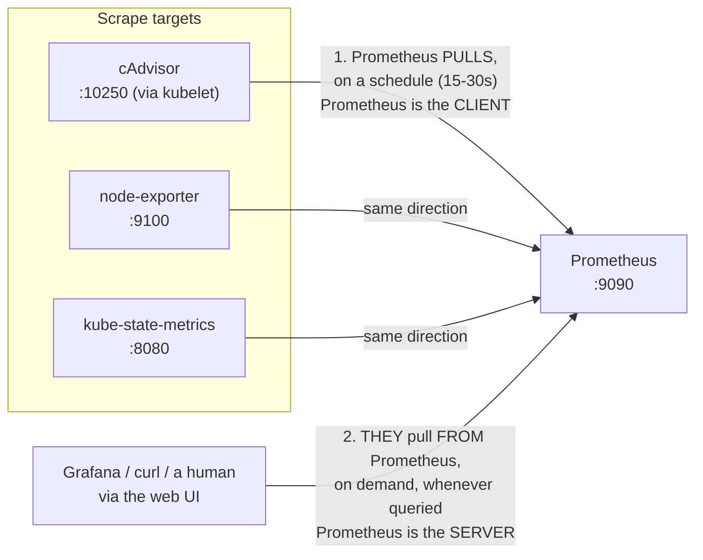
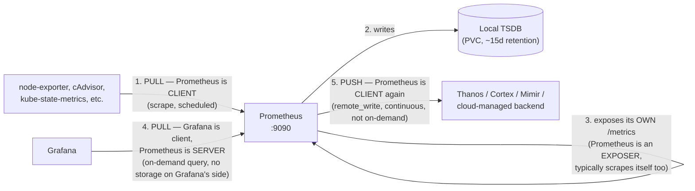

# Part 27: Metrics Collection Mechanics — Scraping, Daemons, Docker, Kubernetes, and the Clouds

> Builds directly on [Part 16's Three Pillars](16_observability.md#the-three-pillars),
> which explains *what* a metric is for and *why* it's cheap compared to logs/traces —
> that part deliberately stops at the concept and defers the mechanism ("already covered
> elsewhere") to this one. This part is that mechanism, in full: what actually moves a
> number from inside a running process to a dashboard, who runs that machinery, and what
> it costs to run it.

## In Plain English

Imagine a large office building where management wants to know, at any moment, how many
people are in each room. There are exactly two ways to find out. Either someone walks
around the building on a fixed schedule, sticking their head into every room and counting
— that's **pulling**: the collector visits each source on its own initiative. Or, every
room has its own little counter by the door that phones the front desk itself, every time
someone enters or leaves — that's **pushing**: the source reports in on its own, without
waiting to be asked. Metrics collection across every system in this document — Docker,
Kubernetes, AWS, GCP, Azure — is built entirely out of these two patterns, combined and
layered in different ways. Once that's solid, the rest of this document is just "which
rooms, and who's doing the walking."

## The Problem, Precisely

A running process knows things about itself in real time — how many requests it's
handled, how much memory it's using, how long its last operation took — but that
knowledge is trapped inside the process's own memory, gone the moment it exits, and
invisible to anyone not already inside it. Multiply this by hundreds of processes across
dozens of machines, and "is the system healthy right now" becomes unanswerable without
some deliberate mechanism to **pull that internal state out, continuously, into a place
outside any single process where it can be compared, graphed, and alerted on.** Everything
in this document is infrastructure built to solve exactly that extraction problem — at the
process level (Docker), the cluster level (Kubernetes), and the fleet level (a cloud
provider).

## What a Metric Actually Is, Before Asking How to Scrape It

Before "how do we collect it," a precise vocabulary for "what are we even collecting" —
Prometheus's own four metric types, now the de facto industry-standard taxonomy regardless
of which backend is actually used:

| Type | What it holds | Only ever goes up? | Example |
|---|---|---|---|
| **Counter** | A cumulative total | Yes (resets only on process restart) | Total HTTP requests served |
| **Gauge** | A value that can go up or down | No | Current memory usage, current queue depth |
| **Histogram** | Observations bucketed into ranges, plus a count and a sum | N/A (bucket counts increase) | Request latency distribution (e.g., how many requests took 0-10ms, 10-50ms, 50-200ms...) |
| **Summary** | Like a histogram, but pre-computes specific quantiles (p50/p99) *on the client side* instead of letting the server compute them from buckets | N/A | Same latency data, different trade-off — see below |

**Histogram vs. Summary is a real, worth-knowing trade-off**, not two names for the same
thing: a histogram's raw bucket counts can be aggregated *after the fact* across many
instances (sum every instance's bucket counts, then compute a fleet-wide p99) — a
summary's pre-computed quantiles cannot be meaningfully averaged across instances at all
(the p99 of five different p99s is not the fleet's real p99). Histograms are the more
composable, and now more commonly recommended, default for exactly this reason.

## How Metric Data Actually Moves: Pull vs. Push, Precisely

**Pull (the Prometheus model)**: the monitored process exposes its current metric values
on an HTTP endpoint (`/metrics`, plain text, one line per series) whenever asked — it does
nothing on its own initiative. A separate **scraper** (Prometheus itself) polls that
endpoint on a fixed interval (commonly 15-30s), storing whatever it reads. The scrape
*succeeding at all* is itself a free health signal — `up == 0` in Prometheus means the
target didn't answer, no extra instrumentation required to know that.

**Push**: the process itself opens a connection outward and sends its metrics to a
collector, on its own schedule, without being asked. StatsD (UDP-based, "fire and forget")
is the classic example; most cloud-provider agents (below) also work this way by default.

**Why pull became the dominant open-source default, and where push is still genuinely
necessary**: pull centralizes configuration (the scraper's target list is the single
source of truth for what's being watched, not scattered across every process's own
config) and makes service discovery natural (Kubernetes-aware Prometheus can *watch the
API server* and automatically start scraping new pods as they appear — see below). Push
is unavoidable, though, for anything that **doesn't live long enough to be scraped** — a
serverless function, a batch job that runs for eight seconds and exits. Prometheus's own
answer for this case is the **Pushgateway**: a small always-on intermediary that a
short-lived job pushes its final metrics *to*, which Prometheus then scrapes on its normal
schedule — pull remains the collection model even for push-shaped sources, by inserting
one long-lived buffer in between.

## What a Daemon Actually Is, and Why Metrics Collection Is Almost Always One's Job

**A daemon is a background process with no controlling terminal, started once (usually at
boot, or by a service manager like `systemd`) and left running continuously to provide an
ongoing system service** — as opposed to a program a user launches interactively and which
exits when its one task is done. The term is Unix folklore, dating to the 1960s-70s
(later informally back-named "Disk And Execution MONitor" by some, though that's a
retrofit, not the origin).

**Why metrics collection specifically is almost always a daemon's job**: the whole point
is *continuous* availability — a metric endpoint has to be answerable at 3am on a
Sunday, not just when someone happens to be logged in. Every collection tool named in this
document is architecturally a daemon: `node-exporter`, `cAdvisor`, the CloudWatch/Ops/Azure
Monitor agents, and — a concrete example from this exact session, not a hypothetical —
**`nvidia-dcgm`**, installed and run as a `systemd` service earlier in this project's own
GCP work (see
[`../../../../mini-llms-playground/infra/gcp-gpu-node/docs/dcgm_gpu_command_reference.md`](../../../../mini-llms-playground/infra/gcp-gpu-node/docs/dcgm_gpu_command_reference.md)):
`nv-hostengine`, running in the background, continuously answering `dcgmi` queries,
managed by `systemctl enable --now`, exactly the daemon pattern described here, already
lived through hands-on rather than just read about.

**Kubernetes' `DaemonSet`** is the direct, formalized version of this general concept at
the cluster level: a workload type that guarantees *exactly one pod per node* (or per
matching subset of nodes), automatically scheduled onto every new node as it joins the
cluster and removed as nodes leave — the Kubernetes-native answer to "run this daemon
everywhere, always, without me manually placing it." `node-exporter` and log shippers
(Fluent Bit, Promtail) are the textbook DaemonSet use cases for exactly this reason: one
per node, always running, no manual placement.

## How Docker Does This — Cgroups, Not Docker Itself

**The load-bearing fact, easy to miss**: Docker does not *measure* container resource
usage itself. The Linux kernel already does, via **cgroups** (control groups) — a kernel
mechanism (originally built at Google, mainlined into Linux ~2007) that tracks and can
limit CPU, memory, disk I/O, and network usage *per process group*. Docker's contribution
is placing every container's processes into their own cgroup at creation time and then
**reading the numbers the kernel was already computing** — from pseudo-files under
`/sys/fs/cgroup/...` — rather than performing any measurement of its own.

```bash
docker stats                              # live, human-readable, polls once per refresh
curl --unix-socket /var/run/docker.sock http://localhost/containers/<id>/stats  # the actual API underneath
```

**No daemon is inherently required for this basic layer** — the numbers already exist in
the kernel the instant a container starts, and `docker stats` is simply a live poll of
them, on demand, with nothing persisted. What Docker's own tooling does *not* do on its
own: retain history, expose these numbers as a scrapeable Prometheus endpoint, or alert on
thresholds — that's precisely the gap cAdvisor and the Docker daemon's optional metrics
endpoint (`--metrics-addr`) exist to close, turning a one-off poll into something a
scraper can continuously collect.

## How Kubernetes Does This — Five Distinct Pieces, Not One

This is exactly the architecture already diagrammed in
[`../../../mlops_aiops/docs/observability-on-eks.md`](../../../mlops_aiops/docs/observability-on-eks.md#how-it-fits-together-on-eks)
— worth reading in full for the picture; here's each piece's specific job, since "Kubernetes
collects metrics" is really five separate mechanisms working together, not one:

| Component | What it actually is | Data source | Scope |
|---|---|---|---|
| **cAdvisor** | Embedded *inside* the `kubelet` binary itself — not a separate pod you deploy | Reads the exact same cgroup files Docker itself reads (§ above) | Per-node, exposed at the kubelet's own `/metrics/cadvisor` |
| **Metrics Server** | A separate, lightweight cluster-wide Deployment | Scrapes cAdvisor's summary API from every kubelet | Cluster-wide; powers `kubectl top` and HPA's CPU/memory scaling — **no historical storage, current values only, deliberately not a general monitoring solution** |
| **kube-state-metrics** | A separate Deployment | Watches the **Kubernetes API server** — not cgroups at all | Object *state* (pod phase, deployment replica counts, restart counts) — metadata about K8s objects, a genuinely different data source than the other four |
| **node-exporter** | A DaemonSet, one pod per node | Reads `/proc` and `/sys` directly on the host | Node-level OS metrics (CPU/memory/disk/network) — the container-orchestration-agnostic equivalent of a cloud provider's own host agent |
| **Prometheus** | A separate server (or a managed equivalent) | Scrapes all four of the above | Aggregates and stores everything, using Kubernetes' own API as its **service discovery** mechanism (`kubernetes_sd_config`) — it watches the API server for pods/services matching scrape-annotation rules and automatically starts/stops scraping as they appear/disappear, no static target list to hand-maintain |

**The single most useful distinction to hold onto**: cAdvisor/node-exporter answer *"how
much resource is this container/node using"* (cgroups/OS data); kube-state-metrics answers
*"what does the Kubernetes API currently say about this object"* (control-plane state) —
two different questions, two different data sources, both essential, easy to conflate as
"just Kubernetes metrics" if the distinction isn't made explicit. This exact zero-code
combination (cAdvisor + kube-state-metrics, no application changes at all) is worked
through concretely, against a real deployed app with no `/metrics` endpoint of its own, in
[`../../../k8s_explorer/docs/metrics-and-logs-without-instrumentation.md`](../../../k8s_explorer/docs/metrics-and-logs-without-instrumentation.md).

## How the Cloud Providers Do This — the Same Underlying Split, Three Names

Every major cloud follows an identical structural pattern, worth understanding as *one*
mechanism with three vendor names rather than three separate systems to memorize:

| | AWS | GCP | Azure |
|---|---|---|---|
| Current unified agent | CloudWatch Agent | **Ops Agent** (successor to the older separate Monitoring + Logging agents) | **Azure Monitor Agent (AMA)** (successor to the older Log Analytics/Diagnostics agents) |
| Managed Prometheus | Amazon Managed Service for Prometheus (AMP) | Google Cloud Managed Service for Prometheus (GMP) | Azure Monitor managed Prometheus |
| Metrics needing **no** agent at all | Basic EC2 monitoring: CPU, network, disk I/O (~5 min granularity; Detailed Monitoring drops this to 1 min) | Compute Engine's default agentless metrics: CPU, network, disk I/O | VM host metrics: CPU, network, disk I/O |
| Metrics that **do** require the agent | **Memory usage** (not visible without it — a very commonly-tested gotcha), disk usage %, custom application metrics | Memory usage, disk usage %, custom application metrics | Memory usage, disk usage %, custom application metrics, guest-OS logs |

**Why this split is identical across all three, and it's not a coincidence**: CPU, network
throughput, and disk I/O are all visible to the **hypervisor** — the layer managing the
virtual machine from *outside* it — because the hypervisor itself is scheduling CPU time
and routing the VM's virtual network/disk devices, so it can meter those directly without
any cooperation from inside the guest. **Memory usage specifically cannot be seen this
way**: from the hypervisor's perspective, a VM's allocated memory just looks like memory
the VM owns — whether the guest OS is actually using 10% or 90% of it internally is state
that only exists *inside* the guest, invisible from outside without paravirtualization
tricks most standard VM types don't use. This is the first-principles reason every cloud
needs an in-guest agent specifically for memory (and anything else the guest OS alone
knows) but never needs one for CPU/network/disk — the same physical boundary explains all
three clouds' identical agent-vs-agentless split.

## Resource Cost of the Metrics Pipeline Itself

**Individual collection agents are cheap — this is by design**, since a metrics agent
that itself consumes meaningful resources would defeat its own purpose. A real, measured
example from this exact project rather than a textbook number: `nvidia-dcgm`, running as
a `systemd` daemon on the GCP training box used earlier this session, reported
`Memory: 18.2M` — under 20 megabytes, for a full GPU health-monitoring daemon, confirmed
live via `systemctl status nvidia-dcgm`. Illustrative, approximate figures for the more
general-purpose agents named throughout this doc, since exact numbers vary by cluster size
and scrape interval: `node-exporter` typically runs tens of megabytes of RAM and well under
1% CPU on a modestly sized node; `cAdvisor`, embedded in the kubelet, shares the kubelet
process's own budget rather than running as a separate process at all.

**`kube-state-metrics` is the one exception worth flagging explicitly**: its memory
footprint scales with the **number of Kubernetes objects in the cluster**, not the number
of nodes — a cluster with a few thousand pods/deployments/services holds meaningfully more
in memory than a small cluster, because it caches the full object state it watches from the
API server.

**The real cost scaling in this whole pipeline is not the agents — it's central
aggregation and storage**, and it scales with exactly two things: **cardinality** (the
number of distinct time series being stored — already covered in depth in
[Part 16's Cardinality Problem](16_observability.md#the-cardinality-problem), directly
relevant here since every additional scraped label combination is one more series
Prometheus has to hold in memory) and **retention** (how long that history is kept).
Doubling the fleet size roughly doubles agent count (cheap, linear, and each one stays
small); a careless high-cardinality label on one metric can multiply Prometheus's own
storage and query cost by orders of magnitude — the expensive part of this whole system is
almost never the daemons doing the collecting.

## Master Comparison Table: Who Collects What, From Where

| Layer | Tool | Reads from | Runs as |
|---|---|---|---|
| Kernel/container | cgroups (no separate tool) | Kernel accounting | Not a process — kernel bookkeeping |
| Docker | `docker stats` / Engine API | cgroups | On-demand poll, not a daemon by default |
| K8s, per-node resource usage | cAdvisor | cgroups (same data as Docker) | Embedded in `kubelet` |
| K8s, current snapshot | Metrics Server | cAdvisor's summary API | Cluster-wide Deployment |
| K8s, object state | kube-state-metrics | Kubernetes API server | Cluster-wide Deployment |
| K8s/on-prem, node OS metrics | node-exporter | `/proc`, `/sys` | DaemonSet, one per node |
| Cloud VM, agentless | (built-in) | Hypervisor | No agent — CPU/net/disk only |
| Cloud VM, full metrics | CloudWatch Agent / Ops Agent / AMA | In-guest OS | Daemon, installed explicitly |
| Aggregation/storage, any of the above | Prometheus (or a managed equivalent) | Scrapes every source above | Central server |

## Why Prometheus, When All These Other Tools Already Expose Data?

Every tool named above — cAdvisor, node-exporter, kube-state-metrics, the cloud agents,
`docker stats`, DCGM — is a **data source**: something that exposes or reports current
numbers *when asked*. None of them, on their own, does the four things a monitoring
*system* actually needs:

1. **Repeated collection over time.** cAdvisor's endpoint always reflects only "right
   now" — nothing about it causes anyone to actually poll it on a schedule. Without a
   scraper, an exposed `/metrics` endpoint is a page nobody's requesting.
2. **Storage.** A scrape endpoint has zero memory of its own history. Without somewhere
   to persist what was read, "what did CPU look like six hours ago" is unanswerable —
   `docker stats` and a bare cAdvisor query both prove this: each is a one-off snapshot,
   gone the instant the terminal scrolls.
3. **A shared query layer across every source at once.** node-exporter (per node),
   cAdvisor (per node), kube-state-metrics (cluster-wide) are three unrelated endpoints
   unless something ingests all three into one store and lets a single query span and
   correlate across them — "average request latency, grouped by deployment, weighted by
   replica count" needs data merged from more than one exposer; no individual exposer can
   answer it alone.
4. **Alerting.** Comparing a live value against a threshold over a time window, and
   firing a notification, requires continuously evaluating rules against *retained*
   history — not something any exposer in the tables above does.

**Prometheus is the piece that does all four.** Everything else in this document
*produces* data; Prometheus is what actually *collects* it (scraping, the pull model
already covered above), *retains* it (its own local time-series database), lets you *ask
questions across every source at once* (PromQL), and *evaluates alerting rules* against
it. Take Prometheus (or an equivalent) out of the picture and every tool in the tables
above still runs fine, individually — there's just nothing gathering, keeping, or acting
on what any of them expose.

## Is Prometheus Itself a Daemon?

Yes, in precisely the general sense [already defined above](#what-a-daemon-actually-is-and-why-metrics-collection-is-almost-always-ones-job)
— a Prometheus server is a long-running background process, always on, never launched
interactively for one task and then exited. On a bare VM it typically runs as a
systemd-managed service (`prometheus.service`) — the identical daemonization pattern as
`nvidia-dcgm` earlier in this document. In Kubernetes it runs as a **Deployment or
StatefulSet** (`kube-prometheus-stack`, the common Helm-based install, uses a StatefulSet
specifically, since Prometheus needs a persistent volume attached for its local TSDB —
losing that on every pod restart would mean losing all retained history).

**A precise distinction worth holding onto, since it's easy to conflate**: Prometheus is a
daemon, but it is deliberately **not** run as a Kubernetes `DaemonSet`. `DaemonSet`
specifically means *exactly one pod per node* — the correct placement for `node-exporter`,
which genuinely needs to run once on every node to read that node's own local `/proc`/
`/sys`. Prometheus is the opposite shape: **centralized**, not per-node — typically one or
two instances (the second for HA) for an *entire* cluster, each scraping every node, pod,
and service, not confined to a single node's own view. Running Prometheus itself as a
DaemonSet would mean N independent, uncorrelated instances, each seeing only its own
node, each redundantly storing most of the same cluster-wide data (kube-state-metrics'
output, for instance) N times over — precisely the wrong shape for something whose entire
job is being the *one* place every source gets unified. **"Daemon" (the general concept —
any continuously running background process) and "DaemonSet" (the specific Kubernetes
scheduling primitive — one-per-node) are related but not the same claim.** Prometheus is a
clean, concrete example of the first without being an instance of the second.

## Prometheus Has Two Different Endpoints — Don't Conflate Them

**Yes, Prometheus exposes an endpoint — but there are actually two separate ones here,
carrying traffic in opposite directions, and the question "who's responsible for
fetching" has a different answer for each:**



**Direction 1 — Prometheus fetching from targets.** This is the pull model already
covered above: **Prometheus itself is responsible for fetching** — it is the client,
initiating an outbound HTTP GET against each target's `/metrics` path on a schedule,
reading whatever `prometheus.yml` (or, when running the Prometheus Operator —
`kube-prometheus-stack`'s actual mechanism — a `ServiceMonitor` custom resource) tells it
to scrape. The *targets* are the ones whose ports need to be reachable *by Prometheus*
for this to work — not the other way around, and not by anyone else.

**Direction 2 — something querying Prometheus.** Prometheus's *own* port (default
`9090`) serves the completely separate role of answering queries about data it has
*already* collected and stored — Grafana calling its HTTP API to render a dashboard, a
human using its own built-in web UI to run an ad-hoc PromQL query, `curl` hitting its API
directly. Here Prometheus is the **server**, and whoever wants the data is the client,
connecting *in* whenever they choose to look — no schedule involved, purely on-demand.

**"Do we need to open a port" — yes, but usually not the way that phrase suggests.**
Within a Kubernetes cluster specifically, Pods share a flat network by default — a
target's `containerPort` is already reachable by anything else in the cluster, Prometheus
included, with nothing to configure in a firewall/security-group sense. What actually has
to be configured is Prometheus's own **scrape config** (or `ServiceMonitor` objects) —
*telling* it which targets exist and where, via Kubernetes' own API as service discovery,
[already covered above](#how-kubernetes-does-this-five-distinct-pieces-not-one). The one
port that genuinely may need deliberate external exposure is Prometheus's *own* `:9090` —
and only if a human or a tool outside the cluster needs to reach it directly. This is
exactly the same pattern already used hands-on with Grafana in this project's own
observability practice session
(`kubectl port-forward svc/rsa-grafana 3000:80` —
[`../../../k8s_explorer/docs/observability-practice-walkthrough.md`](../../../k8s_explorer/docs/observability-practice-walkthrough.md)):
`kubectl port-forward svc/<prometheus-service> 9090:9090` reaches Prometheus's own query
UI the identical way, temporarily and without permanently exposing anything — the same
answer applies to *any* in-cluster service someone occasionally needs to reach from
outside, not something specific to Grafana.

### Prometheus Is Actually Both — Exposer *and* Server, on the Same Port

The two-endpoint framing above simplifies one real wrinkle worth being precise about:
`:9090` doesn't serve just the query API — it also serves **`/metrics`**, in the exact
same exposition format `node-exporter` and `cAdvisor` use, reporting **Prometheus's own
internal state** (scrape success/failure counts per target, samples ingested, its own
memory/CPU usage, per-target scrape duration). This makes Prometheus a legitimate
**[exposer](#vocabulary-builder)** in its own right — the identical role every other
target plays — not only the collector sitting on top of them.

**The near-universal real-world consequence: Prometheus almost always scrapes itself.**
A default `prometheus.yml` scrape config typically lists Prometheus's own `/metrics`
endpoint as one of its own targets, polled on the same schedule as everything else — the
practical answer to "who watches the watcher." One process, three simultaneous roles on
one port: **client** (scraping node-exporter/cAdvisor/etc.), **exposer** (its own
`/metrics`, servicing scrapes — including, typically, its own), and **server** (the query
API and web UI, answering PromQL requests about everything it's collected, itself
included).

## Grafana Doesn't Store Metric Data — It Queries On Demand, No Worker Involved

**A real misconception worth correcting directly: Grafana does not run a background
process continuously copying Prometheus's data into its own storage.** When a dashboard
panel needs to render, Grafana's server sends a PromQL request to Prometheus's query API
— *at that moment*, or on whatever refresh interval the dashboard is configured with
(commonly 15-30s while the dashboard is actively open in a browser tab) — receives the
result, draws it, and keeps nothing. Close the browser tab, and nothing is polling
anything anymore; there's no persistent sync job running regardless of whether anyone is
looking at a dashboard.

**Grafana's own database** (SQLite by default; Postgres/MySQL for production
multi-user setups) stores only Grafana's *own* state — dashboard JSON definitions, user
accounts, data-source connection settings, alert-rule *configuration* — never the metric
time series themselves. There is no second copy of your metrics sitting in Grafana at
any point; it is a pure query-time rendering layer over whatever backend (Prometheus,
Loki, a SQL database) actually holds the data.

## Where Prometheus Actually Saves the Data

Prometheus stores everything it scrapes in its **own purpose-built time-series database
(TSDB)**, on local disk, at the path set by `--storage.tsdb.path` (default `./data`
locally, `/prometheus` in the standard container image). Internally: incoming samples
first land in a **write-ahead log (WAL)** for crash safety, get held in memory, and are
periodically flushed into immutable **2-hour blocks** on disk, which are later compacted
together into larger blocks for older data. **Default retention is 15 days** — after
that, Prometheus deletes the oldest blocks on its own.

**In Kubernetes, this is exactly why Prometheus runs as a `StatefulSet` with a
`PersistentVolumeClaim` attached, not a bare `Deployment`** — a Pod's own local
filesystem is ephemeral by default, and without a PVC backing that storage path, a pod
restart (a node drain, an upgrade, a crash) would silently delete everything Prometheus
had collected, with no warning until someone actually needed the history that used to be
there.

## The Downstream Direction: Prometheus as a *Push* Client — `remote_write`

This is the piece your question was actually pointing at, and it's a genuinely different
mechanism from everything covered so far — not scraping (pull), and not being queried
(server): Prometheus can be configured to **push** every sample it ingests onward, in
real time, to a remote endpoint, via a `remote_write` block in its own config:

```yaml
remote_write:
  - url: "https://<downstream-endpoint>/api/v1/write"
```

Here, **Prometheus is the client again — but pushing, not pulling**, the mirror image of
scraping. The receiving system (Thanos' `receive` component, Cortex, Grafana Mimir, or a
cloud-managed ingestion endpoint like Amazon Managed Service for Prometheus or Google's
equivalent) is the server, accepting a continuous stream of newly-scraped samples as they
arrive — not a one-time bulk copy, and not a query being answered, a standing push
connection carrying fresh data forward.

**Why this exists at all, given Prometheus already stores data locally**: a single
Prometheus instance's local TSDB has two hard limits — its 15-day-default retention, and
being confined to whatever it personally scraped (one cluster, one region). `remote_write`
solves both by fanning multiple Prometheus instances' data out to one shared downstream
store that can retain it far longer (object storage, effectively unlimited) and merge
data from many Prometheus instances into one global queryable view — exactly the pattern
already named as the production answer in
[`../../../mlops_aiops/docs/observability-on-eks.md`](../../../mlops_aiops/docs/observability-on-eks.md#where-the-data-actually-lives-the-part-diagrams-tend-to-hide):
"Thanos, Cortex, or Grafana Mimir... via `remote_write`."

### The Complete Picture, All Four Roles at Once



Five distinct relationships, one process at the center of four of them — worth being able
to name which direction is pull and which is push for each arrow, since "Prometheus is a
client" is true of both arrow 1 and arrow 5, but they are opposite mechanisms (pull vs.
push) serving opposite purposes (ingest vs. long-term offload).

## Getting Real History for Hardware Usage — and Checking Whether You Even Need the Hard Path First

Prometheus's local TSDB holding only 15 days by default means anything asking "what did
CPU/memory usage look like three months ago" — capacity planning, a slow long-term
memory-leak trend, year-over-year comparison — needs somewhere that keeps data longer.
`remote_write` (above) is the mechanism; **but check the cheaper option first, the same
"is the harder version actually needed" instinct this repo's rate-limiter section already
teaches** for a structurally identical question.

### Option 1 — the cloud's own native metrics may already cover this, with zero extra infrastructure

If the hardware being monitored is a cloud VM, its provider's own native metrics service
already retains history far longer than Prometheus's local default, often with **no
agent, no Prometheus, no Thanos required at all**: AWS CloudWatch keeps metrics for **15
months**, at *declining resolution* as data ages — full 1-minute granularity for 15 days,
5-minute for 63 days, 1-hour resolution beyond that — GCP Cloud Monitoring and Azure
Monitor Metrics follow the same declining-resolution shape. For CPU/network/disk
specifically (the agentless metrics [already covered above](#how-the-cloud-providers-do-this-the-same-underlying-split-three-names)),
this history exists automatically, today, without deploying anything new — worth checking
before building a self-hosted long-term-storage pipeline to solve a problem the cloud may
already be solving for free.

### Option 2 — `remote_write` to a long-term store, when self-hosted, portable, or unified history is actually needed

Reach for this specifically when: running on-prem/self-hosted Kubernetes (no cloud-native
metrics service to fall back on), needing custom application/container metrics history
(not just OS-level hardware — cloud-native retention doesn't cover a custom Prometheus
metric), or wanting **one** queryable interface (PromQL/Grafana) spanning both recent and
historical data instead of switching tools for "old" vs. "new" data.

### What a Sidecar Actually Is, Before Explaining Thanos's Own

**A sidecar is a second container running in the *same Kubernetes Pod* as a main
container, sharing that Pod's network (they reach each other over `localhost`) and
optionally its storage volumes, deployed and destroyed together as one inseparable
unit** — a helper attached to a specific application instance, not a separate service
living elsewhere in the cluster. The name is literal: a motorcycle sidecar rides attached
to the motorcycle, along for the identical journey, carrying something extra the
motorcycle itself doesn't. **Full depth, a real worked example (Grafana's own dashboard-
provisioning sidecar, verified live on a cluster), and native sidecars (Kubernetes
1.29+'s formalized ordering guarantees) are already covered in
[`../../../k8s_explorer/docs/sidecar-containers.md`](../../../k8s_explorer/docs/sidecar-containers.md)** —
this is the short version needed to follow Thanos's own use of the pattern below.

**Placed against the other two related concepts this document already covers**: a
*daemon* is the general idea (any continuously running background process); a
`DaemonSet` schedules one daemon instance **per node**, serving that whole node's
workloads collectively; a **sidecar attaches one helper instance per *Pod*** — tied to
one specific application instance, not spread across a node's many unrelated pods. Same
underlying "continuously-running helper process" idea, three different placement
relationships to whatever it's helping.

**Why put a helper in the same Pod instead of its own Deployment, concretely**: because
some jobs genuinely require sharing the main container's own local resources — its
filesystem, specifically — and no amount of clever networking substitutes for actually
being co-located. Thanos's own two modes are a clean, concrete illustration of exactly
this design decision, made two different ways for two different reasons:

**Thanos** (the most commonly cited OSS option) has two distinct architectures for getting
data into long-term storage, worth distinguishing precisely rather than treating as one
thing:

- **Sidecar mode — genuinely needs to be a sidecar, not a design choice made for
  convenience**: a Thanos Sidecar container runs in the *same Pod* as Prometheus, sharing
  its Pod network and — critically — its **storage volume**, mounting the identical PVC
  Prometheus itself writes its compacted 2-hour blocks to. The Sidecar reads those block
  files directly off that shared disk and uploads them to object storage (S3/GCS/Azure
  Blob) once Prometheus finishes writing each one. This is *why* it has to be a sidecar
  and not a separate Deployment somewhere else in the cluster: uploading a file requires
  reading it off a disk, and the only way to guarantee access to *this specific*
  Prometheus instance's own local disk is to share its Pod. The Sidecar also exposes a
  gRPC **StoreAPI** that Thanos Query can call to read Prometheus's *not-yet-uploaded*
  recent data directly — serving live data straight from the co-located Prometheus while
  older data comes from object storage instead.
- **Receive mode — deliberately *not* a sidecar, because nothing here needs local disk
  access**: a separate Thanos Receiver component accepts `remote_write` pushes directly
  over the network (functionally the server on the other end of the arrow in the diagram
  above) and writes to object storage itself. Because this relationship is a network push,
  not a local-file read, there's no filesystem to share and therefore no reason to
  co-locate anything — the Receiver can run as its own ordinary Deployment anywhere in the
  cluster, and one Receiver can accept pushes from many separate Prometheus instances at
  once, which is exactly why it's the better fit for many small/short-lived Prometheus
  instances that shouldn't each carry their own dedicated sidecar.

**The general lesson, not just a Thanos-specific fact**: reach for a sidecar specifically
when a helper needs the main container's own local disk or `localhost` network access to
do its job (exactly [`sidecar-containers.md`](../../../k8s_explorer/docs/sidecar-containers.md)'s
own "why put a helper in the same Pod" reasoning, applied here) — reach for an ordinary,
independently-scaled Deployment when the relationship is already a network call, since
co-location buys nothing a network hop wasn't already doing.

Either way, a **Thanos Query** component (or Cortex's / Mimir's equivalent query layer)
sits in front, transparently merging *recent* data (still on a live Prometheus) with
*historical* data (served from object storage by a Store Gateway component) behind one
PromQL endpoint — **Grafana's dashboard doesn't change at all**; it points at Thanos
Query instead of raw Prometheus, and the exact same query that used to return empty past
15 days now returns real data, with no query-syntax difference on the asking side.

**Long-term data is virtually always downsampled, and that's a deliberate trade-off, not
a limitation to fight.** Thanos's Compactor component (or Cortex/Mimir's equivalent)
aggregates old raw samples into coarser 5-minute and 1-hour resolutions specifically
because nobody needs 15-second-precision CPU data from eight months ago, and keeping
every raw sample forever would make long-term object storage cost scale the same way
Part 16's [Cardinality Problem](16_observability.md#the-cardinality-problem) already
warns about — this is the time-axis version of the identical trade-off, resolution
traded for retention instead of label combinations traded for storage.

**Managed alternative, avoiding running Thanos/Cortex/Mimir yourself**: point
`remote_write` at Amazon Managed Service for Prometheus (AMP) or Google Cloud Managed
Service for Prometheus (GMP) directly — same mechanism, same PromQL query experience
afterward, the cloud provider operates the long-term storage layer instead of you.

## Designing and Operating From First Principles

- **Prefer pull with service discovery over a hand-maintained push target list whenever
  the sources are long-lived** (containers, VMs, K8s pods) — it centralizes configuration
  and gets scrape-failure-as-health-signal for free. Reach for push (or the Pushgateway
  bridge) specifically for sources too short-lived to be scraped, not as a general default.
- **Know which metrics are agentless before troubleshooting "why is memory blank."** A
  dashboard missing memory data on a cloud VM is very often "the agent was never
  installed," not a bug — the hypervisor boundary explained above means that specific gap
  is structural, not accidental, on every major cloud.
- **Budget for cardinality growth, not node growth, when planning a metrics backend's
  resources.** Adding nodes adds cheap, linear agent overhead; adding a high-cardinality
  label to one existing metric can dwarf that cost entirely — see Part 16's Cardinality
  Problem for the mechanism, this part for why it dominates the *collection* pipeline's
  actual cost profile specifically.
- **`kube-state-metrics` capacity planning tracks object count, not cluster size in
  nodes** — a cluster running many small, short-lived Jobs/Pods can stress it more than a
  larger cluster running few, long-lived Deployments, since it's watching object churn,
  not raw node count.

## Key Takeaways

- **Sidecar, daemon, and `DaemonSet` are three related but distinct placement
  relationships, not synonyms** — a daemon is the general "continuously-running helper"
  concept; a `DaemonSet` places one instance per *node*; a sidecar places one instance per
  *Pod*, co-located specifically because it needs the main container's own local disk or
  `localhost` network.
- **Thanos Sidecar mode has to be a sidecar because it reads Prometheus's compacted
  blocks directly off a shared disk volume** — Receive mode deliberately isn't one,
  because accepting a network push (`remote_write`) needs no local filesystem access at
  all, so co-location buys nothing there.
- **Prometheus has two separate endpoints carrying traffic in opposite directions** —
  it's the *client* pulling from every scrape target (`:9090` isn't involved in this
  direction at all), and it's the *server* on its own `:9090` for anyone querying data
  it already collected. "Prometheus exposes an endpoint" is true of both, but they answer
  completely different questions about who's responsible for fetching what.
- **Prometheus is also an exposer of its own metrics, on the same `:9090` `/metrics`
  path every other target uses** — and it almost always scrapes itself, making it
  simultaneously the client, an exposer, and the server, in one process.
- **Grafana never stores metric data — it queries Prometheus on demand and keeps
  nothing**, no background worker involved; its own database holds only dashboard
  definitions and configuration, never the time series themselves.
- **Prometheus's actual data lives in its own local TSDB on disk**, 15-day retention by
  default — which is exactly why it needs a `StatefulSet` + `PersistentVolumeClaim` in
  Kubernetes, not a bare `Deployment`.
- **`remote_write` is Prometheus acting as a *push* client, the mirror opposite of
  scraping** — it's client in both cases, but one direction is pull (ingest) and the
  other is push (offload to long-term storage like Thanos/Cortex/Mimir) — the same word
  ("client") describing two structurally opposite mechanisms.
- **Check the cloud's own native metrics retention before building a long-term-storage
  pipeline** — CloudWatch/Cloud Monitoring/Azure Monitor already keep hardware metrics for
  months at declining resolution, with zero extra infrastructure, for exactly the
  agentless metrics (CPU/network/disk) that dominate most "hardware usage history"
  questions.
- **Long-term metric storage is virtually always downsampled, deliberately** — coarser
  resolution for older data is the time-axis version of the same trade-off Part 16's
  cardinality problem describes on the label-combination axis; nobody needs
  15-second-precision data from eight months ago, and pretending otherwise makes storage
  cost scale needlessly.
- **In-cluster scrape traffic usually needs no firewall/port-opening at all** — Kubernetes'
  flat pod network already makes targets reachable by Prometheus; what actually needs
  configuring is *telling* Prometheus which targets exist (scrape config /
  `ServiceMonitor`), not opening anything. The one port that may need deliberate external
  exposure is Prometheus's own `:9090`, and only if something outside the cluster needs
  to reach it.
- **Every tool in this document except Prometheus is a data *source*, not a monitoring
  *system*** — cAdvisor, node-exporter, kube-state-metrics, and the cloud agents all
  expose numbers on request; none of them scrape on a schedule, retain history, query
  across sources, or evaluate alerts on their own. Prometheus is the piece that does all
  four.
- **Prometheus is a daemon but deliberately not a `DaemonSet`** — it's centralized (one
  or two instances per cluster), the opposite placement shape from `node-exporter`'s
  genuine one-per-node requirement; "daemon" (general, continuous background process) and
  "DaemonSet" (Kubernetes' specific one-per-node scheduling primitive) are related
  concepts, not the same claim.
- **Every metrics system in this document is built from exactly two primitives — pull and
  push** — layered and combined differently, never a third fundamentally different
  mechanism.
- **Docker doesn't measure container resource usage; the Linux kernel's cgroups already
  do, and Docker just reads it** — the same cgroup data is what cAdvisor also reads inside
  Kubernetes, making the two mechanically related, not separate inventions.
- **A daemon is any long-running, backgrounded process providing a continuous service** —
  `nvidia-dcgm`, `node-exporter`, and every cloud provider's monitoring agent are all
  instances of the identical general concept; Kubernetes' `DaemonSet` is that concept
  formalized as a scheduling guarantee.
- **Kubernetes metrics collection is five distinct mechanisms, not one** — cAdvisor and
  node-exporter read resource usage from cgroups/`/proc`; kube-state-metrics reads object
  *state* from the API server entirely separately; Metrics Server and Prometheus are two
  different consumers of that same underlying data, built for different purposes
  (real-time snapshot vs. historical storage).
- **Every major cloud draws the identical agentless-vs-agent line at the same place, for
  the same physical reason**: the hypervisor can meter CPU/network/disk from outside the
  VM; memory usage exists only inside the guest and always needs an in-guest agent.
- **Agents themselves are cheap by design** (a real, measured example: `nvidia-dcgm` at
  18.2MB); **the expensive part of any metrics pipeline is central storage, scaling with
  cardinality and retention**, not the number of daemons collecting data.

## Quick Self-Check

- Explain, in one sentence, why Thanos's Sidecar mode genuinely has to be a sidecar,
  while Receive mode deliberately isn't one — what specific resource does one need that
  the other doesn't?
- Place "daemon," "DaemonSet," and "sidecar" against each other precisely — what's the
  placement granularity each one describes (node? Pod? neither, just a general concept)?
- Before setting up Thanos/Cortex/Mimir to retain a year of hardware-usage history on a
  cloud VM, what should be checked first, and why might it make the harder path
  unnecessary?
- Explain Thanos Sidecar mode vs. Receive mode in one sentence each — which data path
  (Prometheus's own local blocks, or a live `remote_write` stream) does each one actually
  move into object storage?
- Why is downsampled long-term metric history a deliberate design choice rather than a
  limitation — what's the direct parallel to the cardinality problem?
- A dashboard in Grafana refreshes every 30 seconds while open. What's actually happening
  on each refresh — and what happens to that data the moment the browser tab is closed?
- Prometheus is described as "the client" both when scraping targets and when using
  `remote_write`. What's the one-word difference between these two relationships that
  makes them structurally opposite, despite the same label applying to both?
- Why does a Prometheus StatefulSet in Kubernetes need a PersistentVolumeClaim
  specifically — what would actually be lost, and when, without one?
- Prometheus's `:9090` and a scrape target's `/metrics` port both count as "an endpoint
  Prometheus is involved with." Which one is Prometheus the client for, which is it the
  server for, and does either direction require Grafana to be running?
- Within a Kubernetes cluster, what actually needs to be configured for Prometheus to
  reach a new target — a firewall rule, or something else? Why?
- Name the four things a monitoring system needs that a bare `/metrics` endpoint (from
  cAdvisor, node-exporter, or any exposer) doesn't provide on its own.
- Why is `node-exporter` correctly deployed as a Kubernetes `DaemonSet` while Prometheus
  itself deliberately is not, even though both are daemons in the general sense?
- Explain why a dashboard is missing memory data for a cloud VM, but shows CPU and network
  data fine, without checking any configuration first — what's the structural reason this
  specific gap exists on every major cloud?
- Docker and Kubernetes' cAdvisor both report container resource usage. Are they two
  independent measurement systems, or the same underlying data read twice? Justify the
  answer from the kernel mechanism involved.
- Name the five distinct Kubernetes metrics-collection components and, for each, whether
  it reads from cgroups/`/proc` or the Kubernetes API server — why does that split matter?
- Why does adding more nodes to a cluster scale a Prometheus-based metrics pipeline's cost
  far less than adding one high-cardinality label to an existing metric?
- Explain the difference between a histogram and a summary metric type, specifically in
  terms of what can and can't be done with the data *after* it's been collected from many
  instances.

## Articulate It: Interview Framing & Vocabulary

### Three Ways to Explain This

- **Two-primitives framing (the default opener):** "Every metrics-collection system here —
  Docker, Kubernetes, every major cloud — is built from exactly two patterns, pull and
  push, combined differently. I'd start any explanation there before naming a single
  specific tool."
- **Kernel-boundary framing (good for the Docker/cAdvisor/cloud-agent questions
  specifically):** "The mechanism question isn't really 'how does tool X measure this' —
  it's 'what data does the kernel or hypervisor already have, and who's reading it.'
  Docker and cAdvisor read the identical cgroup data; every cloud's agentless-vs-agent
  split traces back to what the hypervisor can and can't see from outside the VM."
- **Cost-attribution framing (good for a 'how would you scale this' follow-up):** "I
  wouldn't budget metrics infrastructure cost against node count — I'd budget it against
  cardinality and retention, since agents themselves are cheap and roughly linear, but
  cardinality growth in the central store is where costs actually explode."

### Vocabulary Builder

- **daemon** (n.) — a long-running background process with no controlling terminal,
  providing a continuous service rather than exiting after one task; the general concept
  `DaemonSet`, `node-exporter`, and `nvidia-dcgm` all instantiate.
- **cgroups (control groups)** (n.) — the Linux kernel mechanism that tracks and can limit
  resource usage per process group; the actual source of every container resource metric
  in this document, not something Docker or Kubernetes computes themselves.
- **service discovery** (n. phrase) — a scraper automatically finding and tracking new
  scrape targets (e.g., new pods) by watching a live source of truth (the Kubernetes API),
  rather than requiring a hand-maintained static target list.
- **agentless metric** (n. phrase) — a metric the cloud provider can report without any
  software running inside the VM, because the hypervisor can observe it directly from
  outside — structurally limited to CPU/network/disk, never memory.
- **"…is reading the same data twice, not measuring it twice"** — a fluent way to
  correct the assumption that Docker and Kubernetes' cAdvisor are independent measurement
  systems, when they're actually two consumers of one kernel data source.
- **exposer** (n., this doc's shorthand) — anything that makes current metric values
  available on request (cAdvisor, node-exporter, a cloud agent) without itself scraping,
  storing, correlating, or alerting on them — the role Prometheus sits on top of, not a
  substitute for it.
- **"…is a daemon, but deliberately not a DaemonSet"** — the precise way to state that
  Prometheus is centralized rather than per-node, without implying it isn't a genuine
  background service.
- **`remote_write`** (n., Prometheus-specific) — a config block that turns Prometheus into
  a push client, continuously forwarding newly-ingested samples to a downstream long-term
  store; the mirror-image mechanism to scraping, not a variant of it.
- **write-ahead log (WAL)** (n. phrase) — a durability technique where an operation is
  recorded to an append-only log *before* being applied, so a crash mid-write can be
  recovered from the log rather than losing the data; Prometheus's own in-progress data
  lives here before being flushed into a compacted block.
- **downsampling** (n.) — reducing data resolution for older history (e.g., 15s samples
  aggregated to 1-hour averages) to keep long-term storage cost bounded, on the
  assumption that old data is examined for trends, not moment-to-moment precision.
- **sidecar** (n.) — a helper container sharing a main container's Pod (network and
  optionally storage), co-located specifically because it needs that local access; see
  [`sidecar-containers.md`](../../../k8s_explorer/docs/sidecar-containers.md) for the
  full pattern and a live worked example.

---

**Previous:** [Part 26: SSH Keys and Public-Key Cryptography](26_ssh_keys_and_public_key_cryptography.md)  |  **Next:** [Part 28: Log Collection Mechanics — Loki](28_log_collection_mechanics_loki.md)
