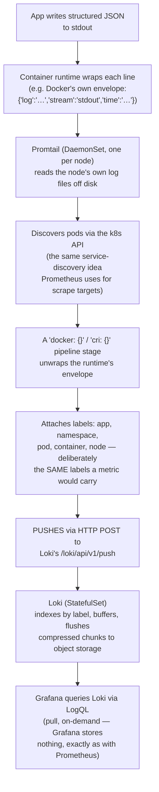

# Part 28: Log Collection Mechanics — Loki, From First Principles

> Companion to [Part 27's metrics-collection mechanics](27_metrics_collection_and_scraping_mechanics.md)
> — same "why, what, where, how, and who's a daemon vs. a sidecar" treatment, applied to
> the logs pillar instead. Reuses that part's vocabulary (daemon, `DaemonSet`, sidecar,
> pull vs. push, cardinality) rather than re-deriving it — read that one first if any of
> those terms aren't already solid.

## In Plain English

Recall [Part 27's office-building analogy](27_metrics_collection_and_scraping_mechanics.md#in-plain-english):
someone walking room to room counting people. Logs are a different question entirely —
not "how many people are in this room right now" (a number, sampled, aggregatable), but
**"give me a transcript of everything anyone actually said in this room, in order"** — a
discrete, growing record of individual events, not a measurement you can re-take later.
That difference in the *shape* of the data — a number vs. a sentence, a sample vs. a
transcript — is what makes log collection genuinely different machinery from metric
collection, not the same problem with a different tool bolted on.

## The Problem, Precisely

The same extraction problem [Part 27 opened with](27_metrics_collection_and_scraping_mechanics.md#the-problem-precisely)
— data trapped inside a process, invisible once it exits — but for a data shape that
can't be re-sampled after the fact. A metric's *current* CPU usage can be asked again a
second later and still mean something. A log line saying "connection refused to
payment-service at 14:32:07" happened exactly once — if nothing captured it at that
instant, it is gone, permanently, the moment the process that emitted it rotates its log
file or the Pod that held it is deleted. This is the structural reason log collection is
built around **push**, not pull, and it's the single most important thing this document
adds on top of Part 27.

## Why: What Existed Before Loki, and the Specific Bet Loki Makes

**Before centralized logging**: SSH into each box, `grep`/`tail -f` its local log files —
workable for a handful of machines, unworkable past that, and actively broken in
Kubernetes specifically, where a rescheduled or crashed Pod's local filesystem — and
every log line on it — disappears the instant the Pod is deleted, unless something
already shipped those lines elsewhere before that happened.

**Elasticsearch (the ELK/EFK stack)** is the older, heavier answer: index *every word* of
every log line for genuine full-text search across any field. Powerful, but the index
itself can rival or exceed the size of the raw logs — expensive at real volume, and
operationally heavy (JVM tuning, shard management).

**Loki's specific bet, worth stating precisely**: the overwhelming majority of real log
queries start the same way — "show me logs for pod X in namespace Y, in this time range,
optionally containing string Z" — filtering by a small, *known* set of **labels** first,
*then* searching within that already-narrow result. Loki indexes **only the labels**
(namespace, pod, container, app) — a small, cheap index — and stores the raw log text as
compressed chunks, doing the actual text search only within whatever chunks the label
filter already narrowed things down to, at query time. This is precisely why Loki is
described, including in this repo's own existing tool note
([`../../../mlops_aiops/docs/tools/loki/README.md`](../../../mlops_aiops/docs/tools/loki/README.md)),
as **"Prometheus, but for logs"** — the exact same "index the cheap, bounded dimension;
leave the expensive part unindexed until query time" philosophy Part 27 already covers for
metric labels, applied here to log lines instead of numeric series.

## What: Loki's Actual Architecture

Exactly parallel to Part 27's opening point about Prometheus — **Loki does not collect
logs itself.** It is a storage-and-query engine that something else has to feed:

| Piece | Role |
|---|---|
| **Index** | Labels only (namespace, pod, container, app) — small, cheap, the only thing actually indexed |
| **Chunks** | Compressed raw log lines, grouped by label set, the bulk of the actual data |
| **LogQL** | Loki's query language — a label selector first (`{app="rust-api"}`, matching PromQL's own label-matching syntax), then an optional line filter (`|= "error"`), then optional parsing (`| json`) to pull structured fields out of a JSON log line for further filtering |

**Object storage as the *native*, from-day-one durability layer — a deliberate
architectural difference from Prometheus, not an oversight on either side.** Already
established in this repo's own EKS observability doc
([`../../../mlops_aiops/docs/observability-on-eks.md`](../../../mlops_aiops/docs/observability-on-eks.md#where-the-data-actually-lives-the-part-diagrams-tend-to-hide)):
Loki chunks land in S3/GCS/Azure Blob as Loki's *primary* store, by design, from the
start. Contrast this directly with [Part 27's Prometheus story](27_metrics_collection_and_scraping_mechanics.md#getting-real-history-for-hardware-usage-and-checking-whether-you-even-need-the-hard-path-first):
Prometheus was built local-disk-first, and object storage only enters the picture as an
*add-on* (Thanos/Cortex/Mimir, bolted on afterward for long-term retention). Loki never
had that gap to begin with — it assumed object storage as its real store from day one,
which is also why Loki has no equivalent of Prometheus's 15-day-then-gone default limit:
retention is a policy choice against cheap, already-native object storage, not a hard
architectural ceiling to work around.

## Where: Daemon, Sidecar, or Centralized — the Same Framework as Part 27, Reapplied

- **The shipping agent (Promtail, Grafana Alloy, or Fluent Bit) runs as a `DaemonSet` —
  one pod per node — for exactly the reason [`node-exporter` does](27_metrics_collection_and_scraping_mechanics.md#how-kubernetes-does-this-five-distinct-pieces-not-one):
  it needs to read *that node's own* local log files directly off disk (the container
  runtime's own log directory), so it has to physically run on every node to have access
  to every node's own files. This isn't a new rule — it's the identical DaemonSet
  reasoning already established for node-level metrics, applied to node-level log files.**
- **A sidecar is the correct alternative specifically when log handling needs to be
  *per-application*, not uniform across a node** — the same "does this need the main
  container's own local disk specifically" test [already used to explain Thanos's Sidecar
  mode](27_metrics_collection_and_scraping_mechanics.md#what-a-sidecar-actually-is-before-explaining-thanoss-own).
  If one specific app writes unusually shaped multi-line logs needing custom parsing
  before shipping — distinct handling from every other pod sharing that node — a sidecar
  co-located with just that one app, sharing its log-writing volume, is the right choice
  over a node-wide DaemonSet applying the same generic rules to everything.
- **Loki itself runs centralized** — a `StatefulSet` (needs stable identity; its
  ingesters briefly buffer recent chunks in memory/local disk before flushing to object
  storage), not a `DaemonSet` — the exact same daemon-but-deliberately-not-a-DaemonSet
  placement already established for [Prometheus](27_metrics_collection_and_scraping_mechanics.md#is-prometheus-itself-a-daemon):
  one (or a small HA set of) centralized instance(s) for the whole cluster, not one per
  node, for the identical reason — a per-node Loki would mean N uncorrelated log stores
  instead of one unified, queryable place.

## How: The Real Pipeline, End to End — Already Verified Live in This Repo

Not a hypothetical — this is the exact, confirmed-working pipeline documented for
[`rust-api-observability-stack`](../../../k8s/k8s_explorer/practice/rust-api-observability-stack/README.md#how-logs-actually-reach-grafana)
earlier in this workspace's own observability practice:

**The single most important structural fact this whole document adds**: notice the
direction of arrow into Loki — **Promtail pushes to Loki; Loki never scrapes anything.**
This is the *opposite* mechanism from [Part 27's entire pull-based Prometheus
story](27_metrics_collection_and_scraping_mechanics.md#how-metric-data-actually-moves-pull-vs-push-precisely),
and it's not an inconsistency between the two systems — it's the correct mechanism for
each data shape, precisely because of the reason named at the top of this document: a
metric is a **re-askable current value** (pull works fine — ask again later, get a valid
answer), while a log line is a **one-time event** (pull cannot work — by the time a
scraper got around to asking, the line may already be gone, rotated out, or the Pod that
held it already deleted). Push is not a design preference here; it's the only mechanism
that can actually capture something that happens exactly once and never again.

**Labels attached deliberately match what a metric for the same workload would carry**
(`app`, `namespace`, `pod`) — not a coincidence, but the specific design choice that lets
someone looking at a metrics dashboard pivot straight to "show me the logs for this exact
pod, this exact time range" without re-deriving which labels correspond to which — the
practical payoff of Loki's Prometheus-shaped label model.

## Resource Cost — the Same Two-Tier Split as Part 27

**The shipping agent is cheap, by design** — Promtail/Alloy's job (tail a file, apply a
lightweight pipeline stage, forward) is comparably cheap to `node-exporter`'s own reading
of `/proc`; expect the same order of magnitude (tens of MB RAM, low CPU) on a modestly
loaded node, for the identical "an agent that itself consumes meaningful resources
defeats its purpose" reason already stated in Part 27.

**Loki's own cost scales with log volume and label cardinality — not node count**, the
same shape of cost curve [Part 27 already established for Prometheus](27_metrics_collection_and_scraping_mechanics.md#resource-cost-of-the-metrics-pipeline-itself).
Loki is explicit about this in its own documentation: a high-cardinality label (a
request ID, a user ID, anything with unbounded distinct values) applied to logs creates
a large number of separate small **streams**, each carrying its own indexing/chunking
overhead — the log-pipeline instance of [Part 16's Cardinality
Problem](16_observability.md#the-cardinality-problem), the identical warning, restated
for a different tool.

## Master Comparison: Loki vs. Prometheus, Side by Side

| | Prometheus (metrics) | Loki (logs) |
|---|---|---|
| Collection direction | **Pull** — Prometheus scrapes targets | **Push** — Promtail/Alloy sends to Loki |
| Why that direction | Data is a re-askable current value | Data is a one-time event that must be captured when it happens |
| What's indexed | Every distinct label combination (full series) | Labels only — log *content* is never indexed |
| Query language | PromQL | LogQL (label selector, then line filter, then parse) |
| Durable storage | Local disk first; object storage is a bolted-on extension (Thanos/Cortex/Mimir) | Object storage *natively*, from day one |
| Default local retention | 15 days | No equivalent hard default — retention is a policy against already-native object storage |
| Collection agent placement | `node-exporter`: `DaemonSet`, one per node | Promtail/Alloy: `DaemonSet`, one per node — same reasoning |
| Central store placement | `StatefulSet`, centralized, not per-node | `StatefulSet`, centralized, not per-node — same reasoning |
| Cardinality risk | High-cardinality label → too many series | High-cardinality label → too many streams — same underlying problem |

## Designing and Operating From First Principles

- **Don't reach for Elasticsearch by default just because "full-text search" sounds more
  capable.** If most real queries against your logs start with a label filter (which
  namespace, which pod, which service) before any text search, Loki's cheaper index
  covers the actual access pattern; reserve Elasticsearch specifically for genuine
  ad hoc full-text search needs (security/audit investigations, "find every occurrence of
  this string anywhere") that label-first filtering structurally can't serve.
- **Keep metric and log labels consistent on purpose** — the pivot-from-dashboard-to-logs
  workflow this document's pipeline diagram enables only works if `app`/`namespace`/`pod`
  actually match between what Prometheus scrapes and what Promtail attaches; a naming
  mismatch between the two pipelines quietly breaks that workflow.
- **Apply the exact same cardinality discipline to log labels as to metric labels** — a
  request ID or user ID belongs in the log *line's content* (queryable via a LogQL line
  filter or `| json` field match after the fact), never as a Promtail-attached label.

## Key Takeaways

- **Loki does not collect logs — a separate shipping agent (Promtail/Alloy/Fluent Bit)
  does, running as a `DaemonSet`** for the identical reason `node-exporter` does: it
  needs each node's own local files, which only co-location with that node provides.
- **Loki's collection pipeline is push, the structural opposite of Prometheus's pull** —
  not an inconsistency, but the correct mechanism for a one-time event (a log line)
  versus a re-askable current value (a metric).
- **Loki was designed around object storage from day one; Prometheus needs
  Thanos/Cortex/Mimir bolted on afterward for the same durability property** — the same
  underlying need (long-term, cheap, durable storage), solved natively by one tool and as
  an extension by the other.
- **Loki indexes labels only, never log content — "Prometheus, but for logs"** is a
  precise description of its actual indexing philosophy, not just a marketing tagline.
- **The cardinality problem is identical across both tools** — Part 16's warning about
  metric label cardinality applies word-for-word to Loki's log labels, just called
  "streams" instead of "series."

## Quick Self-Check

- Explain, from first principles (not just "that's how it works"), why Loki's collection
  pipeline has to be push while Prometheus's has to be pull — what property of a log line
  versus a metric value makes pull structurally unworkable for one of them?
- Why does the shipping agent (Promtail/Alloy) run as a `DaemonSet`, using the exact same
  reasoning already established for `node-exporter` in Part 27?
- A team wants per-application custom multi-line log parsing for one specific service,
  different from every other pod on its node. Sidecar or DaemonSet — and why?
- Why does Loki have no real equivalent to Prometheus's "15 days, then it's gone" default
  retention ceiling?

## Articulate It: Interview Framing & Vocabulary

### Three Ways to Explain This

- **Push-vs-pull-by-necessity framing (the default opener):** "Loki's pipeline is push
  and Prometheus's is pull, and that's not an inconsistency — it's forced by the data
  shape. A metric is a value you can ask for again later; a log line is an event that
  happens once, so something has to actively capture and forward it the instant it
  occurs, or it's gone."
- **Prometheus-for-logs framing (good for explaining Loki's index design specifically):**
  "Loki indexes exactly the same thing Prometheus does — labels — and leaves the
  expensive part (log content, analogous to Prometheus's actual sample values) unindexed
  until query time. That's the entire reason it's cheaper than Elasticsearch: it's making
  the identical cheap-dimension-indexed, expensive-dimension-deferred bet Prometheus
  already makes for metrics."
- **Native-vs-bolted-on-storage framing (good for the retention/durability question):**
  "Loki was built around object storage from day one; Prometheus was built local-disk-
  first and needs Thanos or an equivalent added on top for the same long-term durability.
  Same end goal, opposite starting architecture — worth naming which one a given system
  actually is before assuming they behave identically."

### Vocabulary Builder

- **stream** (n., Loki-specific) — a unique combination of label values, Loki's unit of
  indexing — the direct analog of a Prometheus "series"; high-cardinality labels
  multiply streams the same way they multiply series.
- **chunk** (n., Loki-specific) — a compressed block of raw log lines belonging to one
  stream, Loki's actual stored data, held in object storage — the log-pipeline analog of
  a Prometheus TSDB block.
- **line filter** (n. phrase, LogQL) — the `|= "text"` stage of a LogQL query, applied
  *after* the label selector has already narrowed which streams to search — the
  mechanical reason Loki queries are cheap: text search only ever runs against an
  already-small candidate set.
- **"…is a one-time event, not a re-askable value"** — the precise, reusable way to
  explain why a log line requires push collection where a metric doesn't.

---

**Previous:** [Part 27: Metrics Collection Mechanics](27_metrics_collection_and_scraping_mechanics.md)  |  **Next:** [Part 29: The Rest of the Stack — Grafana, Tempo, Alertmanager](29_the_rest_of_the_stack_grafana_tempo_alertmanager.md)
