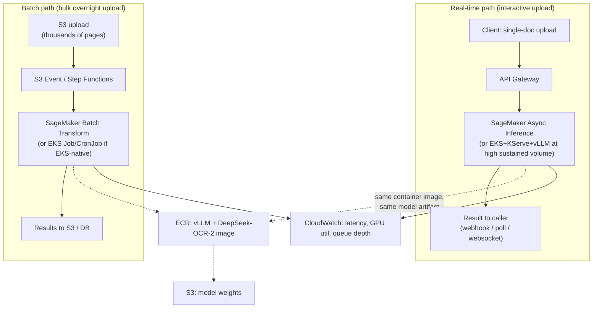

# Deep-Dive: Hosting DeepSeek-OCR-2 (Vision-Language OCR) on AWS

A practical companion to the [Model Serving & Deployment tutorial](04_model_serving_deployment.md) — that
tutorial covers rollout-safety and general serving-framework concepts (canary/shadow,
KServe/Seldon); this walks through one fully-specified, real deployment decision: **which
AWS compute target should actually serve a real, GPU-bound vision-language model in
production, and why.** It's also the mirror image of
[the receipt-processing deep-dive](02_ingestion_pipeline_serverless_vs_eks_receipt_processing.md)
two tutorials back — that doc explicitly notes its Textract-based workload is **I/O-bound,
not CPU-bound**, and calls out "a custom vision model" as the workload shape that changes
the entire analysis. This is that workload. For the PagedAttention/continuous-batching
mechanics underpinning the vLLM-based options below, see
[6. RAG + LLM-Serving at Scale's serving deep-dive](06_rag_llm_serving_at_scale.md#deep-dive-llm-serving-internals-vllm-on-triton).
Runnable pieces this design draws on live elsewhere in this repo:
[vLLM](../../../mlops_aiops/docs/tools/vllm/README.md) and
[`k8s/k8s_explorer/kserve-inference`](../../../k8s/k8s_explorer/practice/kserve-inference/README.md).

## Clarify

- **What's the actual traffic shape?** Interactive single-document upload with a
  few-seconds latency expectation, or bulk overnight processing of millions of scanned
  pages, or both from different customers of the same product? This single answer
  determines almost the entire architecture — the same framing device the rate-limiter
  tutorial uses for "is the limit global."
- **Latency SLA** — is anything actually latency-critical, or is "OCR result eventually
  shows up" acceptable? OCR is unusually latency-tolerant compared to most ML serving
  problems (nobody is blocked mid-conversation waiting on it the way a chat model's caller
  is), and that tolerance changes which AWS services are even worth considering.
- **Expected volume** — peak QPS for the interactive path, pages/day for the bulk path.
- **Cost sensitivity at scale** — is this cost-optimize-aggressively-at-volume, or a
  low-traffic internal tool where engineering time is the scarcer resource than compute
  dollars?
- **Data sensitivity** — OCR'd documents may contain PII; does that impose a residency or
  processing constraint?
- **Existing infra maturity** — greenfield, or does the org already run EKS, or already
  standardize on SageMaker? This materially changes the verdict, the same way team ops
  maturity decided the Pinecone-vs-Milvus call in the RAG tutorial.

**Assume for this worked example** (the representative, genuinely-hard version, not the
simplified one): a B2B document-processing SaaS. Some customers batch-upload thousands of
pages overnight; others need near-real-time single-document OCR during business hours.
Steady-state volume target: 500K-2M pages/day. Cost-sensitive at that scale. The org
already runs production workloads on **both** EKS and SageMaker — a realistic
mixed-maturity org where every AWS-native option is genuinely on the table, not one where
the answer is forced by "we only know X."

## Model facts (grounding the design, not generic LLM assumptions)

Verified directly against the model card, config, and paper — not inferred from what a
typical LLM hosting doc says:

- **~3.39B total parameters, Mixture-of-Experts** (`DeepseekV2ForCausalLM`: 64 routed + 2
  shared experts, **6 activated per token**). This matters for hardware sizing in a way a
  dense model of the same size wouldn't: the model is **memory-dense but compute-sparse**
  — VRAM for weights is sized to the full 3.39B params (~6.8GB in BF16), but the actual
  FLOPs per token only reflect the ~6 active experts, not all 66. Expect meaningfully
  better throughput-per-GPU than a *dense* 3.4B model at the same batch size — a
  directional expectation to load-test, not a published number (none exists for this
  model).
- **Vision encoder (DeepEncoder V2: SAM ViT-B + Qwen2-0.5B + projector)** runs once per
  image as a fixed cost, independent of how much text the language model then generates.
  This is a structurally different cost profile from a pure-text LLM, where cost tracks
  output length — for short-output OCR requests (a one-line receipt vs. a dense contract
  page), the encoder pass is a *proportionally larger* fraction of total latency than
  generation-heavy text LLM benchmarks would suggest. Don't borrow throughput numbers from
  a text-only vLLM benchmark for this model; load-test it directly.
- **BF16 only — no official quantized checkpoint.** AWQ/GPTQ/FP8 quantization is possible
  but is work you'd own, not a supported out-of-the-box path from the model authors.
- **`max_position_embeddings: 8192`** bounds how much OCR'd text + grounding markup one
  request can produce. Long documents need to be paginated into separate requests at the
  application layer *before* they reach the model — a real architectural component, not a
  footnote.
- **Apache 2.0 license** — no licensing blocker to commercial hosting, unlike some
  research-only-licensed VLMs.
- **vLLM 0.8.5 support is officially confirmed** (the model authors ship working vLLM
  inference scripts). This is the single most consequential fact for the whole hosting
  decision: every deployment option that can run a vLLM container gets PagedAttention +
  continuous batching for free; options that can't run arbitrary containers lose real
  throughput, and that gap is what eliminates several AWS options below.
- **No published benchmark/throughput numbers exist anywhere** — the model card, GitHub
  repo, and paper abstract are silent on latency/throughput. Every cost/throughput figure
  in this tutorial is stated as an illustrative estimate reasoned from model size and
  instance specs, explicitly flagged as such — treat it as a starting point for your own
  load test, not a number to build a launch SLA around unverified.

## High-Level Design

Two paths, because Clarify established two genuinely different problems:

Both paths share one container image and one model artifact — the fork is only in *how
requests arrive and how tolerant they are of latency*, not in two different serving
stacks to maintain.

## Deep-Dive: The full deployment-option matrix

The point of this section is elimination with reasoning, not a preference-ranked list —
knowing *why* an option is disqualified is worth more than knowing it's available.

**Disqualified outright** (verified against current AWS docs, not assumed):

| Option | Why it's out |
|---|---|
| **SageMaker Serverless Inference** | CPU-only — explicitly excludes GPU, max 6GB memory. A ~6.8GB BF16 model doesn't fit even before considering it needs a GPU at all. |
| **AWS Lambda (container image)** | No GPU support at any memory tier (max 10,240 MB, CPU-only scaling). Disqualified twice over: no GPU, and cold-start-per-invocation is a bad fit for a model this size regardless. |
| **AWS Fargate** (ECS or EKS) | No GPU support — AWS's own docs state GPUs aren't available for Fargate tasks. GPU workloads on ECS/EKS require the **EC2 launch type** / EC2-backed node groups, not Fargate. |
| **Amazon Bedrock (Custom Model Import)** | Allowlisted architectures only (Llama family, Mistral/Mixtral, Qwen2/2.5/3, GPT-OSS, etc. as of writing) — DeepSeek-OCR-2's custom `DeepseekV2ForCausalLM` + custom DeepEncoder V2 vision encoder (loaded via `trust_remote_code=True`) is not on that list. |
| **Trainium1 (trn1)** | Training-optimized instance family; Inferentia2 (inf2) is the inference-optimized sibling — trn1 is the wrong tool for a hosting problem regardless of architecture support. |

**Viable, with real trade-offs:**

| Option | GPU instances | Ops burden | Best fit |
|---|---|---|---|
| **SageMaker Real-Time Endpoint** (BYOC vLLM container) | g5, g6, g6e, p4d, p5/p5e | Low — managed autoscaling, health checks, deployment | Interactive path if the org wants managed simplicity over the last mile of cost efficiency |
| **SageMaker Async Inference** | Same instance families as real-time | Low — same managed layer, plus built-in queueing and scale-to-zero | **Strong fit for this use case** — OCR's latency tolerance matches async's queue-based model almost exactly, and idle-time scale-to-zero matters for bursty customer upload patterns |
| **SageMaker Batch Transform** | Same instance families | Low — no persistent endpoint, reads/writes S3 directly | The bulk overnight path — no idle endpoint cost, built for exactly this shape |
| **EKS + KServe + vLLM** (HuggingFace `ServingRuntime`, vLLM backend) | Any EC2 GPU instance the node group runs | High — you operate the cluster | Best $/throughput at genuinely high sustained volume, if the org already runs EKS well; see [`k8s/k8s_explorer/kserve-inference`](../../../k8s/k8s_explorer/practice/kserve-inference/README.md) for the exact chart pattern and [vLLM](../../../mlops_aiops/docs/tools/vllm/README.md) for the backend |
| **Plain EC2 + vLLM + ALB + Auto Scaling Group** | Any EC2 GPU instance | Highest — you own health checks, autoscaling, patching | Cheapest at sustained high utilization (stacks with Savings Plans/Spot), but only worth the ops cost if SageMaker's management premium (below) is a real line item at your volume |

**Worth prototyping, not the default bet:**

- **Inferentia2 (inf2, via AWS Neuron SDK)** — potentially the cheapest $/inference at
  volume, and Neuron's current inference library (NxD Inference) does explicitly support
  MoE architectures (Mixtral, DBRX, Qwen3-MoE are named). But that's a **fixed, named list
  of supported architectures** — there's no documented statement that Neuron supports
  arbitrary custom HF architectures loaded via `trust_remote_code=True`, and DeepSeek-OCR-2's
  specific combination (custom MoE language model + a from-scratch two-stage vision
  encoder) isn't on that list. This is genuinely undocumented territory, not a known "no."
  The right call: spike a Neuron compilation attempt in parallel with the SageMaker/EKS
  build, with a clear go/no-go checkpoint tied to whether it compiles and what the real
  cost delta turns out to be — not a bet the initial launch depends on, and not dismissed
  outright either.

## Deep-Dive: Cost and throughput, worked through explicitly

- **This model is small relative to the GPUs it'll run on.** ~6.8GB of weights fits
  comfortably on any single GPU in the g5 (A10G, 24GB) or g6 (L4, 24GB) family, leaving the
  large majority of GPU memory free for vLLM's KV cache. That's the opposite problem from
  serving a 70B+ dense LLM, where weights alone consume most of the GPU — here, achievable
  concurrency via continuous batching should be high even on the smallest instance in these
  families. This needs a real load test to confirm (no published number exists), but it's
  the correct starting expectation, not a guess.
- **Managed convenience has a real, quantifiable premium.** Verified against AWS's current
  published pricing (us-east-1, on-demand): `g5.xlarge` is $1.006/hr on EC2 vs. $1.408/hr
  as a SageMaker real-time endpoint (`ml.g5.xlarge`) — about **40% more** for the same
  underlying hardware. `g6.xlarge` shows the same ~40% gap ($0.805/hr EC2 vs. $1.127/hr
  SageMaker). AWS doesn't publish this as a named "management premium," but the arithmetic
  is consistent across both families — treat ~40% as the going rate for SageMaker's
  managed layer over raw EC2 at these instance sizes, the same build-vs-buy calculus as
  Pinecone vs. Milvus in the RAG tutorial: pay it if ops simplicity is worth more than the
  40%, skip it once sustained volume makes that 40% a real number on a monthly bill.
- **Cost-per-1000-pages is a formula, not a number**, until load-tested:
  `(instance $/hr ÷ (achieved images/sec × 3600)) × 1000`. The only unverified input is
  achieved images/sec at acceptable latency — everything else is known. State the formula
  explicitly in any real proposal rather than presenting a fabricated confident figure;
  this is exactly the "numeric claims are illustrative and approximate" convention used
  throughout this repo's prerequisite-concepts docs.
- **Spot pricing** is worth using for the batch path specifically (Batch Transform jobs and
  EKS batch Jobs both tolerate interruption far better than a live-request-serving
  endpoint does) — historically 60-70% off on-demand for these GPU families, though exact
  savings fluctuate with spot market conditions and shouldn't be hardcoded into a cost
  model as a fixed number.

## Trade-offs

| Decision | Option A | Option B | When to pick which |
|---|---|---|---|
| Interactive path | SageMaker Async Inference (managed, scale-to-zero) | EKS + KServe + vLLM (self-managed, best $/throughput at scale) | Async Inference until sustained volume makes the ~40% SageMaker premium a real line item; EKS once it clearly does and the org already runs EKS well |
| Bulk path | SageMaker Batch Transform | EKS Job/CronJob reading from S3 | Batch Transform if SageMaker is already the org's standard; EKS Job if the interactive path is already on EKS and reusing the same cluster/ops muscle is cheaper than standing up a second platform |
| Instance family | g5 (A10G) | g6 (L4) | g6 is generally the better $/throughput starting point for a model this size at current pricing — validate with a real load test before committing at volume |
| Cost strategy | On-demand throughout | Spot for the batch path | Spot for anything interruption-tolerant (the batch path, definitionally); on-demand (or Savings Plans once volume is proven) for the always-on interactive path |
| Alternative silicon | Skip Inferentia2 entirely | Spike Inferentia2 in parallel | Spike it — the cost upside is real if the custom architecture compiles, and the downside of a bounded, parallel spike is small; betting the launch on it is the wrong risk profile given the undocumented architecture-support gap |

## Verdict

For the assumed use case (mixed real-time + bulk, cost-sensitive at scale, mixed
EKS/SageMaker maturity): **SageMaker Async Inference for the interactive path, paired with
SageMaker Batch Transform for the bulk path.** This avoids committing to a custom
EKS+KServe+vLLM build before volume actually justifies the extra ops investment — a real
build-vs-buy call, made deliberately, not a default. Run the Inferentia2 spike in parallel
regardless of which path wins, since it's cheap to attempt and the payoff is real if it
works.

**When this verdict changes:**

- **Low-volume internal tool, no bulk path at all** → just a SageMaker real-time endpoint.
  Simplest correct answer; don't build the two-path architecture for a problem that doesn't
  have two shapes of traffic.
- **Very high sustained volume (multi-million pages/day, 24/7), cost is the dominant lever,
  and the org already runs EKS well** → EKS + KServe + vLLM becomes the better long-term
  $/throughput bet despite its higher ops cost. This is the same "start simple, graduate to
  self-hosted once genuine scale justifies it" sequencing already established for the
  vector-DB choice in the RAG tutorial — not a new principle, the same one applied here.
- **Data residency/PII constraints rule out one region or push toward VPC-only
  processing** → this doesn't change *which* compute option wins, but does constrain which
  regions/VPC configurations are viable regardless of the compute choice — worth
  re-verifying explicitly, not assuming the default region is fine.

## Staff & Principal Altitude

A **senior** answer picks one deployment option (usually "put it on a SageMaker endpoint")
and stops there.

A **staff** answer additionally: (1) recognizes the real-time-vs-batch split as two
genuinely different problems needing two different architectures, not one endpoint
serving both; (2) explicitly disqualifies the non-GPU-capable options (Serverless
Inference, Lambda, Fargate) with the actual reason, rather than silently omitting them or
listing them as viable; (3) reasons about the MoE + vision-encoder architecture's memory
vs. compute profile explicitly, rather than treating "3.4B params" as if it behaves like a
dense 3.4B model.

A **principal** answer additionally: (1) frames the EKS-vs-SageMaker choice as an
organizational build-vs-buy/TCO decision tied to existing team ops maturity and multi-year
infra strategy, not purely a technical throughput comparison — the same lens Bedrock's
allowlist restriction should be read through too (it's not "AWS is behind," it's "AWS is
managing their own support-surface risk," worth naming as the reason rather than a
complaint); (2) proposes the Inferentia2 spike as a bounded, cheap, parallel investigation
with an explicit go/no-go checkpoint, rather than either betting the launch on it or
dismissing unverified-but-plausible upside outright; (3) names the SageMaker-first,
EKS-later sequencing as a deliberate, timed complexity decision — technical debt taken on
purpose, with a stated trigger for when to pay it down — not an oversight to apologize for
later.

## Failure Modes to Raise Proactively

- **Vision-encoder fixed cost dominating latency for small documents** (a one-line receipt
  pays the same encoder pass as a dense contract page) — load-test across the actual
  document-size distribution, not just large documents, since small-document latency is
  the one a naive text-LLM-shaped load test would miss entirely.
- **Documents exceeding `max_position_embeddings` (8192)** silently truncating or failing —
  requires application-level pagination *before* the model sees the request, not a
  model-side fix.
- **Instance-sizing assumptions baked in for this exact model's ~6.8GB footprint** breaking
  silently if a future larger DeepSeek-OCR variant is swapped in without re-checking memory
  headroom.
- **Cold-start latency on scale-to-zero paths** (EKS Knative scale-to-zero, or a SageMaker
  Async instance spinning up from idle) causing an SLA miss on the first request after an
  idle period — mitigate with a minimum warm-instance floor specifically for the
  interactive path, accepting the idle cost there while letting the batch path scale fully
  to zero.
- **`trust_remote_code=True` is a real supply-chain/security surface** — it executes
  arbitrary code from the model repository. This needs an explicit security review before
  production deployment, not an assumption that a Hugging Face model card is automatically
  safe to load as-is.

## Staff Follow-Ups

- "A new enterprise customer 10x's your volume overnight — walk through what breaks first
  and what you'd change."
- "Legal flags that OCR'd documents may contain PII — how does that change the
  architecture, not just the compliance checklist?"
- "DeepSeek ships a DeepSeek-OCR-3 with 2x the parameters next quarter — what in this
  design has to change, and what's already insulated from that?"

## Practice Questions

- Design the hosting decision for a different modality (e.g. speech-to-text) using the same
  real-time/batch elimination framework.
- Design the production accuracy-drift monitoring loop for this OCR pipeline — see
  [Evidently](../../../mlops_aiops/docs/tools/evidently/README.md) and
  [`drift-detection-concepts.md`](../../../mlops_aiops/docs/tools/evidently/drift-detection-concepts.md)
  for the label-free-vs-ground-truth-dependent drift split, which applies directly to an
  OCR accuracy pipeline once human-corrected transcriptions start arriving as delayed
  ground truth.
- Design a fine-tuning pipeline for this model on one customer's specific document
  templates, including where [MLflow](../../../mlops_aiops/docs/tools/mlflow/README.md)
  and [Feast](../../../mlops_aiops/docs/tools/feast/README.md) would fit if the fine-tuning
  pipeline needs its own feature/label management.

## Articulate It: Interview Framing & Vocabulary

### Three Ways to Explain This

- **Elimination-first (the default for this topic):** "Before comparing what's good, I'd
  eliminate what's structurally impossible — Serverless Inference, Lambda, and Fargate are
  all CPU-only or GPU-incapable by AWS's own docs, so they're out regardless of cost or
  throughput. That elimination step is worth doing explicitly, not skipping past to the
  interesting comparison."
- **Two-problems framing (good for the real-time-vs-batch split):** "This isn't one hosting
  decision, it's two — an interactive path that needs low ops overhead and tolerates
  seconds of latency, and a bulk path that needs to be cheap at volume and tolerates
  minutes. I'd design two architectures sharing one container image, not force one endpoint
  to serve both shapes of traffic well."
- **Sequenced build-vs-buy framing (good for the EKS-vs-SageMaker verdict):** "I wouldn't
  say EKS is better than SageMaker — I'd say start on SageMaker's managed path, and
  graduate to EKS only once sustained volume makes the roughly 40% managed-layer premium a
  real number on the monthly bill. That's a timed decision, not a permanent one."

### Vocabulary Builder

- **memory-dense, compute-sparse** (adj. phrase) — describes an MoE model's hardware
  profile: VRAM sized to total parameters, but FLOPs per token reflect only the activated
  experts — a smaller compute footprint than the parameter count alone would suggest.
- **elimination step** (n. phrase) — explicitly ruling out structurally-impossible options
  with a stated reason, before comparing the options that remain; the thing a senior answer
  often skips past.
- **managed convenience premium** (n. phrase) — the price gap between a managed service and
  the equivalent raw infrastructure, worth naming as a quantified number (here, ~40%)
  rather than an unstated "it costs more."
- **"…is genuinely undocumented territory, not a known 'no'"** — a precise way to describe
  an unverified-but-plausible capability gap (Neuron SDK's custom-architecture support
  here), distinguishing it from a confirmed disqualification.
- **bounded spike** (n. phrase) — a small, time-boxed investigation with an explicit
  go/no-go checkpoint, used to de-risk an uncertain option without betting the main plan on
  it.

---

**See also:** [4. Model Serving & Deployment](04_model_serving_deployment.md) ·
[6. RAG + LLM-Serving at Scale](06_rag_llm_serving_at_scale.md) ·
[Deep-Dive: Serverless vs. EKS for Receipt Processing](02_ingestion_pipeline_serverless_vs_eks_receipt_processing.md)
(the I/O-bound mirror image of this GPU-bound workload) ·
[10. Cost, Security & Multi-Region](10_cost_security_multiregion.md) ·
[vLLM](../../../mlops_aiops/docs/tools/vllm/README.md) ·
[`k8s/k8s_explorer/kserve-inference`](../../../k8s/k8s_explorer/practice/kserve-inference/README.md)
