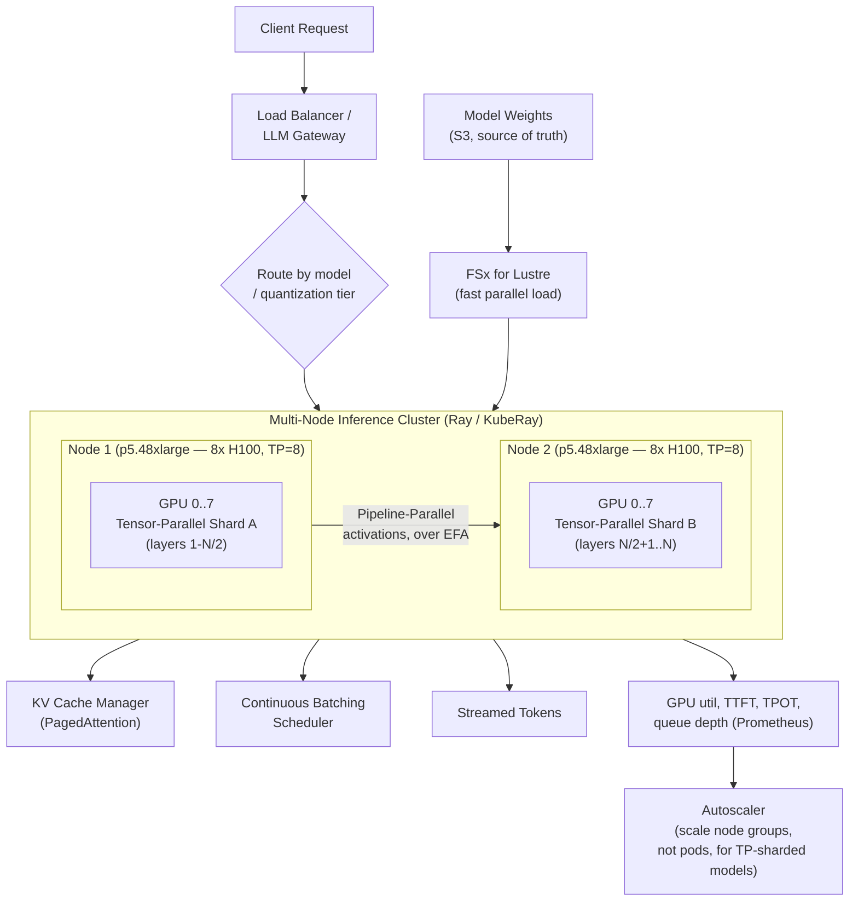

# Running a ~1TB LLM in Production: Multi-GPU, Multi-Node Inference

**Primarily tests**: memory-bound systems reasoning, parallelism strategy
selection, and whether you can tell the difference between a training
problem and a serving problem when someone hands you a huge model and
says "make it fast." Builds directly on [Distributed Training &
Ray/Ray Serve](../07_distributed_training_serving.md) (parallelism
strategies, there framed for training) and
[LLMOps](../11_llmops.md) (the operational discipline around it) —
this tutorial is the piece both of those assume: what changes when the
model itself is too large to fit on one machine, at *inference* time,
not training time.

## Clarify

- **Dense or MoE?** A dense ~500B-parameter model at bf16 (2 bytes/param)
  and a Mixture-of-Experts model with ~1.3TB of *total* weights but far
  fewer *active* parameters per token (DeepSeek-V3: 671B total, ~37B
  active — a real, public reference point) are both "~1TB models," and
  they demand genuinely different serving architectures. Assume dense
  first (the harder case for parallelism, easier to reason about), name
  the MoE variant explicitly if asked to extend.
- **Batch, interactive, or both?** A batch job (score a fixed dataset
  overnight) tolerates throughput-over-latency trade-offs a live chat
  endpoint (p99 time-to-first-token matters) cannot. Assume interactive
  serving — it's the harder, more common interview framing.
- **Fixed context length, or does it vary widely?** This determines how
  much of the memory budget is unpredictable KV cache versus fixed
  weights — see the memory math below.

## Core Concepts

### Why this is a memory problem before it's a compute problem

The instinct is to reach for "more GPUs = more compute = faster" —
that's not what forces multi-GPU serving here. **The actual constraint
is that the model's weights don't fit in one GPU's memory, full stop,
regardless of how fast that GPU is.** An H100 has 80GB of HBM. A
~500B-parameter dense model at bf16 (the precision virtually all
production LLM serving uses — [Part 6's cost-of-precision
reasoning](../../00_prerequisite_concepts/06_mechanical_sympathy_and_physics_of_latency.md)
is the same trade one level up) needs:

```
500,000,000,000 params × 2 bytes/param = 1,000,000,000,000 bytes ≈ 1 TB
```

**1 TB of weights ÷ 80 GB per H100 ≈ 12.8 → at least 13 GPUs just to
hold the weights, before a single token of KV cache or activation
memory is accounted for.** AWS's single largest GPU instance,
`p5.48xlarge`, has 8× H100 — 640GB total. **One instance cannot hold
this model.** That's the entire reason "multi-GPU" in this tutorial's
title actually means "multi-*node*" — two or more physical machines,
networked together, each contributing GPUs to one logical serving unit.
This is the single fact every other design decision below follows from.

### The KV cache: the second, growing memory cost nobody budgets for upfront

Weights are fixed-size and known in advance. The **KV (key/value) cache**
— the per-token, per-layer attention state a transformer must retain for
every token in every active sequence, so it doesn't recompute attention
over the whole context on every new token — is not fixed. It grows with
**context length × batch size (concurrent sequences)**, and at long
context lengths or high concurrency, it routinely rivals or exceeds the
weights themselves in memory footprint:

```
KV cache per token ≈ 2 (K and V) × num_layers × num_kv_heads × head_dim × precision_bytes
total KV cache ≈ that × sum of (sequence length) across every concurrent request
```

**Why this matters for capacity planning specifically**: a deployment
sized only for weights, with no KV cache headroom, will serve the first
few requests fine and then hit out-of-memory errors the moment
concurrency or context length climbs — a failure mode that looks like
"random OOM crashes in production" if you didn't know to budget for it
explicitly. [`vLLM`'s PagedAttention](tools-and-frameworks.md#vllm) exists
specifically to make this budget efficient rather than wasteful (below).

### The three parallelism strategies, now for inference specifically

[Distributed training's parallelism
section](../07_distributed_training_serving.md#the-three-parallelism-strategies)
already named data/tensor/pipeline parallelism for *training*. At
inference, data parallelism (replicate the whole model, split requests
across replicas) is only possible once the model already fits on
whatever unit you're replicating — for a model that doesn't fit on one
node at all, the two that actually matter first are:

- **Tensor parallelism (TP)** — split each individual weight matrix
  across GPUs, so every layer's computation is itself distributed; every
  GPU participates in every layer, communicating (via NCCL, over
  high-bandwidth interconnect) after nearly every operation. This is
  the *only* strategy that reduces per-GPU memory pressure within a
  single layer, which is why it's the default first choice for
  intra-node parallelism (GPUs on the same machine, connected by NVLink
  — far faster than any network link). TP typically stays *within* a
  node for exactly this reason: its communication volume is high enough
  that crossing to a slower network link between nodes costs real
  latency.
- **Pipeline parallelism (PP)** — split the model's *layers* across
  GPUs (or nodes) instead of splitting within a layer — GPU 0 holds
  layers 1-10, GPU 1 holds layers 11-20, and so on, with activations
  passed forward down the pipeline. Communication volume per step is
  much lower than TP's (one activation tensor between pipeline stages,
  not a reduction after every operation), which is exactly why PP is
  the natural choice for crossing *between* nodes, where network
  bandwidth is the scarcer resource.

**The production default for a model this size is both at once**:
tensor-parallel *within* each node (across NVLink-connected GPUs),
pipeline-parallel *across* nodes (over the network) — matching the
physical bandwidth hierarchy to the communication pattern each strategy
actually needs. This is precisely what
[TensorRT-LLM and vLLM's multi-node modes](tools-and-frameworks.md) both
implement, not a from-scratch design decision a team makes per model.

### Quantization: buying back memory headroom without buying more GPUs

Serving at a lower numeric precision than the model was trained in — 
fp8 (natively accelerated on H100/H200), int8, or int4 (via AWQ/GPTQ,
covered in [tools-and-frameworks.md](tools-and-frameworks.md#quantization-tooling))
— directly cuts the weight-memory math above: fp8 roughly halves it
again versus bf16 (1TB → ~500GB), potentially collapsing the GPU count
needed by half. The trade-off is real, not free: some accuracy loss
(usually small for fp8 on modern hardware, more noticeable at int4),
and it's a decision that belongs in the [LLMOps eval-gate
pipeline](../11_llmops.md#deep-dive-wiring-the-eval-gate-into-the-deployment-pipeline)
— a quantized model is a genuinely different artifact that needs its
own regression evaluation, not an assumed-safe optimization.

### Continuous batching: the throughput lever that matters most day to day

Naive batching waits for a full batch of requests to arrive before
running inference together — fine for offline scoring, terrible for
interactive serving, where request arrival is unpredictable and a
slow-arriving batch member stalls everyone else. **Continuous (a.k.a.
in-flight) batching** — the core mechanism in vLLM, TensorRT-LLM, and
TGI alike — instead adds and removes individual requests from the
active batch at every generation step, as they arrive and finish,
keeping the GPU's compute saturated without forcing synchronized
batch boundaries. This single technique is usually the largest
throughput lever available before touching hardware topology at all.

## Reference Architecture



The one detail worth internalizing from this diagram before the
deep-dive: **autoscaling a tensor-parallel-sharded model can't scale by
adding a single GPU or a single pod** — the unit of scaling is a whole
TP group (here, a whole 8-GPU node), because a partial shard is useless
on its own. This is a genuine, structural difference from scaling a
model that fits on one GPU, where adding one more replica is trivial.

## Deep-Dive: Sizing the Cluster — a Worked Example

Take the 500B-parameter dense model from the Core Concepts math above,
bf16, needing ~1TB for weights alone.

1. **Weights**: 1TB ÷ 80GB (H100) ≈ 13 GPUs minimum → round up to 16
   (two full `p5.48xlarge` nodes) both for even TP-group sizing (powers
   of 2 divide cleanly across attention heads) and to leave *some*
   per-GPU headroom before even considering KV cache.
2. **KV cache budget**: decide the target concurrency and max context
   length *before* deploying, not after the first OOM in production —
   e.g., "support 64 concurrent sequences at up to 8K tokens context"
   is a real capacity requirement that consumes a specific, calculable
   number of GB per node, using the formula above with this model's
   actual layer count/head dimensions.
3. **If step 2 doesn't fit in the 2-node budget**: the options, in
   order of how much they change the deployment versus how much they
   cost: (a) add a third node purely for KV cache headroom (increases
   PP degree, adds cross-node communication), (b) quantize to fp8 to
   shrink the weight budget and free GPU memory for KV cache instead
   (no extra nodes, but a new artifact needing its own eval gate), (c)
   cap max context length or max concurrency lower (a product/SLA
   decision, not just an infra one — flag this explicitly rather than
   silently degrading capability).
4. **Networking**: cross-node pipeline-parallel activations need to
   move at every forward pass — this is the reason `p5.48xlarge`'s EFA
   (Elastic Fabric Adapter, ~3200 Gbps aggregate) exists, and why
   attempting this topology on non-EFA instances turns cross-node
   communication into the dominant latency cost, silently, without any
   single obviously-wrong metric pointing at it until someone profiles
   the actual step-time breakdown.

## Trade-offs

| Choice | Pro | Con |
|---|---|---|
| Tensor parallelism (intra-node) | Reduces per-GPU memory pressure within every layer; low added latency on NVLink | Communication-heavy — only viable at NVLink-class bandwidth, not across nodes |
| Pipeline parallelism (inter-node) | Low communication volume per step; the only practical way to span nodes | Introduces pipeline "bubbles" (idle GPU time while waiting on earlier stages) hurting utilization if not carefully scheduled |
| Quantization (fp8/int8/int4) | Real memory and cost reduction, sometimes without a fleet-size change at all | A new model artifact requiring its own eval/regression gate — not a free optimization |
| Continuous batching | Large throughput gain for interactive workloads, standard in modern serving frameworks | Adds scheduler complexity; naive implementations can starve long-context requests behind short ones without fairness logic |
| Scaling by whole TP-group (node) | Matches the actual physical constraint of a sharded model | Coarser-grained, more expensive autoscaling steps than single-pod scaling |

## Failure Modes to Raise Proactively

- **KV cache OOM under real concurrency** — sized for weights alone,
  never load-tested at target concurrency/context length before launch.
- **Cross-node communication becomes the bottleneck**, invisible in
  per-GPU utilization metrics (each GPU looks "busy" while actually
  waiting on a network round-trip) — only visible by profiling
  step-time breakdown, not aggregate utilization.
- **Autoscaling a partial TP group** — a naive Kubernetes HPA scaling by
  pod count instead of by whole node-groups can add GPUs that are
  useless in isolation, silently wasting spend without adding capacity.
- **A quantized model shipped without its own eval gate** — passes
  smoke tests, regresses silently on a task the golden eval set doesn't
  cover.
- **Cold-start weight loading time dominating autoscale responsiveness**
  — a 1TB weight load from S3 directly (not FSx, not pre-warmed) can
  take long enough that "autoscale on demand spike" arrives too late to
  matter for that spike.

## Make It Yours

- Have you ever hit a memory ceiling in a system you've built — was it
  obvious in advance, or discovered via an incident?
- Where have you made a quality-vs-cost trade-off (quantization here;
  could be caching staleness, sampling, approximation elsewhere) and
  how did you validate it was actually safe rather than assumed safe?
- What's a time you had to size infrastructure for a *worst case* you
  hadn't observed yet, rather than for measured average load?

## Practice Questions

- Design the serving architecture for a 1TB dense model with a 128K
  max context window and unpredictable concurrency spikes.
- A team reports "GPU utilization looks fine but p99 latency is bad" on
  a multi-node TP+PP deployment — walk through how you'd diagnose it.
- Given a fixed GPU budget, argue for quantization vs. adding nodes to
  fit a model that's 20% over your current cluster's weight capacity.

## Articulate It: Interview Framing & Vocabulary

### Three Ways to Explain This

- **Memory-first framing (the default opening):** "Before talking about
  GPUs at all, I'd establish this is fundamentally a memory-capacity
  problem — the weights alone don't fit on one machine, so the
  architecture question is really 'how do I shard a model across
  machines without paying more communication cost than the compute I'm
  trying to speed up.'"
- **Bandwidth-hierarchy framing (good for a deep-dive on parallelism
  choice):** "I'd match each parallelism strategy to the physical
  bandwidth available at that boundary — tensor parallelism within a
  node over NVLink, pipeline parallelism across nodes over EFA —
  because using the communication-heavy strategy across the slower link
  is exactly backwards, and it's a common mistake that shows up as
  mysteriously poor scaling efficiency rather than an obvious error."
- **Trade-off-explicit framing (good for staff-level signal):** "I'd
  treat quantization as a genuine trade-off decision requiring its own
  evaluation gate, not a free lunch — the same discipline I'd apply to
  any accuracy-for-cost trade in the system, stated as a decision I
  made deliberately rather than a default I inherited."

### Vocabulary Builder

**Technical shorthand:**

- **tensor parallelism (TP) / pipeline parallelism (PP)** (n. phrases) —
  splitting a model within a layer versus across layers; TP for
  intra-node, PP for inter-node, matched to bandwidth.
- **KV cache** (n. phrase) — the growing, per-request memory cost of
  retained attention state, distinct from fixed weight memory.
- **continuous / in-flight batching** (n. phrases) — adding/removing
  individual requests from an active inference batch per step, instead
  of waiting for a synchronized batch boundary.
- **TTFT / TPOT** (initialisms) — time-to-first-token / time-per-output-
  token, the two latency metrics that actually matter for interactive
  LLM serving, as opposed to a single generic "latency" number.
- **EFA (Elastic Fabric Adapter)** (n. phrase) — AWS's low-latency,
  high-bandwidth networking for cross-node GPU communication; the
  physical requirement pipeline-parallel inference across nodes
  depends on.

**Expressive phrases:**

- **"…a memory problem before it's a compute problem"** — a fluent way
  to redirect a "how would you speed this up" question toward the
  actual bottleneck instead of jumping straight to more GPUs.
- **"…match the strategy to the bandwidth hierarchy"** — the one-line
  justification for TP-within-node, PP-across-node, reusable whenever
  a parallelism choice needs defending.
- **"…a new artifact, not a free optimization"** — the fluent pushback
  against treating quantization (or any accuracy-for-cost trade) as
  something that doesn't need its own validation.
