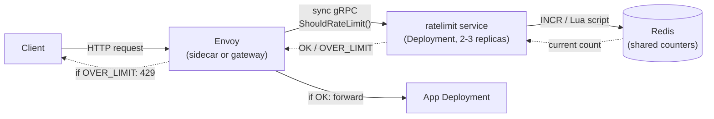

# Rate Limiting on Kubernetes: Every Implementation Pattern

Companion deep-dive for **[tutorial.md](tutorial.md)**. That doc covers *which
architecture* solves the multi-region global-limit problem; **this doc answers a
different question: given you already know which algorithm you want (see
[algorithms_all_iterations.md](algorithms_all_iterations.md)), where does it actually run
inside a Kubernetes cluster, and how do real tools implement it?** Every pattern below
maps directly onto one of that doc's algorithms — naming which one, explicitly, is most of
the signal an interviewer is listening for here.

## The Core Design Axis: Where Does State Live?

Reframe everything below around the exact axis tutorial.md names for multi-region: **local
state (fast, cheap, approximate under replication) vs. shared external state (accurate
across replicas, adds a network hop).** Kubernetes horizontal scaling — `replicas: N`
behind a Service — is a miniature, single-cluster version of the identical problem
tutorial.md solves at region granularity. Every implementation pattern below is that same
trade-off, instantiated at pod-replica granularity instead of region granularity.

## Iteration 1: Per-Pod In-Memory Limiter (the naive answer)

**Mechanism:** the app process holds an in-memory limiter — literally this repo's own
[LLD rate limiter](../../lld/05_rate_limiter/problem.md) (`solution.py` /
`rate_limiter_rusty`), a dict keyed by `client_id`, no external dependency.

**What breaks:** with `replicas: 3` behind a Service, load balancing (round-robin or
random, depending on `kube-proxy` mode) spreads one client's requests across all 3 pods.
Each pod independently enforces the full configured limit, so the *effective* limit
becomes `3 × configured_limit` with zero coordination between replicas. This is exactly
the limitation the LLD doc [names explicitly](../../lld/05_rate_limiter/problem.md#why-class-level-state-doesnt-survive-a-second-process)
— a Kubernetes Service in front of it is the concrete "second process" that limitation
warns about, made real. It's also the specific, concrete case of the general
**"check before the load-balancing decision, not after"** principle
[tutorial.md](tutorial.md#deep-dive-where-the-rate-limiter-sits-relative-to-the-load-balancer)
lays out — this iteration checks *after*, at each independently-balanced backend, which is
precisely why it fragments.

**Deployment:** plain `Deployment` + `Service`, zero extra infrastructure.

**When it's actually fine:** rate limiting as a rough per-pod safety valve (protect *this
pod* from being individually overwhelmed by a retry storm) is a legitimately different
goal from enforcing a business-level per-user quota. Iteration 1 is the right tool for the
first goal and the wrong tool for the second — naming which goal you're solving for,
before reaching for a fix, is the same "question the requirement" move tutorial.md's
Staff Altitude section teaches for the region case.

## Iteration 2: NGINX Ingress Controller — `limit_req` Annotations

**Mechanism:** `nginx.ingress.kubernetes.io/limit-rps` (and `limit-connections`)
annotations on an `Ingress` resource compile down to nginx's native `limit_req_zone` /
`limit_conn_zone` directives, running inside the `ingress-nginx` controller pod(s) — which
is itself a Kubernetes `Deployment`, usually with multiple replicas for HA.

```yaml
apiVersion: networking.k8s.io/v1
kind: Ingress
metadata:
  name: rate-limited-api
  annotations:
    nginx.ingress.kubernetes.io/limit-rps: "10"          # steady-state rate
    nginx.ingress.kubernetes.io/limit-burst-multiplier: "5"   # burst = rate * multiplier
spec:
  rules:
    - host: api.example.com
      http:
        paths:
          - path: /
            pathType: Prefix
            backend:
              service:
                name: rust-api
                port:
                  number: 8080
```

**This is the leaky-bucket/GCRA-flavored algorithm from
[algorithms_all_iterations.md](algorithms_all_iterations.md#iteration-6-gcra-token-buckets-o1-storage-twin),
running in production, by default.** nginx's `limit_req` module queues requests up to
`burst` and releases them at the configured rate (`nodelay` switches the burst allowance
toward instant accept/reject instead of queueing-then-delay) — naming this connection
explicitly, unprompted, is a strong signal that you understand the annotation isn't a
black box.

**What breaks:** state is local to each `ingress-nginx` controller **pod**, not shared —
multiple controller replicas each keep independent counters, the identical
multiple-independent-counters problem as Iteration 1, just moved one hop earlier (the edge
proxy instead of the app). The `limit_req_zone ... zone=mylimit:10m` size also caps how
many distinct keys can be tracked before LRU eviction starts dropping the least-recently
seen ones — a real capacity-planning concern for high-cardinality keying (per-API-key
limits across millions of keys), worth naming proactively rather than discovering it in
production.

## Iteration 3: Envoy Local Rate Limiting (Istio / Envoy Gateway / Contour)

**Mechanism:** Envoy's `local_ratelimit` HTTP filter — a **token bucket** implemented
directly inside the Envoy proxy — as an Istio sidecar, or as the single gateway proxy in
Envoy Gateway / Contour / Ambassador. Configured via `EnvoyFilter` (Istio) or a native
Gateway API rate-limit policy.

```yaml
apiVersion: networking.istio.io/v1alpha3
kind: EnvoyFilter
metadata:
  name: local-rate-limit
spec:
  configPatches:
    - applyTo: HTTP_FILTER
      patch:
        operation: INSERT_BEFORE
        value:
          name: envoy.filters.http.local_ratelimit
          typed_config:
            "@type": type.googleapis.com/envoy.extensions.filters.http.local_ratelimit.v3.LocalRateLimit
            token_bucket:
              max_tokens: 100
              tokens_per_fill: 100
              fill_interval: 60s
```

`token_bucket` here maps directly onto
[algorithms_all_iterations.md's Iteration 4](algorithms_all_iterations.md#iteration-4-token-bucket)
— `max_tokens` is `capacity`, `tokens_per_fill`/`fill_interval` is `rate`.

**What breaks:** same fundamental limitation as Iterations 1–2, but in Istio's sidecar
model it's actually **finer-grained**, not coarser — a sidecar runs in every app pod, so
`replicas: 10` means 10 fully independent buckets, not just the 2–3 an ingress controller
typically runs. Local rate limiting here is unambiguously a per-pod defense-in-depth
mechanism, not a quota-enforcement one — say so explicitly rather than letting it look
like an accuracy oversight.

## Iteration 4: Envoy Global Rate Limit Service (the real distributed answer)

**Mechanism:** Envoy's `envoy.filters.http.ratelimit` filter makes a synchronous gRPC call
to an *external* rate-limit service — canonically Lyft's open-source
[`ratelimit`](https://github.com/envoyproxy/ratelimit) — **before** forwarding each
request. That service is itself a Kubernetes `Deployment` (2–3 replicas for HA), backed by
Redis (in-cluster or an external managed Redis), whose atomic `INCR`/Lua scripting is what
makes cross-pod, cross-replica enforcement exact within a single rate-limit-service
deployment.



```yaml
# RateLimitConfig-style descriptor, wired via EnvoyFilter or a Gateway API RateLimitPolicy
domain: rust-api
descriptors:
  - key: client_id
    rate_limit:
      unit: minute
      requests_per_unit: 100
```

**This is the direct Kubernetes-native instantiation of tutorial.md's "single global
counter" deep-dive** — at cluster/region scope, not true cross-region scope. Name this
explicitly: it hits the exact same latency-vs-accuracy trade-off tutorial.md describes —
every request now pays a synchronous round trip to the ratelimit service (which itself
round-trips to Redis) before proceeding, trading latency for exact enforcement. That
trade is fine within one region (a sub-millisecond in-cluster Redis round trip); it is
*precisely why* tutorial.md rules out the equivalent pattern for the cross-region case (a
US-to-EU round trip on every single request is not sub-millisecond, and it defeats the
purpose of having regional app servers at all).

**The connection back to tutorial.md's own diagram, made concrete:** for the *true*
multi-region version, deploy one such stack — Envoy + `ratelimit` + Redis — **per region**,
each enforcing a *local* budget (exactly tutorial.md's `LocalCounterUS`/`LocalCounterEU`
boxes), and add the same async-reconciliation aggregator on top, syncing each region's
Redis usage back to a global view every few seconds. Iterations 3+4, deployed once per
region with reconciliation between them, is the concrete Kubernetes-native building block
tutorial.md's region-level diagram actually resolves to when you go implement it.

## Iteration 5: Kong Ingress Controller — Rate-Limiting Plugin

**Mechanism:** Kong's `rate-limiting` (or `rate-limiting-advanced`) plugin, attached via a
`KongPlugin`/`KongClusterPlugin` CRD to a `Route` or `Service`. Two policies:

- **`local`** — in-memory LRU inside each Kong proxy pod. Same per-pod-local limitation as
  Iterations 1–3.
- **`redis`/`cluster`** — shared counters in Redis, same shared-state trade-off as
  Iteration 4, minus the separate gRPC ratelimit-service hop (Kong talks to Redis
  directly).

```yaml
apiVersion: configuration.konghq.com/v1
kind: KongPlugin
metadata:
  name: rate-limit-redis
config:
  minute: 100
  policy: redis
  redis_host: redis.observability.svc.cluster.local
plugin: rate-limiting
```

Worth naming as **the same two-option menu recurring under a different vendor** — local
vs. shared-Redis is not a new idea each time it appears (nginx, Kong, Envoy-based
gateways all offer the identical choice); it's the same trade-off from
[algorithms_all_iterations.md](algorithms_all_iterations.md), wearing a different YAML
schema.

## Iteration 6: Gateway API — `RateLimitPolicy` (the emerging standard)

**Mechanism:** the Gateway API (Ingress's successor) is standardizing rate limiting as a
policy-attachment object (`RateLimitPolicy`, or a vendor-specific equivalent from Envoy
Gateway, GKE Gateway, etc.) attached to an `HTTPRoute` or `Gateway`, replacing
vendor-specific annotations with a portable interface. Under the hood, most
implementations compile down to exactly Iteration 3 or Iteration 4 — **this is a
portability layer over the same two underlying mechanisms, not a third mechanism.**

**Why this matters for an interview answer:** naming that the Gateway API standardizes the
*interface*, not the *underlying algorithm or state model*, shows you're not confusing
"which CRD I write" with "which trade-off I'm making." The state-locality question (local
vs. shared) is unchanged no matter which YAML schema configures it — that question is
still answered entirely by algorithms_all_iterations.md and the local-vs-global axis
above, never by which API version is in use.

## Iteration 7: DIY Redis-Backed Middleware (closing the loop with LLD)

**Mechanism:** skip the ingress/gateway layer entirely — implement the limiter as
application middleware, extending this repo's own
[`lld/05_rate_limiter`](../../lld/05_rate_limiter/) implementation to use a Redis client
instead of an in-memory dict for per-client state, with Redis deployed as its own
`Deployment`/`StatefulSet` in-cluster (or an external managed Redis — ElastiCache,
MemoryDB).

**The most direct hands-on path in this repo:** the *only* change needed to take the LLD
single-process implementation from "correct for one process" to "correct under
`replicas: N`" is swapping the in-memory dict for Redis `INCR`/`EVAL` (a Lua script, for
the same atomicity reason
[algorithms_all_iterations.md's sliding-window-log section](algorithms_all_iterations.md#iteration-2-sliding-window-log)
names) — same algorithm, different storage backing, same interface. Worth actually doing:

1. Take `rate_limiter_rusty` (or `solution.py`) and swap its dict-backed state for
   `redis::Client` calls.
2. Deploy behind a Kubernetes `Service` with `replicas: 3`.
3. Load-test with a burst above the configured limit and confirm the effective limit
   stays at the configured value — not `3×` it — verifying the fix, not just asserting it.

This turns Iteration 1's *stated* failure into an *observed*, then *fixed*, failure — the
same "build it, break it, observe it" loop already established in
[`k8s/k8s_explorer/`](../../../k8s/k8s_explorer/) for the observability practice track. A natural
next step after that session: deploy `ingress-nginx` with a `limit-rps` annotation in
front of [`rust-api-observability-stack`](../../../k8s/k8s_explorer/practice/rust-api-observability-stack/)'s
API, drive burst traffic with
[`docs/examples/observability-scenarios.sh traffic-spike`](../../../k8s/k8s_explorer/docs/examples/observability-scenarios.sh),
and watch the resulting `429`s show up in the Grafana logs dashboard that stack already
ships.

## Comparison Table: All Kubernetes Implementation Patterns

| Pattern | State locality | Algorithm underneath | Extra infra needed | Best for |
|---|---|---|---|---|
| Per-pod in-memory | Local, per pod | Whatever the LLD code implements | None | Per-pod defense-in-depth, not quota enforcement |
| NGINX Ingress annotations | Local, per controller pod | Leaky bucket / GCRA-flavored (`limit_req`) | ingress-nginx (usually already running) | Simple edge-level protection, low setup cost |
| Envoy local ratelimit | Local, per proxy instance (sidecar or gateway) | Token bucket | Istio/Envoy Gateway (usually already running if using either) | Per-pod defense-in-depth in a service-mesh setup |
| Envoy global ratelimit service | Shared, cluster/region-wide | Whatever algorithm the `ratelimit` service implements (Redis-backed counters) | `ratelimit` Deployment + Redis | Exact per-user/per-key quota enforcement within one region |
| Kong plugin (local) | Local, per Kong pod | LRU-backed counter | Kong Ingress Controller | Simple edge protection, Kong-based stacks |
| Kong plugin (redis/cluster) | Shared, cluster-wide | Redis-backed counter | Kong + Redis | Exact quota enforcement, Kong-based stacks |
| Gateway API RateLimitPolicy | Depends on backing implementation | Delegates to Envoy local/global underneath | Gateway API controller (Envoy Gateway, GKE Gateway, etc.) | Portability across gateway vendors |
| DIY Redis middleware | Shared, cluster-wide | Whichever algorithm you implement | Redis | Full control, custom business logic (tiers, weighted costs) |

## Which One Would You Actually Deploy? (Staff-Level Framing)

Mirrors tutorial.md's own Staff Altitude section exactly: a **senior** answer picks one
tool (usually whatever the team already runs) and moves on. A **staff** answer asks
**"local defense-in-depth, or a global business quota?"** *first*, unprompted — because
that answer determines which iteration is correct, and picking a tool before answering it
is choosing an implementation before the requirement is understood. The follow-up
question worth asking proactively: *"is this protecting the backend from overload, or
enforcing a per-customer contractual limit?"* — the first is well-served by Iteration 1–3
(cheap, local, approximate); the second needs Iteration 4, 5(redis), or 7 (accurate,
shared, more infrastructure).

## Practice Questions

- Deploy `ingress-nginx` with a `limit-rps` annotation in front of a 3-replica
  Deployment, drive traffic above the limit, and measure the actual effective rate the
  backend receives — does it match the annotation, or is it inflated by controller
  replica count?
- Take the Envoy global rate limit service architecture and sketch how you'd extend it
  into the true multi-region design from tutorial.md — where does the async-reconciliation
  aggregator live, and what does it actually sync between regions?
- A team wants weighted-cost limiting (an expensive endpoint costs 10x a cheap one) enforced
  globally across a 3-replica Deployment. Which iteration from this doc supports that
  cleanly, and which ones would need real modification to support it at all?

## Articulate It: Interview Framing & Vocabulary

### Three Ways to Explain This

- **Same-axis framing (the default opening move):** "Every Kubernetes rate-limiting
  pattern is the same local-vs-shared-state trade-off from the multi-region tutorial,
  just instantiated at pod-replica granularity instead of region granularity — I'd name
  that connection immediately rather than treating each tool as a separate idea."
- **Algorithm-underneath framing (good for showing depth beyond the YAML):** "I wouldn't
  stop at 'this ingress annotation enables rate limiting' — nginx's `limit_req` is a
  leaky-bucket/GCRA-flavored algorithm specifically, and naming that connects the
  infrastructure choice back to the algorithm trade-offs, rather than treating the
  annotation as a black box."
- **Requirement-first framing (good for the 'which one would you deploy' question):** "I'd
  ask whether this is protecting the backend from overload or enforcing a contractual
  per-customer quota before naming a tool — the first is well-served by cheap local
  limiting, the second needs shared state, and picking a tool before that answer is
  backwards."

### Vocabulary Builder

- **policy attachment** (n. phrase) — the Gateway API pattern of binding cross-cutting
  configuration (rate limits, retries, auth) to a route/gateway object via a separate CRD,
  rather than embedding it in annotations on the resource itself.
- **defense-in-depth** (n. phrase) — protecting a resource at multiple independent layers
  (per-pod local limiting *and* a shared global quota), where each layer's imperfection is
  acceptable because the layers compose rather than substitute for each other.
- **portability layer** (n. phrase) — an interface (like Gateway API's `RateLimitPolicy`)
  that standardizes *how you configure* a mechanism without changing *what the mechanism
  actually does* underneath — useful for distinguishing "which YAML I write" from "which
  trade-off I'm making."
- **"…is the concrete Kubernetes-native building block that resolves to"** — a fluent way
  to connect an abstract system-design diagram (tutorial.md's LocalCounter/GlobalAggregator
  boxes) to the actual infrastructure that would implement it, showing the design isn't
  just theoretical.

---

Companion deep-dive for **[tutorial.md](tutorial.md)**. See
**[algorithms_all_iterations.md](algorithms_all_iterations.md)** for the algorithm
landscape every pattern above is built on, or
**[build_vs_buy_and_tooling_landscape.md](build_vs_buy_and_tooling_landscape.md)** for how
every pattern above (all Tier 1 "configure it, don't write it") fits into the full
build-vs-buy picture, Kubernetes-specific tools included.
