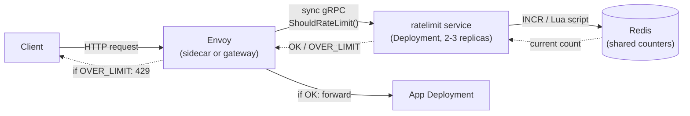

# Rate Limiter — Question & Answer Reference

A plain question/answer pass over the rate limiter design already documented in this
folder (`tutorial.md`, `algorithms_all_iterations.md`, `kubernetes_native_implementations.md`,
`build_vs_buy_and_tooling_landscape.md`) and in `../../lld/05_rate_limiter/problem.md`. Same
material, reorganized as direct questions with direct answers — no framing beyond the
mechanism, the numbers, and the trade-off.

## What problem is being solved, and what does "good" look like?

**Q: What is a rate limiter for, mechanically?**
A: It converts "too many requests from one client" into a fast, cheap rejection (`429`)
instead of letting unbounded load reach a backend and cause a slow, expensive failure —
timeouts, cascading retries, or an outage. Every algorithm below is a different way of
computing "reject or allow" for a given `client_id` at a given moment.

**Q: What are the two axes every rate limiter design decision reduces to?**
A: (1) **Which algorithm** decides admit/reject for a single point of enforcement — see
the six iterations below. (2) **Where does the shared state live** — local to one process
(fast, cheap, but blind to other processes) vs. shared external state (accurate across
processes, adds a network hop). Every scaling problem in this doc — multiple app replicas,
multiple Kubernetes pods, multiple regions — is the same axis (2) applied at a different
granularity.

**Q: What two clarifying questions change the whole design?**
A: (1) Is the limit **per-instance/per-region** (each enforcement point keeps its own
independent quota) or **truly global** (all instances/regions must sum to one limit)?
(2) How much **overshoot** is tolerable — is a hard exact limit required, or is a bounded,
approximate limit acceptable? The answer to (2) in particular determines almost the whole
architecture: exact enforcement forces synchronous shared state; tolerating bounded
overshoot unlocks local enforcement + async reconciliation, which is dramatically cheaper.

---

## Algorithms: single point of enforcement

Each algorithm below fixes a specific, named flaw in the previous one. None is free —
each trades one weakness for a different one.

### Fixed Window Counter

**Q: How does it work?**
A: Partition time into fixed windows aligned to clock boundaries (e.g. `:00`–`:59` each
minute). Key a counter as `{client_id}:{window_start}`. On each request, `INCR` the
counter for the current window; reject if it exceeds the limit. Set a TTL equal to the
window size so the key expires on its own.

```
def allow(client_id, now, limit, window_seconds):
    window_start = now - (now % window_seconds)
    key = f"{client_id}:{window_start}"
    count = incr(key)
    if count == 1:
        expire(key, window_seconds)
    return count <= limit
```

**Q: What is its cost?**
A: O(1) memory per client (one integer), O(1) time per check.

**Q: What breaks?**
A: The **boundary burst**. Limit = 100/minute. 100 requests land at `0:59.9` (end of
window 1, fully compliant). 100 more land at `1:00.1` (start of window 2, fresh counter,
also fully compliant). 200 requests passed in a 200ms span, and every individual window
reported "100/100 — compliant." Up to 2× the intended rate is achievable right at a
window edge — a structural property of the algorithm, not a client misbehaving.

### Sliding Window Log

**Q: How does it eliminate the boundary burst?**
A: Store an exact timestamp per request per client (a sorted set keyed by `client_id`,
scored by request time, in Redis). On each request: evict entries older than
`now - window`, check whether the remaining count is below the limit, and if so add the
new timestamp.

```
def allow(client_id, now, limit, window_seconds):
    key = f"log:{client_id}"
    zremrangebyscore(key, 0, now - window_seconds)   # evict stale
    count = zcard(key)
    if count < limit:
        zadd(key, now, now)                          # record this one
        return True
    return False
```

**Q: What's the concurrency hazard?**
A: The evict → count → add sequence must run atomically (a Redis Lua script or
`MULTI`/`EXEC`) — otherwise two concurrent requests from the same client can both read
`count < limit` before either writes, letting both through. Same class of bug as an
unguarded `SELECT` + `UPDATE` in SQL.

**Q: What does it cost?**
A: O(N) memory per client, where N = requests allowed within one window (10,000 timestamps
for a 10,000/hour limit on one active client). O(log N) time per operation. Exact — no
boundary burst is possible because the window is continuous, not clock-aligned.

### Sliding Window Counter (Weighted)

**Q: How does it get sliding-log accuracy at fixed-window cost?**
A: Keep exactly two fixed-window counters per client — current window count and previous
window count — and blend them:

```
estimated_count = current_window_count + previous_window_count * overlap_fraction
```

`overlap_fraction` is how much of the previous window still falls inside the trailing
look-back (25% into the current window → 75% of the previous window still counts →
`overlap_fraction = 0.75`).

**Q: Worked example?**
A: Limit = 100. Previous window's final count = 80. We're 25% into the current window,
current count = 20. `estimated = 20 + 80 × 0.75 = 80 ≤ 100` → allow.

**Q: What's the hidden assumption, and when does it break?**
A: It assumes requests are distributed **uniformly** across the previous window. If all 80
of the previous window's requests actually landed in its final 10%, the true trailing
count is much closer to 100 than the estimated 80 — the algorithm can under-count under
bursty-within-window traffic. State this as a named, bounded error, not a hidden gap.

**Q: What does it cost, and who actually runs it?**
A: O(1) memory (two integers), O(1) time — the production sweet spot for straightforward
HTTP rate limiting. Cloudflare's public rate-limiting docs describe exactly this
algorithm; a large share of API gateways and CDN edge limiters run it.

### Token Bucket

**Q: What gap does it close that the first three share?**
A: Fixed window, sliding log, and sliding counter all *smooth toward the sustained rate*
and treat any burst as something to suppress. None lets you say "allow a burst up to X,
cap the long-run rate at Y" as two independently tunable numbers. A batch job idle for
nine seconds then sending ten requests in the tenth isn't abusive — a limiter that
conflates burst and sustained rate can't distinguish it from a steady attacker at the same
average rate.

**Q: Mechanism?**
A: Each client has a bucket holding up to `capacity` tokens, refilling continuously at
`rate` tokens/second. A request costs one token (or more, for weighted-cost operations).
Reject if empty. Refill is computed lazily at check-time from elapsed time — no background
timer needed.

```
def allow(client_id, now, capacity, rate):
    tokens, last_ts = load(client_id, default=(capacity, now))
    elapsed = now - last_ts
    tokens = min(capacity, tokens + elapsed * rate)   # lazy refill
    if tokens >= 1:
        tokens -= 1
        save(client_id, (tokens, now))
        return True
    save(client_id, (tokens, now))
    return False
```

**Q: Cost, and who runs it in production?**
A: O(1) memory (two numbers: `tokens`, `last_refill_ts`), O(1) time. AWS API Gateway,
Stripe's public API, and GitHub's REST API all document token-bucket-family limiters. It
composes cleanly with **weighted costs** — an expensive endpoint (full-text search, a bulk
export) can cost 5–10 tokens instead of 1, expressing both "requests per second" and
"expensive-operation budget" with one mechanism.

### Leaky Bucket

**Q: How is it different from token bucket if both use the word "bucket"?**
A: Token bucket is a **policer** — an instant admit/reject decision; once admitted, a
request reaches the backend immediately, so a burst up to `capacity` still arrives *as a
burst* (bounded, but a burst). Leaky bucket is a **shaper** — it queues requests and
releases them at a strictly constant output rate, so the backend never sees anything but a
smooth stream, regardless of input burstiness.

**Q: Mechanism?**
A: A bounded FIFO queue. Requests are enqueued; if the queue is full, reject immediately
(overflow). A separate process drains ("leaks") one request at fixed intervals of `1/rate`
seconds, independent of how many are queued.

```
def enqueue(client_id, request, queue_capacity):
    q = queue_for(client_id)
    if len(q) >= queue_capacity:
        return False   # bucket overflow, reject
    q.append(request)
    return True

# runs on a fixed-interval timer, independent of enqueue():
def leak(client_id, rate):
    q = queue_for(client_id)
    if q:
        process(q.popleft())
    # scheduled again after 1/rate seconds
```

**Q: Cost, and when to pick it over token bucket?**
A: O(min(capacity, current queue depth)) memory — heavier than token bucket since it holds
actual requests, not just a counter. Pick it when the protected downstream has genuinely
zero burst tolerance and degrades badly under any burst — added latency from queueing is
the better failure mode than letting even a bounded burst arrive. Token bucket is the
default when the caller or resource tolerates some burst and instant reject beats added
latency.

### GCRA (Generic Cell Rate Algorithm)

**Q: What does it add over token bucket?**
A: Nothing behaviorally — it is **mathematically equivalent** to token bucket, same
admit/reject decisions, same burst-capacity and sustained-rate semantics. The difference is
storage shape: instead of two stored numbers (`tokens`, `last_refill_ts`), it stores a
single value per key — the **Theoretical Arrival Time (TAT)**, the time the next
fully-conforming request is expected.

**Q: Mechanism?**
A:

```
emission_interval = 1 / rate           # time "cost" of one request
burst_tolerance   = capacity * emission_interval

def allow(client_id, now):
    tat = load(client_id, default=now)
    if now >= tat - burst_tolerance:
        new_tat = max(tat, now) + emission_interval
        save(client_id, new_tat)
        return True
    return False
```

**Q: Who actually runs it?**
A: Stripe's public engineering write-up on their rate limiter describes exactly this
algorithm. `lua-resty-limit-traffic` (the OpenResty library nginx-based ingress controllers
build on) implements a GCRA-family algorithm under the name `limit_req`; nginx's native
`limit_req_zone` module — which `ingress-nginx`'s Kubernetes annotations compile down to —
is leaky-bucket/GCRA-flavored by design (`burst=` is the queue depth, `nodelay` switches it
toward instant accept/reject within the burst allowance).

### Comparison table

| Algorithm | Memory/key | Exact or approximate | Controlled burst? | Smooths sustained rate? | Production examples |
|---|---|---|---|---|---|
| Fixed Window | O(1) | Approximate (2× boundary burst) | No | No | Simplest API gateways |
| Sliding Window Log | O(N) | Exact | No | Yes | Where exactness beats memory cost (billing-adjacent limits) |
| Sliding Window Counter | O(1) | Approximate (bounded, uniform-traffic assumption) | No | Yes | Cloudflare edge limiting, most general API gateways |
| Token Bucket | O(1) | Exact for its own semantics | Yes (`capacity`) | Yes (`rate`) | AWS API Gateway, Stripe, GitHub API |
| Leaky Bucket | O(queue depth) | Exact for its own semantics | No — shapes to constant output | Yes, strictly | Shaping traffic in front of burst-intolerant downstreams |
| GCRA | O(1) | Exact, equivalent to token bucket | Yes (`burst_tolerance`) | Yes | Stripe (public write-up), nginx `limit_req`, `lua-resty-limit-traffic` |

**Q: Which one would you actually default to?**
A: Token bucket (or its GCRA twin) by default — the burst/sustained-rate split matches how
real clients behave. Reach for sliding window counter when O(1)-memory simplicity matters
more than its bounded approximation error. Reach for leaky bucket specifically when the
downstream has genuinely zero burst tolerance and needs shaping, not policing.

---

## Class-level (single-process) design

**Q: What's actually being asked when this is posed as a class-design problem?**
A: Design a `RateLimiter` importable into a single process to gate calls per client,
supporting more than one algorithm behind the same interface, swappable without changing
calling code. The core evaluation is the interface design and the trade-offs between
algorithms — not any single implementation being clever.

**Q: What's the interface, and why keep it to one method?**
A: `RateLimiter.allow_request(client_id, now) -> bool`. One method — Interface
Segregation — because that's the only capability a caller actually needs; keeping fixed
window / sliding log / token bucket interchangeable behind it means a later swap ("use
token bucket instead") is a one-line change at the call site, not a rewrite.

**Q: What's the concurrency ceiling on this design, and why does it exist?**
A: Every implementation keeps counters in an in-memory dict keyed by `client_id`, which is
correct for one process and silently wrong the moment there are two: two API-server
instances behind a load balancer would each independently allow the full quota, producing
an effective limit of `2 × configured_limit` with zero coordination. This is exactly the
gap the distributed design (below) closes with shared state (Redis).

**Q: What's the natural extension follow-up?**
A: Support different limits per client tier (free vs. paid), and let a client query how
many requests it has left. Implementation: pass `(max_requests, window_seconds)` — or
`(capacity, refill_rate)` for token bucket — per client instead of one global config at
construction; add `remaining(client_id) -> int` to the interface. Because algorithm choice
is already isolated behind the interface, this touches all implementations identically and
no calling code.

**Q: Where's the runnable code?**
A: `../../lld/05_rate_limiter/solution.py` (Python, ABC-based, three algorithms, sample
test cases at the bottom) and `../../lld/05_rate_limiter/rate_limiter_rusty/` (Rust,
`trait RateLimiter` with three implementing structs, `cargo test`).

---

## Distributed design: multiple processes, one region

**Q: Why doesn't "just add a load balancer in front of N replicas" work automatically?**
A: The rate-limit check has to run **before or at** the load-balancing decision, not after
it, and in most real stacks they're literally the same proxy process. Envoy, NGINX, and
Kong each do both jobs — an L7 proxy's job is "terminate the request, decide what to do
with it," and rate limiting is one of those decisions made before the other decision
(which backend to route to). In Envoy's filter-chain model this is literal: the
`ratelimit` HTTP filter runs before the `router` filter — a rejected request never reaches
the code path that picks a backend.

**Q: Why does the ordering matter for correctness, specifically?**
A: Checking *after* the load-balancing decision means the check runs independently on
whichever backend the request happened to land on. `replicas: 3` behind a load balancer
fans one client's traffic across 3 independent enforcement points, each blind to the other
two — effective limit becomes `3 × configured_limit`. Checking at or before the single
load-balancing decision point (one hop, one shared view of state) is what keeps the count
meaningful.

**Q: Can an L4 load balancer (e.g. AWS NLB) do the rate limiting itself?**
A: No — an L4 balancer never parses HTTP, so it has no visibility into a client ID, API
key, or JWT claim, only source IP and port. It can enforce coarse connection-level limits
(max new connections/sec from one IP) but structurally cannot enforce per-user/per-API-key
limits. That requires HTTP-layer (L7) visibility — plain AWS ALB has no native per-user
rate limiting either; it needs AWS WAF's rate-based rules attached alongside it.

**Q: Within one region, what's the correct answer for exact enforcement?**
A: A single Redis instance (or equivalent shared store), checked synchronously by every
app server, running any of the algorithms above with an atomic `INCR`/Lua script. This is
the correct single-region baseline.

---

## Distributed design: multiple regions, one global limit

**Q: Why doesn't "one Redis instance globally" work across regions?**
A: Every request, regardless of region, would need a network round-trip to wherever that
single store lives — a user in Asia checking against a US-hosted counter adds significant
latency to every request, defeating the purpose of having regional app servers at all.
This is a CAP-theorem trade-off wearing a rate-limiter costume: a perfectly accurate
global count needs either one source of truth (a latency/availability bottleneck) or
synchronous cross-region coordination on every request (a consensus-style cost) — neither
fits a rate limiter's latency budget, which must add negligible overhead to every request
it protects.

**Q: What's the practical answer?**
A: **Local enforcement + async global reconciliation.**
- Each region gets a local budget — a fraction of the total global limit, allocated
  proportional to typical traffic share (or dynamically rebalanced). Requests are checked
  against this local counter at local latency — no cross-region call on the critical path.
- Regions periodically report local usage to a global aggregator (every few seconds),
  which recomputes actual global usage and can push back adjusted local budgets — a region
  running hot gets a smaller allocation next cycle; an idle region's spare budget can be
  redistributed.

**Q: What does this design explicitly give up, and how should that be stated?**
A: It's an **approximate enforcement mechanism** — for the few seconds between
reconciliation cycles, the true global count can drift above the nominal limit by a bounded
amount (roughly the sum of what each region could independently spend before the next
sync). State this bound as an explicit design parameter — "we tolerate up to N% overshoot,
bounded by the reconciliation interval" — rather than presenting the design as exact
enforcement, which it isn't and can't be at this latency budget.

**Q: When is exact global enforcement actually required, and what changes then?**
A: When there's a genuine hard business/legal limit, not just a soft throttle. Accept the
latency cost of a synchronous check against one authoritative store, but scope that
exact-enforcement requirement narrowly (only the specific action that legally must not
exceed the limit) rather than applying the expensive synchronous pattern to every
rate-limited endpoint uniformly.

**Q: How does clock synchronization factor in?**
A: Any window-based algorithm (fixed window, sliding window) depends on consistent notions
of time across regions. Clock drift between regions' servers can cause a window boundary
to be interpreted slightly differently in different places — usually minor for approximate
enforcement, but another place this design is inherently approximate. NTP-synchronized
clocks are the practical baseline; logical/vector clocks establish relative ordering
without depending on wall-clock precision, but are usually overkill for a rate limiter's
actual accuracy requirements.

**Q: What failure modes need to be handled explicitly?**
A: (1) The global aggregator becoming a single point of failure — if reconciliation can't
reach it, regions should fail toward their **last-known-good local budget**, not fail open
(unbounded) or fail closed (reject everything) by default; pick the direction appropriate
to this specific limit's purpose. (2) A region's traffic share shifting suddenly (a viral
event) — a static regional allocation would under-serve that region while others sit idle;
dynamic rebalancing based on recent usage handles this. (3) Reconciliation lag compounding
under aggregator slowness — if the aggregator falls behind, the overshoot bound silently
grows past its designed value; this needs its own monitoring, separate from monitoring the
limiter's primary function.

**Q: What's the trade-off table for this design?**

| Decision | Option A | Option B | When to pick which |
|---|---|---|---|
| Enforcement scope | Per-region independent limits | Global limit with async reconciliation | Per-region if the actual business requirement can be restated that way — worth asking explicitly before building the harder version |
| Reconciliation frequency | Frequent (tighter accuracy, more overhead) | Infrequent (looser accuracy, less overhead) | Tune based on the tolerable-overshoot bound established up front |
| Overshoot handling | Hard rejection once local budget exhausted | Soft throttle/backoff, allow some overshoot | Soft throttling fits the inherent approximation better; hard rejection is simpler but can make the overshoot bound feel like a bug |
| Exact vs. approximate | Approximate (default) | Exact via synchronous global check | Exact only for the narrow subset of limits with a genuine hard requirement |

---

## Kubernetes implementation patterns

Every pattern below is the identical local-vs-shared-state trade-off from the
multi-region design, instantiated at pod-replica granularity instead of region
granularity.

**Q: Per-pod in-memory limiter — what is it, and what breaks?**
A: The app process holds an in-memory limiter (literally `../../lld/05_rate_limiter`'s
`solution.py`/`rate_limiter_rusty`) — a dict keyed by `client_id`, no external dependency.
With `replicas: 3` behind a Service, load balancing spreads one client's requests across
all 3 pods; each pod independently enforces the full limit, so the effective limit becomes
`3 × configured_limit`. Fine as a per-pod safety valve against a retry storm hitting *this
pod*; wrong tool for a business-level per-user quota.

**Q: NGINX Ingress `limit_req` annotations — mechanism and limitation?**
A: `nginx.ingress.kubernetes.io/limit-rps` / `limit-burst-multiplier` annotations compile
down to nginx's native `limit_req_zone`/`limit_conn_zone` directives inside the
`ingress-nginx` controller pod(s) — a leaky-bucket/GCRA-flavored algorithm, running by
default. State is local to each controller **pod**, not shared — multiple controller
replicas keep independent counters, the same multiple-independent-counters problem as the
per-pod case, moved one hop earlier. The `limit_req_zone ... zone=mylimit:10m` size also
caps how many distinct keys can be tracked before LRU eviction starts dropping entries —
a real capacity concern for high-cardinality per-API-key limits.

```yaml
apiVersion: networking.k8s.io/v1
kind: Ingress
metadata:
  name: rate-limited-api
  annotations:
    nginx.ingress.kubernetes.io/limit-rps: "10"
    nginx.ingress.kubernetes.io/limit-burst-multiplier: "5"
spec:
  rules:
    - host: api.example.com
      http:
        paths:
          - path: /
            pathType: Prefix
            backend:
              service:
                name: rust-api
                port:
                  number: 8080
```

**Q: Envoy local rate limiting (Istio/Envoy Gateway/Contour) — mechanism and limitation?**
A: Envoy's `local_ratelimit` HTTP filter — a token bucket implemented directly inside the
Envoy proxy — as an Istio sidecar or the single gateway proxy in Envoy Gateway/Contour.
`max_tokens` = `capacity`, `tokens_per_fill`/`fill_interval` = `rate`. In Istio's sidecar
model this is actually *finer-grained* than the ingress case: a sidecar runs in every app
pod, so `replicas: 10` means 10 fully independent buckets. Unambiguously a per-pod
defense-in-depth mechanism, not quota enforcement.

```yaml
apiVersion: networking.istio.io/v1alpha3
kind: EnvoyFilter
metadata:
  name: local-rate-limit
spec:
  configPatches:
    - applyTo: HTTP_FILTER
      patch:
        operation: INSERT_BEFORE
        value:
          name: envoy.filters.http.local_ratelimit
          typed_config:
            "@type": type.googleapis.com/envoy.extensions.filters.http.local_ratelimit.v3.LocalRateLimit
            token_bucket:
              max_tokens: 100
              tokens_per_fill: 100
              fill_interval: 60s
```

**Q: Envoy global rate limit service — how does it get real cross-pod accuracy?**
A: Envoy's `envoy.filters.http.ratelimit` filter makes a synchronous gRPC call to an
external rate-limit service — canonically Lyft's open-source
[`ratelimit`](https://github.com/envoyproxy/ratelimit) — before forwarding each request.
That service is itself a Kubernetes `Deployment` (2–3 replicas for HA), backed by Redis,
whose atomic `INCR`/Lua scripting makes cross-pod, cross-replica enforcement exact within
one deployment.



This is the concrete Kubernetes-native version of the multi-region "single global counter"
problem, at cluster/region scope rather than true cross-region scope — every request now
pays a synchronous round trip (sub-millisecond in-cluster, which is why it's fine within
one region but not across US↔EU). For the true multi-region design: deploy one such stack
(Envoy + `ratelimit` + Redis) **per region**, each enforcing a local budget, and add the
same async-reconciliation aggregator on top, syncing each region's Redis usage back to a
global view periodically.

```yaml
domain: rust-api
descriptors:
  - key: client_id
    rate_limit:
      unit: minute
      requests_per_unit: 100
```

**Q: Kong Ingress Controller — what are the two policy modes?**
A: `local` — in-memory LRU inside each Kong proxy pod, same per-pod-local limitation as
above. `redis`/`cluster` — shared counters in Redis, same shared-state trade-off as the
Envoy global service, minus the separate gRPC hop (Kong talks to Redis directly). The same
local-vs-shared menu recurring under a different vendor's YAML schema.

```yaml
apiVersion: configuration.konghq.com/v1
kind: KongPlugin
metadata:
  name: rate-limit-redis
config:
  minute: 100
  policy: redis
  redis_host: redis.observability.svc.cluster.local
plugin: rate-limiting
```

**Q: Gateway API `RateLimitPolicy` — is this a third mechanism?**
A: No — it's a portability layer standardizing the *configuration interface*
(`RateLimitPolicy` attached to an `HTTPRoute`/`Gateway`) over the same two underlying
mechanisms (local or global, i.e. Envoy-based iterations above). The state-locality
question is unchanged no matter which CRD schema configures it.

**Q: DIY Redis-backed middleware — how does this close the loop with the LLD code?**
A: Extend the LLD single-process implementation
(`../../lld/05_rate_limiter/solution.py`/`rate_limiter_rusty`) to use a Redis client
instead of an in-memory dict, with Redis deployed as its own `Deployment`/`StatefulSet`
in-cluster (or a managed Redis — ElastiCache, MemoryDB). The only change needed to take it
from "correct for one process" to "correct under `replicas: N`" is swapping the dict for
Redis `INCR`/`EVAL` — same algorithm, different storage backing, same interface.

Concrete steps:
1. Take `rate_limiter_rusty` (or `solution.py`) and swap its dict-backed state for
   `redis::Client` calls.
2. Deploy behind a Kubernetes `Service` with `replicas: 3`.
3. Load-test with a burst above the configured limit and confirm the effective limit
   stays at the configured value — not `3×` it.

**Q: Comparison table across all Kubernetes patterns?**

| Pattern | State locality | Algorithm underneath | Extra infra needed | Best for |
|---|---|---|---|---|
| Per-pod in-memory | Local, per pod | Whatever the LLD code implements | None | Per-pod defense-in-depth, not quota enforcement |
| NGINX Ingress annotations | Local, per controller pod | Leaky bucket / GCRA-flavored | ingress-nginx | Simple edge-level protection |
| Envoy local ratelimit | Local, per proxy instance | Token bucket | Istio/Envoy Gateway | Per-pod defense-in-depth in a mesh |
| Envoy global ratelimit service | Shared, cluster/region-wide | Redis-backed counters | `ratelimit` Deployment + Redis | Exact per-user quota enforcement within one region |
| Kong plugin (local) | Local, per Kong pod | LRU-backed counter | Kong Ingress Controller | Simple edge protection |
| Kong plugin (redis/cluster) | Shared, cluster-wide | Redis-backed counter | Kong + Redis | Exact quota enforcement |
| Gateway API RateLimitPolicy | Depends on backing implementation | Delegates to Envoy local/global | Gateway API controller | Portability across vendors |
| DIY Redis middleware | Shared, cluster-wide | Whichever algorithm implemented | Redis | Full control, custom business logic (tiers, weighted costs) |

**Q: Which one should actually be deployed?**
A: The deciding question, asked first: *is this protecting the backend from overload, or
enforcing a per-customer contractual limit?* The first is well-served by per-pod/local
patterns (cheap, approximate). The second needs the Envoy global service, Kong's
Redis-backed policy, or the DIY Redis middleware (accurate, shared, more infrastructure).
Picking a tool before answering this is choosing an implementation before the requirement
is understood.

---

## Build vs. buy: do you actually write this code?

**Q: What's the honest default answer to "would you hand-write this in a real system"?**
A: Almost always, tooling already exists — the actual skill is knowing which layer handles
it. Three tiers, in order of preference:

**Q: Tier 1 — zero application code. What does it cover?**
A: Configure existing infrastructure that already sits in the request path:
Kubernetes-native (ingress-nginx, Envoy local/global, Kong, Gateway API — all above), cloud
API gateways (AWS API Gateway usage plans + throttling, Azure API Management,
GCP Apigee/Cloud Endpoints), edge/CDN (Cloudflare rate limiting rules, Fastly, AWS WAF
rate-based rules — rejecting abuse before it even reaches your infrastructure). No server
to run, no library to patch, no algorithm to get subtly wrong. Correct default for the
overwhelming majority of real rate-limiting needs.

**Q: Tier 2 — a library. When does this apply, and what are the options?**
A: When rate limiting needs to live inside application code — per-user business logic,
limits depending on data the gateway can't see (subscription tier, feature flags).

| Language | Library | What it gives you |
|---|---|---|
| Python | `slowapi`, `django-ratelimit`, `Flask-Limiter` | Decorator/middleware limiting, pluggable storage |
| Go | `golang.org/x/time/rate`, `uber-go/ratelimit` | Token-bucket primitives |
| Java | `Resilience4j` `RateLimiter`, `Bucket4j` | Token-bucket implementations, distributed backends |
| Node.js | `express-rate-limit`, `rate-limiter-flexible` | Middleware, pluggable Redis/Memcached backends |
| Rust | `governor` crate | GCRA implementation as a well-tested dependency |

The relationship to the LLD code in this repo: `solution.py`/`rate_limiter_rusty`
implement, by hand, exactly what `Bucket4j` or `governor` already ship as tested,
maintained packages. Writing it by hand is valuable for understanding what these
libraries do internally — not something to normally repeat in a real codebase when a
library already does it.

**Q: Tier 3 — hand-rolled. When does this become the real answer?**
A: (1) Business logic is genuinely custom and doesn't fit any off-the-shelf tool cleanly —
e.g. weighted costs varying per endpoint *and* per customer tier, feeding into a specific
overshoot/reconciliation policy no vendor's config schema expresses. (2) No mature library
exists for the specific runtime/constraint. (3) Building the shared rate-limiting
*service* itself that other teams' code or gateways call into — at which point, note
explicitly that this duplicates Lyft's open-source `ratelimit` service, and check whether
running that instead is viable before building one from scratch.

**Q: What's the decision order before writing any algorithm code?**
A: (1) Does a gateway/proxy/edge layer already sit in this request's path? If yes,
configure Tier 1. (2) Is there a mature, maintained library supporting the algorithm and
storage scope needed? If yes, use it. (3) Is the remaining requirement genuinely not
expressible in either — custom weighted logic, no library, or building shared
infrastructure other teams depend on? Only then does hand-rolled code become the real
answer.

**Q: What's the build-vs-buy calculus, beyond "can a tool do it"?**
A: **Undifferentiated heavy lifting vs. a real differentiator** — for nearly every company,
*how* rate limiting works isn't the product; building bespoke infrastructure when Envoy's
`ratelimit` service or a cloud gateway solves it spends effort on something that earns
nothing strategic (exception: a company whose product *is* API infrastructure). **Total
cost of ownership** — a hand-rolled Redis-backed limiter looks cheap to build but carries
an on-call burden the moment it misbehaves under real traffic (clock skew, Lua script
bugs, Redis failover) that a maintained library or managed gateway has already paid down.
**Exit cost** — a library import is trivially swappable; a bespoke shared rate-limiting
service a dozen other teams call into is not.
