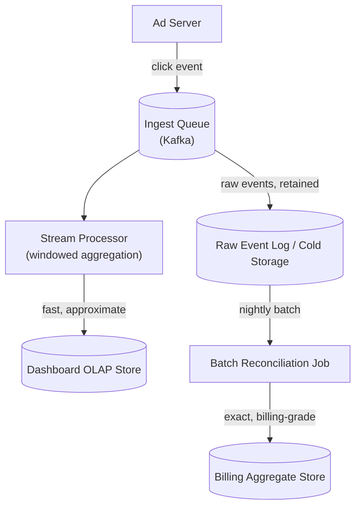

# Design an Ad Click Aggregation / Analytics Pipeline

**Primarily tests**: exactly-once stream aggregation, late-arriving data, and approximate-vs-
exact counting at extreme scale — the practical, hard version of [Part 18's "exactly-once
really means at-least-once plus
idempotency"](../../system_design_foundation/00_prerequisite_concepts/18_message_queues_and_event_driven_semantics.md#delivery-guarantees-what-sent-actually-promises)
argument, applied to a billing-adjacent counting problem where getting it wrong has direct
financial consequences.

## Clarify

- Does this need real-time (seconds-level) dashboards, near-real-time (minutes), or is
  next-day batch reporting acceptable? Assume real-time dashboards *and* billing-grade exact
  totals are both required — that tension is the actual design problem.
- What dimensions need aggregation — by ad, by campaign, by geography, by hour? Assume all of
  the above, which rules out any approach that only supports one fixed rollup.
- Is click-fraud detection in scope, or a separate downstream concern reading this pipeline's
  output? Assume separate — name it, but don't design it here.

## High-Level Design

## Deep-Dive: Exactly-Once Aggregation Is Where This Actually Bites

`count += 1` per incoming message sounds harmless until it meets [Part 18's actual
guarantee](../../system_design_foundation/00_prerequisite_concepts/18_message_queues_and_event_driven_semantics.md#delivery-guarantees-what-sent-actually-promises):
at-least-once delivery means a click event can be redelivered and reprocessed, and a naive
counter increments *again* on the duplicate — silently inflating every downstream number,
including the ones that feed billing. The fix is the same pattern already named there:
**idempotent aggregation**, either via each event carrying a unique ID checked against a
dedup window before it's counted, or by using the stream processor's own transactional
exactly-once mechanism (Kafka Streams' and Flink's checkpointed, transactional commit of
"consumed offset + aggregated state" as one atomic unit) so a reprocessed event after a
failure recovery provably can't double-count. **Naming which of these two mechanisms is
actually in use, and why**, is the specific signal that separates "we use Kafka so it's
exactly-once" (a common, incorrect assumption) from an actually-verified guarantee.

## Deep-Dive: Late-Arriving Events and Watermarks

A click event delayed in transit (a mobile client offline for two minutes, then flushing its
buffer) can arrive after the time window it belongs to has already been aggregated and
reported. A **watermark** — an explicit, declared threshold for "how late is too late to
still include in this window's count" — is the mechanism that makes this trade-off a named
design parameter instead of an unstated bug: a tighter watermark means faster, more
real-time-feeling dashboards at the cost of more late events being excluded (and needing a
correction later); a looser watermark means fewer corrections but slower window closure. This
is the identical **overshoot-bound-as-a-named-parameter** discipline [Part 7's rate limiter
case
study](../07_design_rate_limiter_at_scale/tutorial.md#deep-dive-the-practical-answer-local-enforcement-async-global-reconciliation)
already established for a different kind of approximation — stating the bound explicitly,
rather than presenting an inherently approximate system as if it were exact.

## Deep-Dive: Approximate Counting at Extreme Scale

For dashboard-facing metrics at genuinely massive scale, exact counting itself can become the
bottleneck — tracking millions of distinct users' click counts precisely requires storing
every distinct ID seen. **HyperLogLog** trades a small, bounded error rate (typically under
2%) for counting *unique* clicks/users using a fixed, tiny amount of memory regardless of the
true cardinality — the standard answer whenever "how many distinct X" is the question rather
than a per-item exact count. **Count-Min Sketch** does the analogous trade for *frequency*
estimation (how many times has this specific ad been clicked) with a similarly bounded,
provable error rate instead of exact per-key counters. Both are explicitly the *fast,
approximate* tier's tool — paired deliberately with the exact batch-reconciliation path below
for anything that actually needs to be correct to the click, the same two-tier pattern [Part
7's rate limiter case
study](../07_design_rate_limiter_at_scale/tutorial.md#trade-offs) already established between
an approximate real-time answer and an exact one reserved for where it actually matters.

## Deep-Dive: Two Tiers — Stream for Speed, Batch for Truth

Rather than trying to make the real-time stream path both fast *and* billing-grade exact —
a combination that trades away the speed the real-time path exists for — production systems
commonly run **two tiers deliberately**: the stream path (Flink/Kafka Streams, per [Part
13's messaging
catalog](../../system_design_foundation/00_prerequisite_concepts/13_cap_theorem_and_pacelc.md#a-catalog-of-popular-modern-distributed-systems-by-the-problem-they-solve))
produces fast, approximate dashboard numbers, while a separate nightly or hourly **batch
reconciliation job** re-processes the same raw, retained events for exact, billing-grade
totals. This is the **lambda architecture** trade-off, named explicitly: dashboards get
speed, invoices get correctness, and the two are allowed to briefly disagree (the dashboard
shows an approximate number that gets quietly corrected once the batch job runs) rather than
forcing one pipeline to satisfy both requirements at once.

## Trade-offs

| Decision | Option A | Option B | When to pick which |
|---|---|---|---|
| Aggregation guarantee | Best-effort (fast, can double-count) | Idempotent/exactly-once (slightly slower, correct under redelivery) | Exactly-once for anything touching billing or campaign spend; best-effort acceptable only for purely internal, non-financial telemetry |
| Counting method | Exact counters | Approximate (HyperLogLog / Count-Min Sketch) | Approximate for dashboard-scale unique/frequency counts where a small bounded error is acceptable; always exact for the billing-grade reconciliation path |
| Architecture | Stream-only | Lambda (stream + batch reconciliation) | Lambda whenever both real-time visibility and exact, auditable totals are genuinely required — stream-only if approximate is actually good enough everywhere |

## Staff Altitude

A **senior** answer proposes "aggregate clicks with a stream processor" and treats the count
as automatically correct.

A **staff** answer additionally: (1) names the exactly-once mechanism specifically
(transactional stream-processor commits, or an explicit dedup key) rather than assuming
"Kafka" alone makes it safe; (2) states the watermark's lateness threshold as an explicit,
quantified parameter, the same discipline the rate-limiter case study already established for
its overshoot bound; and (3) proactively separates the fast/approximate dashboard path from
the exact/billing path as two deliberately different tiers, rather than trying to make one
pipeline serve both needs and quietly failing one of them.

## Failure Modes to Raise Proactively

- **The stream processor crashes mid-window**, losing in-flight aggregation state that wasn't
  yet checkpointed — needs the same checkpoint-then-replay-the-tail discipline [Part 10
  already established for WAL
  recovery](../../system_design_foundation/00_prerequisite_concepts/10_physics_of_persistence.md#checkpointing-why-the-wal-doesnt-grow-forever),
  applied to stream-processing state instead of a storage engine's own durability.
- **Duplicate click events from client-side retry logic** (a mobile app retrying a click-beacon
  call it assumed failed) — needs a client-generated event ID and the same idempotent-
  aggregation dedup already named above; without it, the retry silently inflates the count.
- **A traffic spike outpaces the stream processor's throughput**, growing consumer lag
  unboundedly — [Part 18's backpressure
  responses](../../system_design_foundation/00_prerequisite_concepts/18_message_queues_and_event_driven_semantics.md#backpressure-what-happens-when-the-consumer-cant-keep-up)
  apply directly: scale consumers, or accept a temporarily wider watermark rather than an
  unbounded backlog.

## Staff Follow-Ups

- "A bug in the aggregation logic is discovered, affecting the last three days of dashboard
  numbers — walk through exactly how you'd reprocess that window without double-counting
  events that were already correctly counted before the bug window started."
- "How does backpressure on the stream processor during a traffic spike interact with the
  watermark — does a slower consumer mean more events get classified as 'late,' and is that
  actually the right trade-off during a spike?"
- "Add real-time fraud detection on top of this pipeline — does it read from the same stream,
  and what happens to a click that's flagged as fraudulent *after* it's already been
  counted?"

## Practice Variations

- Design a general-purpose metrics/observability ingestion pipeline (the same
  windowed-aggregation shape, applied to infrastructure metrics instead of ad clicks — a
  direct cousin of [Part 16's own
  observability](../../system_design_foundation/00_prerequisite_concepts/16_observability.md)
  primer).
- Design real-time leaderboard aggregation for a mobile game (similar windowing, but ranking
  rather than summing is the core operation).
- Extend this design to support A/B test result aggregation, where correctness requirements
  are closer to the billing tier's than the dashboard tier's, despite feeling like a "just a
  metric" problem at first glance.

## Articulate It: Interview Framing & Vocabulary

### Three Ways to Explain This

- **Named-guarantee framing (the default for 'how do you make sure clicks are counted
  correctly'):** "I wouldn't assume using Kafka makes this exactly-once automatically — I'd
  name the specific mechanism, either a dedup key or the stream processor's own transactional
  checkpoint-and-commit, and verify that's actually what's providing the guarantee."
- **Two-tier framing (good for a 'real-time vs. accurate' follow-up):** "I'd deliberately run
  two tiers rather than one pipeline trying to serve both needs — a fast, approximate stream
  path for dashboards, and a separate exact batch reconciliation path for billing, allowing
  them to briefly disagree rather than slowing the dashboard down to billing-grade certainty."
- **Named-parameter framing (good for the late-data discussion):** "I'd state the watermark's
  lateness threshold as an explicit, quantified trade-off — tighter for faster dashboards,
  looser for fewer corrections — the same discipline as naming a rate limiter's overshoot
  bound explicitly instead of leaving the approximation unstated."

### Vocabulary Builder

- **watermark** (n.) — an explicit threshold for how late an event can arrive and still be
  included in its time window's aggregation; the named trade-off between speed and
  completeness.
- **HyperLogLog** (n.) — a probabilistic data structure estimating unique-item cardinality
  within a small, bounded error using fixed memory, regardless of the true count.
- **Count-Min Sketch** (n. phrase) — the frequency-estimation analog of HyperLogLog, bounding
  error on "how many times has X occurred" without exact per-key counters.
- **lambda architecture** (n. phrase) — deliberately running a fast approximate stream path
  alongside a separate exact batch-reconciliation path, rather than forcing one pipeline to
  satisfy both speed and exactness at once.
- **"…briefly allowed to disagree, on purpose"** — a fluent way to describe the lambda
  architecture's core trade-off without needing to justify it as a flaw.

---

**Previous:** [16. Notification System](../16_design_notification_system/tutorial.md)  |  **Next:** [18. Distributed Key-Value Store](../18_design_key_value_store/tutorial.md)
