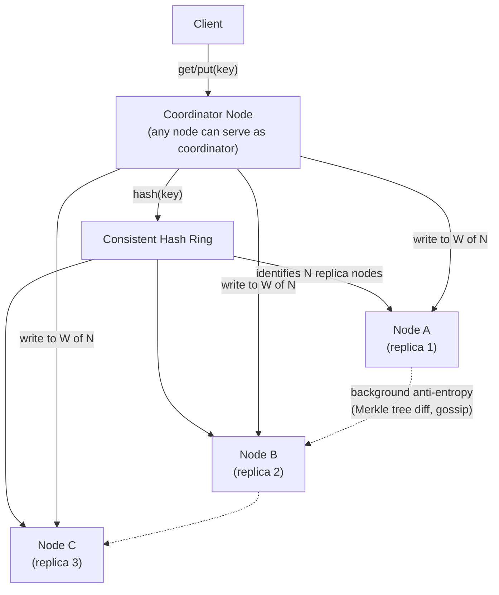

# Design a Distributed Key-Value Store (DynamoDB / Cassandra)

**Primarily tests**: consistent hashing at the storage-engine level, tunable
consistency via quorums, and conflict resolution when replicas disagree — the
foundational storage problem several other case studies in this folder assume as a
building block rather than design directly. This is one of the most commonly asked
staff-level questions on its own, independent of any specific product feature.

## Clarify

- Access pattern: simple `get(key)`/`put(key, value)` only, or does it need range
  queries, secondary indexes, or transactions? Assume simple key-value access —
  that's what makes this a storage-engine question rather than a database-design one.
- Consistency requirement: does every read need the absolute latest write visible
  immediately, or is eventual consistency (a read might briefly return a stale value)
  acceptable? Assume the system must let the *caller* choose per-request — this single
  requirement is what makes "tunable consistency" the actual design, not a fixed choice.
- Availability under partition: when the network partitions, should the system stay
  available for both reads and writes (favoring availability over consistency), or
  reject writes to avoid inconsistency (favoring consistency)? Assume availability is
  the priority — this is explicitly an AP system in CAP terms, the same choice
  Dynamo's original paper made.

## High-Level Design

## Deep-Dive: Consistent Hashing Places the Data (the core of this question)

**The problem**: with N storage nodes and a simple `hash(key) % N` scheme, adding or
removing a single node remaps almost every key to a different node — a full-cluster
data reshuffle triggered by one node joining or leaving, completely impractical at
scale.

**Consistent hashing fixes this**: nodes and keys are both hashed onto the same
circular hash space (a ring). A key belongs to the first node encountered walking
clockwise from the key's hash position. Adding or removing one node only remaps the
keys between that node and its immediate predecessor on the ring — a small, bounded
fraction of total keys, not a full reshuffle.

**Virtual nodes close the load-imbalance gap**: with only one ring position per
physical node, an unlucky hash distribution can leave one node responsible for a much
larger arc of the ring than others. Assigning each physical node many virtual
positions on the ring (hundreds, hashed independently) smooths this out — statistically,
each physical node ends up owning a much more even total share of the ring, and a
node's failure spreads its lost range across many other nodes instead of dumping it
all on one neighbor.

**Replication follows the same ring**: a key with replication factor N isn't stored
on just its first ring successor — it's stored on the first N *distinct physical
nodes* walking clockwise from the key's position (skipping virtual nodes that belong
to a physical node already selected), which is what gives natural, ring-based
replica placement without a separate replication-assignment mechanism.

## Deep-Dive: Quorums — Making Consistency a Tunable Parameter

**The mechanism**: with replication factor N, define a write quorum W and read quorum
R. A write succeeds once W replicas acknowledge it; a read queries R replicas and
returns the most recent value among their responses (using a version/timestamp to
compare — see conflict resolution below).

**The tuning knob this creates**: if `W + R > N`, every read quorum is guaranteed to
overlap with every write quorum by at least one node — meaning at least one node in
any read set has seen the most recent write, giving **strong consistency** (a read
after a completed write is guaranteed to observe it). If `W + R <= N`, reads and
writes can complete without any guaranteed overlap — **eventual consistency**, faster
(fewer nodes to wait on) but a read can return stale data.

**Worked example**: N=3. `W=2, R=2` (`W+R=4 > 3`): strong consistency, tolerates one
node being slow/down for either a read or a write. `W=1, R=1` (`W+R=2 <= 3`): fastest
possible reads and writes, tolerates two nodes down, but no overlap guarantee — the
classic low-latency, eventually-consistent configuration. **This W/R choice is exactly
the tunable-consistency knob the clarifying question above is pointing at** — a
well-designed system exposes it per-request, not as one global fixed setting, because
different callers of the same store (a session-token read vs. a user-profile read)
often have genuinely different consistency needs.

## Deep-Dive: Conflict Resolution When Replicas Disagree

**Why conflicts happen at all**: under network partition or concurrent writes to
different replicas (both allowed to succeed under an AP design), two replicas can end
up holding different values for the same key with no way to tell which happened
"later" using wall-clock time alone (clocks drift, and concurrent writes may have no
real ordering at all).

- **Last-Write-Wins (LWW)**: attach a timestamp to each write, keep whichever is
  newest. Simple, but silently discards one of two genuinely concurrent writes — an
  acceptable trade-off only when losing a write occasionally is tolerable for this
  specific data (e.g. a shopping-cart "last item viewed" field), never for data where
  silently dropping a write is a correctness bug.
- **Vector clocks**: each value carries a vector of per-replica write counters,
  letting the system distinguish "this version strictly descends from that one" (safe
  to discard the older) from "these two versions are concurrent, with no ordering
  between them" (both must be kept and reconciled). Dynamo's original design returns
  *both* concurrent versions to the client/application on a conflicting read, pushing
  reconciliation up to whichever layer actually understands the business meaning of
  the data (e.g. merging two concurrent shopping-cart-add operations into one cart,
  rather than picking one and losing the other's item).
- **CRDTs as the fully automatic alternative**: for specific data shapes (counters,
  sets, sequences) a CRDT structures the value so concurrent updates merge
  deterministically with no data loss and no manual reconciliation step needed at all
  — the trade-off is that CRDTs only exist for a limited set of data shapes, not
  arbitrary values.

## Deep-Dive: Anti-Entropy — Repairing Divergence in the Background

Replicas can drift apart from each other even without an active partition (a
transient failure, a slow node that missed a write). **Merkle trees** let two
replicas efficiently find *which specific keys* differ between them without
comparing every key directly — each replica builds a tree of hashes over its data (a
leaf hash per key range, combined upward into parent hashes), and two replicas
compare trees top-down, only descending into subtrees whose hashes disagree. This
turns "find what's different between two large datasets" into a cost proportional to
the *size of the actual divergence*, not the size of the whole dataset — the same
kind of asymptotic reasoning that makes consistent hashing itself practical. **Read
repair** (fixing a detected staleness the moment a quorum read notices it) and
background anti-entropy (a continuous, lower-priority Merkle-tree comparison between
replica pairs) are complementary: read repair fixes what's actively being read;
anti-entropy eventually catches divergence in keys nobody has read recently.

## Trade-offs

| Decision | Option A | Option B | When to pick which |
|---|---|---|---|
| CAP posture | AP (available, eventually consistent under partition) | CP (consistent, may reject requests under partition) | AP for the common case (shopping carts, session data, most product data); CP only for the narrow subset of keys with a genuine correctness requirement that can't tolerate staleness |
| Quorum configuration | Low W/R (fast, eventually consistent) | High W/R with `W+R>N` (slower, strongly consistent) | Per-request, not globally fixed — expose the knob to callers rather than picking one setting for the whole store |
| Conflict resolution | Last-Write-Wins (simple, can lose data) | Vector clocks + app-level reconciliation (safe, more complex) | LWW only where losing a concurrent write is truly harmless; vector clocks whenever silently dropping a write would be a real bug |
| Partitioning granularity | One virtual node per physical node | Many virtual nodes per physical node | Many virtual nodes almost always — the load-balancing and failure-spreading benefit is large relative to its bookkeeping cost |

## Staff Altitude

A **senior** answer proposes consistent hashing and quorum reads/writes, and stops
once the happy path works.

A **staff** answer additionally: (1) treats the W/R quorum configuration as a
per-request, exposed API parameter rather than a single global setting, naming that
different callers of the same store have genuinely different consistency needs; (2)
picks a conflict-resolution strategy deliberately per data shape — LWW where losing a
write is harmless, vector clocks (with application-level reconciliation) where it
isn't — rather than defaulting to one mechanism everywhere; and (3) distinguishes
read-repair (reactive, fixes what's being actively read) from background
anti-entropy (proactive, catches divergence in cold keys) as two complementary
mechanisms, not one.

## Failure Modes to Raise Proactively

- **A node returns but with stale data after being partitioned** — read repair (or,
  worse, a client observing it directly at `R=1`) needs to reconcile this
  deliberately, not assume the returned value is automatically current.
- **Virtual-node hashing collides unevenly for a specific key distribution** (a
  small number of extremely hot keys) — this is the store-level instance of the
  hot-key problem the [distributed cache case study](../05_design_distributed_cache/tutorial.md#deep-dive-the-hot-key-problem)
  already names; a single very hot key can still overwhelm whichever replica set
  happens to own it, regardless of how even the overall ring distribution is.
- **A prolonged partition causing unbounded version divergence** — vector clocks
  themselves can grow unboundedly if two sides of a long partition keep writing
  independently; a pruning strategy (bounding vector-clock size, accepting some loss
  of causal history) needs to be a named, deliberate trade-off, not an afterthought.

## Staff Follow-Ups

- "A specific set of keys (feature flags, say) genuinely needs strong consistency
  while the rest of the store stays eventually consistent — how do you support both
  in the same system without splitting into two separate stores?"
- "Walk through what happens, step by step, when a node that was partitioned for ten
  minutes rejoins the cluster — what's stale, and in what order does it get fixed?"
- "How would you add secondary-index queries (`find all users where X`) on top of
  this design, given the base store only supports key lookup?"

## Practice Variations

- Design a distributed cache using this same ring (the
  [distributed cache case study](../05_design_distributed_cache/tutorial.md) covers
  this from the caching-layer angle; this doc is its underlying storage-engine
  version).
- Extend this design to support range queries (a sorted key space, à la Cassandra's
  wide-column model) instead of pure point lookups.
- Design a distributed unique ID generator (the [next case
  study](../19_design_unique_id_generator/tutorial.md)) that could serve as this
  store's own primary-key generation scheme.

## Articulate It: Interview Framing & Vocabulary

### Three Ways to Explain This

- **Tunable-knob framing (the default opening move):** "I wouldn't present consistency
  as a fixed property of the store — I'd expose W and R as per-request parameters, so
  a caller reading a session token and a caller reading a shopping cart can make
  genuinely different consistency-vs-latency trade-offs against the same underlying
  system."
- **Push-reconciliation-up framing (good for the conflict-resolution discussion):**
  "Rather than silently picking a winner on conflicting writes, I'd use vector clocks
  to detect genuine concurrency and return both versions to whichever layer actually
  understands the data's business meaning — the store's job is detecting the
  conflict, not guessing the right resolution."
- **Proportional-cost framing (good for anti-entropy):** "Merkle trees turn 'find
  what's different between two large replicas' into a cost proportional to the actual
  divergence, not the dataset size — the same asymptotic move that makes consistent
  hashing itself practical, applied to repair instead of placement."

### Vocabulary Builder

- **quorum** (n.) — the minimum number of replicas that must acknowledge a read or
  write for it to count as complete; the `W`/`R` knobs that make consistency tunable
  per request.
- **anti-entropy** (n.) — background reconciliation between replicas that repairs
  divergence proactively, independent of whether anyone is actively reading the
  affected keys.
- **vector clock** (n. phrase) — a per-replica write-counter vector attached to a
  value, letting the system distinguish a strict version descent (safe to discard the
  older) from genuine concurrency (both versions must be kept).
- **"…pushes reconciliation up to whichever layer actually understands the business
  meaning"** — a fluent way to justify returning conflicting versions to the
  application instead of silently resolving them in the storage layer.

---

---

**Previous:** [17. Ad Click Aggregation](../17_design_ad_click_aggregation/tutorial.md)  |  **Next:** [19. Distributed Unique ID Generator](../19_design_unique_id_generator/tutorial.md)
