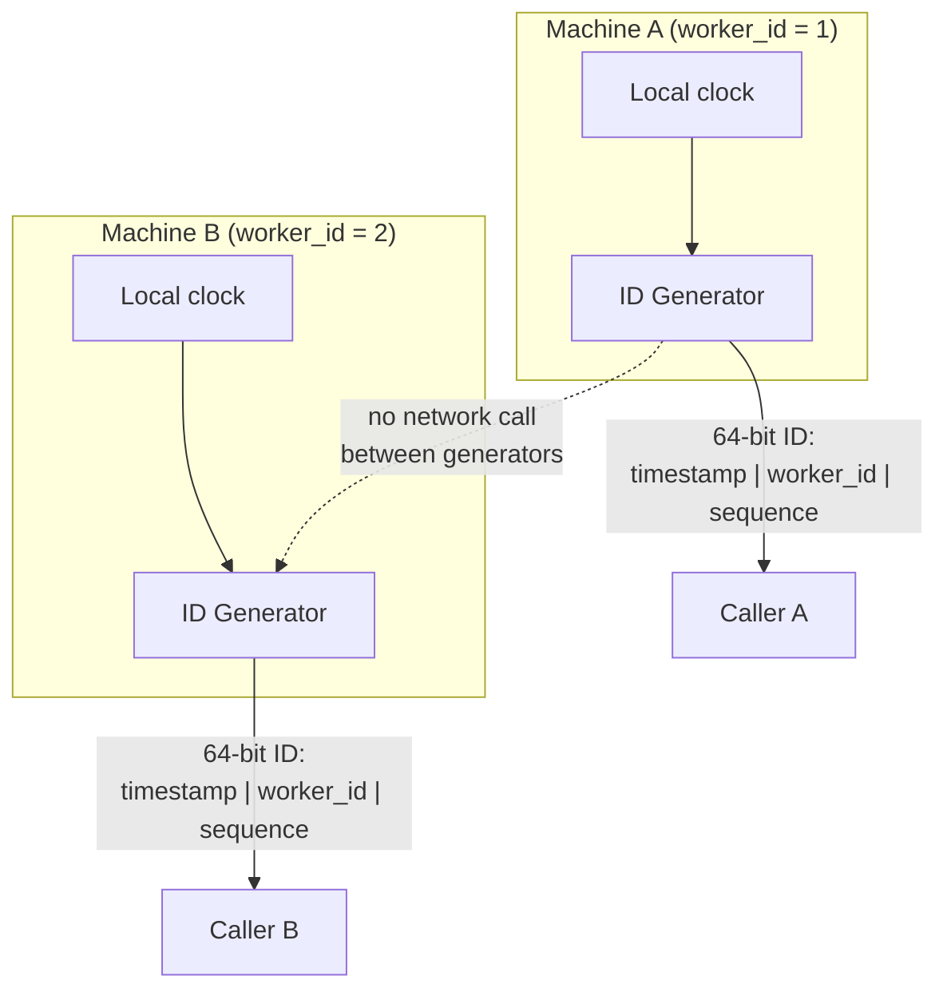

# Design a Distributed Unique ID Generator (Twitter Snowflake)

**Primarily tests**: generating globally unique, roughly time-sortable IDs across many
independent machines with **zero coordination on the hot path** — the general pattern
several other case studies in this folder assume a solution to (primary keys for the
[key-value store](../18_design_key_value_store/tutorial.md), message offsets, order
IDs) without designing it directly.

## Clarify

- Do IDs need to be roughly **sortable by creation time** (useful for pagination,
  "show me recent items," debugging), or is pure uniqueness enough? Assume
  time-sortability is required — it's what makes this harder than "just use a UUID."
- Throughput: how many IDs/second, across how many machines generating them
  concurrently? Assume tens of thousands/second per machine, thousands of machines —
  a scale where any generation scheme requiring a round-trip to a central authority
  per ID is immediately disqualified.
- Do IDs need to fit a specific bit budget (fitting in a 64-bit integer column, say),
  or is an arbitrary-length string acceptable? Assume a 64-bit integer — the
  constraint that forces the actual interesting design trade-offs below.

## High-Level Design



The diagram's most important detail is the dotted, crossed-out-feeling line between
`GenA` and `GenB`: **the entire design goal is that these two boxes never need to talk
to each other at all** — every other coordination-heavy design (a central counter
service, a database sequence) is disqualified by the throughput requirement above
before it's even evaluated.

## Deep-Dive: The Bit Layout (the core of this question)

**Mechanism**: partition a 64-bit integer into fixed-width fields, each independently
guaranteeing part of the uniqueness:

```
| 1 bit (unused/sign) | 41 bits: timestamp (ms since epoch) | 10 bits: worker/machine ID | 12 bits: sequence number |
```

- **Timestamp (41 bits)**: milliseconds since a custom epoch (not Unix epoch — using a
  more recent custom epoch, e.g. "company founding date," stretches the field's usable
  range further before it overflows: 41 bits of milliseconds is about 69 years from
  whatever epoch is chosen). This is what makes IDs **roughly time-sortable** — an ID
  generated later numerically exceeds one generated earlier, down to millisecond
  resolution, without any machine needing to know what any other machine generated.
- **Worker/machine ID (10 bits)**: a unique identifier per generating machine (up to
  1024 concurrent machines), assigned at startup — this is what makes uniqueness
  *across machines* trivial: two machines generating an ID in the exact same
  millisecond still produce different IDs because their worker-ID fields differ,
  with **no coordination between them required**.
- **Sequence number (12 bits)**: a per-machine, per-millisecond counter (up to 4096),
  incremented for each ID generated within the same millisecond on the same machine,
  reset to zero when the millisecond ticks over. This is what makes uniqueness
  *within one machine, within one millisecond* work — a single machine can generate up
  to 4096 IDs in the same millisecond before it must wait for the next millisecond
  tick (a real, named throughput ceiling per machine, not an unlimited one).

**Why the field ordering matters, specifically**: timestamp occupies the *most*
significant bits, worker ID and sequence the *least*. This ordering is what makes IDs
sort correctly by creation time as plain integers — if worker ID were the most
significant field instead, IDs would sort by machine first and time second, breaking
the "recent items" use case entirely. Getting this ordering right, and explaining
*why* it has to be this way rather than reciting "there are three fields," is the
specific signal this question is testing.

## Deep-Dive: Clock Drift and the NTP Rollback Problem

**The failure this design is exposed to**: the whole scheme assumes each machine's
local clock only moves forward. If NTP corrects a machine's clock **backward** (a
drift correction, or a bad NTP response), that machine could generate an ID with an
earlier timestamp than one it already generated — breaking both uniqueness (if the
sequence counter also happens to collide) and the time-sortability guarantee the
whole design exists to provide.

- **Detect it explicitly**: on ID generation, compare the current timestamp to the
  last timestamp this machine used. If the current time is *behind* the last used
  timestamp, that's clock drift, and it must be handled — not silently ignored.
- **The two realistic responses**: (1) **refuse to generate IDs** until the clock
  catches back up past the last-used timestamp — safe, but causes a generation outage
  on that machine for the drift's duration; (2) **borrow from the sequence/worker
  space** — some production implementations reserve a small "clock moved backward"
  flag bit or fall back to a slower, coordinated allocation path specifically during
  detected drift, accepting reduced throughput only during the rare drift window
  rather than a full outage. Naming that this is a real, handled case — not an
  unstated assumption that clocks are perfect — is the detail that separates a
  complete answer from one that only works until the first NTP correction actually
  happens in production.
- **NTP configured to only slew, never step, is the operational mitigation**: an NTP
  daemon configured for gradual slewing (nudging the clock slowly toward correct time)
  rather than an instantaneous step avoids most backward jumps in the first place —
  worth naming as the operational half of the fix, alongside the generator's own
  defensive check.

## Deep-Dive: Worker-ID Assignment — the One Piece of Coordination That Remains

**The apparent contradiction**: the design's whole point is zero coordination on the
hot path, yet each machine needs a *unique* worker ID assigned to it *somehow* — that
assignment itself is a coordination problem, just one that happens rarely (at machine
startup) instead of per-ID.

- **Static configuration**: assign worker IDs manually via deployment config (machine
  1 gets worker-id 1, etc.). Simplest, but doesn't survive machines being dynamically
  added/removed/rescheduled (exactly what happens under Kubernetes autoscaling) without
  a manual bookkeeping process alongside it.
- **A coordination service at startup, not on the hot path**: a machine claims an
  available worker ID from a small pool by writing an ephemeral, leased entry into
  Zookeeper or etcd (per the [foundations tutorial's distributed-lock
  coverage](../01_distributed_systems_foundations/tutorial.md#distributed-locks-zookeeper-etcd))
  on startup, and releases it (or the lease simply expires) on shutdown/crash. This
  keeps coordination confined to the rare "a machine is joining or leaving the
  fleet" event, never touching the per-ID generation path the throughput requirement
  is actually about.

## Trade-offs

| Decision | Option A | Option B | When to pick which |
|---|---|---|---|
| ID scheme | Snowflake-style structured 64-bit ID (time-sortable, decodable) | Random UUID v4 (simpler, no coordination at all, not sortable) | Snowflake whenever time-ordering matters for the product (pagination, "recent," debugging by inspection); UUID when uniqueness alone is the only requirement |
| Worker-ID assignment | Static config | Coordination service (etcd/Zookeeper) at startup | Coordination service for any environment where machines are added/removed dynamically (autoscaling, container orchestration) |
| Clock-drift response | Refuse to generate (safe, brief outage) | Fallback/degraded allocation during drift (available, more complex) | Refuse for the simplest correct implementation; fallback only once the added complexity is justified by an actual availability requirement during rare drift events |
| Bit-field split | Wider timestamp, narrower sequence (favors long usable lifespan) | Narrower timestamp, wider sequence (favors more IDs/ms/machine) | Depends on the product's actual per-machine peak throughput vs. how many decades the ID scheme must remain valid — a quantitative trade-off, not a default |

## Staff Altitude

A **senior** answer proposes the timestamp+worker-ID+sequence bit layout and explains
why each field exists.

A **staff** answer additionally: (1) proactively raises the clock-rollback failure
mode and names a specific handling strategy, rather than presenting the design as if
clocks are perfectly monotonic; (2) recognizes that worker-ID assignment is itself a
small, deliberately-scoped coordination problem — solving it once at startup rather
than either ignoring it or over-engineering per-ID coordination — and can explain
*why* confining coordination to that boundary is the right architectural choice; and
(3) treats the bit-field width split as a quantitative sizing decision (given actual
expected machine count and per-machine throughput) rather than reciting Twitter's
original 41/10/12 split as if it were universally correct.

## Failure Modes to Raise Proactively

- **Two machines racing to claim the same worker ID** during a coordination-service
  hiccup — the lease/claim mechanism needs to be atomic (a compare-and-swap or
  equivalent), not a read-then-write race.
- **A machine crashing and restarting with its old worker ID still marked as
  claimed** — the lease must expire (a TTL) rather than requiring explicit release,
  or a crashed machine can never rejoin under its old ID.
- **Sequence-number exhaustion under a sudden burst** (more than 4096 IDs requested
  in one millisecond on one machine) — the generator must correctly block/spin until
  the next millisecond tick rather than silently overflowing the sequence field into
  the worker-ID bits.

## Staff Follow-Ups

- "The company later needs IDs sortable across a *federation* of separate clusters,
  each running its own worker-ID pool — does this design still work unmodified, or
  does the bit layout need to change?"
- "How would you migrate from UUIDs (already in production, already stored in every
  downstream system) to this Snowflake-style scheme without a flag-day cutover?"
- "A downstream system needs to extract the creation timestamp from an ID for
  auditing purposes — what does the encode/decode contract for that look like, and
  who owns keeping it correct as the bit layout evolves?"

## Practice Variations

- Design the primary-key generation scheme for the [distributed key-value
  store](../18_design_key_value_store/tutorial.md) case study, using this design as
  the underlying mechanism.
- Extend this design to support IDs that additionally encode a **shard ID** directly
  in the bit layout, so an ID alone (not a separate lookup) is enough to route a
  request to the correct shard.
- Design a URL-shortener's key-generation scheme (the [URL shortener case
  study](../11_design_url_shortener/tutorial.md)) using this doc's coordination
  pattern instead of that doc's own approach — compare the two directly.

## Articulate It: Interview Framing & Vocabulary

### Three Ways to Explain This

- **Zero-coordination-on-the-hot-path framing (the default opening move):** "The
  entire design goal is that two machines never talk to each other to generate an
  ID — timestamp gives rough ordering, worker ID gives cross-machine uniqueness, and
  sequence gives within-machine uniqueness, each field solving a different slice of
  the problem with no network round-trip on the per-ID path."
- **Confined-coordination framing (good for the worker-ID assignment
  discussion):** "Worker-ID assignment is a real coordination problem, I wouldn't
  pretend it isn't — but I'd confine it to machine startup, a rare event, rather than
  either ignoring it or letting coordination creep into the per-ID generation path
  the whole design exists to keep fast."
- **Named-failure framing (good for the clock-drift discussion):** "I wouldn't
  present this design as if clocks are perfectly monotonic — I'd name the backward
  NTP correction explicitly as a handled case, with a specific response, rather than
  waiting for it to surface as a production incident."

### Vocabulary Builder

- **worker ID** (n. phrase) — a per-machine identifier embedded in each generated ID,
  the field that makes cross-machine uniqueness require zero runtime coordination.
- **clock rollback / NTP step** (n. phrase) — a backward jump in a machine's clock
  correction, the specific failure mode that can break both uniqueness and
  time-sortability in a timestamp-based ID scheme if left unhandled.
- **monotonic clock** (n. phrase) — a clock guaranteed to never move backward,
  the property this design's timestamp field implicitly assumes and must defend
  against violating.
- **"…confines coordination to a rare event, not the hot path"** — a fluent way to
  describe deliberately scoping a necessary coordination step to something
  infrequent (startup) rather than letting it touch a high-throughput operation.

---

---

**Previous:** [18. Distributed Key-Value Store](../18_design_key_value_store/tutorial.md)  |  **Next:** [20. Proximity/Location Search](../20_design_proximity_search/tutorial.md)
