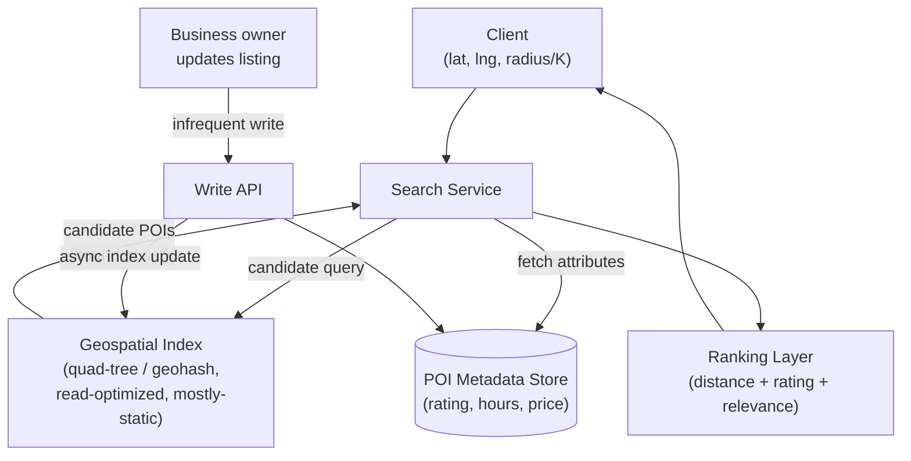

# Design Proximity/Location Search (Yelp / Google Maps "nearby")

**Primarily tests**: geospatial indexing for a **query-shaped** workload — "find the
K nearest points of interest to a location" — as distinct from the [ride-hailing
dispatch case study](../04_design_ride_hailing_dispatch/tutorial.md)'s
**matching-shaped** workload. Both lean on the same underlying geospatial index
structures, but the read/write ratio and the staleness tolerance are almost
opposite, which changes several design decisions.

## Clarify

- What's being searched for — static points of interest (restaurants, businesses,
  updated rarely) or moving entities (the dispatch case study's drivers, updated
  every few seconds)? Assume **static, business-listing-style data**: this is the
  detail that most distinguishes this problem from dispatch.
- Query shape: "K nearest neighbors" (top 20 restaurants near me), radius search
  ("everything within 2km"), or both? Assume both are needed.
- Does ranking need to combine distance with other signals (rating, price,
  open-now status), or is pure distance sufficient? Assume distance is one input to a
  larger ranking step, not the sole output — this shapes where the geospatial index
  sits in the overall pipeline.

**Reasonable assumptions to state**: tens of millions of points of interest globally,
each updated on the order of days/weeks (a business changing its hours, a new
listing), but queried extremely frequently — a **read-to-write ratio of many
thousands to one**, the opposite of dispatch's near-real-time write pattern.

## High-Level Design

## Deep-Dive: Quad-Trees vs. Geohash for a Read-Heavy, Mostly-Static Workload

**Why this workload favors a different index shape than dispatch's**: the [ride-hailing
case study](../04_design_ride_hailing_dispatch/tutorial.md#deep-dive-geospatial-indexing-the-core-of-this-question)
picks geohash/H3 largely because driver locations change every few seconds, and a
flat hash-bucket index handles high-frequency updates cheaply. This problem's data
barely changes, which opens up a structure that handles *skewed density* better at
the cost of being more expensive to update.

- **Quad-trees adapt their resolution to data density**: a quad-tree recursively
  subdivides a 2D space into four quadrants, but only *as deep as the data in that
  region requires* — a sparse rural area stays a single large cell, while a dense
  urban block (thousands of restaurants within a few hundred meters) subdivides many
  levels deeper. This is the key advantage over geohash's *fixed*-resolution cells for
  this specific workload: a fixed-size geohash cell in Manhattan and one in rural
  Montana cover the same physical area but wildly different POI counts, so a K-nearest
  query in Manhattan may need to examine far more candidates within one cell than the
  same query in Montana — a quad-tree's adaptive subdivision keeps the *candidate
  count per leaf node* roughly even instead, which is exactly the property a "give me
  the top 20 nearest" query wants.
- **The trade-off this creates**: a quad-tree is more expensive to rebalance on
  writes (inserting a point into a densely-subdivided region may trigger further
  splits) — an acceptable cost precisely *because* this workload's writes are rare,
  which is the direct opposite of why dispatch avoids this structure for its
  high-frequency driver-location updates. **Naming this workload-dependent reversal
  explicitly — the same two structures, opposite conclusion, because the read/write
  ratio flipped — is the specific signal this question is testing relative to the
  dispatch case study.**
- **Geohash remains a reasonable fallback** when engineering simplicity matters more
  than handling extreme density skew, or when the team already has geohash tooling
  (Redis geospatial commands) in place from another system — worth naming as a
  legitimate "simpler, slightly worse for this specific skew" choice, not a wrong
  answer.

## Deep-Dive: K-Nearest-Neighbor Query Execution

**The mechanism**: a KNN query against a quad-tree starts at the leaf node containing
the query point and expands outward level by level (checking the current node's
siblings, then its parent's other children, and so on) until at least K candidates
have been found *and* the search radius already covered is provably larger than the
distance to the Kth-nearest candidate found so far — at which point no undiscovered
node could possibly contain anything closer, and the search can stop.

**The bounding-box pruning that makes this fast**: at each expansion step, a node is
skipped entirely if its bounding box's *closest possible point* to the query is
already farther than the current Kth-best candidate distance — this prunes away
large swaths of the tree without visiting them, the same branch-and-bound principle
that makes spatial indexes usable instead of degenerating into a scan of nearby
nodes one at a time.

**Combining distance with other ranking signals**: a pure-distance KNN result is
rarely the final answer — a slightly farther restaurant with a much higher rating
often should outrank the literal nearest one. The standard pattern (the same
candidate-generation-then-ranking shape the [Twitter feed case
study](../02_design_twitter_feed/tutorial.md#deep-dive-ranking) uses) is: use the
geospatial index to cheaply generate a bounded candidate set (say, the 200 nearest),
then apply a full ranking model over that bounded set combining distance, rating,
price, and relevance — deliberately over-fetching on the geospatial step so the
ranking step has enough candidates to actually reorder meaningfully, not just confirm
the same nearest-first order the index already produced.

## Deep-Dive: Sharding a Geospatial Index Across Machines

**The problem at global scale**: tens of millions of POIs and a global query load
don't fit on, or get served fast enough by, a single machine's index — the index
itself needs to be sharded.

- **Geographic sharding (shard by region)** is the natural first instinct — shard 1
  owns North America, shard 2 owns Europe, etc. — but it reproduces the **same
  uneven-density problem the quad-tree already solves within one shard**, just at
  shard granularity: a "New York City" shard serves vastly more query and data
  volume than a "rural Montana" shard of similar physical size, an uneven-load
  problem worth naming proactively.
- **The fix is the same principle already established for the quad-tree**: shard
  boundaries should be drawn by *data/query density*, not by fixed physical area —
  effectively, treat the top few levels of the quad-tree itself as the sharding
  scheme (each shard owns one or more subtrees, and a very dense subtree that would
  otherwise overload one shard gets split across two). This directly reuses [Part 7's
  local-budget-plus-reconciliation
  pattern](../07_design_rate_limiter_at_scale/tutorial.md#deep-dive-the-practical-answer--local-enforcement--async-global-reconciliation)'s
  underlying idea in spirit — don't split by a naive fixed dimension when the actual
  data distribution is uneven; split by the thing that's actually uneven.
- **A query spanning a shard boundary** (the user's location and search radius touch
  two shards) requires fan-out to both shards and a merge step at the search service
  — a small, bounded fan-out (almost always 2-4 neighboring shards, never the whole
  fleet), unlike a naive design that might need to query every shard for every
  request.

## Trade-offs

| Decision | Option A | Option B | When to pick which |
|---|---|---|---|
| Index structure | Geohash (simple, fixed resolution) | Quad-tree (adaptive resolution, better under density skew) | Quad-tree once query latency under real-world density skew (dense cities) is measured to be a problem; geohash as a simpler starting point otherwise |
| Sharding scheme | Fixed geographic regions | Density-aware (subtree-based) sharding | Density-aware once one region's load is measurably disproportionate; fixed regions as a reasonable simple starting point |
| Index update path | Synchronous (index updated in the same request as the metadata write) | Asynchronous (metadata written immediately, index updated shortly after) | Asynchronous is standard here — this workload's rare, low-urgency writes (a business updating its hours) tolerate a short index-update lag far better than dispatch's driver-location writes would |
| Candidate over-fetch factor | Fetch exactly K from the geospatial index | Over-fetch (e.g. 10K) and re-rank | Over-fetch whenever ranking combines distance with other signals — fetching exactly K from a distance-only index can't be reordered by a later ranking step with nothing to reorder among |

## Staff Altitude

A **senior** answer proposes a geospatial index (geohash or quad-tree) and a KNN
query over it, and stops once nearest-neighbor search works.

A **staff** answer additionally: (1) explicitly contrasts this workload's read-heavy,
mostly-static shape against the [ride-hailing dispatch case
study](../04_design_ride_hailing_dispatch/tutorial.md)'s write-heavy, ephemeral shape
and derives the index choice *from* that contrast, rather than picking a structure by
habit; (2) recognizes that naive geographic sharding reproduces the same
density-skew problem the index structure itself was chosen to solve, and applies the
same density-aware principle at the sharding layer too; and (3) treats the
geospatial-candidate-generation step as deliberately over-fetching for a downstream
ranking stage, rather than treating "nearest" as if it were already the final
answer.

## Failure Modes to Raise Proactively

- **A dense urban area's query load overwhelming its shard** even after density-aware
  sharding — this is the geospatial version of the [distributed cache case
  study](../05_design_distributed_cache/tutorial.md#deep-dive-the-hot-key-problem)'s
  hot-key problem, needing the same kind of read-replica fan-out for that specific
  hot shard rather than assuming sharding alone fully solves uneven load.
- **A newly-opened business not appearing in search immediately** due to the
  asynchronous index-update lag — needs the lag to be a bounded, monitored SLA (e.g.
  "under 5 minutes"), not an unstated, unbounded delay.
- **A query near a shard boundary silently missing nearby results** if the fan-out
  logic doesn't correctly identify *all* shards whose region could contain a
  closer-than-current-Kth-best candidate — this is the sharded-index analog of the
  [ride-hailing case study's cell-boundary
  problem](../04_design_ride_hailing_dispatch/tutorial.md#deep-dive-geospatial-indexing-the-core-of-this-question),
  the same edge case recurring at shard granularity instead of cell granularity.

## Staff Follow-Ups

- "How would you support a filtered search — 'nearby vegan restaurants open right
  now' — without the geospatial index needing to know anything about cuisine type or
  hours?"
- "A single very popular landmark (a stadium, an airport) causes a query hot-spot at
  one specific point rather than one dense region — how does that differ from the
  general density-skew problem, and does it need a different fix?"
- "Walk through what changes about this design if 'nearby' needs to account for
  actual travel time (accounting for a river or highway between two physically close
  points) instead of straight-line distance."

## Practice Variations

- Design the ride-hailing dispatch system's geospatial index (the [existing case
  study](../04_design_ride_hailing_dispatch/tutorial.md)), and compare directly which
  design decisions flip because of the write-heavy, ephemeral data shape.
- Extend this design to support "search along a route" (points of interest near a
  driving path, not a single point).
- Design a real-estate/property search system (similar proximity search, plus
  polygon/boundary containment queries — "is this point within this school
  district's boundary" — a related but distinct geospatial primitive).

## Articulate It: Interview Framing & Vocabulary

### Three Ways to Explain This

- **Same-primitive-opposite-conclusion framing (the default, and the strongest
  signal relative to the dispatch case study):** "This uses the same family of
  geospatial index as ride-hailing dispatch, but the read/write ratio is basically
  inverted — dispatch is write-heavy and ephemeral, this is read-heavy and
  mostly-static — and that single difference is what makes a quad-tree, not
  geohash, the better default here."
- **Density-follows-you-up framing (good for the sharding discussion):** "Naive
  geographic sharding just moves the same density-skew problem the index structure
  was chosen to solve up one layer — a 'New York shard' and a 'rural Montana shard'
  have wildly different load even at equal physical area, so I'd shard by data
  density, not fixed geography, for the same reason I picked a quad-tree in the
  first place."
- **Deliberate-over-fetch framing (good for the ranking discussion):** "I wouldn't
  treat 'nearest K' as the final answer — I'd over-fetch from the geospatial index
  deliberately, so a downstream ranking step combining distance with rating and
  relevance actually has candidates worth reordering, instead of confirming the same
  order the index already produced."

### Vocabulary Builder

- **quad-tree** (n.) — a spatial index that recursively subdivides 2D space only as
  deep as local data density requires, adapting resolution to where data actually is
  rather than using a fixed cell size everywhere.
- **branch-and-bound pruning** (n. phrase) — skipping an entire subtree during a
  nearest-neighbor search once its closest possible point is already farther than the
  current best candidate, avoiding the cost of visiting it at all.
- **density-aware sharding** (n. phrase) — drawing shard boundaries by data/query
  volume rather than fixed physical area, so no single shard ends up disproportionately
  loaded relative to others of the same geographic size.
- **"…the same structure, the opposite conclusion, because the read/write ratio
  flipped"** — a fluent way to show a design choice was derived from the workload's
  shape, not picked out of habit, especially when directly contrasting two related
  case studies.

---

---

**Previous:** [19. Distributed Unique ID Generator](../19_design_unique_id_generator/tutorial.md)  |  **Next:** [21. Real-Time Leaderboard](../21_design_realtime_leaderboard/tutorial.md)
