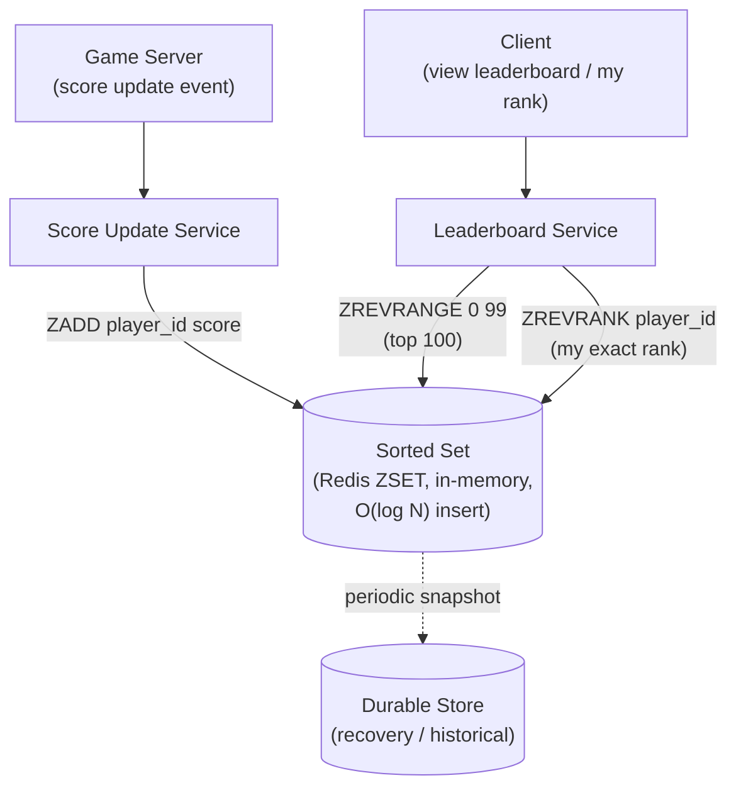

# Design a Real-Time Leaderboard (Gaming / Ranking System)

**Primarily tests**: maintaining a globally ranked, continuously updated ordering
under extremely high write volume, and the specific trade-off between *exact* rank
and *approximate but cheap* rank — a data-structure-selection problem that looks
simple at small scale and becomes genuinely hard once "what's my rank out of 50
million players" needs to answer in milliseconds.

## Clarify

- What's actually needed: a player's exact numeric rank ("you are #14,382,190"), just
  the top-N display (top 100 shown on a screen), or both? Assume both are required —
  the top-N case alone is much easier and doesn't reveal the interesting problem.
- Write volume: how often do scores update, and for how many concurrent players? Assume
  a live competitive game — scores update continuously during active play, for tens
  of millions of concurrent players, meaning the leaderboard's underlying structure
  is being mutated constantly, not just read.
- Does rank need to be **globally exact** at all times, or is a brief staleness (a
  player's displayed rank lagging their true rank by a second or two) acceptable?
  Assume brief staleness is acceptable — this is the single answer that unlocks the
  practical design below, the same overshoot-style question the [rate limiter case
  study](../07_design_rate_limiter_at_scale/tutorial.md#clarify) asks first for its
  own problem.

## High-Level Design

## Deep-Dive: Why a Sorted Set, Specifically (the core of this question)

**The naive approach and why it fails**: storing scores in a regular table and
computing rank with `SELECT COUNT(*) WHERE score > my_score` on every rank lookup is
an O(N) scan per query — completely infeasible at millions of concurrent players
each checking their rank frequently.

**The mechanism a sorted-set structure provides**: a **skip list** (Redis's ZSET
implementation) keeps elements ordered by score with O(log N) insert, O(log N)
rank-lookup, and O(log N + M) range queries (fetching M consecutive ranked elements,
e.g. the top 100) — every operation this problem needs is logarithmic, not linear,
in the total player count. This single data-structure choice is what makes "what's my
exact rank out of 50 million" answerable in milliseconds rather than requiring a
full scan or a precomputed, quickly-stale batch job.

**Why not a plain sorted list or array**: an array kept sorted by score would give
O(1) rank lookup by index, but O(N) insert (shifting elements to maintain order) —
exactly backward for this workload, where inserts (score updates) happen constantly
and far outnumber any single rank lookup. A skip list's O(log N) *insert* is the
specific property that makes it fit a write-heavy, continuously-updating leaderboard,
where an array would fit a read-heavy, rarely-updated one.

## Deep-Dive: Sharding the Leaderboard at Extreme Scale

**The problem a single sorted set eventually hits**: one Redis instance holding a
sorted set of 50M+ players, receiving continuous concurrent writes, becomes both a
memory-capacity and a single-threaded-throughput bottleneck (Redis processes commands
on one thread per shard).

- **Sharding by a hash of player ID** solves the throughput/capacity problem but
  **breaks global rank directly** — a player's rank *within their own shard* is cheap
  to compute, but their *true global rank* requires knowing how many players across
  *all* shards outrank them, which a single-shard skip list can't answer on its own.
- **The practical fix — the same local-plus-aggregation shape as the [rate limiter
  case study's multi-region
  design](../07_design_rate_limiter_at_scale/tutorial.md#deep-dive-the-practical-answer--local-enforcement--async-global-reconciliation)**:
  maintain a skip list per shard (fast local operations), and periodically aggregate
  each shard's score distribution into a smaller, coarser global index — e.g. a
  histogram of "how many players in this shard have a score above X," refreshed every
  few seconds. A global rank query then combines the requester's exact local rank
  with the aggregated counts from all *other* shards, giving an answer that's exact
  as of the last aggregation cycle — **explicitly bounded, brief staleness, the same
  named-parameter discipline the rate limiter case study establishes for its own
  overshoot bound**, applied here to rank freshness instead of enforcement accuracy.
- **Top-N display (the leaderboard screen) is actually simpler at scale than exact
  individual rank**: merging the top 100 from each of, say, 20 shards (2,000
  candidates total) and re-sorting that small merged set to find the true global top
  100 is cheap regardless of total player count — this is why "what's the top 100"
  and "what's my exact rank" have genuinely different scaling stories, worth stating
  explicitly rather than assuming one solution serves both.

## Deep-Dive: Tie-Breaking and Score-Update Semantics

**A subtle correctness detail**: two players with the identical score need a
deterministic, stable secondary ordering (earliest-to-reach-that-score wins ties,
commonly) — without one, "my rank" can visibly flicker between two values on
repeated queries for tied players, which reads as a bug even though the primary score
comparison is completely correct. The fix is a **composite sort key** (score,
then a tiebreaker such as timestamp-of-last-update or player ID) rather than relying
on score alone, encoded as a single sortable value the skip list can order on
directly (e.g. packing score into the high bits and a negated timestamp into the low
bits of one numeric key) — naming this proactively is the specific detail
distinguishing "the leaderboard sorts correctly" from "the leaderboard sorts
correctly and never visibly flickers for the large fraction of players who end up
tied."

## Trade-offs

| Decision | Option A | Option B | When to pick which |
|---|---|---|---|
| Underlying structure | Sorted relational table + scan | Skip list / sorted set (Redis ZSET) | Sorted set for any workload with frequent writes and frequent rank queries — the scan approach is only viable at small scale or infrequent lookups |
| Rank freshness | Strictly exact at all times (synchronous cross-shard query per lookup) | Approximate, refreshed every few seconds (async aggregation) | Approximate almost always — exact-at-all-times reintroduces a cross-shard synchronous cost on every single rank query, at a scale where that's the exact bottleneck sharding exists to avoid |
| Sharding key | Hash of player ID (even load, breaks global rank) | Range/score-based sharding (preserves rank locality, uneven load) | Hash-based is the standard default; score-based sharding is rarely worth its uneven-load cost unless global rank needs to stay computable without any aggregation step at all |
| Persistence | In-memory only (fast, lost on crash) | In-memory + periodic durable snapshot | Periodic snapshot for any leaderboard with real business/competitive stakes — in-memory-only is acceptable only for a purely cosmetic, non-competitive display |

## Staff Altitude

A **senior** answer proposes a Redis sorted set and gets single-instance rank/top-N
queries working correctly.

A **staff** answer additionally: (1) proactively identifies that sharding breaks
global rank *before* being asked, and proposes the local-skip-list-plus-periodic-
aggregation pattern as the direct consequence, explicitly naming it as the same
architectural shape as other local-plus-reconciliation designs in this folder rather
than treating it as a novel one-off; (2) states the rank-staleness bound as an
explicit, quantified design parameter ("exact as of the last N-second aggregation
cycle") rather than presenting the sharded design as if it still returns perfectly
exact rank; and (3) separates the top-N and exact-individual-rank query paths as
having genuinely different scaling properties, rather than assuming one mechanism
serves both equally well.

## Failure Modes to Raise Proactively

- **A shard becoming hot** because one region's players are disproportionately
  active during a live event — the same hot-shard problem as the [distributed
  cache case study](../05_design_distributed_cache/tutorial.md#deep-dive-the-hot-key-problem),
  needing rebalancing or read-replica fan-out for that specific shard.
- **The aggregation job falling behind under load**, silently widening the
  rank-staleness bound past its designed value — needs its own monitoring, the exact
  same failure mode the [rate limiter case study names for its reconciliation
  aggregator](../07_design_rate_limiter_at_scale/tutorial.md#failure-modes-to-raise-proactively).
- **A crash losing recent score updates that hadn't yet been snapshotted** — the
  durable-store write path needs a replay/recovery mechanism (a write-ahead log of
  recent score deltas) rather than assuming the periodic snapshot alone is sufficient
  durability.

## Staff Follow-Ups

- "The game needs per-region *and* global leaderboards simultaneously — does this
  design extend cleanly, or does it need a fundamentally different structure?"
- "A player's score needs to reset at the start of each new competitive season —
  walk through exactly how that reset happens without a visible outage or an
  inconsistent leaderboard mid-transition."
- "How would you detect and handle a cheating player whose score updates arrive at
  an implausible rate — does that detection belong in this system, or upstream of
  it?"

## Practice Variations

- Design a "trending now" ranking system (similar sorted-structure problem, but the
  score itself decays over time rather than being monotonically increasing).
- Extend this design to support percentile-based rank ("you're in the top 5%")
  instead of, or alongside, absolute numeric rank.
- Design the ad-click aggregation pipeline's own real-time dashboard ranking (the
  [existing case study's practice
  variations](../17_design_ad_click_aggregation/tutorial.md#practice-variations)
  names this connection directly) using this doc's sharded-skip-list pattern.

## Articulate It: Interview Framing & Vocabulary

### Three Ways to Explain This

- **Logarithmic-everything framing (the default opening move):** "The whole design
  hinges on picking a structure where insert, rank lookup, and range query are all
  O(log N) — a skip list, not an array or a naive scan — because this workload has
  both heavy writes and frequent rank reads, and any structure optimized for only one
  of those falls over on the other."
- **Named-staleness framing (good for the sharding discussion, and the strongest
  cross-reference in this doc):** "Sharding breaks exact global rank the same way it
  breaks a rate limiter's exact global count — I'd propose the same local-plus-
  periodic-aggregation shape and state the rank-staleness bound explicitly, rather
  than pretending the sharded version still returns perfectly exact rank."
- **Two-different-problems framing (good for distinguishing top-N from individual
  rank):** "Top-N and 'what's my exact rank' look like the same feature but scale
  completely differently — merging a handful of shards' top-100 lists is cheap
  regardless of total players, while exact individual rank needs the aggregated
  cross-shard count. I'd design for both explicitly rather than assuming one
  mechanism covers both."

### Vocabulary Builder

- **skip list** (n. phrase) — a probabilistic, layered linked-list structure giving
  O(log N) insert, delete, and ordered-rank operations; the data structure behind
  Redis's sorted set and the reason this problem is tractable at scale.
- **composite sort key** (n. phrase) — packing a primary value (score) and a
  tiebreaker (timestamp, ID) into one sortable key, avoiding visible rank flicker
  among tied entries.
- **rank staleness bound** (n. phrase) — the maximum age of the cross-shard
  aggregation a sharded leaderboard's exact-rank answer can lag behind, stated as an
  explicit design parameter rather than left as an unstated approximation.
- **"…the same local-plus-aggregation shape, just applied to rank instead of
  enforcement"** — a fluent way to connect this design back to an already-established
  pattern elsewhere, signaling the architecture isn't a one-off invention.

---

---

**Previous:** [20. Proximity/Location Search](../20_design_proximity_search/tutorial.md)  |  **Next:** [22. Distributed Logging & Metrics Pipeline](../22_design_logging_metrics_pipeline/tutorial.md)
