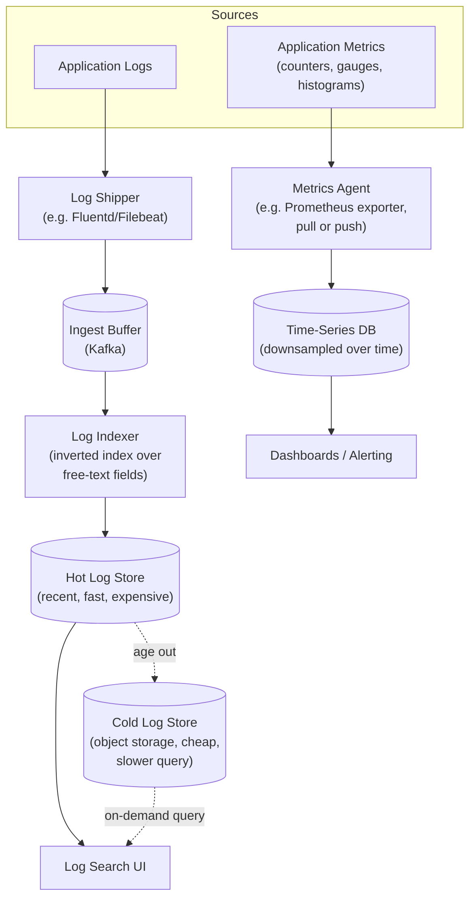

# Design a Distributed Logging & Metrics Pipeline (ELK / Prometheus at Scale)

**Primarily tests**: high-cardinality time-series storage, the fundamentally
different ingestion/query shapes of logs vs. metrics (despite both being called
"observability data"), and cost-control at a volume where naive "store everything
forever" is financially, not just technically, infeasible. Directly complements the
hands-on Evidently/Prometheus/Grafana/Loki/ELK stacks already built in this
repo's [`platform-lab/mlops_aiops/`](../../../mlops_aiops/) — this doc is the
system-design version of infrastructure that folder runs for real.

## Clarify

- Logs, metrics, or both? Assume both, explicitly — they're routinely conflated as
  "observability" but have almost opposite storage and query characteristics, and
  naming that difference up front is most of this question's actual signal.
- Retention and query patterns: are recent logs/metrics (last 24-48h) queried far
  more than historical data, or is long-range historical query (compare this month to
  last year) equally common? Assume the standard skew — recent data is queried
  constantly, historical data rarely but occasionally needed for compliance/trend
  analysis — since that skew is what justifies a tiered storage design.
- Scale: assume tens of thousands of hosts/containers, each emitting metrics every
  10-60 seconds and a continuous log stream, aggregating to billions of log lines and
  metric data points per day.

## High-Level Design

## Deep-Dive: Logs vs. Metrics Are Not the Same Storage Problem

**Why this distinction is the actual crux of the question**: both get lumped under
"observability," but a log line is an **arbitrary, unstructured (or semi-structured)
text blob** queried by full-text/field search, while a metric is a **fixed-schema
numeric time series** (a name, a set of label key-value pairs, a timestamp, a
number) queried by aggregation over time. Treating them as the same storage problem
— storing metrics in a text-search index, or logs in a time-series database — is a
correctness-adjacent mistake that shows up as either unusably slow queries or
unusably expensive storage, not just a suboptimal choice.

- **Logs need an inverted index** (mapping each distinct token/term back to which
  documents contain it) to make free-text search fast — this is the same underlying
  data structure a [web search engine](../09_design_web_crawler/tutorial.md) or the
  [search autocomplete case study](../10_design_search_autocomplete/tutorial.md)
  relies on, applied to log lines instead of web pages.
- **Metrics need a time-series-optimized store**, not a general document index —
  because a metric's schema (name + labels + timestamp + value) is fixed and highly
  regular, specialized time-series databases (Prometheus's own TSDB, InfluxDB) exploit
  that regularity for extreme write throughput and highly efficient columnar-style
  compression (storing near-identical adjacent values, e.g. a mostly-flat CPU
  gauge, in far less space than a generic row-oriented store would).
- **The one place they genuinely converge**: both eventually need to support
  "correlate this alert with what was happening in the logs at that exact timestamp"
  — the design implication is that both stores share a common timestamp-and-service
  tagging convention (the same `trace_id`/`service`/`host` labels on both sides) so a
  human or an automated system can pivot from one to the other, even though the
  underlying storage engines remain entirely separate.

## Deep-Dive: High Cardinality — Where Metrics Storage Actually Breaks

**The problem, concretely**: a metric like `http_requests_total{method, status,
endpoint, user_id}` — adding `user_id` as a label seems harmless, but a time-series
database stores **one independent time series per unique combination of label
values**. With millions of distinct `user_id`s, this single metric name explodes
into millions of independent time series, each with its own storage overhead — this
is the **cardinality explosion**, and it's the single most common way a metrics
pipeline silently becomes unaffordable or falls over under load, not from raw data
*volume* but from label *combinatorics*.

- **The fix is architectural, not just "use fewer labels"**: high-cardinality
  dimensions (user ID, request ID, specific error message text) belong in **logs or
  traces**, which are built for per-event granularity, not in metric labels, which
  are built for aggregation across a bounded set of dimensions (service, region,
  status code — dozens to low thousands of combinations, not millions). Naming this
  as *the* design rule for what belongs in a metric label versus a log field —
  rather than a vague "keep cardinality reasonable" — is the specific signal this
  sub-problem is testing.
- **Detecting it before it's a production incident**: a metrics pipeline should
  track its own **active series count** and alert on it climbing unexpectedly — the
  same "the aggregator itself needs monitoring, not just the thing it monitors"
  discipline the [rate limiter case study names for its reconciliation
  aggregator](../07_design_rate_limiter_at_scale/tutorial.md#failure-modes-to-raise-proactively),
  applied to the observability system's own health instead of the primary system it
  observes.

## Deep-Dive: Tiered Retention and Downsampling — Making "Store Everything" Affordable

**The core cost problem**: storing every raw log line and every metric data point
at full resolution forever is not a technical impossibility, it's a **cost**
impossibility — the standard fix is to make both freshness and resolution
explicitly tiered, trading fidelity for cost as data ages.

- **Metrics: downsampling over time**. Raw 10-second-resolution data points are kept
  at full resolution for a short window (e.g. 24-48h, matching the "recent data
  queried constantly" access pattern from the clarifying question), then
  progressively downsampled — averaged/aggregated into 5-minute buckets after a few
  days, hourly buckets after a few weeks — trading query resolution for a large,
  compounding storage reduction the further back in time a query reaches. A
  dashboard asking "what was CPU usage a year ago" gets an hourly-resolution answer,
  which is exactly the resolution that question actually needs; a dashboard asking
  "what happened 10 minutes ago" gets full 10-second resolution, which *that*
  question needs.
- **Logs: hot/cold tiering by age**, not by resolution reduction (a log line can't
  be meaningfully "downsampled" the way a numeric metric can) — recent logs (last
  24-48h) live in a fast, expensive, fully-indexed hot store; older logs move to
  cheap object storage (S3-class), either with a reduced or rebuilt-on-demand index,
  trading query latency (a historical search takes seconds instead of milliseconds)
  for a large storage-cost reduction.
- **This is the same speed-vs-cost trade-off already established for the
  [distributed message queue's log-structured
  storage](../06_design_distributed_message_queue/tutorial.md#deep-dive-log-structured-storage-why-its-fast)
  and the [rate limiter's exact-vs-approximate
  trade-off](../07_design_rate_limiter_at_scale/tutorial.md#trade-offs)**, applied to
  a third dimension — *retention resolution over time* rather than *write speed* or
  *enforcement accuracy* — worth naming explicitly as the same underlying discipline
  recurring, not a new idea invented fresh for this problem.

## Trade-offs

| Decision | Option A | Option B | When to pick which |
|---|---|---|---|
| Metrics vs. logs storage | One unified store for both | Separate, purpose-built stores (TSDB + log index) | Separate stores, almost always at real scale — a unified store optimizes for neither workload's actual access pattern |
| Label cardinality | Allow high-cardinality labels (user ID, request ID) on metrics | Restrict metric labels to bounded dimensions; push high-cardinality data to logs/traces | Restrict labels as the default rule; the "allow it" option is really just cardinality explosion waiting to happen |
| Retention resolution | Full resolution retained indefinitely | Tiered downsampling (metrics) / hot-cold tiering (logs) as data ages | Tiered, almost always — full-resolution-forever is a cost problem at any meaningful scale and retention length |
| Log indexing scope | Index every field of every log line | Index a bounded, deliberately chosen set of fields (service, level, trace ID) plus full-text on the message body | Bounded indexing — indexing every field of unstructured logs reproduces the same unbounded-cost problem as unrestricted metric cardinality, just in a different subsystem |

## Staff Altitude

A **senior** answer proposes shipping logs to Elasticsearch and metrics to
Prometheus, and gets basic ingestion and dashboards working.

A **staff** answer additionally: (1) names the logs-vs-metrics storage-shape
distinction explicitly and unprompted, rather than treating "observability
pipeline" as one undifferentiated problem; (2) identifies cardinality explosion as
an architectural rule (what belongs in a label vs. a log field) rather than a vague
"watch your cardinality" caution, and proposes monitoring the pipeline's own active
series count as a first-class concern; and (3) treats retention/resolution tiering
as a deliberate, quantified cost-vs-fidelity trade-off — stating the tier boundaries
as explicit parameters — rather than an implementation detail glossed over after the
ingestion path is designed.

## Failure Modes to Raise Proactively

- **A single misbehaving service label-exploding a metric** (a bug that includes a
  raw request ID in a label instead of the intended bounded dimension) — needs a
  cardinality *limit* enforced at ingestion (reject or drop label combinations
  beyond a configured ceiling), not just after-the-fact detection once storage is
  already strained.
- **The ingest buffer (Kafka) falling behind during a log-volume spike** (an
  incident causing every service to log far more than usual, at exactly the moment
  observability matters most) — needs the same backpressure handling as [Part 18's
  message-queue
  coverage](../../system_design_foundation/00_prerequisite_concepts/18_message_queues_and_event_driven_semantics.md#backpressure-what-happens-when-the-consumer-cant-keep-up),
  with an explicit decision about which data (if any) gets sampled/dropped under
  extreme load rather than silently falling further behind.
- **Downsampled historical data being queried as if it were full-resolution** — a
  dashboard silently showing hourly-averaged data as if it were a live 10-second
  reading during an incident retrospective can mislead an on-call engineer; the
  query layer needs to surface the actual resolution being returned, not just the
  numbers.

## Staff Follow-Ups

- "A postmortem needs to correlate a metric spike with the exact log lines from the
  same five-second window, across a dozen services — walk through exactly how that
  query works given metrics and logs live in two entirely separate stores."
- "The company wants to cut observability infrastructure cost by 40% without losing
  incident-response capability — what do you cut first, and how do you justify that
  choice isn't just guessing?"
- "How would you support distributed tracing (a third observability signal) on top
  of this design — does it need its own storage tier, or can it reuse one of the
  existing two?"

## Practice Variations

- Design the ad-click aggregation pipeline's real-time dashboard path (the
  [existing case study](../17_design_ad_click_aggregation/tutorial.md#practice-variations)
  names this connection directly) using this doc's metrics/downsampling design.
- Extend this design to support real-time alerting (a rule evaluated continuously
  against the live metrics stream, not just a dashboard query) — what changes about
  the storage/query path to support sub-minute alert latency?
- Walk through deploying a real version of this stack using this repo's own
  [`mlops_aiops/` Prometheus/Grafana/Loki/ELK
  examples](../../../mlops_aiops/) instead of just diagramming it.

## Articulate It: Interview Framing & Vocabulary

### Three Ways to Explain This

- **Two-different-problems framing (the default opening move):** "Logs and metrics
  get lumped together as 'observability,' but they're different storage problems —
  unstructured text needing an inverted index versus fixed-schema numeric time
  series needing a columnar time-series store. I'd name that split immediately rather
  than proposing one pipeline for both."
- **Labels-vs-log-fields framing (good for the cardinality discussion):** "The rule
  I'd apply is architectural, not just 'be careful with cardinality' — bounded
  dimensions like service and status code belong in metric labels, anything
  per-event and high-cardinality like a user ID or request ID belongs in logs or
  traces instead, because that's what each storage engine is actually built to
  handle cheaply."
- **Named-tier framing (good for the retention/cost discussion):** "I wouldn't
  present 'store everything forever' as free — I'd state the tier boundaries
  explicitly: full resolution for the first day or two, progressively downsampled
  after that, the same speed-vs-cost trade-off already showing up elsewhere in this
  set of designs, just applied to retention instead of write throughput or
  enforcement accuracy."

### Vocabulary Builder

- **cardinality explosion** (n. phrase) — a metric's independent time-series count
  growing combinatorially with the number of distinct label-value combinations,
  the single most common way a metrics pipeline becomes unaffordable.
- **downsampling** (n.) — progressively reducing a time series's stored resolution
  as it ages, trading query precision for a large, compounding storage reduction.
- **inverted index** (n. phrase) — a structure mapping each distinct term back to
  the documents (here, log lines) containing it, the mechanism that makes full-text
  log search fast.
- **"…a cost impossibility, not a technical one"** — a fluent way to frame
  "store everything forever" as a budget decision rather than an engineering
  limitation, reframing a retention discussion around the actual constraint.

---

---

**Previous:** [21. Real-Time Leaderboard](../21_design_realtime_leaderboard/tutorial.md)  |  **Next:** [23. Real-Time Ad Auction / Bidding](../23_design_ad_auction_bidding/tutorial.md)
