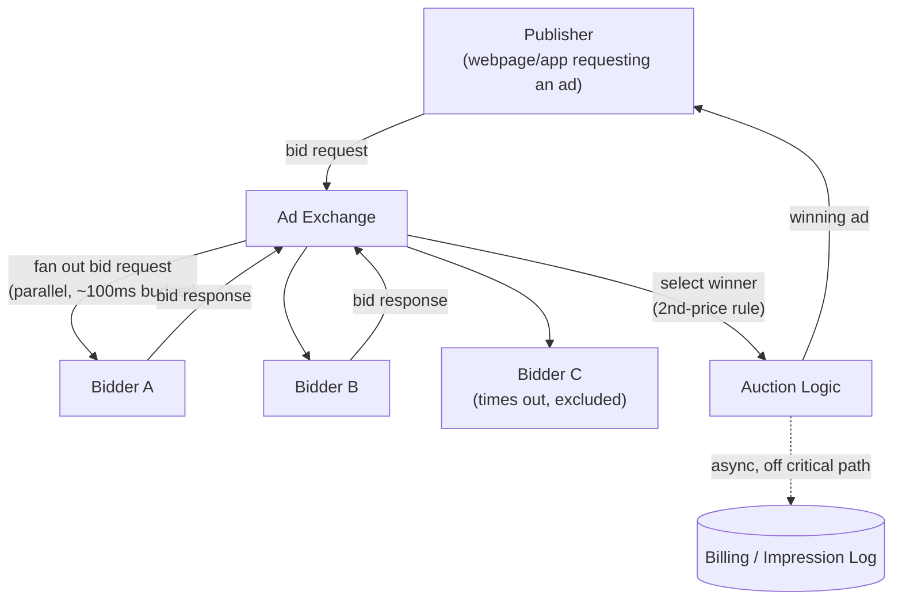

# Design a Real-Time Ad Auction / Bidding System (RTB)

**Primarily tests**: correctness and business-logic execution under an extremely
strict, non-negotiable latency budget — the opposite emphasis from the [ad click
aggregation case study](../17_design_ad_click_aggregation/tutorial.md), which is
about aggregating events *after* an ad has already been shown. This one is about
deciding, in real time, **which ad wins the right to be shown at all**, in under
~100ms end-to-end, across potentially hundreds of competing bidders.

## Clarify

- What's the actual latency budget, end to end, and who imposes it? Assume the
  industry-standard **~100-120ms total budget** for the entire round trip (ad
  exchange → every participating bidder → collect responses → pick a winner → render),
  imposed by the ad exchange's own timeout, not a soft internal target — a bidder that
  doesn't respond in time is simply excluded from that auction, not penalized later.
- Auction type: first-price (winner pays their own bid) or second-price (winner pays
  the second-highest bid plus a small increment)? Assume second-price (Vickrey-style)
  as the classic version — it changes what a *rational* bidder should even bid,
  which matters for the business-logic discussion below.
- Does this design build the **bidder** (one participant deciding whether/how much to
  bid) or the **exchange** (the auctioneer coordinating many bidders)? Assume the
  **exchange** — the harder, more infrastructure-shaped side of this problem, though
  the bidder's own internal latency budget is a real constraint the exchange design
  must account for.

## High-Level Design

## Deep-Dive: The Latency Budget Is the Design (the core of this question)

**Why this is fundamentally different from most other case studies in this
folder**: almost every other design here treats latency as *something to
optimize*; this one treats a specific latency number as a **hard, externally
imposed constraint that determines correctness**, not just user experience — a
bidder that responds in 150ms when the budget is 100ms hasn't given a slow answer,
it has given **no answer at all**, because the exchange has already moved on
without it.

- **This forces "fail fast, partial-result-tolerant" as the exchange's core
  design principle**: the exchange cannot wait for all bidders — it must proceed
  with whichever bid responses arrived within the budget and treat the rest as
  simply absent, the same fail-fast philosophy the [rate limiter tutorial names for
  rejecting cheaply before load-balancing
  cost](../07_design_rate_limiter_at_scale/tutorial.md#deep-dive-where-the-rate-limiter-sits-relative-to-the-load-balancer),
  but applied to an entire distributed auction instead of one request.
- **The budget must be sub-divided and enforced internally, not just as one outer
  number**: ~100ms total decomposes into a bidder-fan-out budget (say 70-80ms,
  leaving room for network round-trip both ways), plus the exchange's own
  auction-logic and response-formatting time — each bidder must independently
  respect a *tighter* internal deadline than the outer budget, because their own
  response still has to travel back across the network and be processed before the
  outer deadline expires. Naming this budget decomposition explicitly — not just
  "we have 100ms" — is the specific signal this sub-problem tests.
- **What this rules out, architecturally**: any bidder-side dependency that can't
  reliably respond within its slice of the budget (a synchronous call to a slow
  user-profile database, a large ML model with unpredictable inference latency) is
  disqualified from the bidder's real-time path entirely — bidder-side ML scoring
  models for RTB are specifically built and served (quantized, cached feature
  lookups, aggressive timeouts of their own) around this constraint, not adapted
  from a slower offline model as-is.

## Deep-Dive: Second-Price Auction Mechanics and Why the Rule Matters

**The mechanism**: the highest bidder wins, but pays only the **second-highest
bid** (plus a small increment, e.g. $0.01) rather than their own bid.

**Why this isn't just an arbitrary pricing rule — it changes bidder behavior,
which the exchange design must account for**: in a second-price auction, a
bidder's dominant strategy is to bid their **true valuation** of the impression —
bidding higher risks overpaying if they win against a bid between their true value
and their inflated bid; bidding lower only risks losing auctions they'd have
profitably won, with no benefit. This means the exchange can trust that (rational)
bid amounts reflect real valuations, which matters for how the exchange reasons
about fraud detection and bid-shading defenses (see below) — a first-price auction
gives bidders an incentive to strategically underbid relative to their true
valuation instead, which is a fundamentally different bidding landscape the
exchange would need to model differently.

**A subtle correctness requirement this creates**: the exchange must compute and
log the second-highest bid, not just the winning one — a design that only retains
"the winner and what they bid" cannot correctly bill under second-price rules, and
this detail is easy to miss if the auction logic is designed around "who wins"
without equally designing around "what do they actually pay."

## Deep-Dive: Fraud, Bid-Shading, and Why Billing Is Deliberately Off the Critical Path

**The problem**: the auction's real-time decision (who wins, what they pay) happens
under a hard ~100ms budget with no room for expensive fraud-detection logic (bot
traffic inflating impression counts, a publisher spoofing traffic) — but billing
still has to be accurate, and fraud still has to be caught.

- **The fix is the same two-tier pattern the [ad click aggregation case
  study](../17_design_ad_click_aggregation/tutorial.md#deep-dive-two-tiers-stream-for-speed-batch-for-truth)
  already establishes**: the real-time auction path makes a fast decision under the
  hard budget and logs the raw event; a **separate, asynchronous reconciliation
  path** (off the critical path entirely) re-evaluates impressions for fraud
  signals, applies billing adjustments, and issues credits/holds for
  detected-fraudulent impressions after the fact. This is deliberately **not** solved
  by making the real-time path slower and more careful — that would violate the
  latency budget that makes the auction possible at all.
- **Bid-shading** (a bidder using historical auction data to predict the likely
  second-price and shade their bid just above it rather than their true valuation)
  is itself an entire optimization problem bidders solve on their own side — worth
  naming as existing, without needing to design the bidder's own strategy, since
  this doc scopes to the exchange side.

## Trade-offs

| Decision | Option A | Option B | When to pick which |
|---|---|---|---|
| Missing-bidder handling | Wait for all bidders (accurate, violates latency budget) | Proceed with whichever responses arrived in time (fast, some bidders excluded) | Proceed-with-partial-results always — waiting for stragglers isn't actually available as a choice once the budget is externally imposed by the exchange's own timeout |
| Auction pricing rule | First-price (pay your own bid) | Second-price (pay second-highest bid) | Second-price for the classic RTB design — it produces truthful bidding as a dominant strategy, simplifying how the exchange can reason about bid amounts |
| Fraud handling | Inline, blocking the real-time auction decision | Asynchronous, post-hoc reconciliation | Asynchronous, always — inline fraud detection at auction-decision time is incompatible with the latency budget |
| Bidder timeout enforcement | Soft (log slow bidders, still count their bid if it arrives) | Hard (bid is void if it arrives after the deadline, no exceptions) | Hard — a soft timeout reintroduces unbounded latency risk into a system whose entire value proposition is a guaranteed response window |

## Staff Altitude

A **senior** answer proposes fanning out bid requests to bidders and picking the
highest bid, and gets the happy path working.

A **staff** answer additionally: (1) treats the ~100ms budget as the design's
central constraint from the start, decomposing it into sub-budgets (bidder
fan-out, network round trip, auction logic) rather than treating "be fast" as a
generic goal to optimize later; (2) explicitly separates real-time auction
decisioning from asynchronous fraud/billing reconciliation, naming *why* they can't
share one critical path rather than proposing inline fraud checks and only later
discovering they blow the budget; and (3) understands that the pricing rule
(second-price) isn't just a billing detail but actively shapes bidder incentives,
and reasons about the exchange's design in light of that — e.g., knowing bid
amounts can be trusted as closer to true valuations under second-price rules than
first-price ones.

## Failure Modes to Raise Proactively

- **A bidder's response arriving a few milliseconds after the deadline, but before
  the exchange has fully finalized the auction** — needs a hard, explicitly-enforced
  cutoff (not "best effort"), or auctions become non-deterministic and unauditable.
- **A popular publisher's ad slot causing a fan-out spike to hundreds of bidders
  simultaneously** — the exchange's own outbound connection/thread pool needs
  capacity planning as a first-class concern, the same kind of thundering-herd
  awareness the [Twitter feed case study names for fan-out
  writes](../02_design_twitter_feed/tutorial.md#deep-dive-the-fan-out-problem-the-core-of-this-question),
  applied to outbound requests instead of inbound writes.
- **A bidder discovered to be exploiting a bug for consistently favorable pricing**
  (a form of fraud specific to the auction mechanism itself, not traffic fraud) —
  needs the same asynchronous reconciliation/clawback path as traffic fraud, plus
  bidder-level rate limiting or suspension as an operational lever, not just a
  billing correction.

## Staff Follow-Ups

- "A major bidder's infrastructure degrades and starts timing out on 80% of
  auctions — does the exchange treat this as 'that bidder loses more auctions' (no
  special handling) or does it need active circuit-breaking, and why?"
- "Walk through, precisely, what 'the auction is over' means in a distributed
  system — is there a single authoritative moment, and how is that enforced across
  network-separated bidders who each perceive time slightly differently?"
- "How would you extend this design to support header bidding (multiple exchanges
  competing for the same ad slot simultaneously, upstream of any single exchange's
  own auction)?"

## Practice Variations

- Design the bidder side of this system instead of the exchange — the internal
  ML-scoring/feature-lookup pipeline that must produce a bid within its slice of the
  latency budget.
- Extend this design to support private marketplace (PMP) deals — pre-negotiated,
  guaranteed pricing between a specific publisher and bidder, running alongside the
  open real-time auction for the same ad slot.
- Design the [ad click aggregation pipeline](../17_design_ad_click_aggregation/tutorial.md)
  as the downstream consumer of this system's impression events, and trace exactly
  what data has to flow from the auction's real-time path into that pipeline's
  ingest queue.

## Articulate It: Interview Framing & Vocabulary

### Three Ways to Explain This

- **Constraint-not-goal framing (the default opening move):** "Most system design
  questions treat latency as something to optimize; here the ~100ms budget is an
  external, hard constraint that determines correctness — a bidder that answers late
  hasn't answered slowly, they haven't answered at all. I'd design the whole exchange
  around that distinction from the start, not discover it late."
- **Incentive-aware framing (good for the pricing-rule discussion):** "I wouldn't
  treat second-price as just a billing detail — it makes truthful bidding a rational
  bidder's dominant strategy, which is what lets the exchange trust that bid amounts
  roughly reflect real valuations, a property a first-price design wouldn't have."
- **Split-critical-path framing (good for the fraud/billing discussion):** "Fraud
  detection can't live on the real-time auction path without blowing the latency
  budget, so I'd split it the same way the ad-click-aggregation pipeline splits fast
  dashboards from exact billing — a fast, real-time decision, and a separate
  asynchronous path that corrects it after the fact."

### Vocabulary Builder

- **second-price (Vickrey) auction** (n. phrase) — an auction where the winner pays
  the second-highest bid, not their own, making truthful bidding the bidder's
  rational strategy.
- **bid-shading** (n.) — a bidder deliberately bidding below their true valuation
  based on predicted competition, a bidder-side optimization the exchange doesn't
  need to solve but should recognize exists.
- **hard timeout / fail-fast auction** (n. phrase) — enforcing a bid deadline with
  no exceptions, treating a late response as absent rather than delayed, since the
  exchange has already moved on.
- **"…hasn't given a slow answer, has given no answer at all"** — a fluent way to
  frame a missed deadline in a hard-real-time system as an absence, not a delay,
  reframing how a bidder-timeout failure mode should be discussed.

---

---

**Previous:** [22. Distributed Logging & Metrics Pipeline](../22_design_logging_metrics_pipeline/tutorial.md)  |  **Next:** [24. Design a CDN](../24_design_cdn/tutorial.md)
