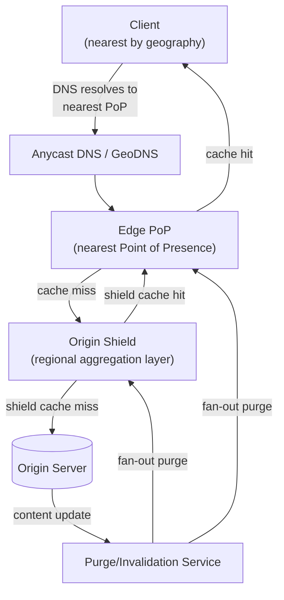

# Design a Content Delivery Network (CDN)

**Primarily tests**: request routing to the nearest healthy edge location, cache-key
design, and — the genuinely hard part — **propagating an invalidation/purge to
thousands of geographically distributed caches quickly and reliably**. The [video
streaming case study](../08_design_video_streaming/tutorial.md#deep-dive-cdn-architecture-and-cache-invalidation)
touches CDN architecture from the angle of one specific workload (adaptive-bitrate
video segments); this doc is the general-purpose version — static assets, API
responses, and dynamic/personalized content alike — and goes deeper on purge
propagation specifically, which that doc treats as a supporting detail rather than
the main event.

## Clarify

- What's being served: static assets only (images, JS/CSS, video segments), or also
  cacheable API responses / dynamic content? Assume both — static-only is
  meaningfully simpler, and the harder, more general version includes dynamic
  content with its own cache-control rules.
- How fast must a purge (an origin update that must invalidate already-cached
  copies everywhere) propagate — is a few minutes acceptable, or does a legal/
  compliance takedown requirement demand propagation in seconds? Assume the strict
  version — near-real-time purge is required for at least some content class — since
  that's what makes purge propagation the hard problem rather than an afterthought.
- Origin shield: is there one origin (single source of truth) behind potentially
  thousands of edge nodes, or multiple origins? Assume one logical origin (may be
  internally load-balanced/replicated, but conceptually singular from the CDN's
  perspective).

## High-Level Design

## Deep-Dive: Request Routing — Getting to the Nearest Healthy Edge

**The mechanism**: **Anycast** — the same IP address is announced via BGP from many
physical PoP locations simultaneously, and internet routing naturally delivers a
client's packet to whichever announcing location is topologically nearest (fewest
network hops), with no explicit client-side location logic required. **GeoDNS** is
the alternative/complementary mechanism at the DNS layer — resolving a hostname to a
different IP depending on the resolving client's apparent geographic location, used
when finer-grained control over routing decisions (beyond what BGP-level anycast
naturally provides) is needed, e.g. explicitly routing around a PoP that's healthy at
the network level but overloaded at the application level.

**Why "nearest" isn't purely a distance problem**: a PoP that's geographically
nearest but currently overloaded or degraded should be routed around — this requires
routing decisions to incorporate **live PoP health**, not just static geography,
which is why most real CDN routing layers combine anycast/GeoDNS's coarse geographic
routing with an additional, faster-changing health-check layer that can pull an
unhealthy PoP out of rotation in seconds, not whatever a DNS record's TTL happens to
allow.

## Deep-Dive: Purge Propagation (the core, hardest part of this question)

**Why this is harder than it first sounds**: a purge/invalidation isn't a single
write to a single system — it's a message that must reach **every PoP globally**
(potentially thousands of edge nodes across dozens of regions) reliably and
quickly, and a PoP that misses the purge message keeps serving stale content
indefinitely until its own TTL-based expiry eventually catches up — which, for
content requiring near-real-time takedown, is not an acceptable fallback.

- **Fan-out via a pub/sub or gossip-based propagation layer**: rather than the
  purge service directly connecting to every PoP (an operationally fragile,
  tightly-coupled design at thousands of endpoints), purge events are published to
  a distribution layer (a global pub/sub topic, or a gossip protocol between PoPs)
  that each PoP subscribes to independently — this is architecturally the same
  fan-out problem the [Twitter feed case
  study](../02_design_twitter_feed/tutorial.md#deep-dive-the-fan-out-problem-the-core-of-this-question)
  solves for follower delivery, applied to cache invalidation instead of new
  content, with the same core tension: push (fast, but must reliably reach every
  one of thousands of far-flung subscribers) vs. some form of pull/reconciliation
  safety net for whichever subscribers the push missed.
- **Purge must be acknowledged, not fire-and-forget**: the purge service needs to
  track which PoPs have confirmed receipt and applied the invalidation, retrying
  against any that haven't — a purge that silently fails to reach 2% of PoPs (a
  transient network blip during propagation) leaves that 2% serving stale content
  with no signal anything went wrong, unless acknowledgment is explicitly tracked.
- **A TTL-based safety net underneath the push mechanism**: even with reliable
  push-based purge, every cached object should still carry a bounded TTL as a
  fallback — if push propagation fails silently despite acknowledgment tracking (a
  bug, a partition that resolves after the purge service gives up retrying), the
  TTL guarantees staleness is bounded at some known maximum, rather than unbounded.
  This is the same "fail toward a bounded, known state rather than an unbounded one"
  discipline the [rate limiter case study names for its global
  aggregator](../07_design_rate_limiter_at_scale/tutorial.md#failure-modes-to-raise-proactively),
  applied to cache freshness instead of enforcement budget.
- **Selective vs. full purge**: purging a single URL is cheap to propagate; purging
  by a wildcard pattern or a tag (invalidate everything associated with a specific
  product ID, say, without knowing every exact URL in advance) requires each PoP to
  maintain its own reverse index from tag → cached object, adding local bookkeeping
  cost at every PoP in exchange for supporting a much more useful purge granularity
  than "one exact URL at a time."

## Deep-Dive: Cache-Key Design and the Origin Shield

**Cache-key design determines the actual hit rate, not just correctness**: naively
keying purely on URL breaks the moment content varies by another dimension (a
response that differs by `Accept-Language` header, or by device type via
`User-Agent`) — the cache key must include every dimension the origin's response
actually varies on (mirroring HTTP's own `Vary` header semantics), or the CDN will
either serve the wrong variant to some clients (a correctness bug) or fragment the
cache into far more entries than necessary if it over-includes dimensions that don't
actually change the response (a hit-rate problem). Getting this key design
deliberately right — not defaulting to "just the URL" — is a specific, concrete
signal in this question.

**The origin shield's actual job**: without a shield layer, thousands of edge PoPs
each independently missing on the same newly-published content would all hit the
origin simultaneously — a **thundering herd against the origin**, the same
cache-stampede shape the [distributed cache case
study](../05_design_distributed_cache/tutorial.md#deep-dive-cache-stampede-thundering-herd)
names for a single cache instance, recurring here at CDN-fleet scale. A shield layer
(a smaller number of regional aggregation caches sitting between edge PoPs and the
origin) absorbs this: many edge PoPs' cache misses in one region collapse into a
single shield cache miss (and a single origin request), rather than each edge PoP
independently hitting the origin.

## Trade-offs

| Decision | Option A | Option B | When to pick which |
|---|---|---|---|
| Routing mechanism | Pure Anycast (BGP-level, coarse) | Anycast + application-level health-aware routing | Combined, almost always at real scale — pure anycast can't route around an application-healthy-but-degraded PoP quickly |
| Purge propagation | Fire-and-forget push | Acknowledged push + TTL safety net | Acknowledged + TTL, whenever any content class has a near-real-time takedown requirement — fire-and-forget risks silent, unbounded staleness |
| Cache-key scope | Key on URL only | Key on URL + every actual `Vary` dimension | Include every real variance dimension — under-keying is a correctness bug, not just a hit-rate one |
| Purge granularity | Exact-URL purge only | Tag/wildcard purge with a per-PoP reverse index | Tag-based whenever content is invalidated in groups (all pages referencing a changed product) rather than one exact URL at a time |

## Staff Altitude

A **senior** answer proposes edge caching with anycast routing and TTL-based
expiry, and gets basic cache-hit serving working.

A **staff** answer additionally: (1) treats purge propagation — not cache-hit
serving — as the actual hard problem in this question, and designs it with
acknowledgment tracking and a TTL safety net rather than assuming a push
notification alone is sufficient; (2) recognizes the origin-shield layer as solving
the identical cache-stampede problem already named for a single-instance cache,
just recurring at fleet scale, rather than treating it as a novel CDN-specific
idea; and (3) designs the cache key deliberately around the origin's actual `Vary`
semantics rather than defaulting to "key on URL," naming the correctness risk of
under-keying explicitly.

## Failure Modes to Raise Proactively

- **A purge silently failing to reach a subset of PoPs** despite the push mechanism
  reporting success upstream — needs explicit per-PoP acknowledgment tracking with
  retry, not an assumption that "the message was published" equals "every PoP
  applied it."
- **A misconfigured cache-key (missing a `Vary` dimension) serving the wrong
  language/device variant to some users** — a correctness bug that can go
  undetected for a long time if monitoring only tracks hit rate, not
  variant-correctness; worth naming that hit-rate metrics alone don't catch this
  class of bug.
- **A single very popular piece of content overwhelming one region's shield layer**
  even after the shield already absorbed the naive edge-level thundering herd — the
  hot-key problem recurring one layer up, needing the shield layer itself to
  support request coalescing (collapsing concurrent identical origin requests into
  one) as a further defense.

## Staff Follow-Ups

- "A customer needs a takedown to propagate in under 5 seconds globally for legal
  reasons — walk through exactly what has to be true about the purge path for that
  SLA to be trustworthy, not just usually achieved."
- "How would you support origin failover (the origin itself becomes unavailable) —
  does the CDN serve stale cached content past its TTL as a degraded-but-available
  fallback, and who decides that trade-off?"
- "A new edge PoP is being added in a region with no existing traffic history — how
  does it get its initial cache population, and does it start serving traffic
  cold, with a temporarily worse hit rate?"

## Practice Variations

- Design the CDN layer for the [video streaming case
  study](../08_design_video_streaming/tutorial.md) specifically, focusing on how
  segment-level caching for adaptive bitrate differs from this doc's general-purpose
  design.
- Extend this design to support edge compute (running small pieces of application
  logic at the edge PoP itself, not just caching) — what changes about the
  architecture when a PoP can execute code, not just serve bytes?
- Design a private, internal CDN-like layer for a company's own microservice-to-
  microservice API responses, and compare which parts of the public-internet CDN
  design still apply versus which assumptions (anycast, BGP-level routing) don't
  transfer to an internal network.

## Articulate It: Interview Framing & Vocabulary

### Three Ways to Explain This

- **Wrong-emphasis framing (the default opening move):** "The easy part of this
  question is serving cache hits from the nearest edge — the actual hard part is
  purge propagation, getting an invalidation reliably to thousands of geographically
  distributed PoPs quickly, and I'd spend most of my design time there rather than on
  routing."
- **Recurring-pattern framing (good for the origin-shield discussion):** "The origin
  shield is solving the exact same cache-stampede problem a single Redis instance
  has, just recurring at CDN-fleet scale — thousands of edge misses on the same new
  content would otherwise all hit the origin at once, so the shield collapses them
  into one regional miss instead."
- **Bounded-fallback framing (good for the purge-reliability discussion):** "I
  wouldn't trust a push-based purge alone, even with acknowledgment tracking — I'd
  keep a TTL underneath it as a bounded safety net, so a silent propagation failure
  degrades to 'stale for at most N minutes' instead of 'stale forever, unnoticed.'"

### Vocabulary Builder

- **anycast** (n.) — announcing the same IP address from many physical locations
  simultaneously, letting internet routing itself deliver a request to the
  topologically nearest one with no client-side location logic.
- **origin shield** (n. phrase) — a regional aggregation cache layer between edge
  PoPs and the origin, collapsing many concurrent edge misses into a single origin
  request instead of a stampede.
- **purge propagation** (n. phrase) — reliably delivering a cache-invalidation event
  to every distributed cache node, the specific hard problem this design centers on.
- **"…stale for at most N minutes, not stale forever, unnoticed"** — a fluent way to
  describe a TTL safety net's value even when a primary push-based mechanism is
  already reliable, framing it as bounding a failure rather than being redundant.

---

---

**Previous:** [23. Real-Time Ad Auction / Bidding](../23_design_ad_auction_bidding/tutorial.md)  |  **Next:** [Back to Overview](../README.md)
