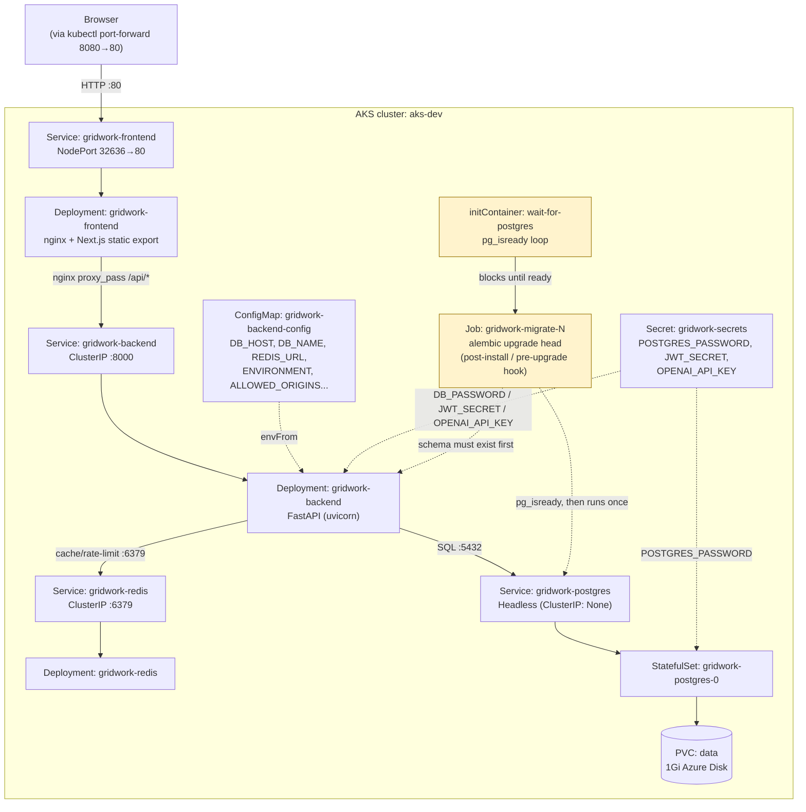

# Architecture — how the pieces actually talk to each other

This is the same deployment `WORKLOAD_ANATOMY.md` explains resource-by-resource,
drawn as a request-flow diagram instead. Read that file for "what created this
and why it restarted once"; read this one for "how does a browser request
actually get from outside AKS to Postgres and back."

## Reading the diagram

**The only arrow that crosses the cluster boundary** is `User → FrontendSvc`.
Everything else — backend, Postgres, Redis — has no path to the outside world
at all; their Services are plain `ClusterIP` (or headless), which Azure
doesn't attach a public IP to. That's deliberate, not incidental: the
frontend's nginx is the sole reverse proxy, forwarding `/api/*` to the backend
Service internally (`BACKEND_HOST`/`BACKEND_PORT` env vars from
`frontend.yaml`, consumed by `nginx.conf.template`'s `envsubst` at container
start). A browser never talks to the backend directly, even though it's
"just" a ClusterIP that would resolve fine from inside the cluster.

**Two solid arrows go into `BackendPod`, from two different sources, and
that split is the point:** `CM` (ConfigMap) supplies everything that's fine to
see in `kubectl describe configmap` — hostnames, feature flags, model names —
while `Secret` supplies the three values that actually gate access (DB
password, JWT signing key, OpenAI key). Kubernetes doesn't encrypt Secrets any
differently from ConfigMaps by default (both are base64, not encrypted, in
etcd without extra configuration) — the split exists so RBAC *can* be
tightened later (a role that can read ConfigMaps but not Secrets), not because
Secrets are inherently safer at rest here.

**The yellow-highlighted path (`WaitInit → MigrateJob`) runs once, out of
band, before the request-flow above ever exists.** It's not a fourth
long-lived component — trace the dotted lines: the `wait-for-postgres`
initContainer polls `pg_isready` against the Postgres Service in a loop
(`migration-job.yaml` lines 29-39) so the migration container behind it never
even starts until Postgres is actually accepting connections. This is the gap
that `BackendPod` itself doesn't have — the backend Deployment has no
equivalent initContainer, which is exactly why its pod hit the DNS-resolution
race documented in `WORKLOAD_ANATOMY.md` (restart count 1) while the Job never
does. Same dependency, two different levels of protection against the same
race — the Job took the belt-and-suspenders approach, the backend Deployment
relies on its own in-app retry loop instead.

**Why `PostgresPod` has a `PVC` hanging off it and nothing else does:** it's
the only component in this whole diagram whose data would need to survive a
pod restart. Delete `RedisPod` and it comes back empty — fine, it's a cache.
Delete `PostgresPod` without the PVC and every board, note, and task is gone.
The headless Service (`clusterIP: None`) exists specifically so that
`gridwork-postgres` always resolves to *this exact* StatefulSet pod's IP, not
a load-balanced pick among replicas — because the PVC and the pod identity
are permanently paired (`serviceName` + `volumeClaimTemplates` in
`postgres.yaml`), "any Postgres pod" isn't a valid concept here even if you
scaled replicas up.
