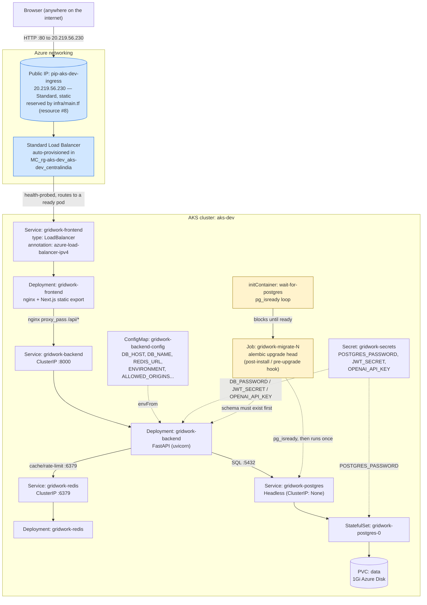

# Architecture — how the pieces actually talk to each other

This is the same deployment `WORKLOAD_ANATOMY.md` explains resource-by-resource,
drawn as a request-flow diagram instead. Read that file for "what created this
and why it restarted once"; read this one for "how does a browser request
actually get from the public internet to Postgres and back." This version
supersedes the `minimul_aks_001` copy of this file — that one still showed
the pre-public-IP setup (`NodePort` + `kubectl port-forward`); this cluster
now serves real internet traffic directly, no port-forward involved.

## Reading the diagram

**Two new boxes sit outside the `AKS` subgraph now, and that boundary
matters:** `PIP` and `LB` are Azure resources, not Kubernetes ones — `PIP` is
literally `resource "azurerm_public_ip" "ingress"` from `infra/main.tf`
(Terraform-owned, survives Helm releases entirely), while `LB` is a Standard
Load Balancer Azure's cloud-controller-manager auto-creates the moment it
sees a `Service` of `type: LoadBalancer`. Neither existed in the previous
(`minimul_aks_001`) version of this diagram — that setup only had `NodePort`,
which has no Load Balancer or Public IP at all, just a port opened on every
node that `kubectl port-forward` had to be manually pointed at.

**How the pinning actually works, mechanically:** `FrontendSvc`'s
`service.beta.kubernetes.io/azure-load-balancer-ipv4: "20.219.56.230"`
annotation (`templates/frontend.yaml`) tells the cloud-controller-manager
*which already-existing* Public IP to attach to the Load Balancer it
provisions, instead of minting a fresh one. This only works because that
exact IP object already lives in the same resource group
(`MC_rg-aks-dev_aks-dev_centralindia`) Kubernetes provisions Load Balancer
IPs into by default — `infra/main.tf`'s `data "azurerm_resource_group"
"aks_node_rg"` reads that resource group's name straight off the AKS cluster
rather than hardcoding it, specifically so this match-by-location works
without needing a second, cross-resource-group annotation.

**The only arrow that crosses into the AKS cluster itself** is
`LB → FrontendSvc`. Everything past that — backend, Postgres, Redis — is
still plain `ClusterIP`/headless, unreachable from outside even though
there's now a public IP sitting in front of the whole thing. The Load
Balancer and the Public IP are a routing layer bolted onto the *frontend's*
Service specifically; they don't change anything about how backend/Postgres/
Redis are exposed, because nothing about those Services changed.

**Two solid arrows go into `BackendPod`, from two different sources, and
that split is the point:** `CM` (ConfigMap) supplies everything that's fine
to see in `kubectl describe configmap` — hostnames, feature flags, model
names — while `Secret` supplies the three values that actually gate access
(DB password, JWT signing key, OpenAI key). Kubernetes doesn't encrypt
Secrets any differently from ConfigMaps by default (both are base64, not
encrypted, in etcd without extra configuration) — the split exists so RBAC
*can* be tightened later (a role that can read ConfigMaps but not Secrets),
not because Secrets are inherently safer at rest here.

**The yellow-highlighted path (`WaitInit → MigrateJob`) runs once, out of
band, before the request-flow above ever exists.** It's not a fourth
long-lived component — trace the dotted lines: the `wait-for-postgres`
initContainer polls `pg_isready` against the Postgres Service in a loop
(`migration-job.yaml` lines 29-39) so the migration container behind it never
even starts until Postgres is actually accepting connections. This is the gap
that `BackendPod` itself doesn't have — the backend Deployment has no
equivalent initContainer, which is exactly why its pod hit the DNS-resolution
race documented in `WORKLOAD_ANATOMY.md` (restart count 1) while the Job
never does. Same dependency, two different levels of protection against the
same race — the Job took the belt-and-suspenders approach, the backend
Deployment relies on its own in-app retry loop instead.

**Why `PostgresPod` has a `PVC` hanging off it and nothing else does:** it's
the only component in this whole diagram whose data would need to survive a
pod restart. Delete `RedisPod` and it comes back empty — fine, it's a cache.
Delete `PostgresPod` without the PVC and every board, note, and task is gone.
The headless Service (`clusterIP: None`) exists specifically so that
`gridwork-postgres` always resolves to *this exact* StatefulSet pod's IP, not
a load-balanced pick among replicas — because the PVC and the pod identity
are permanently paired (`serviceName` + `volumeClaimTemplates` in
`postgres.yaml`), "any Postgres pod" isn't a valid concept here even if you
scaled replicas up.

## What this diagram doesn't cover yet

This is still Level 0 of `PUBLIC_EXPOSURE_PLAN.md` — one Service, one public
IP, plain HTTP, no domain. Level 1 (a shared ingress-nginx controller sitting
where `LB`/`FrontendSvc` currently connect directly) and Level 2 (TLS via
cert-manager) would both change this diagram's top half; the Postgres/Redis/
migration portion underneath would stay identical either way.
