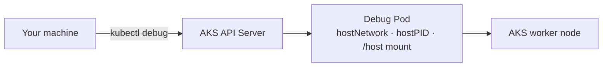
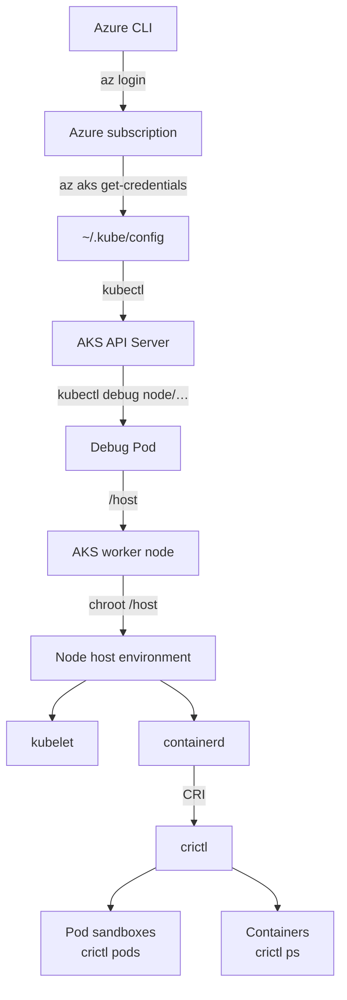

# AKS Node Access and Container Runtime Inspection

This guide shows how to go from an Azure CLI login to an interactive
shell on an **AKS worker node**, then inspect Kubernetes containers
using `crictl`.

> **Important:** This is not traditional SSH. The method below uses
> `kubectl debug` to create a temporary debugging pod on the node and
> then `chroot /host` to enter the node's host filesystem/environment.

------------------------------------------------------------------------

## 1. Prerequisites

You need:

-   Azure CLI (`az`)
-   `kubectl`
-   Access to the Azure subscription containing the AKS cluster
-   Permission to access the AKS cluster and create a debug pod
-   An AKS Linux node

Verify the tools:

``` bash
az version
kubectl version --client
```

------------------------------------------------------------------------

# Part 1 --- Verify Azure Login

## 2. Check Azure CLI authentication

Run:

``` bash
az account show
```

This confirms that Azure CLI is authenticated and shows the currently
selected subscription.

Example:

``` text
{
  "environmentName": "AzureCloud",
  "id": "...",
  "name": "Azure subscription 1",
  "state": "Enabled",
  ...
}
```

The important fields are:

-   `name` --- selected Azure subscription
-   `id` --- subscription ID
-   `tenantId` --- Microsoft Entra tenant
-   `state` --- should normally be `Enabled`

------------------------------------------------------------------------

## 3. List available subscriptions

Run:

``` bash
az account list --output table
```

Example:

``` text
Name                  CloudName    SubscriptionId    TenantId    State    IsDefault
--------------------  -----------  ----------------  ---------  -------  ---------
Azure subscription 1  AzureCloud   xxxxxxxx-xxxx...  xxxxxxxx   Enabled  True
```

If you have multiple subscriptions, select the correct one:

``` bash
az account set --subscription "<SUBSCRIPTION_NAME_OR_ID>"
```

Then verify:

``` bash
az account show
```

------------------------------------------------------------------------

# Part 2 --- Find the AKS Cluster

## 4. List AKS clusters

Run:

``` bash
az aks list --output table
```

Example:

``` text
Name               Location      ResourceGroup      KubernetesVersion    ProvisioningState
-----------------  ------------  ----------------  -------------------  -----------------
aks-fastsite-prod  centralindia  rg-fastsite-prod  1.35                 Succeeded
```

Record:

-   AKS cluster name
-   Resource group
-   Region
-   Provisioning state

For this example:

``` text
Cluster:       aks-fastsite-prod
ResourceGroup: rg-fastsite-prod
Region:        centralindia
```

The cluster should normally have:

``` text
ProvisioningState = Succeeded
```

------------------------------------------------------------------------

# Part 3 --- Configure kubectl

## 5. Download/merge AKS credentials into kubeconfig

Run:

``` bash
az aks get-credentials \
  --resource-group rg-fastsite-prod \
  --name aks-fastsite-prod
```

Expected output:

``` text
Merged "aks-fastsite-prod" as current context in /home/<user>/.kube/config
```

This adds the AKS cluster to your local Kubernetes configuration.

The configuration is normally stored in:

``` bash
~/.kube/config
```

------------------------------------------------------------------------

## 6. Check the current Kubernetes context

Run:

``` bash
kubectl config current-context
```

Expected:

``` text
aks-fastsite-prod
```

This tells you which Kubernetes cluster `kubectl` will talk to.

You can see all configured contexts with:

``` bash
kubectl config get-contexts
```

------------------------------------------------------------------------

## 7. Verify communication with the AKS cluster

Run:

``` bash
kubectl get nodes
```

If authentication and connectivity are working, you should see your AKS
worker nodes.

For more information:

``` bash
kubectl get nodes -o wide
```

Example:

``` text
NAME                             STATUS   ROLES    AGE    VERSION   INTERNAL-IP   EXTERNAL-IP   OS-IMAGE
aks-system-20366932-vmss000000   Ready    <none>   3h22m  v1.35.8   10.20.0.4     <none>        Microsoft Azure Linux 3.0
```

Important fields:

-   `STATUS` --- should normally be `Ready`
-   `INTERNAL-IP` --- node's private IP
-   `EXTERNAL-IP` --- public IP, if one exists
-   `OS-IMAGE` --- node operating system
-   `CONTAINER-RUNTIME` --- container runtime, e.g. containerd

------------------------------------------------------------------------

# Part 4 --- Inspect the AKS Node Pool

## 8. List AKS node pools

Run:

``` bash
az aks nodepool list \
  --resource-group rg-fastsite-prod \
  --cluster-name aks-fastsite-prod \
  --output table
```

Example:

``` text
Name    OsType    KubernetesVersion    VmSize             Count    MaxPods    ProvisioningState    Mode
------  --------  -------------------  -----------------  -------  ---------  -------------------  ------
system  Linux     1.35                 Standard_B2als_v2  1        50         Succeeded            System
```

This tells you which node pools exist and what VM size they use.

------------------------------------------------------------------------

# Part 5 --- Execute Commands Through AKS

## 9. Use `az aks command invoke`

AKS provides a way to execute commands against the cluster without
directly SSHing to a node.

Example:

``` bash
az aks command invoke \
  --resource-group rg-fastsite-prod \
  --name aks-fastsite-prod \
  --command "kubectl get nodes -o wide"
```

Example output:

``` text
command started at 2026-09-28 06:01:16+00:00, finished at 2026-09-28 06:01:16+00:00 with exitcode=0

NAME                             STATUS   ROLES    AGE    VERSION   INTERNAL-IP
aks-system-20366932-vmss000000   Ready    <none>   3h24m  v1.35.8   10.20.0.4
```

### What this does

It allows you to execute commands through the AKS control plane/AKS
management mechanism.

However, this is **not the same as getting an interactive shell on the
worker node**.

> **Note:** `az aks command invoke` runs your command inside a short-lived
> Pod (in the `aks-command` namespace) using a kubeconfig with the
> cluster-admin-level credentials Azure gives it. It exists mainly for
> **private clusters** whose API Server isn't reachable from your
> machine. The command runs as a Pod in the cluster, not on the node's
> host, and each call takes several seconds.

For an interactive node-level shell, use `kubectl debug`.

------------------------------------------------------------------------

# Part 6 --- Start a Debug Shell on the Node

## 10. Identify the node

First:

``` bash
kubectl get nodes
```

Suppose the node is:

``` text
aks-system-20366932-vmss000000
```

------------------------------------------------------------------------

## 11. Create a debug pod on the node

Run:

``` bash
kubectl debug node/aks-system-20366932-vmss000000 -it --image=ubuntu
```

You may see:

``` text
Creating debugging pod node-debugger-aks-system-20366932-vmss000000-xxxxx with container debugger on node aks-system-20366932-vmss000000.

root@aks-system-20366932-vmss000000:/#
```

You are now inside the **debug container attached to the node**.

### Important distinction

At this point you are not necessarily running directly in the node's
host environment.

Conceptually:



The debug container provides access to the node's host filesystem
through:

``` text
/host
```

> **Note:**
>
> -   The debug Pod shares the node's network, PID and IPC namespaces,
>     so `ps aux` already shows host processes (kubelet, containerd)
>     even before `chroot`.
> -   It is created in your **current namespace** (usually `default`).
> -   `--image=ubuntu` pulls from Docker Hub. Microsoft's AKS docs use
>     `mcr.microsoft.com/cbl-mariner/busybox:2.0` or similar MCR images,
>     which avoids Docker Hub rate limits and works on clusters with
>     egress restricted to Microsoft endpoints.
> -   If `chroot /host` or `systemctl` fails with permission errors on
>     newer kubectl, add `--profile=sysadmin`.

------------------------------------------------------------------------

# Part 7 --- Enter the Actual Node Host Environment

## 12. Inspect `/host`

Inside the debug container:

``` bash
ls /host
```

You should see directories similar to:

``` text
bin
etc
home
opt
root
usr
var
...
```

These are directories from the node's host filesystem.

------------------------------------------------------------------------

## 13. Enter the host environment with `chroot`

Run:

``` bash
chroot /host
```

Now commands such as:

``` bash
cat /etc/os-release
```

refer to the node's operating system rather than the Ubuntu debug
container.

Verify the OS:

``` bash
cat /etc/os-release
```

Verify the kernel:

``` bash
uname -a
```

For an Azure Linux AKS node, you may see information such as:

``` text
Microsoft Azure Linux
```

and a kernel similar to:

``` text
6.6.x-...-azl3
```

> **Note — useful node-level commands once inside `chroot /host`:**
>
> ``` bash
> systemctl status kubelet          # kubelet is a systemd service, not a Pod
> journalctl -u kubelet --since "10 min ago"
> systemctl status containerd
> cat /etc/crictl.yaml              # which CRI socket crictl uses
> df -h /var/lib/containerd         # image/container disk usage (DiskPressure)
> ls /etc/cni/net.d                 # CNI config (Azure CNI / Cilium)
> ```
>
> You won't find `kube-apiserver`, `kube-scheduler`, `kube-controller-manager`
> or `etcd` on an AKS node — the control plane is managed by Azure and
> runs outside your node pools.

------------------------------------------------------------------------

# Part 8 --- Inspect Kubernetes Containers with crictl

## 14. Check the container runtime

From the node host:

``` bash
crictl info
```

You can also check the running processes:

``` bash
ps aux | grep containerd
```

The AKS node in this example uses:

``` text
containerd
```

------------------------------------------------------------------------

## 15. List running containers

Run:

``` bash
crictl ps
```

This shows containers currently running through the Kubernetes Container
Runtime Interface (CRI).

Typical columns include:

``` text
CONTAINER    IMAGE    CREATED    STATE    NAME    ATTEMPT    POD ID
```

------------------------------------------------------------------------

## 16. List all containers

To include stopped/exited containers:

``` bash
crictl ps -a
```

Difference:

``` text
crictl ps
    = running containers

crictl ps -a
    = running + stopped containers
```

------------------------------------------------------------------------

## 17. Count running containers

Run:

``` bash
crictl ps -q | wc -l
```

Explanation:

``` text
crictl ps -q
    |
    +-- prints only container IDs
         |
         +-- wc -l counts them
```

To count all containers:

``` bash
crictl ps -a -q | wc -l
```

------------------------------------------------------------------------

# Part 9 --- Inspect Kubernetes Pod Sandboxes

## 18. List Pod sandboxes

Run:

``` bash
crictl pods
```

This shows Pod sandbox information from the CRI layer.

Do not use:

``` bash
crictl pods -o wide
```

because `crictl pods` does not support the `wide` output format in the
same way as `kubectl get pods -o wide`.

------------------------------------------------------------------------

## 19. Inspect a specific Pod sandbox

First get the sandbox ID:

``` bash
crictl pods
```

Then:

``` bash
crictl inspectp <POD_ID>
```

For example:

``` bash
crictl inspectp abc123...
```

The output contains detailed sandbox information, including networking
information.

You can search the output for IP information:

``` bash
crictl inspectp <POD_ID> | grep -i ip
```

------------------------------------------------------------------------

# Part 10 --- See Pod IPs with kubectl

`kubectl` is normally used from your administration machine, not from
the worker node.

Exit the node environment first.

## 20. Exit `chroot`

From:

``` text
root@node:/#
```

run:

``` bash
exit
```

You should return to the debug container:

``` text
root@aks-system-20366932-vmss000000:/#
```

------------------------------------------------------------------------

## 21. Exit the debug container

Run:

``` bash
exit
```

You should return to your normal shell:

``` text
surendra@<machine>:~$
```

------------------------------------------------------------------------

## 22. List Pods and their IP addresses

Run:

``` bash
kubectl get pods -A -o wide
```

Example:

``` text
NAMESPACE     NAME                         READY   STATUS    IP          NODE
default       nginx-xxxxx                 1/1     Running   10.20.x.x   aks-system-...
kube-system   coredns-xxxxx               1/1     Running   10.20.x.x   aks-system-...
```

For a specific namespace:

``` bash
kubectl get pods -n fast-site -o wide
```

------------------------------------------------------------------------

## 23. Show only namespace, Pod, IP and node

A cleaner command:

``` bash
kubectl get pods -A \
  -o custom-columns="NAMESPACE:.metadata.namespace,POD:.metadata.name,IP:.status.podIP,NODE:.spec.nodeName"
```

Example:

``` text
NAMESPACE     POD                         IP          NODE
fast-site     api-xxxxx                   10.20.x.x   aks-system-...
fast-site     caddy-xxxxx                 10.20.x.x   aks-system-...
```

------------------------------------------------------------------------

# Part 11 --- Understanding the Architecture

The complete path you used is:



------------------------------------------------------------------------

# Part 12 --- Important Command Cheat Sheet

## Azure

``` bash
az account show
```

``` bash
az account list --output table
```

``` bash
az aks list --output table
```

``` bash
az aks get-credentials \
  --resource-group rg-fastsite-prod \
  --name aks-fastsite-prod
```

``` bash
az aks nodepool list \
  --resource-group rg-fastsite-prod \
  --cluster-name aks-fastsite-prod \
  --output table
```

------------------------------------------------------------------------

## Kubernetes

``` bash
kubectl config current-context
```

``` bash
kubectl get nodes
```

``` bash
kubectl get nodes -o wide
```

``` bash
kubectl get pods -A -o wide
```

``` bash
kubectl get pods -n fast-site -o wide
```

------------------------------------------------------------------------

## Node debugging

``` bash
kubectl debug node/<NODE_NAME> -it --image=ubuntu
```

Then:

``` bash
ls /host
```

Then:

``` bash
chroot /host
```

------------------------------------------------------------------------

## Container runtime

``` bash
crictl info
```

``` bash
crictl ps
```

``` bash
crictl ps -a
```

``` bash
crictl ps -q | wc -l
```

``` bash
crictl pods
```

``` bash
crictl inspectp <POD_ID>
```

------------------------------------------------------------------------

# Part 13 --- Exiting Safely

When finished:

### Exit the node host environment

``` bash
exit
```

### Exit the debug container

``` bash
exit
```

The `kubectl debug` command creates a debugging Pod. It is **not**
deleted automatically when you exit — it stays in `Completed` state
until you delete it.

Check:

``` bash
kubectl get pods
```

If the debug Pod remains and you want to remove it, identify it:

``` bash
kubectl get pods | grep node-debugger
```

Then delete the specific debug Pod:

``` bash
kubectl delete pod <DEBUG_POD_NAME>
```

------------------------------------------------------------------------

# Important Safety Notes

You are working on a **real Kubernetes worker node** when you use:

``` bash
chroot /host
```

Be especially careful with:

``` text
/etc
/var/lib/kubelet
/var/lib/containerd
network configuration
system services
container runtime
kubelet
```

Avoid deleting or modifying files unless you know exactly what they do.

`crictl` is primarily a **diagnostic/inspection tool** in this workflow.
Prefer `kubectl` for normal Kubernetes operations.

Also remember:

``` text
kubectl
    = Kubernetes API / cluster-level view

crictl
    = CRI / node-level container runtime view

containerd / ctr
    = container runtime implementation
```

This distinction is useful when troubleshooting why something appears
differently from the Kubernetes level versus the node/container-runtime
level.
