# Kubernetes Architecture

## 1. High-Level Architecture

Kubernetes has two major parts:

- **Control Plane** — the "brain" of the cluster. It decides what should happen.
- **Worker Nodes** — the execution layer where application Pods actually run.

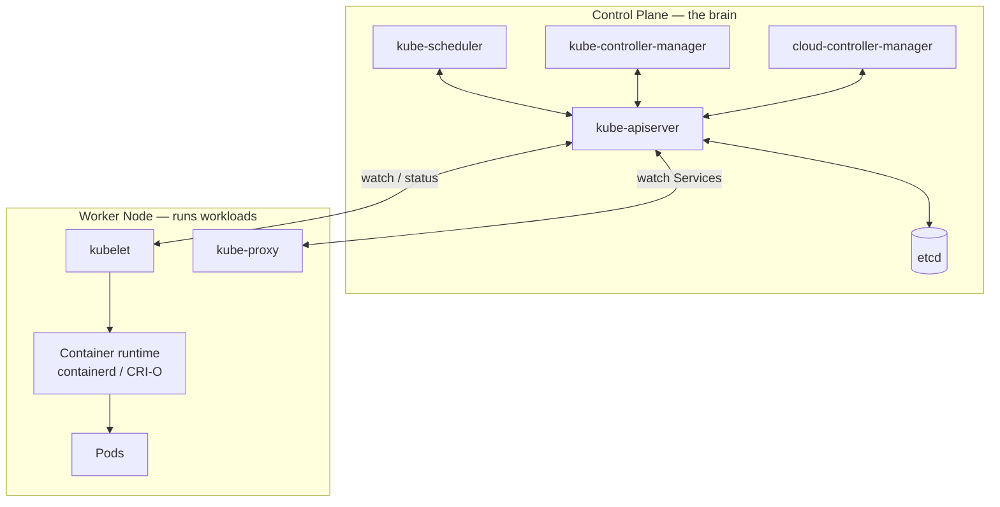

---

# 2. Control Plane

The Control Plane manages the overall state of the Kubernetes cluster.

Its main components are:

1. kube-apiserver
2. etcd
3. kube-scheduler
4. kube-controller-manager
5. cloud-controller-manager (mainly in cloud environments)

## 2.1 kube-apiserver

The **API Server** is the main entry point to Kubernetes.

Everything that wants to interact with the Kubernetes cluster generally communicates through the API Server.

For example:

```bash
kubectl get pods
kubectl create deployment nginx --image=nginx
```

The flow is:

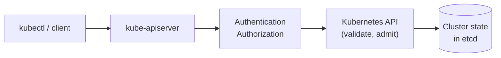

### Important points

- Exposes the Kubernetes API.
- `kubectl` communicates with it.
- Validates API requests.
- Handles authentication and authorization.
- Reads/writes Kubernetes objects and state.
- Other Kubernetes components also communicate through the API Server.

Think:

> **API Server = Front door of Kubernetes**

> **Note — the full request pipeline.** Every write goes through the same ordered stages:
>
> ```mermaid
> flowchart LR
>     R["Request"] --> AN["Authentication"] --> AZ["Authorization<br/>(RBAC)"] --> MA["Mutating<br/>admission"] --> SV["Schema<br/>validation"] --> VA["Validating<br/>admission"] --> E[("etcd")] --> RESP["Response"]
> ```
>
> Admission controllers (e.g. `DefaultTolerationSeconds`, `LimitRanger`, `ResourceQuota`, `PodSecurity`, and your own webhooks) can modify or reject objects **before** they are persisted. The API Server is also the **only** component that reads/writes etcd — every other component (scheduler, KCM, kubelet, kubectl) is an API client. Deep dive: [`../api-server/02-request-lifecycle.md`](../api-server/02-request-lifecycle.md).

---

# 3. etcd

**etcd** is the distributed key-value database used by Kubernetes to store cluster state.

It stores information such as:

- Deployments
- Pods
- Services
- ConfigMaps
- Secrets
- Nodes
- ReplicaSets
- Desired state
- Cluster configuration

Example:

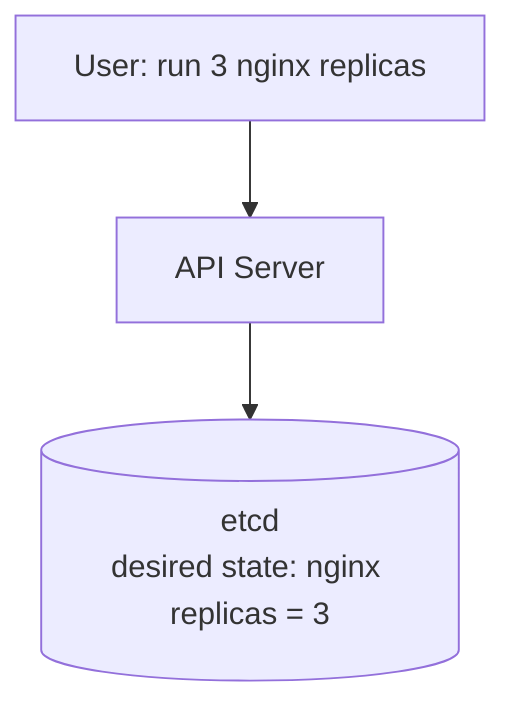

Kubernetes components then work to make the actual cluster state match this desired state.

Think:

> **etcd = Kubernetes' source of truth**

Important:

> etcd does NOT run containers. It stores Kubernetes state.

> **Note:**
>
> - etcd uses the **Raft** consensus algorithm, so it runs as an odd-sized cluster (3 or 5 members). A write succeeds only when a majority (quorum) agrees — 3 members tolerate 1 failure, 5 tolerate 2.
> - Objects are stored under keys like `/registry/deployments/<namespace>/<name>`.
> - Secrets are only base64-encoded in etcd unless **encryption at rest** is configured on the API Server. Backing up etcd = backing up the whole cluster state.
> - On AKS/EKS/GKE, etcd is managed by the provider and not reachable by you.

---

# 4. kube-scheduler

The **Scheduler** decides which worker node should run a newly created Pod.

Suppose you have:

```text
Worker Node 1
CPU: 2
Memory: 4 GB

Worker Node 2
CPU: 8
Memory: 16 GB

Worker Node 3
CPU: 4
Memory: 8 GB
```

A new Pod is created requiring:

```text
CPU: 2
Memory: 4 GB
```

The scheduler evaluates available nodes and selects a suitable node.

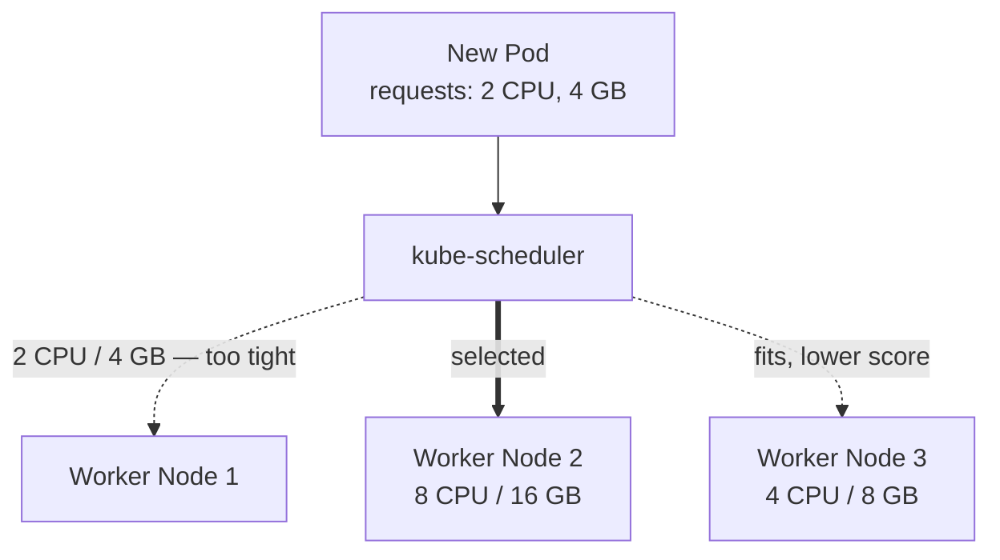

The scheduler considers things such as:

- CPU/memory availability
- Node selectors
- Affinity/anti-affinity
- Taints and tolerations
- Topology constraints
- Resource requests

> **Note:** The scheduler works on **requests**, not live CPU/memory usage. A node "has room" if `allocatable − sum(requests of Pods already on it)` fits the new Pod's requests. A Pod with no requests can be packed onto an already-busy node.
>
> Scheduling is two phases per Pod:
>
> ```mermaid
> flowchart LR
>     P["Unscheduled Pod<br/>spec.nodeName empty"] --> F["Filter<br/>which nodes CAN run it?"] --> S["Score<br/>which node is BEST?"] --> B["Bind<br/>write spec.nodeName"]
>     F -->|no node passes| PEND["Pod stays Pending<br/>FailedScheduling event"]
> ```
>
> If no node passes the filter, the Pod stays `Pending` with a `FailedScheduling` event.

Think:

> **Scheduler = Decides where a Pod should run**

Important:

> Scheduler does NOT start the container.

It only makes the scheduling decision. The **kubelet** on the selected node ultimately gets the Pod running.

---

# 5. kube-controller-manager

The **Controller Manager** runs various controllers.

Controllers continuously compare:

```text
Desired State
      vs
Actual State
```

and take action when they differ.

Example:

You request:

```yaml
replicas: 3
```

But currently only 2 Pods are running.

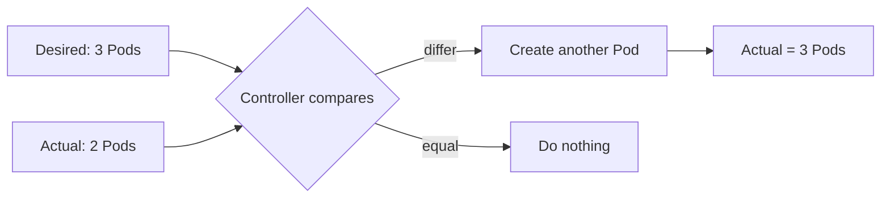

Examples of controllers include:

- Deployment controller
- ReplicaSet controller
- Node controller
- Job controller
- Namespace controller
- EndpointSlice-related controllers

Think:

> **Controller Manager = Keeps the cluster aligned with the desired state**

## 5.1 One binary, many controllers

`kube-controller-manager` (KCM) is **one process** that runs **dozens of independent control loops** (one goroutine-based loop per controller).

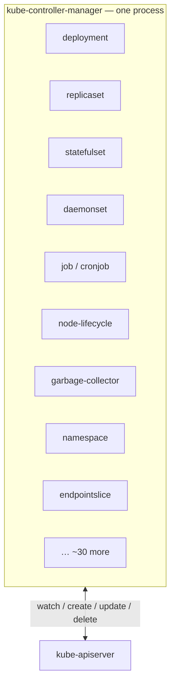

Logically, each controller is a separate program. They are compiled into one binary and run in one process purely to **reduce operational complexity** (one thing to deploy, upgrade, secure and monitor instead of 30+).

> **Note:** The controllers inside KCM do not talk to each other directly. The Deployment controller never "calls" the ReplicaSet controller. They coordinate only by reading and writing objects through the API Server.

## 5.2 KCM never talks to etcd

This is a very common misconception.

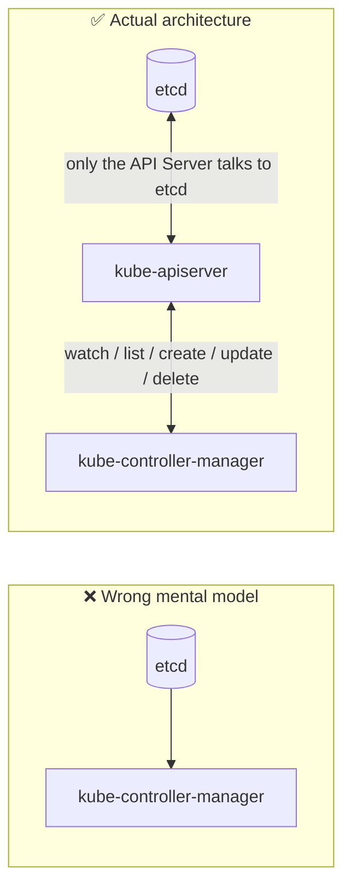

KCM is just an **API client** — conceptually no different from `kubectl` or a custom operator. It:

- authenticates to the API Server with its own credentials (kubeconfig / client certificate),
- is subject to RBAC like any other client,
- reads and writes objects only through the API.

With `--use-service-account-credentials=true` (the kubeadm default), each controller uses its **own ServiceAccount** in `kube-system`, for example:

```text
system:serviceaccount:kube-system:replicaset-controller
system:serviceaccount:kube-system:deployment-controller
system:serviceaccount:kube-system:namespace-controller
```

so each loop gets only the RBAC permissions it needs (`system:controller:*` ClusterRoles). You can see them:

```bash
kubectl get clusterroles | grep system:controller:
```

## 5.3 How a single controller loop actually works

Every built-in controller (and every operator built with controller-runtime / client-go) follows the same shape:

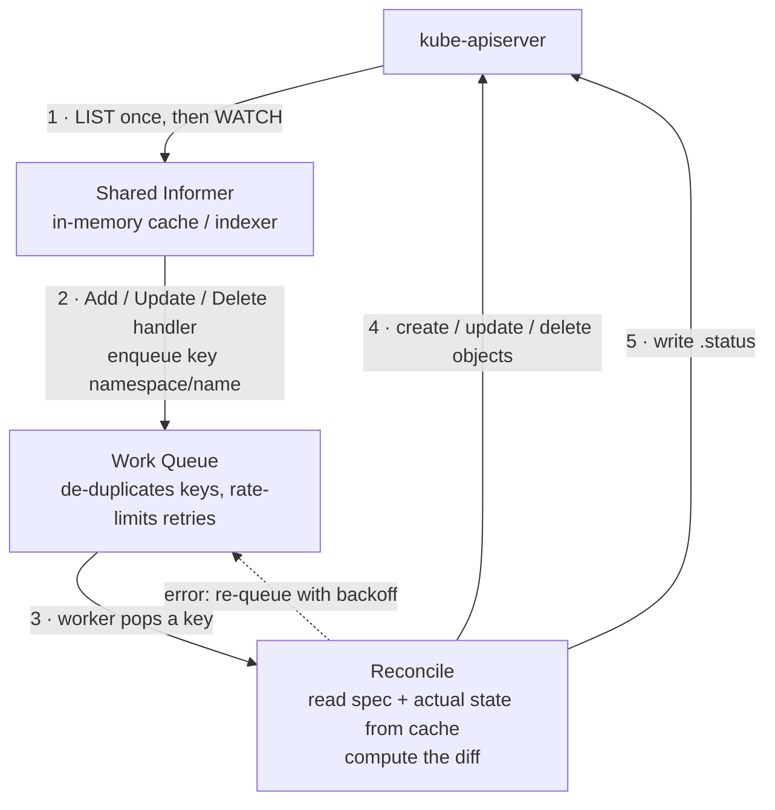

Key properties worth remembering:

| Property | Meaning |
|---|---|
| **Level-triggered** | The reconcile looks at the *current* state, not at "what event happened". If an event is missed, the next reconcile still converges. |
| **Cache reads, API writes** | Reads come from the informer cache (cheap); only writes hit the API Server. This is why KCM can watch thousands of objects without overloading the API. |
| **Keys, not objects, are queued** | Ten rapid updates to one Deployment collapse into one queue entry → one reconcile. |
| **Retries with backoff** | A failed reconcile (e.g. quota exceeded, webhook rejected) is re-queued with exponential backoff. |
| **Periodic resync** | Informers can re-deliver all cached objects periodically as a safety net. |
| **Status is feedback** | Controllers write `.status` (e.g. `readyReplicas`, `observedGeneration`) so users and other controllers can see progress. |

> **Note:** `metadata.generation` increments when `.spec` changes; the controller writes `.status.observedGeneration` when it has processed that generation. `kubectl rollout status` relies on exactly this handshake.

The API Server side of this (LIST + WATCH, `resourceVersion`, bookmarks) is covered in [`../api-server/04-watch-and-list.md`](../api-server/04-watch-and-list.md).

## 5.4 Catalogue of controllers inside KCM

Grouped by what they are responsible for (names are the ones used by the `--controllers` flag since v1.28 — older short names like `deployment` or `bootstrapsigner` are still accepted as aliases; exact list varies slightly by version):

| Area | Controller(s) | What it reconciles |
|---|---|---|
| **Workloads** | `deployment-controller` | Deployment → ReplicaSets (rollouts, rollback, revision history) |
| | `replicaset-controller` | ReplicaSet → Pods (count) |
| | `replicationcontroller-controller` | Legacy ReplicationController → Pods |
| | `statefulset-controller` | StatefulSet → ordered Pods + PVCs |
| | `daemonset-controller` | DaemonSet → one Pod per eligible Node |
| | `job-controller` | Job → Pods until completions reached |
| | `cronjob-controller` | CronJob → Jobs on schedule |
| | `ttl-after-finished-controller` | Deletes finished Jobs after `ttlSecondsAfterFinished` |
| **Scaling / availability** | `horizontal-pod-autoscaler-controller` | HPA → updates `replicas` on the target (yes — HPA runs in KCM) |
| | `disruption-controller` | PodDisruptionBudget status (`disruptionsAllowed`) |
| **Nodes** | `node-lifecycle-controller` | Watches node heartbeats, sets `Ready=Unknown`, adds `unreachable`/`not-ready` taints |
| | `taint-eviction-controller` | Evicts Pods that don't tolerate `NoExecute` taints (split out of node-lifecycle in 1.29) |
| | `node-ipam-controller` | Allocates `podCIDR` ranges to Nodes (when the CNI relies on it) |
| | `ttl-controller` | Annotates Nodes with a cache TTL for kubelets |
| **Pod cleanup** | `pod-garbage-collector-controller` (PodGC) | Deletes terminated Pods above a threshold and Pods bound to Nodes that no longer exist |
| | `garbage-collector-controller` | Deletes dependents whose owner is gone (`ownerReferences`) |
| **Namespaces** | `namespace-controller` | Deletes everything inside a Namespace that is `Terminating`, then removes its finalizer |
| **Networking** | `endpointslice-controller` | Service selector → EndpointSlices (Pod IPs behind a Service) |
| | `endpointslice-mirroring-controller` | Mirrors custom Endpoints into EndpointSlices |
| | `endpoints-controller` | Legacy Endpoints objects (Endpoints API is deprecated in favour of EndpointSlice) |
| **Storage** | `persistentvolume-binder-controller` | Binds PVCs to PVs, triggers dynamic provisioning |
| | `persistentvolume-attach-detach-controller` | Attaches/detaches volumes to/from Nodes |
| | `persistentvolume-expander-controller` | Handles PVC resize |
| | `persistentvolumeclaim-protection-controller` / `persistentvolume-protection-controller` | Prevents deleting PVCs/PVs still in use (finalizers) |
| | `ephemeral-volume-controller` | Creates PVCs for generic ephemeral volumes |
| **Identity / security** | `serviceaccount-controller` | Creates the `default` ServiceAccount in every Namespace |
| | `serviceaccount-token-controller` | Legacy token Secrets for ServiceAccounts |
| | `root-ca-certificate-publisher-controller` | Publishes `kube-root-ca.crt` ConfigMap into every Namespace |
| | `certificatesigningrequest-{signing,approving,cleaner}-controller` | Signs & auto-approves kubelet CSRs, cleans old ones |
| | `clusterrole-aggregation-controller` | Fills aggregated ClusterRoles (e.g. `admin`, `edit`, `view`) |
| | `bootstrap-signer-controller` / `token-cleaner-controller` | Bootstrap tokens for node join (**off by default**) |
| **Quota** | `resourcequota-controller` | Recalculates `ResourceQuota.status.used` |

Controllers are enabled/disabled with:

```text
--controllers=*                                # all default-on controllers
--controllers=*,bootstrap-signer-controller   # plus an off-by-default one
--controllers=*,-ttl-controller               # all except ttl-controller
```

> **Note:** Things that are **not** in KCM: the scheduler (separate binary `kube-scheduler`), cloud-specific controllers (moved to `cloud-controller-manager`, see §6), and all CRD operators (they run as ordinary Deployments in the cluster).

## 5.5 Garbage collection and ownerReferences

When a controller creates an object, it stamps an `ownerReference` on it:

```yaml
# on a Pod created by a ReplicaSet
metadata:
  ownerReferences:
  - apiVersion: apps/v1
    kind: ReplicaSet
    name: nginx-7c5ddbdf54
    controller: true
    blockOwnerDeletion: true
```

The **garbage-collector** controller uses these links to delete children when the owner is deleted:

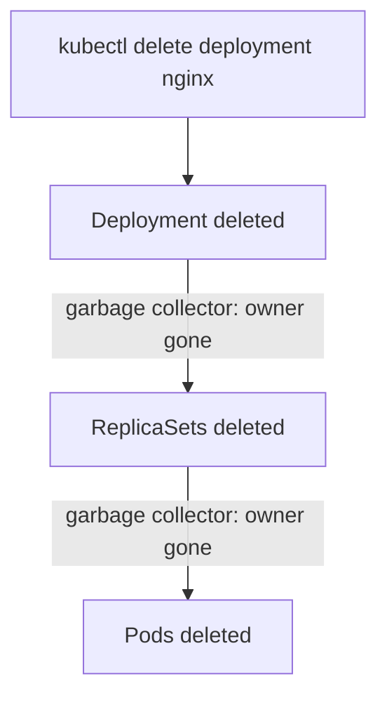

Deletion propagation policies:

| Policy | Behaviour |
|---|---|
| `Background` (default for `kubectl`) | Owner deleted immediately; GC deletes children afterwards |
| `Foreground` | Owner gets `deletionTimestamp` + `foregroundDeletion` finalizer; children deleted first, then owner |
| `Orphan` | Owner deleted; children kept, their `ownerReferences` removed |

```bash
kubectl delete deployment nginx --cascade=foreground
kubectl delete deployment nginx --cascade=orphan      # Pods/RS survive
```

> **Note:** The reverse also happens — **adoption**. A ReplicaSet will adopt an existing Pod that matches its selector and has no controller `ownerReference`. That is why manually creating a Pod with matching labels can cause the ReplicaSet to delete a Pod (see `kubernetes_pod_creation_flow.md` §15).

## 5.6 Node lifecycle — what happens when a node dies

This is one of KCM's most operationally important jobs:

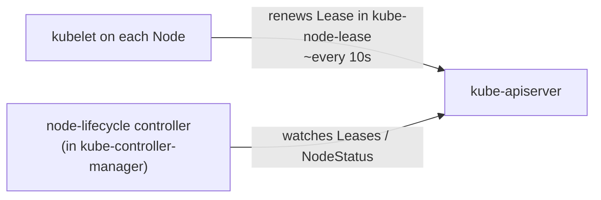

If the heartbeat stops:

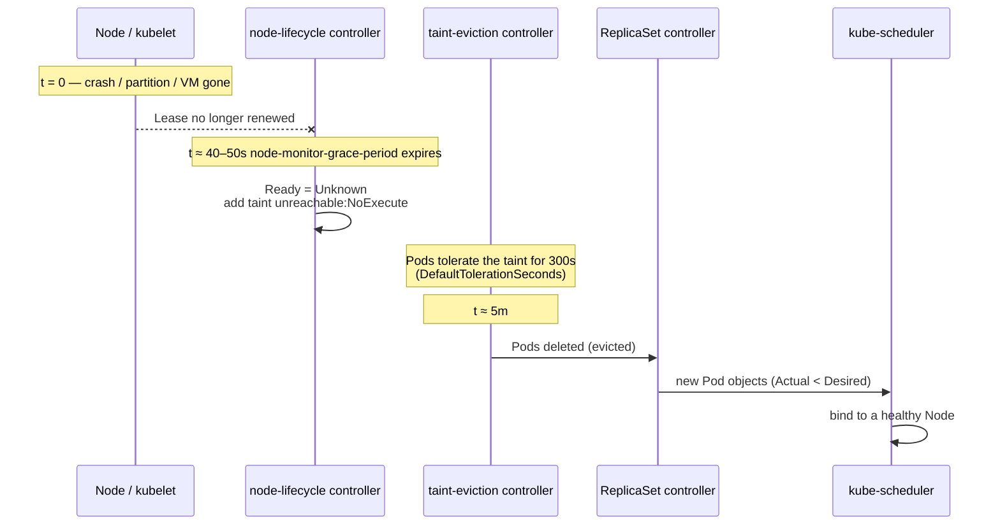

Practical consequence:

> **A Deployment Pod on a node that silently dies is typically replaced after ~5–6 minutes, not instantly.** Tune per workload with `tolerations[].tolerationSeconds` on the `node.kubernetes.io/unreachable` / `not-ready` taints.

```bash
kubectl get leases -n kube-node-lease
kubectl describe node <node> | grep -A5 Taints
```

> **Note:** DaemonSet Pods get these tolerations **without** `tolerationSeconds`, so they are never evicted for unreachable/not-ready nodes. StatefulSet Pods are deleted from the API but the controller will not create a replacement with the same identity until the old Pod is confirmed gone (force delete, or the `node.kubernetes.io/out-of-service` taint after a non-graceful shutdown) — this avoids two `db-0` instances running at once.

## 5.7 High availability — leader election

A production control plane runs **several KCM replicas** (typically 3, one per control-plane node). If all were active, they would fight — e.g. two ReplicaSet controllers each creating the "missing" Pod.

So only **one** instance is active at a time, chosen via a `Lease` object:

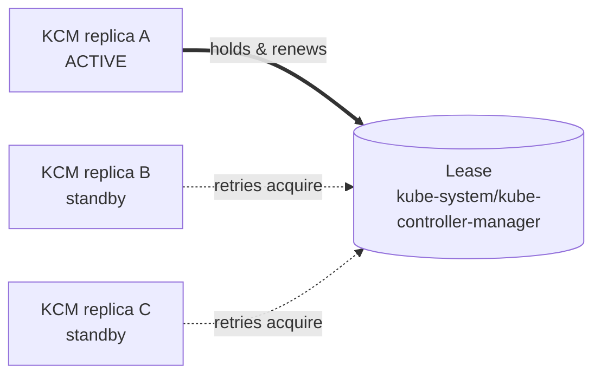

```bash
kubectl get lease kube-controller-manager -n kube-system -o yaml
# look at spec.holderIdentity and spec.renewTime
```

`kube-scheduler` uses the same mechanism with its own Lease.

## 5.8 Where KCM runs — self-managed vs AKS

**kubeadm / kind / minikube** — KCM is a *static Pod* started by the kubelet on the control-plane node:

```bash
# on the control-plane node
cat /etc/kubernetes/manifests/kube-controller-manager.yaml

# from kubectl
kubectl get pods -n kube-system -l component=kube-controller-manager
kubectl logs -n kube-system kube-controller-manager-<control-plane-node>
```

It serves health and metrics on the secure port `10257` (`/healthz`, `/metrics`).

**AKS (and EKS/GKE)** — the control plane is managed by the cloud provider and runs **outside your node pools**:

```bash
kubectl get pods -n kube-system | grep controller-manager
# -> nothing (on AKS)
```

You cannot see or configure the KCM process. To read its logs on AKS, enable **Diagnostic settings** on the cluster and send the `kube-controller-manager` log category to a Log Analytics workspace.

> **Note:** On AKS, what you *do* see in `kube-system` are node-level pieces (`kube-proxy`, `azure-cns`, `cloud-node-manager`, CSI node drivers, CoreDNS…). Don't confuse `cloud-node-manager` (a DaemonSet on your nodes) with `cloud-controller-manager` (managed, hidden).

## 5.9 Useful tuning flags (self-managed clusters)

| Flag | Default | Why it matters |
|---|---|---|
| `--concurrent-deployment-syncs` | 5 | Parallel Deployment reconciles |
| `--concurrent-replicaset-syncs` | 5 | Parallel ReplicaSet reconciles |
| `--concurrent-gc-syncs` | 20 | Garbage collector workers |
| `--kube-api-qps` / `--kube-api-burst` | 20 / 30 | Client-side rate limit to the API Server — often the real bottleneck in large clusters (mass scale-ups feel slow) |
| `--node-monitor-grace-period` | ~40–50s (version dependent) | How long before a silent Node is marked `Unknown` |
| `--terminated-pod-gc-threshold` | 12500 | How many terminated Pods PodGC tolerates before deleting old ones |
| `--leader-elect` | true | Enable leader election for HA |

## 5.10 What breaks when KCM is down?

A great interview question. Existing workloads **keep running** — kubelets and containers don't need KCM. What stops is *reconciliation*:

| Symptom | Controller that isn't running |
|---|---|
| `kubectl scale deploy --replicas=5` changes nothing | deployment / replicaset |
| Deleted Pods are not replaced | replicaset / statefulset / daemonset |
| New Nodes don't get DaemonSet Pods | daemonset |
| Pods on a dead Node are never evicted | node-lifecycle / taint-eviction |
| New Service endpoints don't appear | endpointslice |
| Namespace stuck in `Terminating` | namespace |
| Orphaned ReplicaSets/Pods pile up | garbage-collector |
| CronJobs don't fire, HPA doesn't scale | cronjob / horizontalpodautoscaling |
| New Namespace has no `default` ServiceAccount → Pod creation fails | serviceaccount |

Compare with **kube-scheduler down**: Pod objects get created but stay `Pending` with no node assigned.

## 5.11 Seeing controllers at work (debugging)

Controllers report what they do as **Events**, with the controller as the source:

```bash
kubectl get events -A --sort-by=.lastTimestamp
kubectl describe rs <replicaset>
```

Typical examples:

```text
Normal   SuccessfulCreate  replicaset-controller   Created pod: nginx-7c5ddbdf54-abcde
Normal   ScalingReplicaSet deployment-controller   Scaled up replica set nginx-7c5ddbdf54 to 3
Warning  FailedCreate      replicaset-controller   Error creating: pods "nginx-..." is forbidden:
                                                   exceeded quota: compute-quota ...
```

> **Note:** If a Deployment shows `READY 0/3` but `kubectl get pods` shows **no Pods at all**, the problem is usually at the controller step (quota, admission webhook, PodSecurity rejection) — look at `kubectl describe rs`, not at the Pods. If Pods exist but are `Pending`, look at the scheduler (`kubectl describe pod` → Events).

## 5.12 KCM vs custom controllers/operators

| | Built-in controllers | Custom controllers / operators |
|---|---|---|
| Runs in | `kube-controller-manager` process | Your own Deployment in the cluster |
| Watches | Built-in resources | Usually CRDs (plus built-ins) |
| Pattern | Informer → workqueue → reconcile | Same pattern (client-go / controller-runtime / kopf) |
| Talks to | API Server only | API Server only |

Writing an operator is literally writing one more KCM-style loop — see [`../../aks_crd_operator/`](../../aks_crd_operator) in this repo.

## 5.13 One-paragraph interview answer

> **kube-controller-manager is a control-plane binary that runs the built-in Kubernetes controllers — Deployment, ReplicaSet, StatefulSet, DaemonSet, Job, node lifecycle, garbage collector, namespace, EndpointSlice, HPA and more — as separate reconcile loops in one process. Each loop watches objects through the API Server using shared informers, compares desired state (`spec`) with actual state, and creates, updates or deletes objects through the API to converge them, writing progress back into `status`. It never talks to etcd directly, runs with leader election so only one replica is active in an HA control plane, and on managed services like AKS it is hidden inside the provider-managed control plane.**

---

# 6. cloud-controller-manager

The **Cloud Controller Manager (CCM)** integrates Kubernetes with cloud-provider APIs.

It is relevant when Kubernetes is running on platforms such as:

- AWS
- Azure
- Google Cloud

For example, Kubernetes can request cloud resources such as:

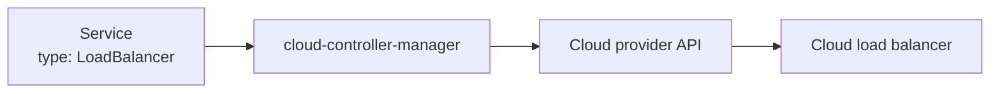

Think:

> **Cloud Controller Manager = Kubernetes ↔ Cloud provider integration**

> **Note:** CCM runs the cloud-specific loops that used to live inside KCM:
>
> | CCM controller | Job |
> |---|---|
> | Node controller | Labels Nodes with zone/instance type, removes Nodes whose VM was deleted |
> | Route controller | Programs cloud routes for Pod CIDRs (some network modes only) |
> | Service controller | Creates/updates the cloud load balancer for `type: LoadBalancer` Services |
>
> In-tree cloud provider code was removed from Kubernetes in v1.31, so on any modern cluster these loops always come from an external CCM. On AKS the CCM is part of the hidden managed control plane; the `cloud-node-manager` DaemonSet you see in `kube-system` is a separate node-side helper.

---

# 7. Worker Node

Worker Nodes are where application workloads actually run.

A typical worker node contains:

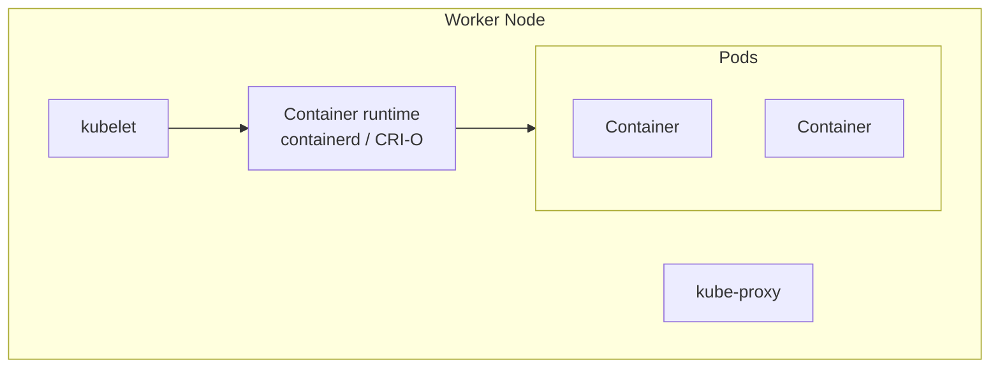

The main components are:

1. kubelet
2. kube-proxy
3. Container Runtime
4. Pods

---

# 8. kubelet

The **kubelet** is the Kubernetes agent running on every worker node.

Its main responsibility is:

> Make sure the Pods assigned to this node are running correctly.

Example:

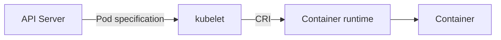

The kubelet:

- Watches for Pods assigned to its node.
- Talks to the API Server.
- Tells the container runtime to create/start/stop containers.
- Performs health checks.
- Reports node and Pod status back to the API Server.

Think:

> **kubelet = Agent responsible for running Pods on a node**

> **Note:** The kubelet is not managed by Kubernetes itself — it runs as a **systemd service** on the node (`systemctl status kubelet`, logs via `journalctl -u kubelet`). It can also run **static Pods** from manifest files on disk (`/etc/kubernetes/manifests`) without any API Server involvement — this is how kubeadm bootstraps the control plane (API Server, etcd, scheduler, KCM) itself.

Important distinction:

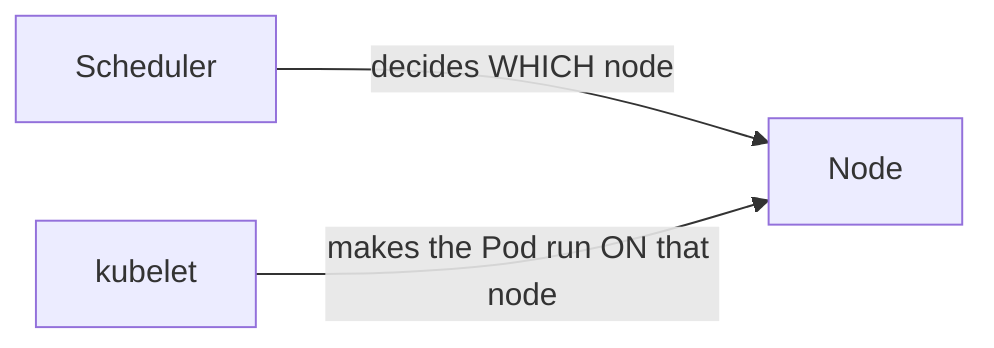

---

# 9. Container Runtime

The **Container Runtime** is responsible for actually running containers.

Common examples:

- containerd
- CRI-O

Historically Docker was commonly used, but modern Kubernetes does not use Docker Engine directly as its runtime interface.

> **Note:** The built-in Docker shim (`dockershim`) was removed in Kubernetes v1.24. Images built with `docker build` still work everywhere — they are standard OCI images; only the *runtime on the node* changed to containerd/CRI-O. AKS uses containerd.

The relationship is approximately:

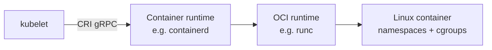

For example:

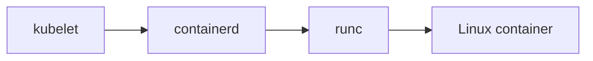

Think:

> **Container Runtime = Actually starts and stops containers**

---

# 10. kube-proxy

`kube-proxy` is a node-level networking component associated with Kubernetes Services.

It helps implement Service networking and traffic forwarding on nodes.

Example:

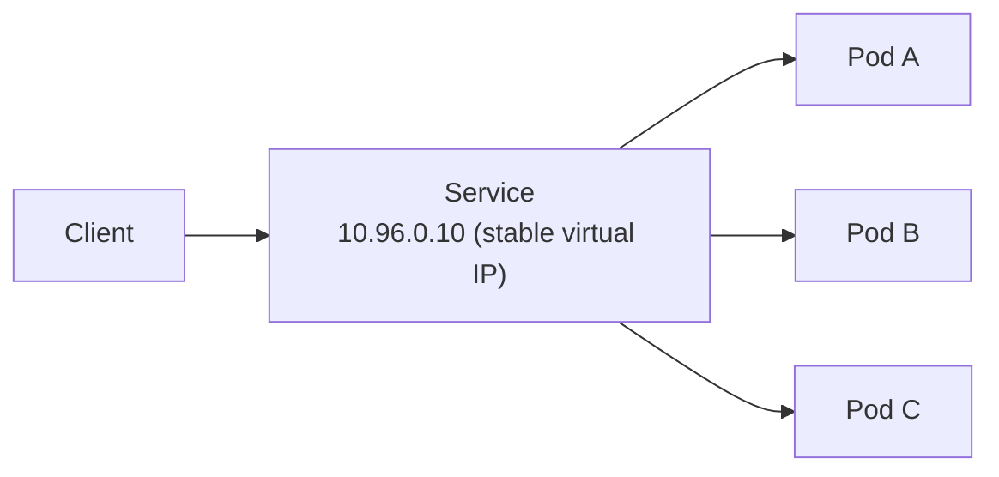

The Service provides a stable virtual endpoint while Pods can be created and destroyed.

`kube-proxy` traditionally programs networking rules on nodes so traffic can be forwarded to the appropriate backend Pods.

Depending on the cluster/networking implementation, kube-proxy may use mechanisms such as:

- iptables
- IPVS
- nftables (newer mode; GA in recent releases)

> **Note:** kube-proxy does not proxy traffic itself in these modes — it watches Services and EndpointSlices through the API Server and programs kernel rules; the **kernel** does the forwarding. eBPF-based CNIs such as Cilium (used by "Azure CNI powered by Cilium" on AKS) can replace kube-proxy entirely.

Some modern Kubernetes networking implementations can replace or eliminate kube-proxy functionality.

Think:

> **kube-proxy = Helps implement Service networking and traffic forwarding**

---

# 11. Pods

A **Pod** is the smallest deployable unit in Kubernetes.

Your application containers run inside Pods.

Example:

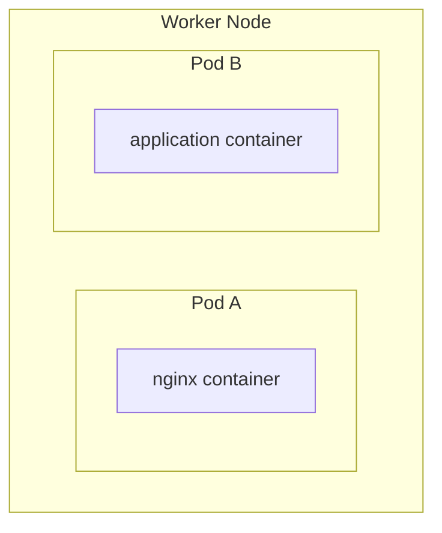

A Pod can contain one or multiple containers.

For most applications:

```text
1 Pod
  |
  +-- 1 main application container
```

Multiple containers in a Pod share things such as:

- Network namespace
- IP address
- localhost
- Volumes

---

# 12. Complete Request Flow

Consider this command:

```bash
kubectl create deployment nginx --image=nginx --replicas=3
```

A simplified flow is:

```mermaid
flowchart TB
    K["kubectl create deployment nginx --replicas=3"] --> API["kube-apiserver"]
    API <--> E[("etcd<br/>desired state = 3")]
    API --> KCM["kube-controller-manager<br/>creates ReplicaSet → Pod objects"]
    KCM --> SCH["kube-scheduler<br/>chooses worker node"]
    SCH --> W1["Worker 1<br/>kubelet → containerd → nginx Pod"]
    SCH --> W2["Worker 2<br/>kubelet → containerd → nginx Pod"]
```

The same process happens until all 3 desired replicas are running.

> **Note — two corrections to read into this simplified diagram:**
>
> 1. Arrows from `etcd` to other components really mean "**watches via the API Server**". Nothing except the API Server reads etcd.
> 2. "Controller Manager creates Pod objects" is really two controllers: the **Deployment controller** creates a ReplicaSet, then the **ReplicaSet controller** creates the Pods. The scheduler then writes the node assignment back through the API Server, and each kubelet watches for Pods whose `spec.nodeName` is its own node.
>
> ```mermaid
> sequenceDiagram
>     participant U as kubectl
>     participant A as API Server (+etcd)
>     participant D as deployment-controller
>     participant R as replicaset-controller
>     participant S as kube-scheduler
>     participant K as kubelet (worker-1)
>     U->>A: create Deployment (replicas=3)
>     A-->>D: watch: new Deployment
>     D->>A: create ReplicaSet
>     A-->>R: watch: new ReplicaSet
>     R->>A: create 3 Pods (nodeName empty)
>     A-->>S: watch: unscheduled Pods
>     S->>A: Binding (nodeName = worker-1)
>     A-->>K: watch: Pod for my node
>     K->>K: CRI → containerd → containers
>     K->>A: Pod status (IP, Ready)
> ```

---

# 13. Control Plane vs Worker Node

| Component | Location | Main Responsibility |
|---|---|---|
| kube-apiserver | Control Plane | Kubernetes API |
| etcd | Control Plane | Stores cluster state |
| kube-scheduler | Control Plane | Chooses node for Pods |
| kube-controller-manager | Control Plane | Maintains desired state |
| cloud-controller-manager | Control Plane | Cloud integration |
| kubelet | Worker Node (also on control-plane nodes in kubeadm clusters) | Manages Pods on node |
| kube-proxy | Worker Node | Service networking/traffic forwarding |
| Container Runtime | Worker Node | Runs containers |
| Pod | Worker Node | Runs application workload |

---

# 14. Easy Interview Memory Trick

## Control Plane

Remember:

> **API → STORE → DECIDE → CONTROL**

```text
API Server          → API
etcd                → STORE
Scheduler           → DECIDE
Controller Manager  → CONTROL
```

## Worker Node

Remember:

> **WATCH → NETWORK → RUN**

```text
kubelet             → WATCH/MANAGE Pods
kube-proxy          → NETWORK
container runtime   → RUN containers
```

---

# 15. Most Important Interview Distinctions

### Scheduler vs kubelet

```text
Scheduler
    ↓
Which node should run this Pod?

kubelet
    ↓
Make that Pod actually run on my node.
```

### etcd vs API Server

```text
API Server
    ↓
Provides access to Kubernetes state

etcd
    ↓
Stores Kubernetes state
```

### kubelet vs container runtime

```text
kubelet
    ↓
Tells runtime what should be running

container runtime
    ↓
Actually runs the containers
```

### Pod vs Container

```text
Pod
 └── Container(s)
```

A Pod is the Kubernetes workload unit; containers are the processes running inside it.

---

# 16. One-Line Architecture Summary

> **The Control Plane manages and makes decisions about the cluster, while Worker Nodes execute the workloads through kubelet, the container runtime, networking components, and Pods.**
