# Kubernetes Workload Controllers — Mental Model and Architecture

## 1. The big picture

Kubernetes has several **workload controllers** that manage Pods, but they solve different problems.

The most useful way to understand them is to ask:

> **What requirement do I have for my Pods?**

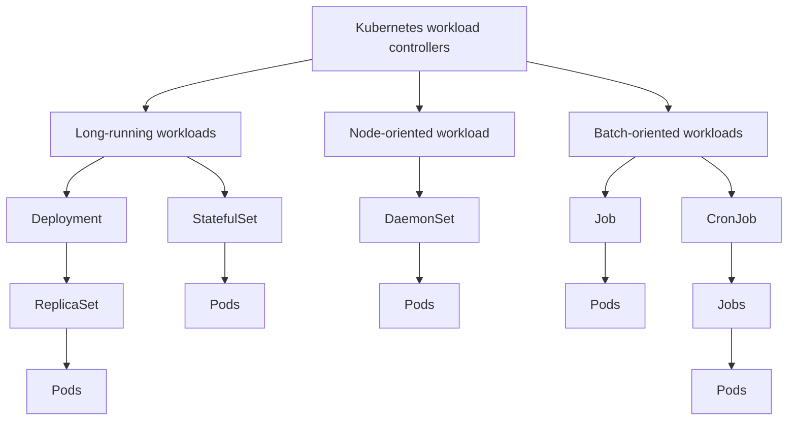

A more precise controller relationship is:

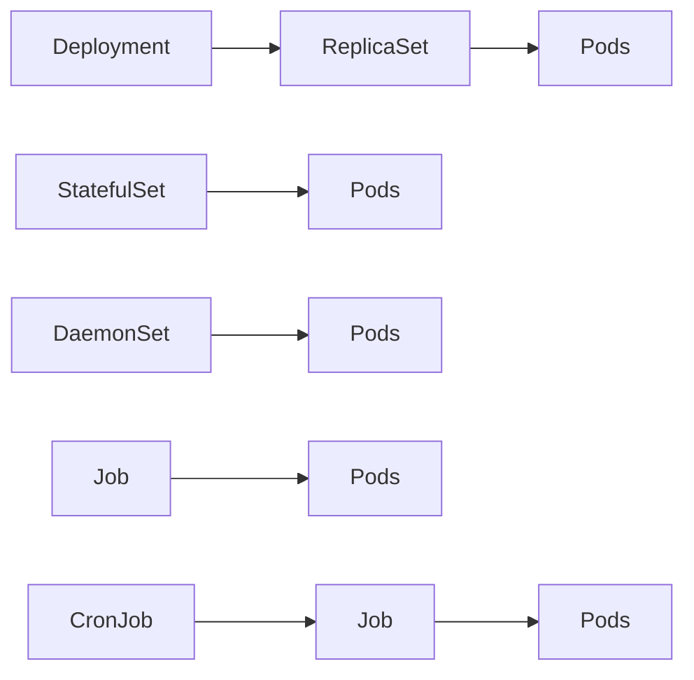

**Important:** Deployment is the workload controller that uses a ReplicaSet as an intermediate layer. StatefulSet and DaemonSet do not use ReplicaSets.

> **Note — terminology.** "Deployment is a controller" is common shorthand. Precisely: `Deployment` is an **API resource** (a kind you write in YAML), and the **Deployment controller** is a loop inside `kube-controller-manager` that acts on it. The same pairing applies to every row above (StatefulSet ↔ statefulset-controller, Job ↔ job-controller, …). All of these controllers live in one process — see [`architecture.md` §5](./architecture.md#5-kube-controller-manager).

---

# 2. The common idea: controllers maintain desired state

A useful Kubernetes mental model is:

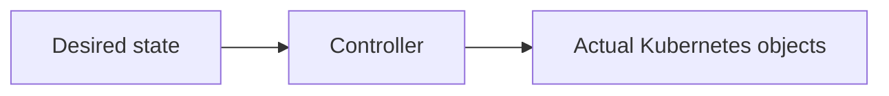

For example:

```text
Desired: 3 application Pods
             │
             ▼
        Controller
             │
             ▼
       Actual: 3 Pods
```

Different controllers implement different meanings of "desired state."

```text
ReplicaSet
→ N interchangeable Pods

Deployment
→ application rollout/version management using ReplicaSets

StatefulSet
→ N Pods with stable identity and stateful lifecycle semantics

DaemonSet
→ one Pod on every applicable node

Job
→ enough successful Pod completions to finish a finite task

CronJob
→ create Jobs according to a schedule
```

---

# 3. Deployment

## What is a Deployment?

### Interview answer

> **A Deployment is a Kubernetes workload controller used to manage long-running, usually stateless applications. It maintains the desired number of interchangeable Pods and provides declarative rolling updates, rollout history, and rollback. Internally, a Deployment manages ReplicaSets, and ReplicaSets manage the Pods.**

Short version:

> **Deployment manages the rollout and lifecycle of a stateless application, using ReplicaSets to maintain the desired number of Pods.**

---

## Deployment architecture

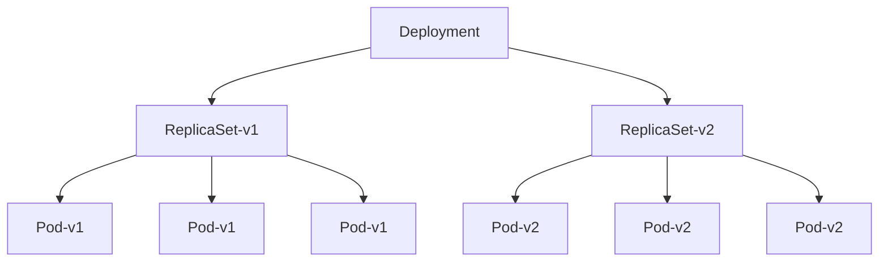

During a rollout, both old and new ReplicaSets may temporarily exist.

For example:

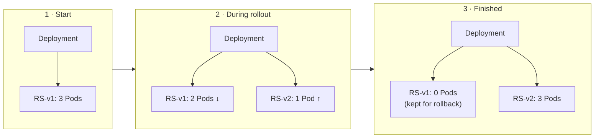

The old ReplicaSet can remain as rollout history, allowing rollback.

Useful commands:

```bash
kubectl get deployments
kubectl get replicasets
kubectl get pods
kubectl rollout status deployment <name>
kubectl rollout history deployment <name>
kubectl rollout undo deployment <name>
```

> **Note — rollout knobs worth knowing:**
>
> ```yaml
> spec:
>   strategy:
>     type: RollingUpdate          # default; the other option is Recreate (kill all, then start new)
>     rollingUpdate:
>       maxSurge: 25%              # default: how many extra Pods above replicas during rollout
>       maxUnavailable: 25%        # default: how many may be unavailable during rollout
>   revisionHistoryLimit: 10       # old ReplicaSets kept for rollback
>   minReadySeconds: 0             # Pod must be Ready this long to count as available
>   progressDeadlineSeconds: 600   # after this, condition Progressing=False (rollout "failed")
> ```
>
> A new ReplicaSet is created only when `spec.template` changes (tracked by the `pod-template-hash` label). Scaling `replicas` alone does not create one. `kubectl rollout pause/resume` lets you batch several template edits into one rollout.

---

# 4. Why does Deployment need ReplicaSet?

A Deployment has a higher-level responsibility:

> **Manage application versions and rollouts.**

A ReplicaSet has a simpler responsibility:

> **Maintain the desired number of matching Pods.**

Therefore:

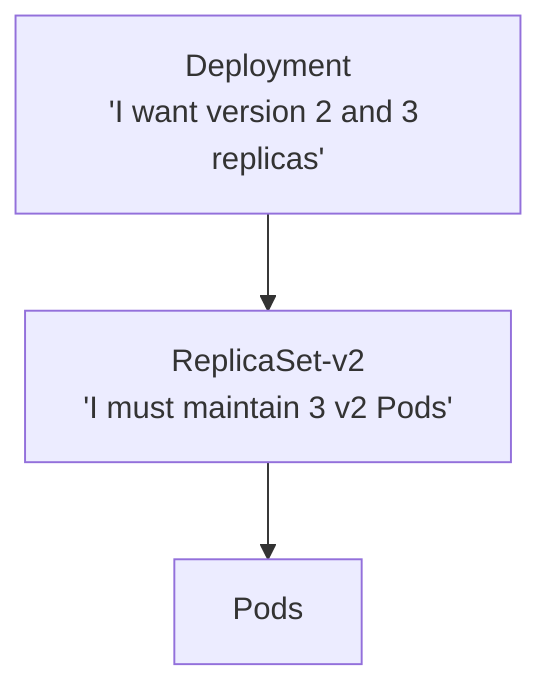

During an update:

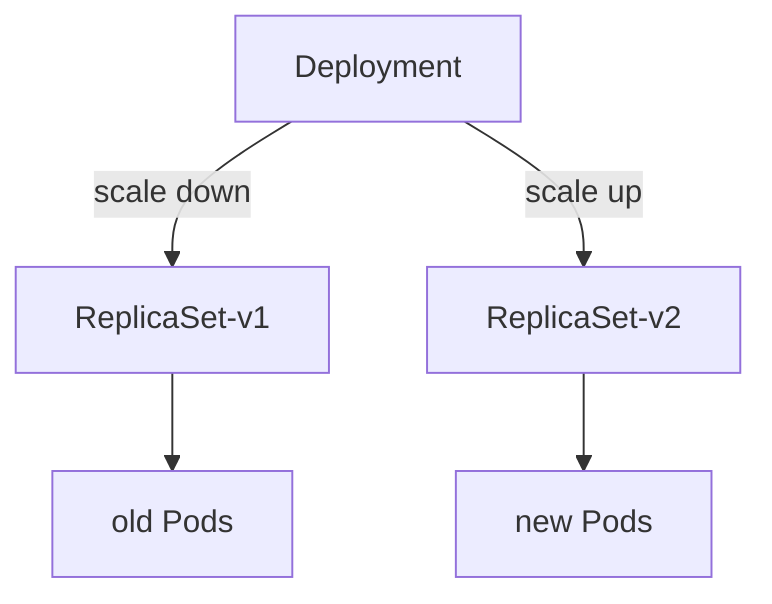

The Deployment can scale the old ReplicaSet down and the new ReplicaSet up according to the rollout strategy.

This separation also supports rollout history and rollback.

---

# 5. ReplicaSet

## What is a ReplicaSet?

A ReplicaSet is a controller whose primary responsibility is:

> **Ensure that a specified number of matching Pods are running.**

For example:

```yaml
spec:
  replicas: 3
```

Conceptually:

```text
ReplicaSet
    │
    ├── Pod
    ├── Pod
    └── Pod
```

If one Pod disappears:

```text
Before:

Pod-A
Pod-B
Pod-C

Pod-B disappears:

Pod-A
Pod-C
```

The ReplicaSet notices:

```text
Desired = 3
Actual  = 2
```

and creates another Pod.

The replacement Pod does not need to preserve the identity of the deleted Pod.

### Important practical point

You normally do **not** create ReplicaSets directly for normal application deployment.

Instead:

```text
Deployment
    ↓
ReplicaSet
    ↓
Pods
```

The Deployment manages the ReplicaSet for you.

---

# 6. StatefulSet

## What is a StatefulSet?

### Interview answer

> **A StatefulSet is a Kubernetes workload controller for stateful or identity-sensitive applications. It manages multiple Pods directly while providing stable Pod identities, stable network identities, persistent storage associations, and ordered lifecycle behavior. Unlike a Deployment, a StatefulSet does not use ReplicaSets.**

Short version:

> **StatefulSet manages Pods that need stable identity and often stable storage, such as database or distributed-system members.**

---

## StatefulSet architecture

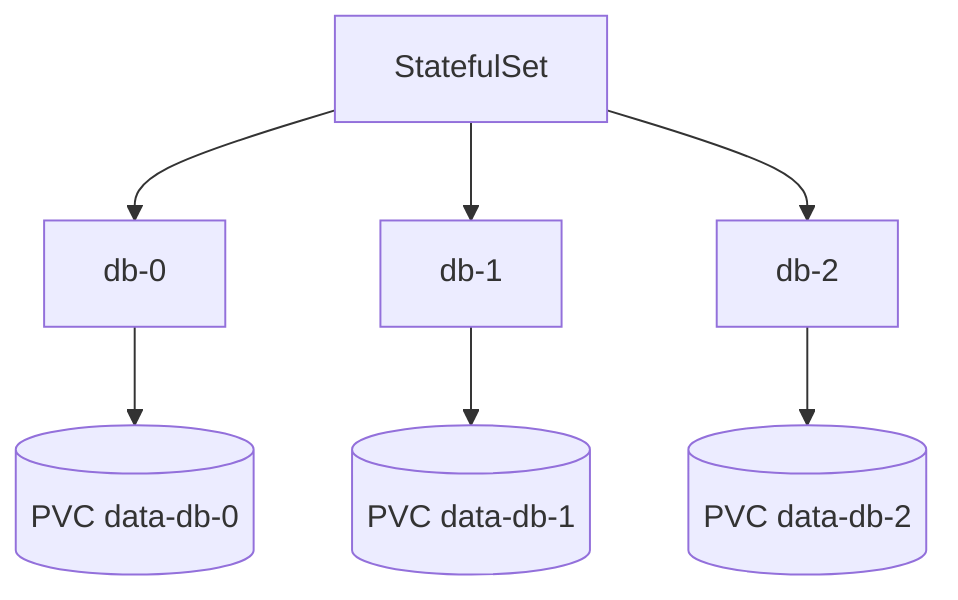

Notice:

```text
StatefulSet
    │
    ▼
Pods
```

There is **no ReplicaSet layer**.

---

# 7. How does StatefulSet manage N Pods without a ReplicaSet?

This is an important concept.

Suppose:

```yaml
spec:
  replicas: 3
```

The StatefulSet controller itself makes sure the desired Pods exist:

```text
StatefulSet
    │
    ├── db-0
    ├── db-1
    └── db-2
```

If `db-1` dies:

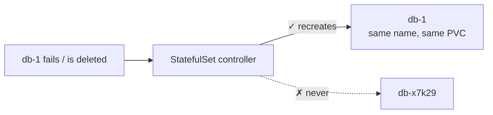

The StatefulSet controller notices that the desired state is not satisfied and recreates:

```text
db-1
```

It does not simply create an arbitrary Pod such as:

```text
db-x7k29
```

The identity matters.

> **Note — what a StatefulSet actually guarantees:**
>
> - **Stable name**: `<statefulset>-<ordinal>` (`db-0`, `db-1`, …).
> - **Stable DNS**: requires a **headless Service** (`clusterIP: None`) named in `spec.serviceName`; each Pod gets `db-0.<service>.<namespace>.svc.cluster.local`.
> - **Stable storage**: `volumeClaimTemplates` create one PVC per ordinal (`data-db-0`, `data-db-1`). When `db-1` is recreated it re-attaches **the same PVC**. PVCs are **not** deleted when you scale down or delete the StatefulSet (unless `persistentVolumeClaimRetentionPolicy` says so).
> - **Ordering**: with the default `podManagementPolicy: OrderedReady`, Pods are created `0 → N-1` (each must be Ready first) and deleted `N-1 → 0`. `Parallel` removes the ordering.
> - **At-most-one**: if the node running `db-1` becomes unreachable, the controller will **not** start a new `db-1` elsewhere until the old one is confirmed gone (force delete or the `node.kubernetes.io/out-of-service` taint). This avoids two Pods with the same identity writing to the same data — but it means StatefulSets don't self-heal from node failure as fast as Deployments.

---

# 8. Deployment vs StatefulSet

This is one of the most important Kubernetes comparisons.

| Property | Deployment | StatefulSet |
|---|---|---|
| Typical use | Stateless/replaceable application | Stateful/identity-sensitive application |
| Pod identity | Interchangeable | Stable |
| Pod names | Generated | Predictable, e.g. `db-0`, `db-1` |
| ReplicaSet layer | Yes | No |
| Storage association | Usually external/independent | Can provide stable PVC association |
| Replacement identity | New Pod can be different | Same ordinal identity is recreated |
| Rollouts | Deployment-managed | StatefulSet-managed |
| Typical examples | API, frontend, web service | Database, Kafka-like clustered system |

### Mental model

Deployment:

```text
"I need 3 equivalent copies."

Pod
Pod
Pod
```

StatefulSet:

```text
"I need 3 specific members."

db-0
db-1
db-2
```

---

# 9. DaemonSet

## What is a DaemonSet?

A DaemonSet is a controller that ensures a Pod runs on **every applicable node**.

Mental model:

> **One Pod per applicable node.**

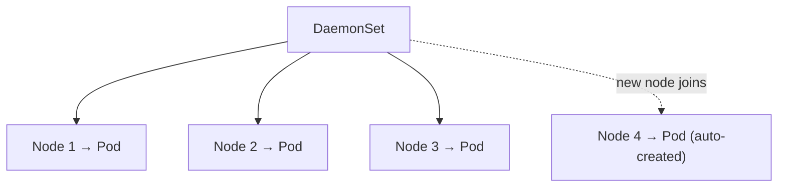

If a new applicable node joins:

```text
Node 4
```

the DaemonSet creates:

```text
Node 4 → Pod
```

If a node is removed, its DaemonSet Pod disappears with the node.

> **Note:** Precisely, the Pod object doesn't vanish by itself — when the Node object is deleted, the **pod-garbage-collector** controller (in KCM) deletes Pods bound to a node that no longer exists.

---

## Important correction

Do not define DaemonSet as:

> "One Pod on every node."

More accurately:

> **One Pod on every node that satisfies the DaemonSet's scheduling requirements.**

Scheduling can be restricted by:

- node affinity
- node selectors
- taints/tolerations
- OS requirements
- other scheduling constraints

---

# 10. Your Azure CNS example

Your AKS cluster has:

```text
DaemonSet: azure-cns
```

Its architecture is:

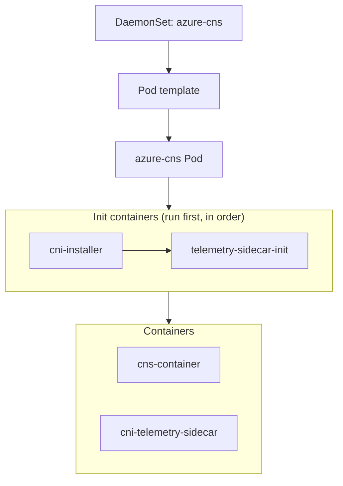

The Pod uses `hostNetwork: true` and several `hostPath` volumes.

Examples from your DaemonSet:

```text
/opt/cni/bin
/etc/cni/net.d
/var/run
/var/lib/azure-network
/var/run/azure-vnet
```

These are node-level paths.

Conceptually:

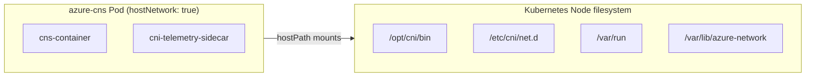

This is a strong real-world example of why a DaemonSet is useful: Azure CNS is node-level networking infrastructure.

Useful commands:

```bash
kubectl get daemonsets -A
kubectl get daemonset azure-cns -n kube-system
kubectl describe daemonset azure-cns -n kube-system
kubectl get daemonset azure-cns -n kube-system -o yaml
kubectl get pods -n kube-system -o wide
```

---

# 11. DaemonSet vs ReplicaSet

These are directly comparable because both are controllers that maintain Pods, but their desired-state rules differ.

### ReplicaSet

> Maintain N matching/interchangeable Pods.

```text
ReplicaSet
    │
    ├── Pod
    ├── Pod
    └── Pod
```

Example:

```text
replicas = 3
```

means:

```text
3 Pods
```

The Pods do not have to be distributed one per node.

### DaemonSet

> Maintain one Pod on each applicable node.

```text
DaemonSet
    │
    ├── Node 1 → Pod
    ├── Node 2 → Pod
    └── Node 3 → Pod
```

So:

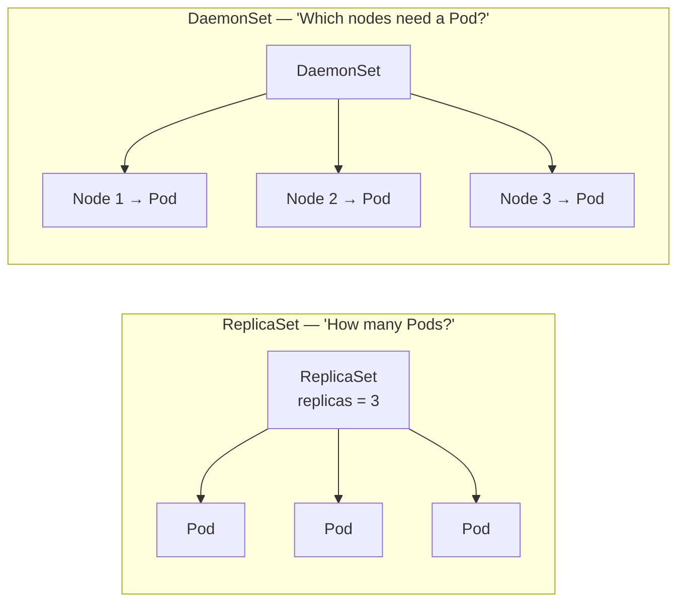

---

# 12. Job

A Job is for a **finite task that should eventually complete**.

Mental model:

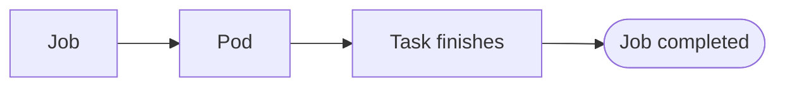

Unlike a Deployment, the Pod is not expected to run forever.

Example:

```text
Run a database migration
Run a batch ML preprocessing task
Generate a report
Process a finite data set
```

---

# 13. Can a Job have multiple Pods?

Yes.

A Job can use concepts such as:

```yaml
completions:
parallelism:
```

For example:

```yaml
spec:
  completions: 5
  parallelism: 2
```

Mental model:

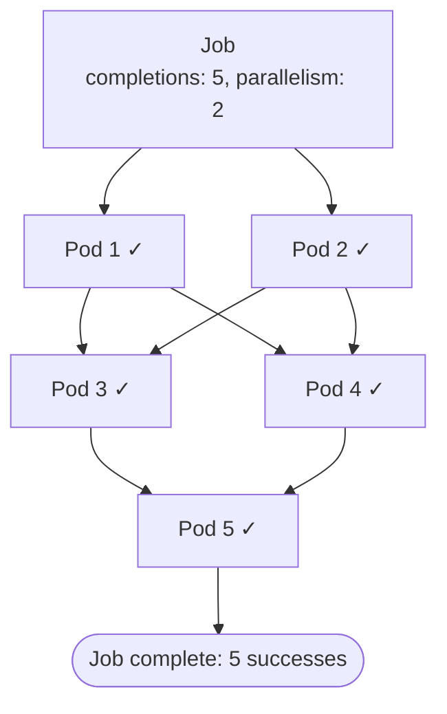

`parallelism: 2` means up to two Pods can work concurrently.

> **Note — other Job fields that matter in practice:**
>
> | Field | Default | Meaning |
> |---|---|---|
> | `completions` | 1 | Successful Pods needed |
> | `parallelism` | 1 | Max Pods running at once |
> | `backoffLimit` | 6 | Failed retries before the Job is marked `Failed` |
> | `activeDeadlineSeconds` | none | Hard time limit for the whole Job |
> | `ttlSecondsAfterFinished` | none | Auto-delete the Job (and its Pods) after it finishes |
> | `completionMode: Indexed` | `NonIndexed` | Each Pod gets `JOB_COMPLETION_INDEX` 0..N-1 — useful for sharding work |
> | `restartPolicy` (Pod template) | — | Must be `OnFailure` or `Never` (`Always` is not allowed for Jobs) |
>
> With `restartPolicy: OnFailure` the kubelet retries the container in the same Pod; with `Never` the Job controller creates a new Pod per failure.

The important distinction is that the Pods are being used to **complete work**, not to provide a permanently running service.

---

# 14. CronJob

A CronJob is a scheduler for Jobs.

Mental model:

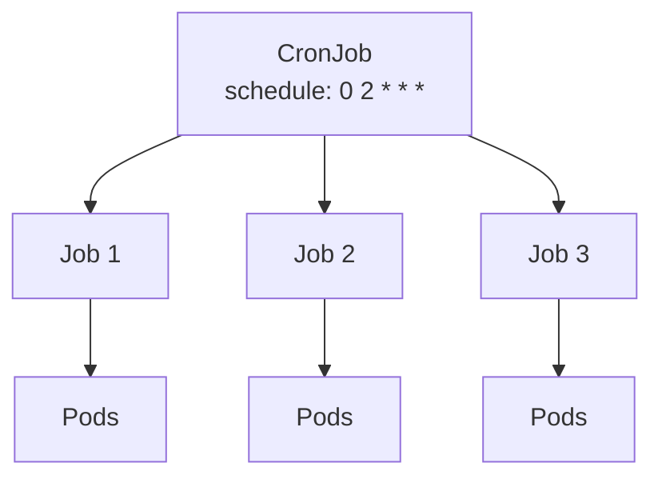

Example:

```yaml
schedule: "0 2 * * *"
```

means:

> Create a Job according to that schedule.

So:

```text
CronJob
   ↓
Job
   ↓
Pods
   ↓
Task completes
```

If each Job itself uses multiple completions, each scheduled Job can create/manage multiple Pods.

> **Note:** Key CronJob fields: `concurrencyPolicy` (`Allow` default / `Forbid` / `Replace` — what to do if the previous Job is still running), `startingDeadlineSeconds` (how late a missed run may still start; if it is unset and more than 100 runs were missed, the controller refuses to start the Job and logs an error), `timeZone` (e.g. `"Asia/Kolkata"`; without it the schedule is interpreted in the KCM's time zone, normally UTC), `suspend: true` to pause, and `successfulJobsHistoryLimit` (3) / `failedJobsHistoryLimit` (1). Trigger a run manually with `kubectl create job --from=cronjob/<name> <job-name>`.

---

# 15. Long-running vs batch workloads

A very useful boundary is:

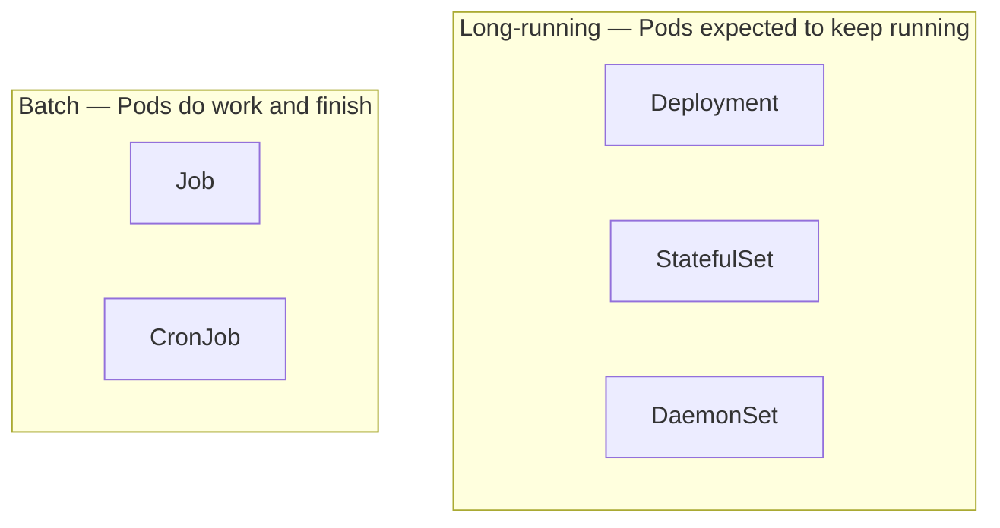

Long-running:

> Pods are expected to remain running.

Batch:

> Pods are expected to perform work and eventually finish.

---

# 16. Quick decision framework

Ask:

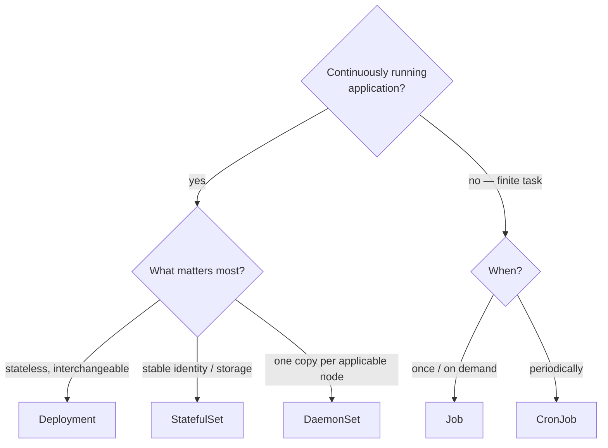

---

# 17. Interview-ready definitions

## "What is a Deployment in Kubernetes?"

A strong answer:

> **A Deployment is a Kubernetes workload controller used primarily for stateless, long-running applications. It declares the desired number and version of application Pods and manages their rollout. A Deployment creates and manages ReplicaSets, and the ReplicaSets maintain the actual Pods. This allows Kubernetes to perform rolling updates, maintain availability, keep rollout history, and support rollback.**

If the interviewer wants a shorter answer:

> **Deployment manages stateless application Pods and their versioned rollouts. It uses ReplicaSets underneath to maintain the desired number of Pods.**

---

## "What is a StatefulSet in Kubernetes?"

A strong answer:

> **A StatefulSet is a Kubernetes workload controller designed for applications where Pod identity and state matter. It manages Pods directly rather than through ReplicaSets and provides stable Pod identities, predictable names, stable network identities, and persistent storage associations. It is commonly used for databases and distributed systems where individual members need stable identity.**

Shorter answer:

> **StatefulSet manages stateful or identity-sensitive Pods with stable identities and storage associations. Unlike Deployment, it does not use ReplicaSets.**

---

# 18. Interview comparison: Deployment vs StatefulSet vs DaemonSet

If asked:

> "What's the difference between Deployment, StatefulSet, and DaemonSet?"

A concise answer:

> **Deployment is for interchangeable, generally stateless application replicas; StatefulSet is for Pods that need stable identity and often persistent storage; DaemonSet is for node-level workloads where one Pod should run on every applicable node.**

Example:

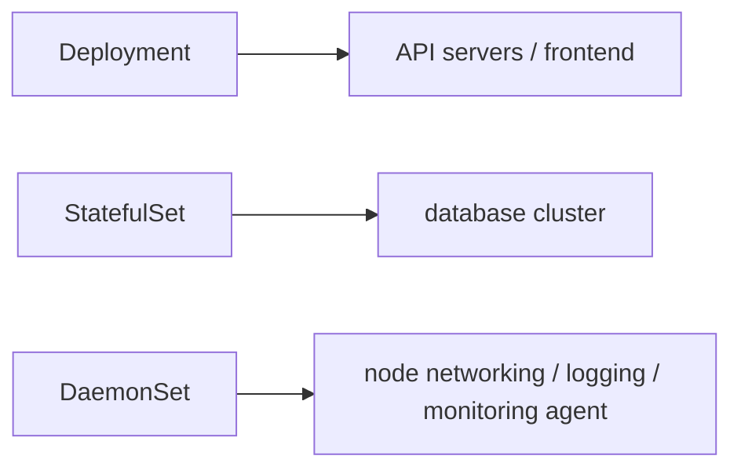

---

# 19. Final mental model

Memorize this:

```text
Deployment
    ↓
ReplicaSet
    ↓
Pods

"I need N interchangeable application Pods,
and I need rollout/version management."


StatefulSet
    ↓
Pods

"I need N Pods, but each Pod has stable identity
and potentially stable storage."


DaemonSet
    ↓
Pods

"I need one Pod on every applicable node."


Job
    ↓
Pods

"I need Pods to perform a finite task and finish."


CronJob
    ↓
Jobs
    ↓
Pods

"I need those finite tasks to run on a schedule."
```

And the most important conceptual distinction:

```text
Deployment  → version/rollout management
ReplicaSet  → number of interchangeable Pods
StatefulSet → identity/state
DaemonSet   → node placement
Job         → completion
CronJob     → scheduling Jobs
```
