# Kubernetes DaemonSet — Complete Guide

## 1. What is a DaemonSet?

A **DaemonSet is a Kubernetes workload controller that ensures a copy of a Pod runs on every node that is eligible for that DaemonSet.**

The important word is **eligible**.

A DaemonSet does **not** blindly put a Pod on every node in every situation.

Its scheduling rules can restrict which nodes are eligible.

### Interview answer

> **A DaemonSet is a Kubernetes workload controller used for node-level workloads. It ensures that one Pod runs on every node that matches the DaemonSet's scheduling requirements. When a new matching node is added, Kubernetes automatically creates the DaemonSet Pod on that node. When a node is removed, its DaemonSet Pod is removed with it.**

Examples:

- node monitoring agents
- log collectors
- networking agents
- storage agents
- security agents
- CNI components
- kube-proxy-like node-level components

---

# 2. The most important mental model

Think:

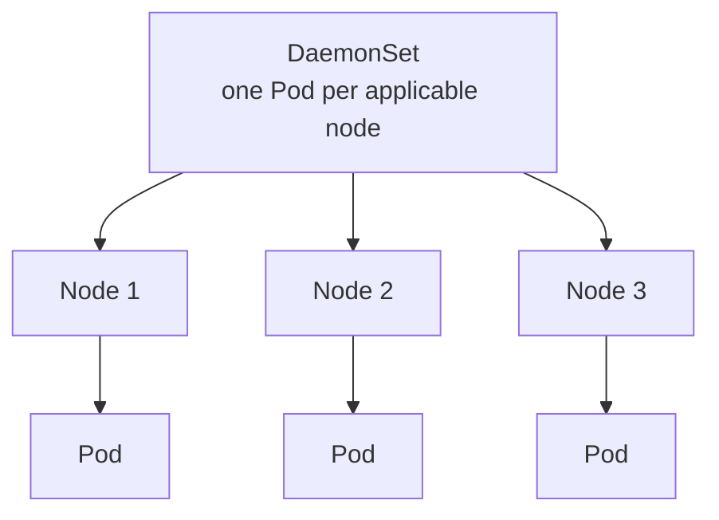

If a fourth applicable node appears:

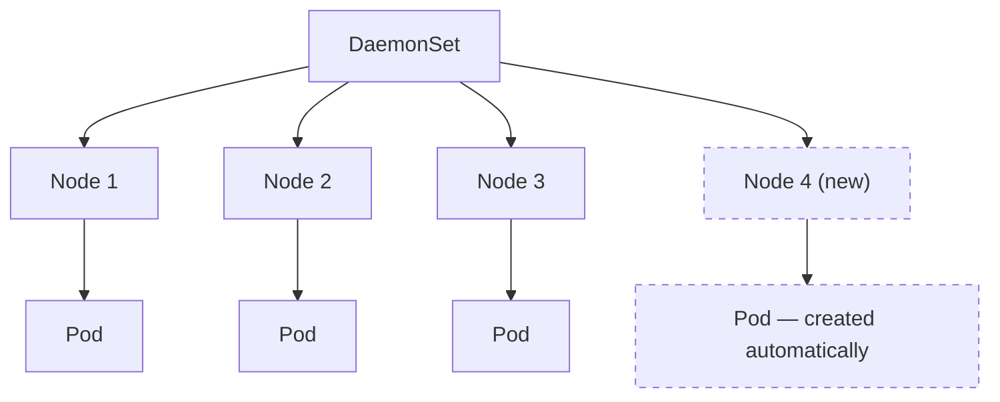

The DaemonSet controller automatically creates the new Pod.

---

# 3. Does deploying a DaemonSet automatically create a Pod on each node?

## Yes — on each eligible node.

Suppose you have:

```text
Node 1
Node 2
Node 3
```

and apply:

```bash
kubectl apply -f daemonset.yaml
```

Kubernetes creates:

```text
Node 1 → DaemonSet Pod
Node 2 → DaemonSet Pod
Node 3 → DaemonSet Pod
```

You do **not** manually create the Pods.

You don't specify:

```yaml
replicas: 3
```

based on the current number of nodes.

The DaemonSet controller determines the required number based on eligible nodes.

---

# 4. What happens when a new node is added?

Suppose the cluster initially has:

```text
Node 1 → Pod
Node 2 → Pod
```

Then a new eligible node joins:

```text
Node 3
```

The DaemonSet controller observes the new node and creates:

```text
Node 3 → Pod
```

So:

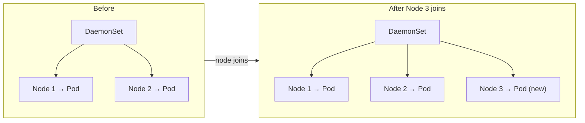

This is one of the biggest reasons DaemonSets are useful for infrastructure agents.

---

# 5. What happens when a node is removed?

Suppose:

```text
Node 1 → Pod
Node 2 → Pod
Node 3 → Pod
```

Node 2 is removed.

The DaemonSet does not try to maintain three Pods elsewhere.

Instead:

```text
Node 1 → Pod
Node 3 → Pod
```

There is no longer an eligible Node 2, so there is no reason for the DaemonSet to maintain a Pod there.

> **Note:** When the Node object is deleted, the Pod left bound to it is cleaned up by the **pod-garbage-collector** controller in `kube-controller-manager`, not by the DaemonSet controller. If the node merely becomes `NotReady` (not deleted), the DaemonSet Pod stays — see §37.

---

# 6. DaemonSet vs ReplicaSet

These are comparable because both are Pod controllers.

## ReplicaSet

Its requirement is:

> Maintain N matching Pods.

```text
ReplicaSet
    │
    ├── Pod
    ├── Pod
    └── Pod

replicas = 3
```

It doesn't inherently care which nodes those Pods are on.

## DaemonSet

Its requirement is:

> Maintain one Pod on every eligible node.

```text
DaemonSet
    │
    ├── Node 1 → Pod
    ├── Node 2 → Pod
    └── Node 3 → Pod
```

So:

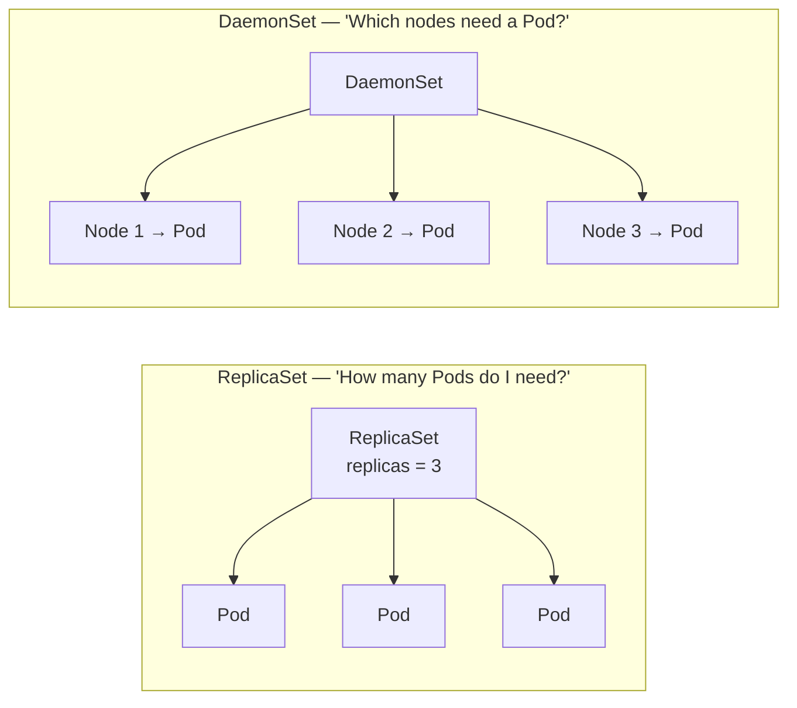

---

# 7. DaemonSet is not a Pod

A DaemonSet is a **controller**.

The Pods are separate Kubernetes objects.

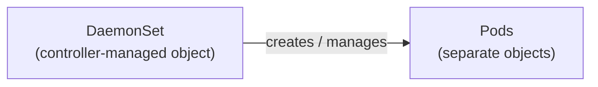

For example:

```bash
kubectl get daemonsets -A
```

might show:

```text
NAMESPACE     NAME          DESIRED   CURRENT   READY
kube-system   kube-proxy    3         3         3
```

Then:

```bash
kubectl get pods -n kube-system -o wide
```

might show:

```text
kube-proxy-abc    Running    node-1
kube-proxy-def    Running    node-2
kube-proxy-ghi    Running    node-3
```

The DaemonSet is the controller; the Pods are the actual running workload.

---

# 8. A DaemonSet contains a Pod template

A DaemonSet YAML has:

```yaml
kind: DaemonSet

spec:
  selector:
    ...

  template:
    metadata:
      ...

    spec:
      containers:
        ...
```

The `template` is essentially the definition of the Pod that the DaemonSet wants on each eligible node.

Conceptually:

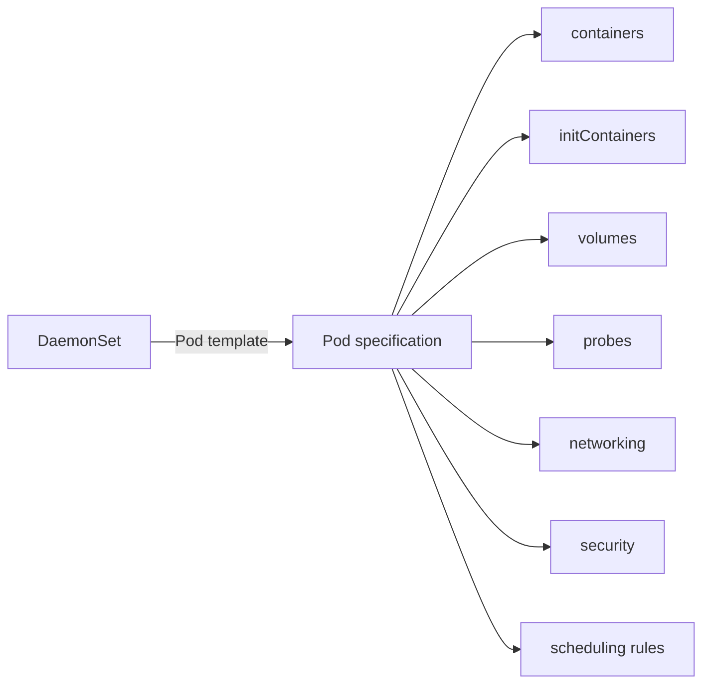

---

# 9. Minimal DaemonSet

A very simple example:

```yaml
apiVersion: apps/v1
kind: DaemonSet

metadata:
  name: node-agent
  namespace: default

spec:
  selector:
    matchLabels:
      app: node-agent

  template:
    metadata:
      labels:
        app: node-agent

    spec:
      containers:
      - name: agent
        image: nginx
```

Apply it:

```bash
kubectl apply -f daemonset.yaml
```

Check:

```bash
kubectl get daemonset node-agent
```

Then:

```bash
kubectl get pods -o wide
```

If there are three eligible nodes:

```text
node-agent-xxxxx    Running    node-1
node-agent-yyyyy    Running    node-2
node-agent-zzzzz    Running    node-3
```

---

# 10. You do NOT specify replicas

Unlike a Deployment:

```yaml
spec:
  replicas: 3
```

a DaemonSet does not use:

```yaml
replicas:
```

> **Note:** It's not just "not normally used" — the DaemonSet spec has **no `replicas` field at all**. `kubectl apply` will reject it as an unknown field (strict field validation). You also can't `kubectl scale` a DaemonSet. To temporarily run it on zero nodes, a common trick is a `nodeSelector` that matches no node.

because the number of required Pods is derived from the number of eligible nodes.

Conceptually:

```text
Eligible nodes = 5

DaemonSet desired Pods = 5
```

If:

```text
Eligible nodes = 8
```

then:

```text
DaemonSet desired Pods = 8
```

---

# 11. But "every node" is not literally every node

This is extremely important.

A DaemonSet can use scheduling rules.

For example:

```yaml
nodeSelector:
  kubernetes.io/os: linux
```

Now the requirement is:

> One Pod on every eligible Linux node.

Suppose:

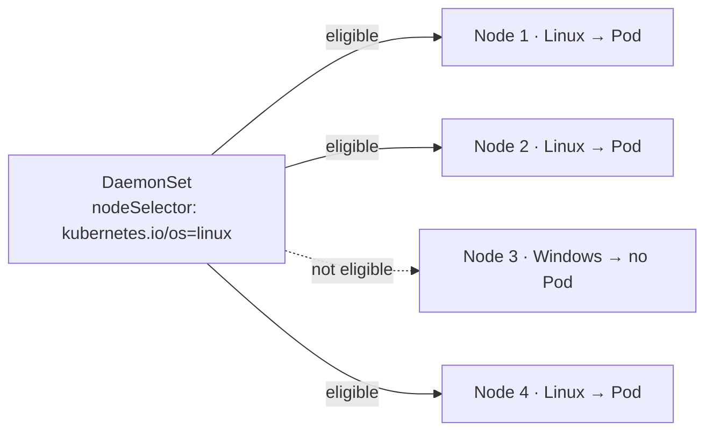

Then:

```text
Node 1 → Pod
Node 2 → Pod
Node 3 → no Pod
Node 4 → Pod
```

So:

```text
DaemonSet
    ↓
Eligible nodes
    ↓
One Pod per eligible node
```

---

# 12. Ways to control which nodes get the DaemonSet Pod

Several Kubernetes scheduling mechanisms can affect this.

## A. nodeSelector

Simple exact matching.

```yaml
nodeSelector:
  kubernetes.io/os: linux
```

Meaning:

> Schedule only on nodes with this label.

---

## B. Node affinity

More expressive than nodeSelector.

Example:

```yaml
affinity:
  nodeAffinity:
    requiredDuringSchedulingIgnoredDuringExecution:
      nodeSelectorTerms:
      - matchExpressions:
        - key: workload
          operator: In
          values:
          - monitoring
```

Meaning:

> Only nodes labeled `workload=monitoring`.

You can express:

- In
- NotIn
- Exists
- DoesNotExist
- Gt
- Lt

---

# 13. Taints and tolerations

Nodes can have taints.

For example:

```text
Node 1
taint:
  dedicated=gpu:NoSchedule
```

Normally a Pod without the corresponding toleration cannot be scheduled there.

A DaemonSet can specify:

```yaml
tolerations:
- key: dedicated
  operator: Equal
  value: gpu
  effect: NoSchedule
```

Now the DaemonSet Pod can run on that node.

This is very important for infrastructure agents.

For example, an observability agent may need to run on nodes that are otherwise reserved for special workloads.

> **Note — tolerations the DaemonSet controller adds automatically.** Every DaemonSet Pod gets these, even if you don't write them:
>
> | Toleration | Effect | Why |
> |---|---|---|
> | `node.kubernetes.io/not-ready` | `NoExecute` | Not evicted when the node is NotReady |
> | `node.kubernetes.io/unreachable` | `NoExecute` | Not evicted when the node stops heartbeating |
> | `node.kubernetes.io/disk-pressure` | `NoSchedule` | Can land on a node under disk pressure |
> | `node.kubernetes.io/memory-pressure` | `NoSchedule` | …memory pressure |
> | `node.kubernetes.io/pid-pressure` | `NoSchedule` | …PID pressure |
> | `node.kubernetes.io/unschedulable` | `NoSchedule` | Still runs on a **cordoned** node |
> | `node.kubernetes.io/network-unavailable` | `NoSchedule` | Only for `hostNetwork: true` Pods — lets a CNI DaemonSet start on a node whose network isn't up yet |
>
> This is why `kubectl drain` needs `--ignore-daemonsets`: DaemonSet Pods tolerate `unschedulable`, so draining would just see them come straight back.

---

# 14. Your Azure CNS example uses node affinity

Your actual AKS `azure-cns` DaemonSet had:

```yaml
affinity:
  nodeAffinity:
    requiredDuringSchedulingIgnoredDuringExecution:
```

with conditions including:

```yaml
- key: kubernetes.io/os
  operator: In
  values:
  - linux
```

So Azure CNS is restricted to Linux nodes.

It also had conditions excluding certain node types/dataplanes.

This demonstrates an important point:

> A DaemonSet can be "one per node" while still having very specific rules about which nodes qualify.

---

# 15. Tolerations in your Azure CNS example

Your Azure CNS DaemonSet also had:

```yaml
tolerations:
- key: CriticalAddonsOnly
  operator: Exists

- effect: NoExecute
  operator: Exists

- effect: NoSchedule
  operator: Exists
```

This allows the node-level infrastructure Pod to tolerate certain node taints.

This is common for system-level DaemonSets.

---

# 16. DaemonSet scheduling is automatic

When you run:

```bash
kubectl apply -f daemonset.yaml
```

the sequence is roughly:

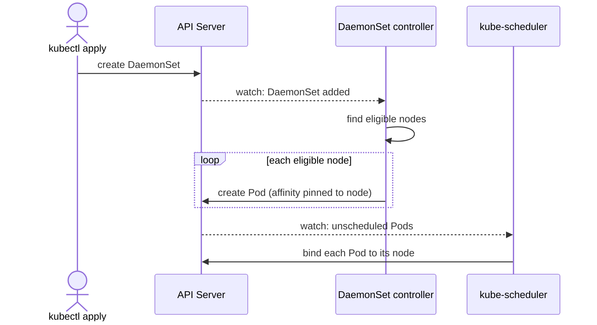

You don't manually create the Pods.

---

# 17. Scheduler's role

The DaemonSet controller determines that a Pod is needed for an eligible node.

The Pod is then scheduled according to Kubernetes scheduling behavior.

Conceptually:

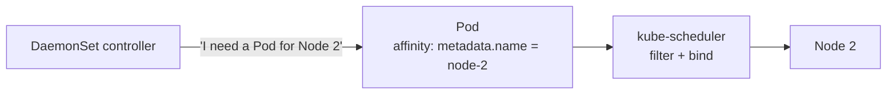

Modern Kubernetes has implementation details around DaemonSet scheduling and pre-created Pods, but the important operational model is:

> **Note — the actual mechanism (since v1.12, GA v1.17).** The DaemonSet controller creates each Pod with a **required node affinity pinned to one node by name**:
>
> ```yaml
> affinity:
>   nodeAffinity:
>     requiredDuringSchedulingIgnoredDuringExecution:
>       nodeSelectorTerms:
>       - matchFields:
>         - key: metadata.name
>           operator: In
>           values: ["aks-system-xxxxx-vmss000000"]
> ```
>
> The **default kube-scheduler** then binds it — so the Pod still goes through normal filtering (resources, ports, taints). Consequence: if the node lacks CPU/memory for the DaemonSet Pod's requests, the Pod stays `Pending` on that node. System DaemonSets therefore usually set `priorityClassName: system-node-critical` so the scheduler can preempt lower-priority Pods to make room.
>
> ```bash
> kubectl get pod <ds-pod> -n kube-system -o jsonpath='{.spec.affinity.nodeAffinity}'
> ```


> DaemonSet ensures the per-node Pod requirement; Kubernetes scheduling machinery places the Pod according to scheduling constraints.

---

# 18. What happens if the DaemonSet Pod crashes?

Suppose:

```text
Node 1 → DaemonSet Pod → Crash
```

The DaemonSet still wants a Pod on Node 1.

The Pod/container restart behavior and Kubernetes controllers ensure the workload is brought back according to the Pod's configuration.

> **Note — who does what:** a crashing **container** is restarted in place by the **kubelet** (DaemonSet Pods must use `restartPolicy: Always`), with exponential backoff → `CrashLoopBackOff`. The DaemonSet controller only steps in if the Pod **object** is deleted or ends in phase `Failed` (e.g. evicted); then it creates a new Pod for that node.

Conceptually:

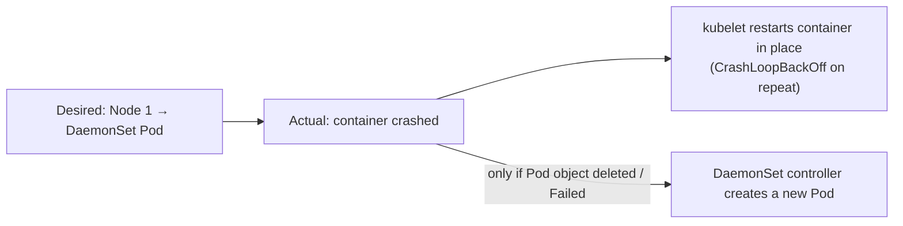

A DaemonSet is therefore not simply a one-time Pod creator.

It continuously works toward the desired state.

---

# 19. What happens if you manually delete a DaemonSet Pod?

For example:

```bash
kubectl delete pod <daemonset-pod> -n kube-system
```

If the node is still eligible, the DaemonSet controller will create another Pod for that node.

Conceptually:

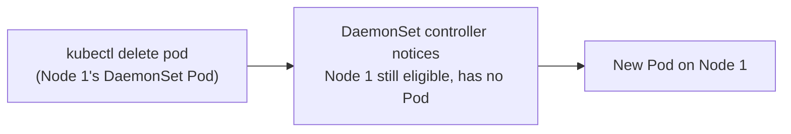

This is exactly the controller model.

---

# 20. What happens if a new node joins?

This is one of the best DaemonSet use cases.

Suppose:

```text
Before:
Node 1 → agent
Node 2 → agent
```

Autoscaler adds:

```text
Node 3
```

The DaemonSet automatically creates:

```text
Node 3 → agent
```

This is why DaemonSets are excellent for infrastructure that must automatically follow cluster capacity.

---

# 21. DaemonSet update strategy

DaemonSets support update strategies.

Common strategies include:

```yaml
updateStrategy:
  type: RollingUpdate
```

or:

```yaml
updateStrategy:
  type: OnDelete
```

## RollingUpdate

Kubernetes progressively replaces old DaemonSet Pods with new ones.

Conceptually:

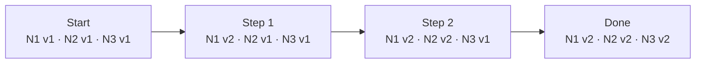

This is normally the preferred strategy for managed infrastructure updates.

> **Note:** `RollingUpdate` is the **default** (with `maxUnavailable: 1`). With `OnDelete`, changing the template does nothing to running Pods — a node only gets the new version when you manually delete its old Pod. `OnDelete` is used when an operator must control per-node upgrade timing (e.g. CNI or storage agents). Watch progress with `kubectl rollout status ds/<name> -n <ns>`; `kubectl rollout undo ds/<name>` works too (DaemonSets keep history as `ControllerRevision` objects: `kubectl get controllerrevisions -n <ns>`).

---

# 22. maxUnavailable

With RollingUpdate you can control how many DaemonSet Pods can be unavailable during the update.

Example:

```yaml
updateStrategy:
  type: RollingUpdate
  rollingUpdate:
    maxUnavailable: 1
```

Meaning:

> At most one DaemonSet Pod should be unavailable during the rollout.

This is particularly important for node-level networking, logging, monitoring, and security agents.

---

# 23. maxSurge

DaemonSets can also use `maxSurge` with supported rolling-update behavior.

Example:

```yaml
rollingUpdate:
  maxUnavailable: 1
  maxSurge: 1
```

This allows temporary additional Pods during rollout, subject to the DaemonSet update behavior and cluster constraints.

Conceptually:

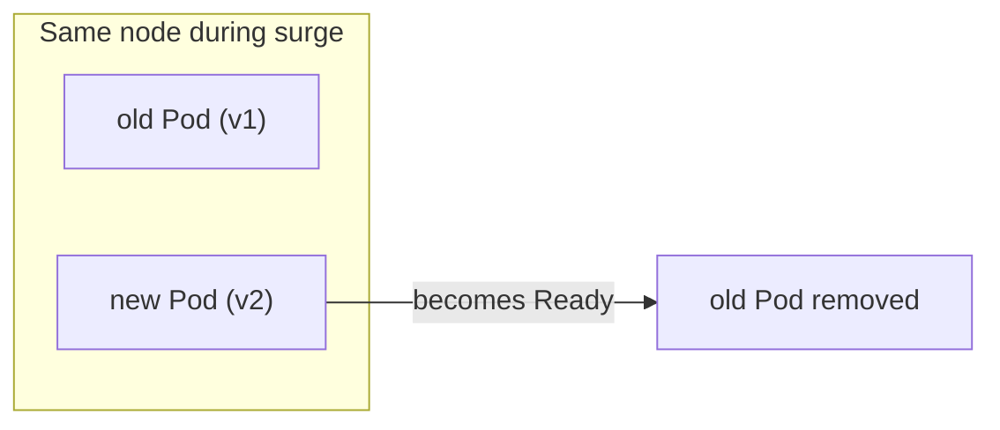

Then the old Pod can be removed after the new Pod is ready.

> **Note:** `maxSurge` for DaemonSets is GA since v1.25. `maxSurge` and `maxUnavailable` cannot both be `0`. Surge does **not** work for Pods that use a `hostPort` (or bind a fixed port with `hostNetwork: true`) — the old and new Pod would conflict on the same node port, so the new Pod can't start until the old is gone.

---

# 24. DaemonSet status

Run:

```bash
kubectl get daemonset -A
```

Example:

```text
NAMESPACE     NAME          DESIRED   CURRENT   READY   UP-TO-DATE   AVAILABLE
kube-system   kube-proxy    3         3         3       3            3
```

Meaning:

```text
DESIRED
How many nodes should have a DaemonSet Pod?

CURRENT
How many DaemonSet Pods currently exist?

READY
How many are ready?

UP-TO-DATE
How many use the current Pod template?

AVAILABLE
How many are available according to readiness/minReadySeconds?
```

---

# 25. Useful DaemonSet commands

List all:

```bash
kubectl get daemonsets -A
```

Short form:

```bash
kubectl get ds -A
```

One namespace:

```bash
kubectl get ds -n kube-system
```

Detailed description:

```bash
kubectl describe ds <name> -n <namespace>
```

YAML:

```bash
kubectl get ds <name> -n <namespace> -o yaml
```

Wide output:

```bash
kubectl get ds <name> -n <namespace> -o wide
```

Find its Pods:

```bash
kubectl get pods -n <namespace> -o wide
```

---

# 26. How to identify which Pods belong to a DaemonSet

Look at the DaemonSet selector:

```yaml
selector:
  matchLabels:
    k8s-app: azure-cns
```

Then:

```bash
kubectl get pods -n kube-system \
  -l k8s-app=azure-cns \
  -o wide
```

This shows Pods matching the DaemonSet's selector.

You can also inspect the Pod's metadata and owner references:

```bash
kubectl get pod <pod-name> -n kube-system -o yaml
```

Look for:

```yaml
metadata:
  ownerReferences:
```

The Pod will normally have an owner reference pointing to the DaemonSet.

---

# 27. DaemonSet and Pod ownership

Conceptually:

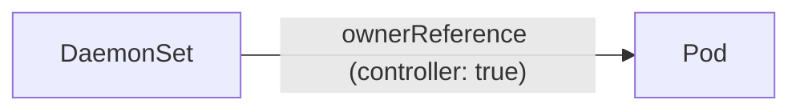

This is useful when debugging.

You can inspect:

```bash
kubectl get pod <pod-name> -n <namespace> -o yaml
```

and look for:

```yaml
ownerReferences:
- apiVersion: apps/v1
  kind: DaemonSet
  name: ...
```

---

# 28. DaemonSet with HostPath

DaemonSets are commonly used with `hostPath` because node-level agents often need access to node files.

Example:

```yaml
volumes:
- name: host-logs
  hostPath:
    path: /var/log
```

and:

```yaml
volumeMounts:
- name: host-logs
  mountPath: /var/log
```

Conceptually:

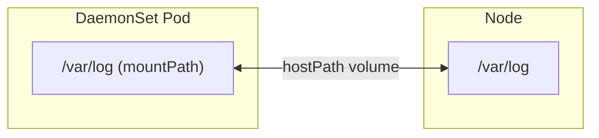

Each DaemonSet Pod sees the corresponding node's `/var/log`.

This is common for log collectors.

> **Note — security.** `hostPath` gives the container direct access to the node's filesystem; a writable mount of paths like `/`, `/etc`, `/var/lib/kubelet` or the container runtime socket is effectively node root. Mount `readOnly: true` where possible and prefer the narrowest path. The `baseline`/`restricted` Pod Security Standards forbid `hostPath` entirely — which is why system DaemonSets live in namespaces like `kube-system` that allow `privileged`.

---

# 29. DaemonSet with hostNetwork

Some node-level components use:

```yaml
hostNetwork: true
```

This means the Pod uses the node's network namespace rather than getting a separate normal Pod network namespace.

Conceptually:

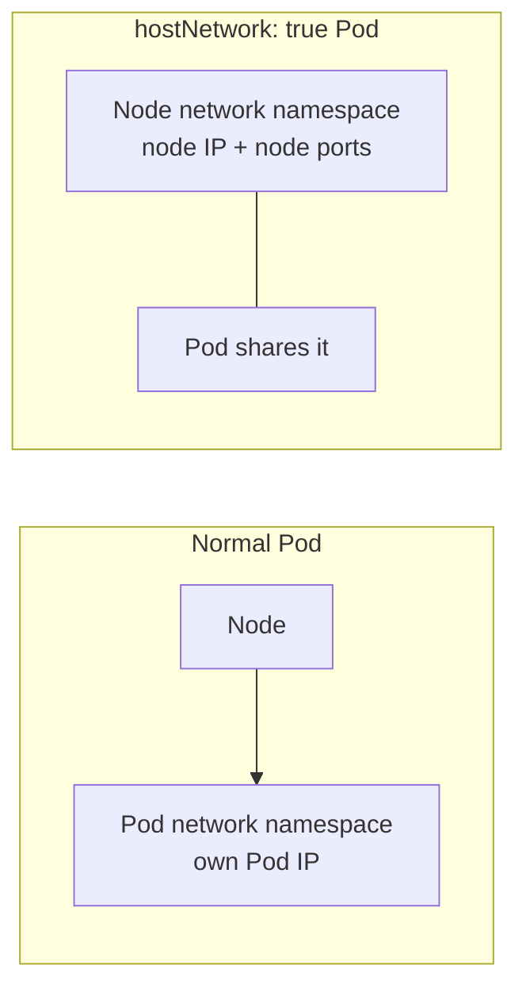

This can be useful for networking/system agents, but it should only be used when required.

> **Note:** With `hostNetwork: true`, the Pod's DNS defaults to the **node's** resolver, so cluster names like `my-svc.my-ns.svc.cluster.local` won't resolve. Set `dnsPolicy: ClusterFirstWithHostNet` if the agent needs to reach in-cluster Services by name. Also, any port the container listens on is opened on the node itself, so two such Pods on one node can't use the same port.

---

# 30. DaemonSet use cases

## A. Log collection

Example:

```text
Node 1 → log-agent
Node 2 → log-agent
Node 3 → log-agent
```

Each agent reads node/container logs and sends them to a central system.

Examples of workloads:

- Fluent Bit
- Fluentd
- Vector
- Alloy-like node agents

---

## B. Monitoring agents

Example:

```text
Node 1 → node monitoring agent
Node 2 → node monitoring agent
Node 3 → node monitoring agent
```

The agent collects:

- CPU
- memory
- disk
- network
- filesystem
- node-level metrics

---

## C. Security agents

A security/endpoint agent may need to run on every node.

```text
Node 1 → security agent
Node 2 → security agent
Node 3 → security agent
```

It may inspect:

- processes
- filesystem activity
- network activity
- container/runtime information

Exact requirements depend on the security product.

---

## D. Kubernetes networking

Networking components are classic DaemonSet candidates.

Your AKS cluster has examples such as:

```text
azure-cns
kube-proxy
```

because networking functionality is needed at the node level.

---

## E. Storage drivers

Your AKS cluster also showed:

```text
csi-azuredisk-node
csi-azurefile-node
```

These are examples of node-level storage components.

A node may need a driver/helper to perform storage operations for workloads running on that node.

---

## F. Hardware/device agents

DaemonSets are useful when every applicable node needs access to hardware.

Examples:

- GPU device/plugin components
- specialized accelerator agents
- hardware monitoring
- NIC-related agents

Often these use node labels, affinity, and tolerations so that the Pod only runs on appropriate nodes.

---

## G. Node-level observability

A DaemonSet can collect:

```text
Node
├── logs
├── metrics
├── filesystem information
├── runtime information
└── network information
```

and send it to a central observability platform.

---

# 31. When NOT to use a DaemonSet

Don't choose DaemonSet simply because you want multiple Pods.

### If you want 5 interchangeable application replicas:

Use:

```text
Deployment
```

not:

```text
DaemonSet
```

### If you need stable identities and storage:

Use:

```text
StatefulSet
```

### If you need a finite task:

Use:

```text
Job
```

### If you need a scheduled finite task:

Use:

```text
CronJob
```

---

# 32. DaemonSet vs Deployment

This is one of the most useful comparisons.

### Deployment

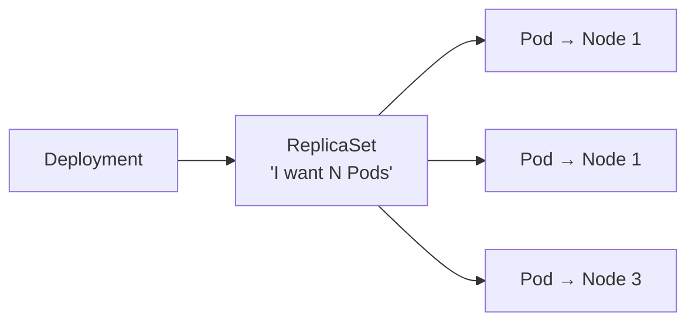

The requirement is:

> "I want N Pods."

### DaemonSet

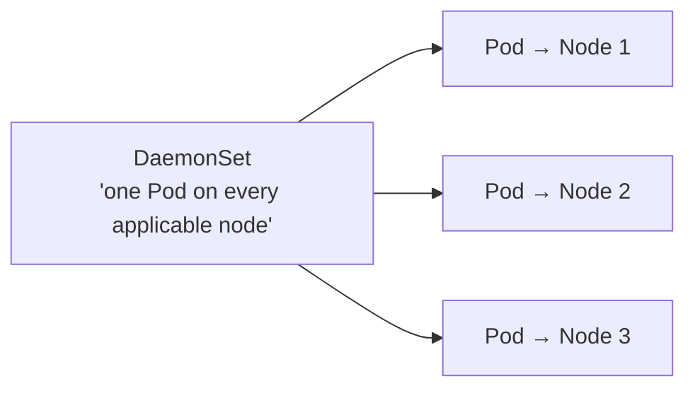

The requirement is:

> "I want one Pod on every applicable node."

---

# 33. DaemonSet vs StatefulSet

Both manage Pods directly, but the desired state is different.

### StatefulSet

```text
StatefulSet
    │
    ├── db-0
    ├── db-1
    └── db-2
```

Requirement:

> "I need specific identified members."

### DaemonSet

```text
DaemonSet
    │
    ├── Node 1 → agent
    ├── Node 2 → agent
    └── Node 3 → agent
```

Requirement:

> "I need a copy associated with each applicable node."

---

# 34. DaemonSet vs Job

### DaemonSet

```text
Node → Pod → keep running
```

### Job

```text
Pod → do work → finish
```

A DaemonSet Pod is normally a continuously running service/agent.

A Job Pod is expected to terminate successfully.

---

# 35. What if you have Windows and Linux nodes?

Suppose:

```text
Node 1 → Linux
Node 2 → Linux
Node 3 → Windows
```

A DaemonSet can use:

```yaml
nodeSelector:
  kubernetes.io/os: linux
```

Then:

```text
Node 1 → Pod
Node 2 → Pod
Node 3 → no Pod
```

This is why many Kubernetes system installations have separate DaemonSets for Linux and Windows.

Your AKS cluster output showed examples such as:

```text
azure-cns
azure-cns-win

kube-proxy
windows-kube-proxy-initializer
```

The `*-win` objects can exist specifically for Windows-node scenarios.

---

# 36. DaemonSet and node autoscaling

DaemonSets work particularly well with autoscaling clusters.

Suppose:

```text
Current:
Node 1 → monitoring-agent
Node 2 → monitoring-agent
```

Cluster autoscaler adds Node 3.

The DaemonSet automatically results in:

```text
Node 3 → monitoring-agent
```

So the new node gets the infrastructure agent without you manually deploying another Pod.

This is a major operational advantage.

---

# 37. What happens when a node becomes temporarily unavailable?

The DaemonSet's desired state is tied to eligible nodes.

The exact behavior depends on what happened to the node and Kubernetes' node lifecycle handling.

The key principle is:

> **The DaemonSet controller continuously reconciles the desired per-node Pod state.**

Do not think of a DaemonSet as a one-time deployment command.

> **Note — concretely:** when a node goes `NotReady`/unreachable, the node-lifecycle controller (in `kube-controller-manager`) taints it `node.kubernetes.io/unreachable:NoExecute`. Normal Pods are evicted after ~5 minutes, but DaemonSet Pods carry that toleration **without** a time limit (see §13), so they are **not** evicted and not recreated elsewhere — they simply resume when the node comes back. If the node is deleted instead, PodGC removes its Pod (see §5).

Think:

```text
Desired:
one Pod on every eligible node

Controller:
continuously reconcile

Actual:
Pods distributed across eligible nodes
```

---

# 38. DaemonSet YAML — important sections

When reading a DaemonSet YAML, focus on these areas:

```yaml
kind: DaemonSet
```

→ identifies the resource.

```yaml
metadata:
```

→ name, namespace, labels, annotations.

```yaml
spec:
  selector:
```

→ identifies the Pods managed by the DaemonSet.

```yaml
spec:
  template:
```

→ Pod template.

```yaml
spec:
  template:
    spec:
      nodeSelector:
```

→ simple node filtering.

```yaml
spec:
  template:
    spec:
      affinity:
```

→ advanced scheduling constraints.

```yaml
spec:
  template:
    spec:
      tolerations:
```

→ allows scheduling onto tainted nodes.

```yaml
spec:
  updateStrategy:
```

→ controls DaemonSet updates.

```yaml
spec:
  template:
    spec:
      containers:
```

→ actual workload.

```yaml
spec:
  template:
    spec:
      volumes:
```

→ storage/mount configuration.

---

# 39. A useful debugging sequence

When a DaemonSet Pod is missing from a node, don't immediately assume the DaemonSet is broken.

Check:

### Step 1 — Does the DaemonSet exist?

```bash
kubectl get ds -n <namespace>
```

### Step 2 — What does it want?

```bash
kubectl describe ds <name> -n <namespace>
```

Look at:

```text
Desired Number of Nodes Scheduled
Current Number of Nodes Scheduled
Number of Nodes Scheduled with Up-to-date Pods
Number of Nodes Misscheduled
Pods Status
```

### Step 3 — Check the nodes

```bash
kubectl get nodes --show-labels
```

### Step 4 — Check taints

```bash
kubectl describe node <node-name>
```

Look for:

```text
Taints:
```

### Step 5 — Check node affinity/nodeSelector

```bash
kubectl get ds <name> -n <namespace> -o yaml
```

Inspect:

```yaml
nodeSelector:
affinity:
tolerations:
```

### Step 6 — Check events

```bash
kubectl describe pod <pod-name> -n <namespace>
```

and:

```bash
kubectl get events -n <namespace> --sort-by=.lastTimestamp
```

---

# 40. Important CLI distinction

If you see:

```text
kube-system   azure-cns
```

then:

```text
kube-system = namespace
azure-cns    = DaemonSet name
```

The resource type is:

```text
daemonset
```

Therefore:

```bash
kubectl describe daemonset azure-cns -n kube-system
```

Not:

```bash
kubectl describe azure-cns -n kube-system
```

Because `azure-cns` is the name, not the resource type.

---

# 41. Your current AKS example

Your cluster showed:

```text
kube-system   azure-cns
kube-system   azure-ip-masq-agent
kube-system   cloud-node-manager
kube-system   csi-azuredisk-node
kube-system   csi-azurefile-node
kube-system   kube-proxy
```

These demonstrate the common DaemonSet pattern:

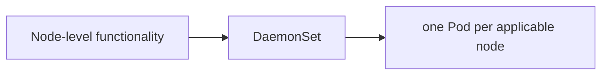

Your `azure-cns` example is especially useful because it combines:

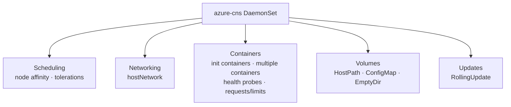

This is a realistic production DaemonSet rather than a toy example.

---

# 42. Final mental model

Remember this:

```mermaid
flowchart TB
    DS["DaemonSet<br/>one Pod per eligible node"] --> N1["Node 1"] --> P1["Pod-1"]
    DS --> N2["Node 2"] --> P2["Pod-2"]
    DS --> N3["Node 3"] --> P3["Pod-3"]
```

The DaemonSet:

- does not normally use `replicas`
- automatically creates the required Pods
- automatically reacts to new eligible nodes
- removes/reconciles Pods as nodes change
- can restrict nodes using selectors/affinity
- can use tolerations to run on tainted nodes
- can perform rolling updates
- can mount node filesystem paths with HostPath
- is ideal for node-level infrastructure

### One-sentence interview definition

> **A DaemonSet is a Kubernetes controller that ensures one instance of a Pod runs on every node eligible according to its scheduling constraints, making it suitable for node-level networking, logging, monitoring, storage, security, and hardware agents.**
