# Kubernetes Debug Pod and Workload Debugging — Complete Guide

## 1. Overview

“Debug pod” is an informal term. Kubernetes provides several different debugging mechanisms, each intended for a different layer of the system.

The main approaches are:

1. `kubectl exec` — enter an existing application container.
2. Ephemeral container with `kubectl debug` — add a temporary debugging container to an existing Pod.
3. `kubectl debug --copy-to` — create a modified copy of a Pod for investigation.
4. Standalone debug Pod — create an independent toolbox Pod.
5. Node debugging with `kubectl debug node/...` — investigate the Kubernetes node, kubelet, container runtime, CNI, filesystem, etc.
6. Shared volumes — allow containers to intentionally exchange files.
7. Process-level debugging — inspect or attach to an already-running process.
8. Application-specific hot reload/debugging — useful for development, but different from Kubernetes debugging.

The most important conceptual rule is:

> Containers in the same Pod do NOT automatically share their root filesystems.

They normally share the Pod network namespace, and they can share volumes when those volumes are explicitly mounted. Process namespaces can also be shared/configured.

---

# 2. Kubernetes Pod and Container Filesystems

Consider:

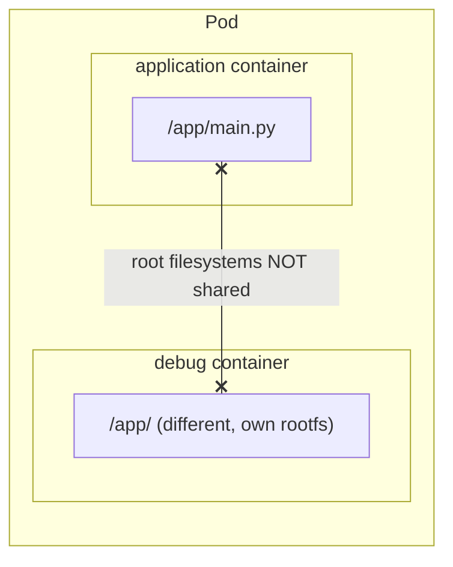

These are normally separate container root filesystems.

Changing:

```text
debug-container:/app/main.py
```

does not automatically change:

```text
application-container:/app/main.py
```

The containers can share:

- Pod network namespace
- explicitly mounted volumes
- a process namespace if configured
- other namespaces depending on Pod/container configuration

They do not automatically share:

- the complete root filesystem
- `/app`
- `/usr`
- `/etc`
- arbitrary files from another container

---

# 3. Debugging Decision Tree

Use the following mental model:

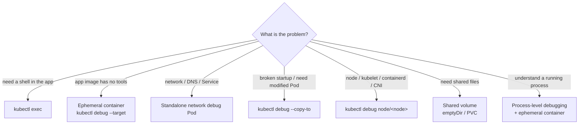

---

# 4. Method 1 — kubectl exec

## What it does

`kubectl exec` executes a command inside an existing container.

Example:

```bash
kubectl exec -it api-776f8b7547-zq9zd -n fast-site -- bash
```

If `bash` does not exist:

```bash
kubectl exec -it api-776f8b7547-zq9zd -n fast-site -- sh
```

If the Pod contains multiple containers:

```bash
kubectl exec -it <pod> -n <namespace> -c <container> -- sh
```

## Typical uses

Inspect processes:

```bash
ps aux
```

Inspect environment:

```bash
env
```

Inspect files:

```bash
ls -lah
find /app -maxdepth 2 -type f
```

Inspect disk:

```bash
df -h
```

Inspect Python:

```bash
python --version
pip list
```

Inspect DNS configuration:

```bash
cat /etc/resolv.conf
```

Inspect application files:

```bash
cd /app
cat main.py
```

## When to use it

Use `exec` when:

- the container is running
- the container has a usable shell
- required debugging tools are already installed
- you want to inspect the application from inside its environment

## Main limitation

Production images are often minimal.

They may not contain:

```text
bash
curl
wget
ps
vim
nano
tcpdump
strace
netstat
```

Distroless images may contain almost no interactive tooling.

That is a major reason ephemeral containers exist.

---

# 5. Method 2 — Ephemeral Containers

An ephemeral container is a temporary container added to an existing Pod for debugging.

Example:

```bash
kubectl debug -it api-776f8b7547-zq9zd \
  -n fast-site \
  --image=ubuntu:24.04 \
  --target=api \
  -- bash
```

Conceptually:

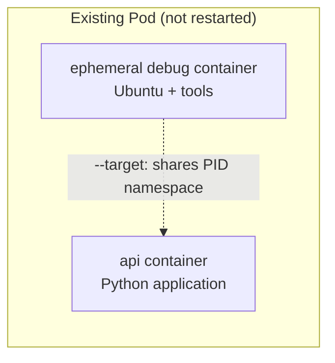

The original application image does not need to be rebuilt.

The application Pod does not need to be replaced just to add the debugging container.

> **Note — ephemeral container rules (GA since v1.25):**
>
> - They are added through the Pod's `ephemeralcontainers` subresource; the Pod is **not restarted**.
> - They **cannot be removed or restarted** once added — they stay in `spec.ephemeralContainers` (and in `kubectl describe pod`) until the Pod is deleted. Each `kubectl debug` run adds another one.
> - They may not declare `ports`, probes, or resource requests/limits, and are never restarted automatically.
> - RBAC: the user needs `patch` on `pods/ephemeralcontainers` — often not granted in production namespaces.
> - They do count towards node resource usage, and Pod Security admission still applies (a `restricted` namespace rejects a privileged debug container).

---

# 6. Why Use an Ephemeral Container?

Typical scenario:

```text
Application container
    │
    ├── Python
    ├── application
    └── no bash
       no curl
       no ps
```

Instead of modifying the application image, add:

```text
Debug container
    │
    ├── bash
    ├── ps
    ├── curl
    ├── networking tools
    └── debugging tools
```

This lets you investigate the running workload without rebuilding the application image merely to obtain troubleshooting utilities.

---

# 7. The --target Option

Example:

```bash
kubectl debug -it <pod> \
  --image=ubuntu:24.04 \
  --target=<container> \
  -- bash
```

`--target` identifies the container whose process environment is the target of the debugging operation.

One important use is enabling access to the target container's process namespace where supported/configured.

This can allow tools such as:

```bash
ps aux
```

to show the target application's processes.

Important:

> `--target` does NOT mean that the debug container automatically gets the target container's root filesystem.

Process namespace sharing and filesystem sharing are different concepts.

> **Note — how you *can* reach the target's files.** Once `--target` gives you the target's PID namespace, the target's root filesystem is reachable through procfs:
>
> ```bash
> ps aux                       # find the app's PID, e.g. 1
> ls /proc/1/root/app          # the TARGET container's /app
> ```
>
> This only works if the debug container runs as the same user as the target (or as root with sufficient capabilities); otherwise you get `Permission denied`. It is the practical version of "Option 3" in §19. `--target` also requires runtime support (containerd and CRI-O support it).

---

# 8. Ephemeral Container vs Existing Container

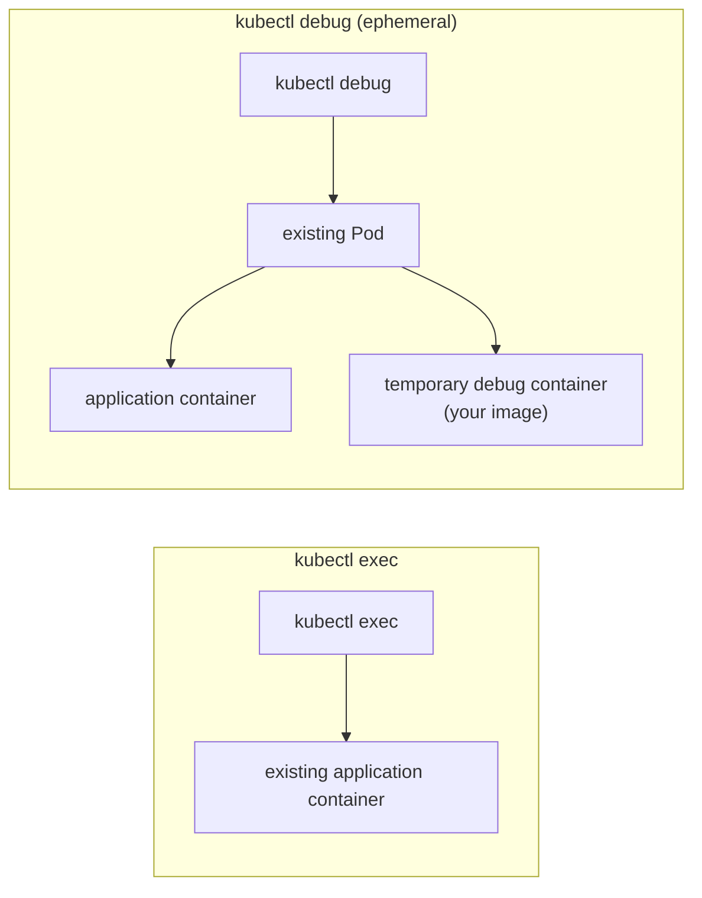

`kubectl exec` enters the application container itself. `kubectl debug` gives you a separate container with your desired debugging image.

This is particularly useful when the application container is minimal.

---

# 9. Method 3 — Standalone Debug Pod

A standalone debug Pod is completely separate from the application Pod.

Example:

```bash
kubectl run debug \
  -n fast-site \
  --rm -it \
  --image=ubuntu:24.04 \
  -- bash
```

Conceptually:

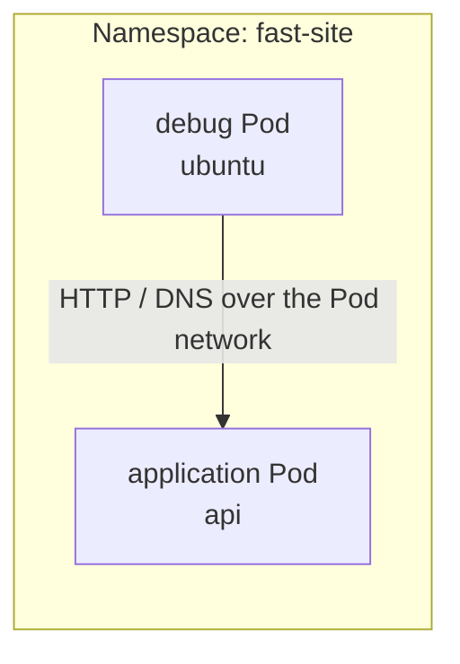

This is extremely useful for network and service troubleshooting.

---

# 10. Network Debug Pod

A specialized networking image can provide tools such as:

```text
curl
wget
dig
nslookup
ping
nc
ss
tcpdump
```

For example, a network-debugging image can be used to test:

```bash
curl http://api.fast-site.svc.cluster.local
```

DNS:

```bash
nslookup api.fast-site.svc.cluster.local
```

or:

```bash
dig api.fast-site.svc.cluster.local
```

This lets you distinguish:

```text
Application problem
        vs
Service problem
        vs
DNS problem
        vs
NetworkPolicy problem
        vs
Ingress problem
```

---

# 11. What a Standalone Debug Pod Cannot Automatically Do

A standalone debug Pod does NOT automatically have:

```text
application container filesystem
application process
application environment variables
application PID namespace
```

It is simply another Pod.

For example:

```text
debug Pod:/app/main.py
```

has no reason to be the same as:

```text
application Pod:/app/main.py
```

unless a shared storage mechanism is deliberately configured.

---

# 12. Method 4 — kubectl debug --copy-to

Sometimes you don't want to touch the existing Pod.

Instead, create a copy for investigation.

Conceptually:

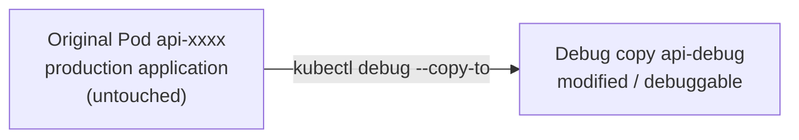

A common pattern is:

```bash
kubectl debug <pod> \
  -n <namespace> \
  --copy-to=<debug-pod>
```

Additional options can be used to change the image, command, container, environment, or other debugging properties depending on the problem.

> **Note — the flags you actually use with `--copy-to`:**
>
> ```bash
> # copy + add a debug container + share process namespace
> kubectl debug <pod> -n <ns> -it --copy-to=<pod>-debug \
>   --image=ubuntu:24.04 --share-processes -- bash
>
> # copy + replace the app container's command with a shell (crash-on-start investigation)
> kubectl debug <pod> -n <ns> -it --copy-to=<pod>-debug \
>   --container=<app-container> -- sh
>
> # copy + swap an image
> kubectl debug <pod> -n <ns> --copy-to=<pod>-debug --set-image=<app-container>=myimage:debug
> ```
>
> The copy is a **bare Pod** (no ReplicaSet owner), so it isn't replaced if it dies and must be deleted manually when you're done. Recent kubectl versions strip the original labels from the copy by default (see `--keep-labels`), so it doesn't receive Service traffic — check with `kubectl get pod <copy> --show-labels`.

The key idea is:

> Debug a copy rather than changing the live workload.

---

# 13. Why Use --copy-to?

This is particularly useful when:

- the application crashes immediately
- the startup command is wrong
- the container exits too quickly
- you need a shell instead of the normal application command
- you need to alter the container image for investigation
- you need to change startup behavior temporarily
- you want to preserve the original Pod while investigating

Example concept:

Production:

```text
python main.py
```

Debug copy:

```text
bash
```

Now you can inspect:

```text
environment
files
libraries
configuration
permissions
DNS
network
```

without relying on the production process staying alive.

---

# 14. Method 5 — Node Debugging

Sometimes the problem isn't inside the application at all.

The architecture is:

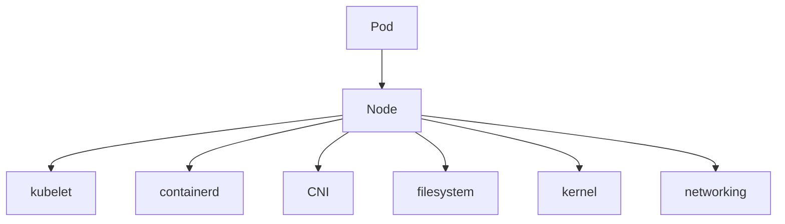

You can use node debugging:

```bash
kubectl debug node/<node-name> -it --image=ubuntu
```

A debug container is created for investigating the node.

A host filesystem can commonly be exposed through:

```text
/host
```

depending on the debug setup.

> **Note — what a node debug Pod really is:**
>
> - A normal Pod pinned to that node (`spec.nodeName`), created in your **current namespace**, named `node-debugger-<node>-<suffix>`.
> - It shares the node's **network, PID and IPC namespaces** (`hostNetwork`, `hostPID`, `hostIPC`), and mounts the node's `/` at `/host`.
> - What it may do is controlled by `--profile`: `legacy`, `general`, `baseline`, `restricted`, `netadmin`, `sysadmin`. Newer kubectl versions default to `general` instead of `legacy`; use `--profile=sysadmin` when you need a fully privileged container (e.g. for `chroot /host` + `systemctl`, or mounting).
> - It is **not deleted when you exit** — it stays in `Completed` state until you `kubectl delete pod node-debugger-...`.

---

# 15. What Node Debugging Is For

Typical problems:

```text
Pod cannot start
Image/runtime problem
containerd issue
kubelet issue
CNI issue
disk pressure
node filesystem problem
mount problem
kernel/network problem
```

Useful areas may include:

```text
/host/var/lib/kubelet
/host/var/lib/containerd
/host/etc
/host/proc
/host/sys
```

Exact availability depends on the Kubernetes environment and security configuration.

---

# 16. Relationship Between Pod Debugging and Node Debugging

Think in layers:

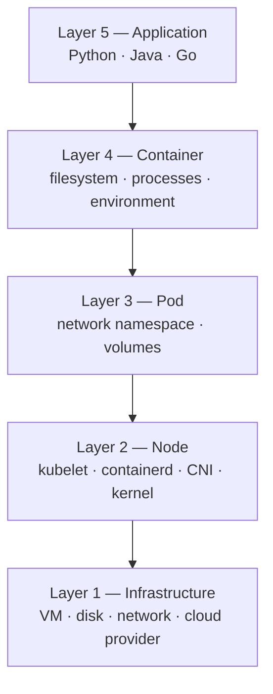

Debug at the lowest layer that explains the problem.

---

# 17. Shared Volumes — The Important Exception

Suppose:

```yaml
volumes:
  - name: shared
    emptyDir: {}
```

and both containers mount it.

Conceptually:

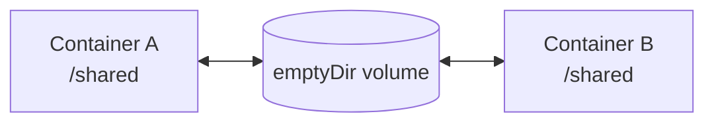

Now a file written by A:

```bash
echo hello > /shared/test.txt
```

can be read by B:

```bash
cat /shared/test.txt
```

This is intentional shared storage.

---

# 18. Shared Volume and Application Filesystem Are Different

This distinction is extremely important.

Suppose:

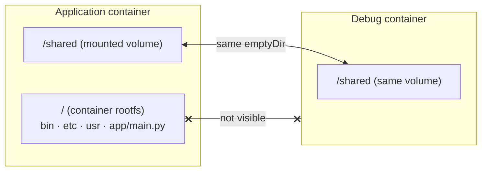

A debug container may see:

```text
/shared
```

if it mounts the same volume.

That does NOT mean it sees:

```text
/app/main.py
```

The application root filesystem and shared volume are different storage concepts.

---

# 19. Can I Edit Another Container's Files?

Usually:

```text
No — not directly through another container's filesystem.
```

But there are several possibilities.

## Option 1 — Shared volume

If the file is on a shared volume:

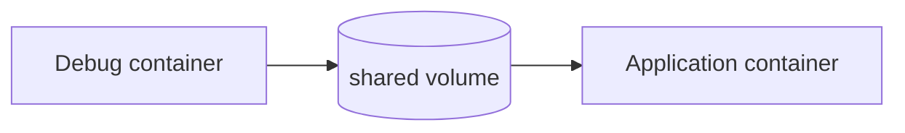

then yes, you can modify the shared file.

## Option 2 — Enter the application container

If permissions and filesystem settings allow it:

```bash
kubectl exec -it <pod> -c <app-container> -- sh
```

Then edit the file directly inside the application container.

## Option 3 — Advanced process/host-level investigation

With sufficient privileges and access to the host/container namespaces, advanced Linux debugging techniques can inspect container filesystems through process/namespace relationships.

This is powerful and should be used carefully.

## Option 4 — Recreate/copy the Pod

Create a debug copy where the application filesystem can be modified as part of the investigation.

---

# 20. Read-Only Root Filesystem

A secure workload may specify:

```yaml
securityContext:
  readOnlyRootFilesystem: true
```

Then application files in the root filesystem cannot normally be modified.

An attempt such as:

```bash
echo change >> /app/main.py
```

may result in:

```text
Read-only file system
```

This is an intentional security control.

It reduces the ability of a compromised process to modify application binaries/files.

---

# 21. Container Filesystem Changes Are Usually Ephemeral

Suppose the image is:

```text
my-api:v42
```

and you modify:

```text
/app/main.py
```

inside the running container.

You now have:

```text
Image:
my-api:v42
    │
    └── original main.py

Running container:
    │
    └── modified main.py
```

If the container is recreated:

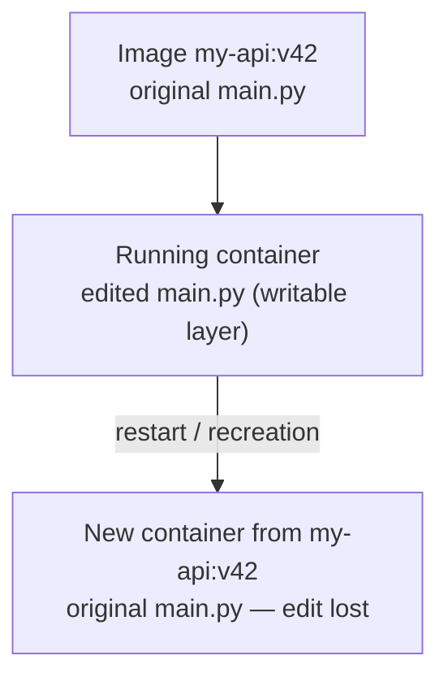

Your manual modification is normally lost.

---

# 22. Container Restart vs Container Recreation

This distinction matters.

A process restart inside the same container may leave the writable container filesystem intact.

> **Note — correction for Kubernetes:** when the **kubelet** "restarts" a container (crash, OOMKill, failed liveness probe — the `RESTARTS` column), it actually creates a **new container** from the image. The old writable layer is discarded, so edits made with `kubectl exec` are **lost on every kubelet restart**, not only when the Pod is replaced. Only data on volumes (`emptyDir`, PVC, …) survives a container restart; `emptyDir` is lost when the Pod itself is deleted.

A new container created from the image gets a fresh filesystem based on that image, subject to mounted volumes.

In Kubernetes, Pods are designed to be replaceable and reproducible.

Therefore:

> Do not treat modifications made directly inside a container as permanent configuration management.

---

# 23. The Python Example

Suppose:

```text
/app/main.py
```

contains:

```python
def hello():
    print("VERSION 1")

hello()
```

Start:

```bash
python /app/main.py
```

Python loads and executes the code.

Now change the file to:

```python
def hello():
    print("VERSION 2")

hello()
```

The already-running Python process normally continues using the code it has already loaded.

Changing the source file does NOT automatically replace the running process.

---

# 24. Why Editing main.py Does Not Automatically Change the Process

Conceptually:

```text
main.py
   │
   │ loaded
   ▼
Python interpreter
   │
   └── running code
```

After startup:

```text
main.py
   │
   X
   │
   └── changing the file does not automatically replace
       the code already executing
```

The process needs some mechanism to reload/restart the code.

---

# 25. Python Hot Reload

Development servers can support automatic reload.

For example:

```bash
uvicorn main:app --reload
```

Conceptually:


This gives the development experience:

```text
edit
  ↓
save
  ↓
reload
  ↓
new behavior
```

This is different from Kubernetes itself modifying the application.

---

# 26. Python Module Reloading

Python also supports:

```python
import importlib
import mymodule

importlib.reload(mymodule)
```

But this is not a general-purpose replacement for restarting an application.

Potential complications include:

- existing object references
- old class definitions
- imported names
- global state
- threads
- asynchronous tasks
- dependency relationships
- objects created before reload

Use module reload deliberately rather than assuming it replaces a deployment.

---

# 27. Process-Level Debugging

Another option is to debug the running process itself.

For Python, tools such as:

```text
debugpy
pydevd
```

can support debugging.

Native/Linux applications may use:

```text
gdb
strace
```

depending on the situation.

The conceptual model is:

```text
Running process
      │
      ▼
Debugger
      │
      ├── breakpoints
      ├── stack
      ├── variables
      └── execution state
```

This is different from simply editing the source file.

---

# 28. Debugging vs Fixing

Keep these concepts separate.

## Debugging

Question:

> What is happening?

Tools:

```text
kubectl exec
kubectl debug
ephemeral containers
debug Pods
node debugging
logs
events
describe
/proc
ps
curl
tcpdump
strace
```

## Temporary experiment

Question:

> Does changing X affect the behavior?

Possible tools:

```text
exec
shared volume
debugger
temporary runtime changes
```

## Permanent fix

Question:

> How do I make this change reproducibly?

Preferred flow:


---

# 29. Why Manually Editing Production Containers Is Dangerous

Suppose the desired state is:

```text
Git
  │
  ▼
Dockerfile
  │
  ▼
Image v42
  │
  ▼
Deployment
  │
  ▼
Pod
```

You manually change:

```text
running-container:/app/main.py
```

Now:

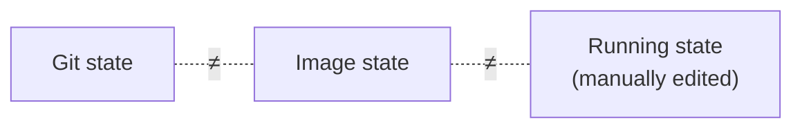

This creates configuration drift.

Problems include:

- difficult reproduction
- difficult rollback
- another Pod won't contain the change
- scaling creates Pods with the old code
- rescheduling loses the change
- incident investigation becomes confusing
- future deployments overwrite the change

Therefore, direct modification should generally be treated as a **temporary debugging experiment**, not a deployment strategy.

---

# 30. A Legitimate Production Incident Use Case

Suppose you suspect:

```python
some_function()
```

is responsible for an incident.

Normally:

```text
Change source
     ↓
Build
     ↓
Test
     ↓
Push image
     ↓
Deploy
     ↓
Observe
```

This may take time.

During an incident, a temporary experiment may help answer:

```text
"Is this actually the problem?"
```

Conceptually:

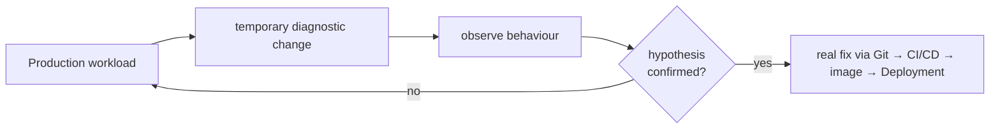

Then the real fix should go through:

```text
Git → CI/CD → image → deployment
```

---

# 31. Five Core Debugging Methods

| Method | Existing workload? | Separate container? | Typical use |
|---|---:|---:|---|
| `kubectl exec` | Yes | No | Enter application container |
| Ephemeral container | Yes | Yes | Add debugging tools |
| `--copy-to` | No — creates copy | Yes | Debug modified copy |
| Standalone debug Pod | No | Yes | Network/DNS/toolbox debugging |
| Node debug | Node | Yes | kubelet/containerd/CNI/node |

> **Note:** Before reaching for any of these, the cheapest checks are usually `kubectl describe pod` (Events), `kubectl logs --previous`, and `kubectl get events --sort-by=.lastTimestamp`. If a workload has **no Pods at all**, none of the methods above apply — the problem is at the controller/admission step (`kubectl describe rs` / `describe deploy`), see `architecture.md` §5.11.

---

# 32. Choosing the Correct Method

## Situation: Application is running and has shell

Use:

```bash
kubectl exec
```

## Situation: Application is running but image has no tools

Use:

```bash
kubectl debug
```

with an ephemeral container.

## Situation: Application crashes immediately

Consider:

```bash
kubectl debug --copy-to
```

and change the startup command for investigation.

## Situation: Need to test Service/DNS/networking

Use a standalone debug Pod.

## Situation: Need to investigate the Kubernetes node

Use:

```bash
kubectl debug node/<node>
```

## Situation: Need files shared between containers

Use:

```text
emptyDir
PVC
other Kubernetes volume
```

## Situation: Need to inspect a running Python process

Use an ephemeral/debug container plus process-level debugging tools, subject to the Pod's namespace and security configuration.

---

# 33. Important Kubernetes Concepts Behind Debugging

To understand debugging deeply, learn these together:

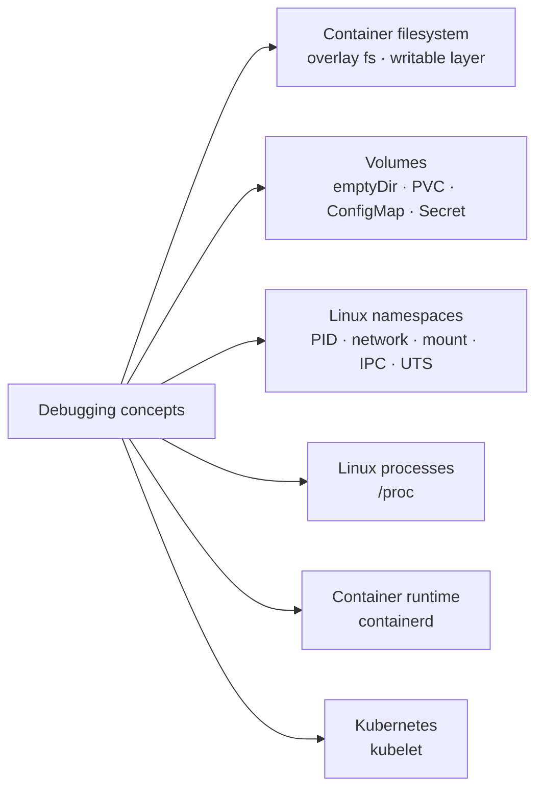

These concepts explain most of what happens during advanced Kubernetes debugging.

---

# 34. The Most Important Mental Model

Think of a Pod as:

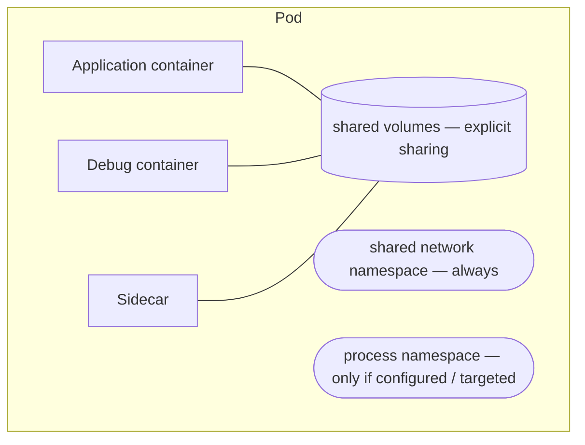

And separately:

```text
Pod
 │
 └── shared network namespace

Pod
 │
 └── process namespace
       │
       └── only if configured/targeted appropriately
```

But:

```text
Container A root filesystem
          ≠
Container B root filesystem
```

unless you deliberately create another mechanism for access.

---

# 35. Practical Learning Sequence

For hands-on learning, follow this order:

### Step 1 — Enter an application container

```bash
kubectl exec -it <pod> -c <container> -- sh
```

Understand:

```text
filesystem
environment
processes
network
```

### Step 2 — Create a standalone debug Pod

Use it to test:

```text
DNS
Service
HTTP
network connectivity
```

### Step 3 — Use an ephemeral container

```bash
kubectl debug -it <pod> \
  --image=ubuntu:24.04 \
  --target=<container> \
  -- bash
```

Compare its environment with the application container.

### Step 4 — Investigate processes

Compare:

```bash
ps aux
```

inside the application and debug contexts.

### Step 5 — Study shared volumes

Create:

```text
application container
+
debug container
+
emptyDir
```

Write a file from one and read it from the other.

### Step 6 — Experiment with filesystem permissions

Test:

```text
writable root filesystem
read-only root filesystem
shared volume
```

### Step 7 — Modify a Python file

Observe:

```text
file changed
vs
running process changed
```

This experiment is particularly important.

### Step 8 — Enable Python reload

Compare:

```text
normal Python process
vs
uvicorn --reload
```

### Step 9 — Use `--copy-to`

Break/modify startup behavior without changing the original workload.

### Step 10 — Debug a node

Study:

```text
kubelet
containerd
CNI
host filesystem
```

---

# 36. Debugging Cheat Sheet

## Enter application container

```bash
kubectl exec -it <pod> -n <namespace> -c <container> -- sh
```

## Execute one command

```bash
kubectl exec <pod> -n <namespace> -c <container> -- ls -lah /app
```

## Create temporary debug Pod

```bash
kubectl run debug \
  -n <namespace> \
  --rm -it \
  --image=ubuntu:24.04 \
  -- bash
```

## Add ephemeral debug container

```bash
kubectl debug -it <pod> \
  -n <namespace> \
  --image=ubuntu:24.04 \
  --target=<container> \
  -- bash
```

## Debug a Pod by copying it

```bash
kubectl debug <pod> \
  -n <namespace> \
  --copy-to=<debug-pod>
```

## Debug node

```bash
kubectl debug node/<node-name> -it --image=ubuntu
```

## Inspect Pods

```bash
kubectl get pods -A -o wide
```

## Describe Pod

```bash
kubectl describe pod <pod> -n <namespace>
```

## Logs

```bash
kubectl logs <pod> -n <namespace>
```

Multiple containers:

```bash
kubectl logs <pod> -n <namespace> -c <container>
```

Previous crashed container:

```bash
kubectl logs <pod> -n <namespace> -c <container> --previous
```

---

# 37. Final Summary

The term “debug pod” hides several different techniques.

The important distinction is:

```text
kubectl exec
    =
enter the existing container

ephemeral container
    =
add a temporary debugging container to the existing Pod

--copy-to
    =
create a debug copy of the workload

standalone debug Pod
    =
independent troubleshooting environment

node debug
    =
investigate the Kubernetes node/runtime layer
```

And the filesystem rule is:

```text
Same Pod
    ≠
Same filesystem
```

Instead:

```text
Same Pod
    ├── shared network
    ├── optional shared process namespace
    └── explicitly mounted shared volumes
```

For your Python question:

```text
Changing /app/main.py
        ≠
changing the already-running Python process
```

A running Python process normally continues executing the code it has already loaded.

For development, hot reload can provide:

```text
edit → detect → reload → new code
```

For production, the reproducible path remains:

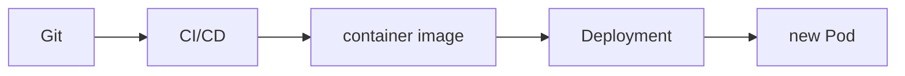

A direct modification of a running container can be useful for **temporary incident investigation**, but it should not normally become the permanent deployment mechanism.

---

# 38. Recommended Resources to Study Next

Official Kubernetes documentation:

- Kubernetes debugging Pods: https://kubernetes.io/docs/tasks/debug/debug-application/
- `kubectl debug`: https://kubernetes.io/docs/reference/kubectl/generated/kubectl_debug/
- Ephemeral containers: https://kubernetes.io/docs/concepts/workloads/pods/ephemeral-containers/
- Share a volume between containers: https://kubernetes.io/docs/tasks/access-application-cluster/communicate-containers-same-pod-shared-volume/
- Kubernetes Pods: https://kubernetes.io/docs/concepts/workloads/pods/
- Kubernetes volumes: https://kubernetes.io/docs/concepts/storage/volumes/

For Linux-level debugging, study:

```text
Linux namespaces
/proc filesystem
mount namespaces
PID namespaces
overlay filesystem
containerd
runc
nsenter
```

These topics explain what Kubernetes is actually doing underneath `kubectl debug`.
