# Kubernetes Pod Creation — Controllers, Scheduler, Kubelet & Runtime

This note explains what actually happens when Kubernetes needs to create a Pod, especially in the context of a Deployment, ReplicaSet, and ReplicaSet Controller.

---

# 1. The Most Important Question

If an interviewer asks:

> **"What creates a Pod?"**

The strongest answer is:

> **At the Kubernetes API level, a controller such as the ReplicaSet Controller creates the Pod object through the API Server. The scheduler assigns that Pod to a node, and the kubelet on that node instructs the container runtime to actually create and run the Pod's containers.**

There are therefore several different steps involved.

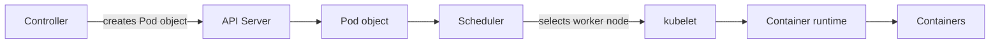

---

# 2. Who Does What?

| Component | Responsibility |
|---|---|
| API Server | Accepts API requests and exposes Kubernetes resources |
| etcd | Stores Kubernetes cluster state |
| Controller | Creates/updates/deletes objects to reconcile desired state |
| ReplicaSet Controller | Ensures the requested number of matching Pods exist |
| Scheduler | Selects a Worker Node for an unscheduled Pod |
| kubelet | Manages Pods assigned to its node |
| Container Runtime | Actually creates and runs containers |

The important distinction:

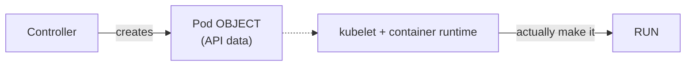

---

# 3. Example: ReplicaSet Wants 2 Pods

Suppose we have:

```yaml
apiVersion: apps/v1
kind: ReplicaSet

metadata:
  name: nginx-rs

spec:
  replicas: 2

  selector:
    matchLabels:
      app: nginx

  template:
    metadata:
      labels:
        app: nginx

    spec:
      containers:
        - name: nginx
          image: nginx
```

The important part is:

```yaml
replicas: 2
```

This means:

> The desired number of matching Pods is 2.

---

# 4. Initial State

Suppose there are currently no matching Pods:

```text
Desired State:

2 Pods

Actual State:

0 Pods
```

The ReplicaSet Controller compares them:

```text
Desired = 2
Actual  = 0

Difference = 2
```

Therefore it needs to create Pods.

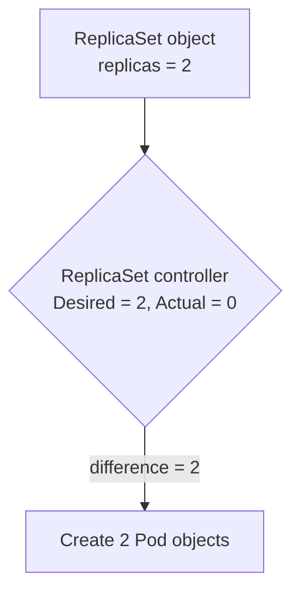

---

# 5. Does ReplicaSet Controller Directly Create Containers?

No.

This is extremely important.

The ReplicaSet Controller does **not**:

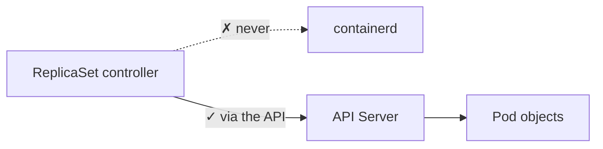

Instead:

```text
ReplicaSet Controller
       |
       v
API Server
       |
       v
Pod Objects
```

The controller works through the Kubernetes API.

---

# 6. What Happens After the Pod Object Is Created?

The Pod now exists as a Kubernetes API object.

But it may not yet be assigned to a Worker Node.

Conceptually:

```text
Pod Object

name: nginx-abc
status: Pending
node: not assigned
```

Then the scheduler sees the unscheduled Pod.

```text
Pod Object
    |
    | node not assigned
    v
Scheduler
```

> **Note:** "Node not assigned" concretely means `spec.nodeName` is empty. You can list such Pods with:
>
> ```bash
> kubectl get pods -A --field-selector spec.nodeName=
> ```
>
> The scheduler assigns a node by POSTing a **Binding** (the `pods/binding` subresource), which sets `spec.nodeName`. After that, `spec.nodeName` is immutable — a Pod never moves to another node; it can only be deleted and replaced.

---

# 7. Scheduler Chooses a Node

Suppose the cluster has:

```text
Worker Node 1
Worker Node 2
Worker Node 3
```

The scheduler evaluates the available nodes and chooses a suitable one.

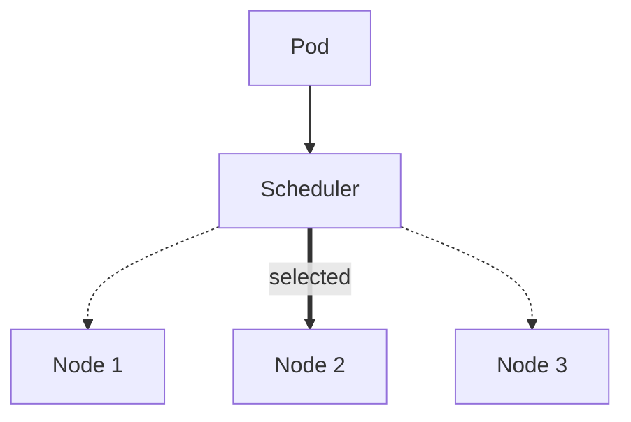

The scheduler does NOT run the container.

It makes the placement decision.

> **Scheduler = Which node should run this Pod?**

---

# 8. What Happens on the Selected Node?

Suppose the scheduler selects Worker Node 2.

```text
Scheduler
    |
    v
Worker Node 2
```

The kubelet on Node 2 is responsible for making sure the Pod actually runs.

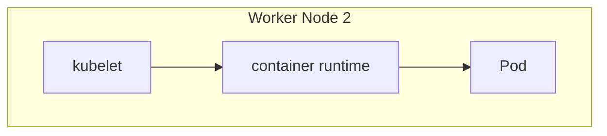

The kubelet reads the Pod specification and works with the container runtime.

---

# 9. Kubelet + Container Runtime

The simplified flow is:

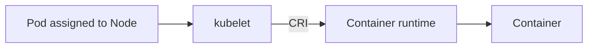

Typical container runtimes include:

- containerd
- CRI-O

The runtime creates and starts the actual containers.

> **Note — what the kubelet actually does, in order:**
>
> ```text
> 1. Admit the Pod        (enough resources? node-level checks)
> 2. Create Pod sandbox   (CRI RunPodSandbox -> "pause" container holds the network namespace)
> 3. CNI plugin           (assigns the Pod IP, wires it into the cluster network)
> 4. Volumes              (CSI / ConfigMap / Secret / emptyDir mounted)
> 5. Pull images          (per imagePullPolicy)
> 6. Init containers      (run one at a time, each must exit 0)
> 7. App containers       (CRI CreateContainer + StartContainer)
> 8. Probes               (startup -> liveness / readiness)
> 9. Report status        (Pod IP, conditions, Ready) back to the API Server
> ```
>
> Steps 2–4 are where most "stuck in `ContainerCreating`" problems live (CNI out of IPs, volume attach failures). `crictl pods` on the node lists the sandboxes from step 2 — see `aks-node-access-and-crictl-runbook.md`.

---

# 10. Complete Pod Creation Flow

Putting everything together:

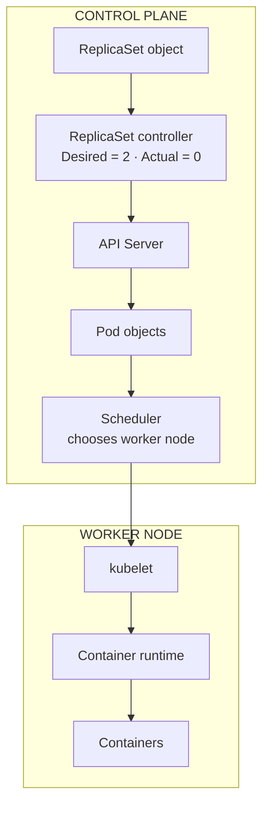

---

# 11. What If Desired = 2 and Actual = 2?

Suppose:

```text
ReplicaSet:
replicas = 2

Running Pods:
Pod A
Pod B
```

Then:

```text
Desired = 2
Actual  = 2
```

The ReplicaSet Controller does nothing.

```text
Desired == Actual
       |
       v
No corrective action
```

This is the normal steady state.

---

# 12. What If One Pod Dies?

Suppose:

```text
Desired = 2

Pod A ✓
Pod B ✗
```

Now:

```text
Desired = 2
Actual  = 1
```

The ReplicaSet Controller detects the difference.

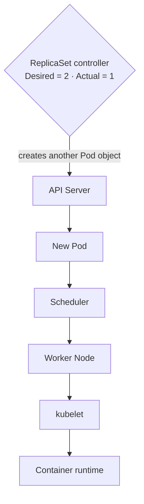

Then:

```text
New Pod
   |
   v
Scheduler
   |
   v
Worker Node
   |
   v
kubelet
   |
   v
Container Runtime
```

Eventually:

```text
Desired = 2
Actual  = 2
```

The system returns to the desired state.

> **Note — what "dies" means matters.**
>
> | What happened | Who reacts | Result |
> |---|---|---|
> | Container process crashes / OOMKilled | **kubelet** | Same Pod, container restarted in place, `RESTARTS` +1, backoff → `CrashLoopBackOff` |
> | Liveness probe fails | **kubelet** | Same as above |
> | Pod deleted (`kubectl delete pod`) or evicted | **ReplicaSet controller** | New Pod object with a new name |
> | Node dies | **node-lifecycle + taint-eviction controllers**, then ReplicaSet controller | Pods evicted after ~5 min (default `tolerationSeconds: 300`), then replaced elsewhere |
>
> So a crash-looping Pod is **not** replaced by the ReplicaSet — it keeps being restarted by the kubelet on the same node. See [`architecture.md` §5.6](./architecture.md#56-node-lifecycle--what-happens-when-a-node-dies).

---

# 13. What If There Are Too Many Pods?

This is equally important.

Suppose:

```text
Desired = 2

Pod A ✓
Pod B ✓
Pod C ✓
```

Now:

```text
Desired = 2
Actual  = 3
```

The ReplicaSet Controller reconciles the difference.

```text
ReplicaSet Controller
        |
        | Actual > Desired
        v
Deletes an excess matching Pod
        |
        v
Actual = 2
```

Therefore:

```text
Desired < Actual
        |
        v
Remove excess Pods
```

> **Note — which Pod gets deleted?** The ReplicaSet controller ranks candidates and deletes the "cheapest" first, roughly:
>
> 1. Pods not yet scheduled to a node
> 2. `Pending` / `Unknown` before `Running`
> 3. Not-Ready before Ready
> 4. Lower `controller.kubernetes.io/pod-deletion-cost` annotation first
> 5. Pods on nodes with more replicas of the same RS first (spreads the remainder)
> 6. Newer Pods (shorter Ready time) before older ones
>
> You can influence it with the `controller.kubernetes.io/pod-deletion-cost` annotation (best-effort, not a guarantee).

---

# 14. The Fundamental ReplicaSet Rule

The ReplicaSet Controller continuously tries to make:

```text
Actual matching Pods = spec.replicas
```

So:

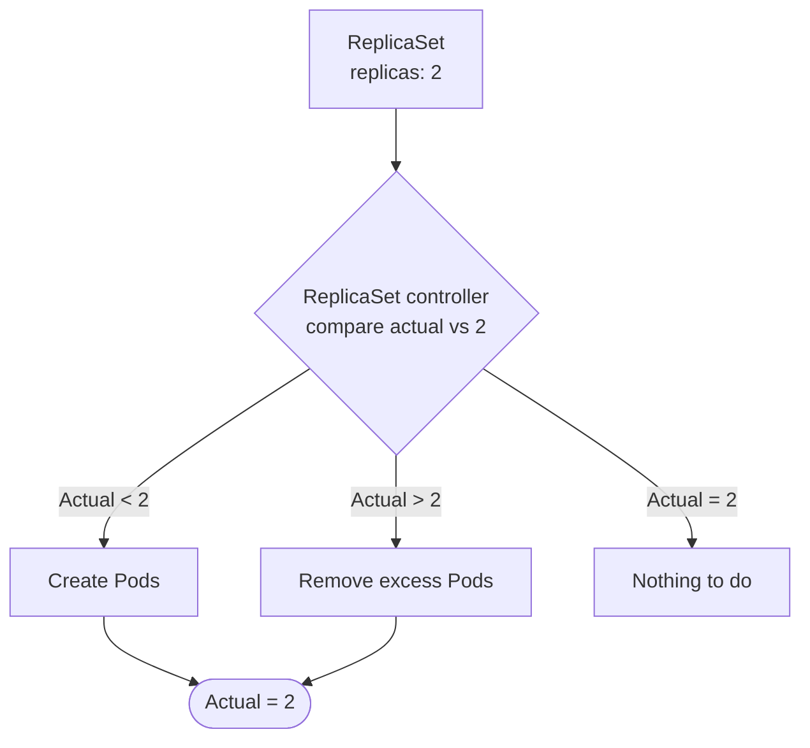

This is called **reconciliation**.

---

# 15. "New Entry in Pod" — Important Correction

A common misunderstanding is:

> "If a new entry appears in the Pod, will ReplicaSet create another Pod?"

Not exactly.

The ReplicaSet Controller watches the **ReplicaSet object and the current state of matching Pods**.

For example:

```text
ReplicaSet:
Desired = 2

Current:
Pod A
Pod B
```

Everything is correct.

If you manually create another matching Pod:

```text
ReplicaSet:
Desired = 2

Current:
Pod A
Pod B
Pod C
```

Now:

```text
Desired = 2
Actual  = 3
```

The controller may remove an excess matching Pod.

It does NOT create another Pod just because another Pod appeared.

> **Note — adoption and ownerReferences.** The ReplicaSet counts Pods it **owns** (via `metadata.ownerReferences` with `controller: true`). A matching Pod with **no** controller owner is **adopted** — the RS adds itself as owner and then counts it, which is why a hand-made Pod with `app: nginx` can cause one of the RS's Pods to be deleted. A Pod already owned by another controller is **not** adopted. Conversely, if you edit a Pod's labels so it no longer matches, the RS **releases** it (removes the ownerReference) and creates a replacement — a handy trick to pull a misbehaving Pod out of a Service for debugging while keeping it alive.
>
> ```bash
> kubectl get pod <pod> -o jsonpath='{.metadata.ownerReferences}'
> kubectl label pod <pod> app=debug --overwrite     # detach from RS for debugging
> ```

---

# 16. Deployment Makes This One Level More Interesting

If you are using a Deployment, the hierarchy is:

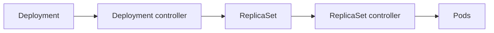

For example:

```text
Deployment
replicas = 3
      |
      v
ReplicaSet
replicas = 3
      |
      v
Pod 1
Pod 2
Pod 3
```

So the Deployment Controller and ReplicaSet Controller have different responsibilities.

---

# 17. Deployment Controller vs ReplicaSet Controller

### Deployment Controller

Main responsibility:

```text
Deployment
    |
    v
ReplicaSets
```

It manages rollout and revision behavior.

> **Note:** The Deployment controller identifies "which ReplicaSet belongs to which version" using the `pod-template-hash` label — a hash of `spec.template`. Any change to the Pod template (image, env, labels…) produces a new hash → new ReplicaSet → rollout. Changing only `replicas` does **not** create a new ReplicaSet; it just scales the current one. Old ReplicaSets are kept (scaled to 0) up to `revisionHistoryLimit` (default 10) for `kubectl rollout undo`.

### ReplicaSet Controller

Main responsibility:

```text
ReplicaSet
    |
    v
Pods
```

It maintains the desired number of Pods.

So:

```text
Deployment Controller
        |
        v
    ReplicaSet

ReplicaSet Controller
        |
        v
       Pods
```

---

# 18. Full Deployment Pod Creation Flow

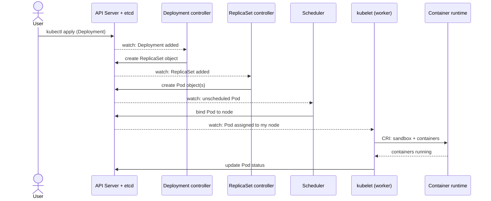

This is the most useful diagram to remember for interviews.

---

# 19. Does the Controller Talk Directly to the Scheduler?

No.

The controller creates/updates the Pod object through the API Server.

Then the scheduler watches for unscheduled Pods.

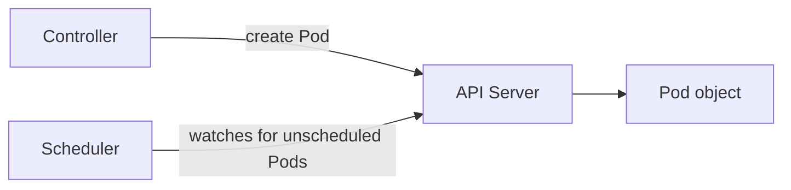

The controller does not normally say:

> "Scheduler, please put this Pod on Node 2."

Instead, the scheduler independently makes the scheduling decision based on the Pod specification and cluster state.

---

# 20. Does the Scheduler Talk Directly to kubelet?

The conceptual architecture is API-driven.

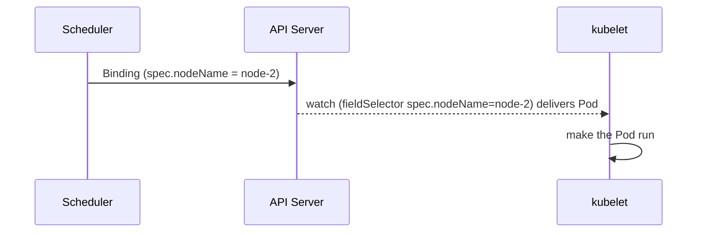

The kubelet then works to make the Pod actually run.

> **Note:** Each kubelet runs a **watch on the API Server filtered to its own node** (`fieldSelector=spec.nodeName=<my-node>`). So "the scheduler tells the kubelet" really means: the scheduler writes `spec.nodeName`, and the kubelet's watch delivers that Pod to it. There is no direct scheduler → kubelet connection.

---

# 21. Why Does Kubernetes Use This Design?

Because Kubernetes separates responsibilities.

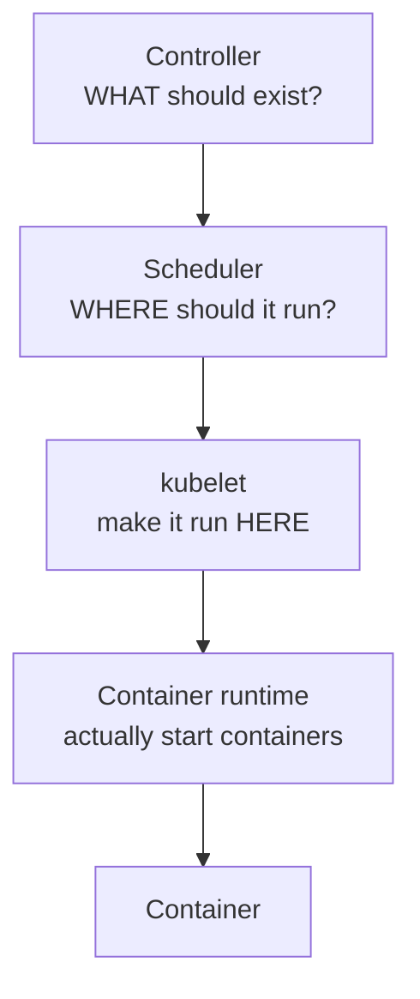

This separation makes Kubernetes extensible and resilient.

---

# 22. Special Case: Directly Creating a Pod

You don't always need a Deployment or ReplicaSet.

You can directly create a Pod:

```bash
kubectl run nginx --image=nginx
```

Conceptually:

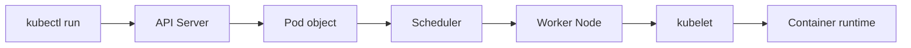

There may be **no Deployment or ReplicaSet** in this case.

> **Note:** Since kubectl v1.18, `kubectl run` creates **only a bare Pod** (older versions created a Deployment). A bare Pod has no controller: if you delete it, or its node dies, **nothing recreates it**. That's why bare Pods are fine for experiments/debugging but not for real workloads.

But the Pod still goes through the API Server, scheduler, kubelet, and container runtime.

---

# 23. Direct Pod vs Deployment

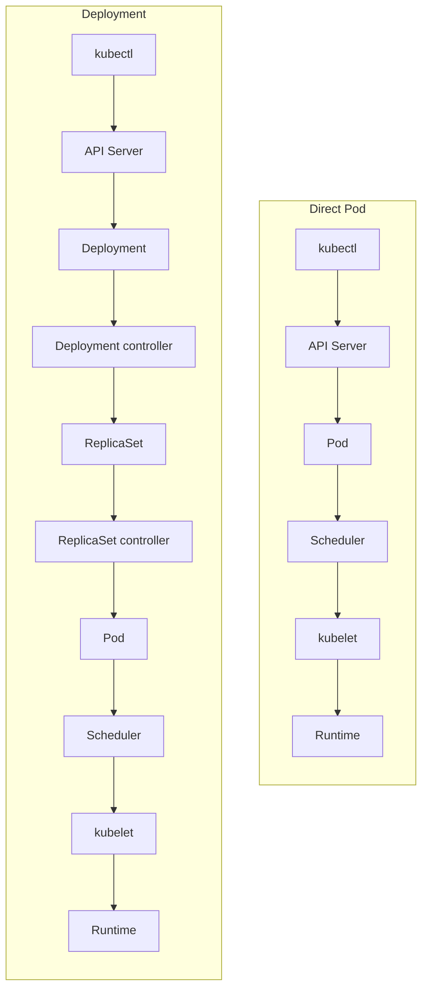

This is why Pods can exist without Deployments, but Deployments ultimately result in Pods.

---

# 24. Interview Question: "Who Creates the Pod?"

A precise answer:

> **"It depends on the context. If a Deployment is being used, the Deployment Controller creates/manages a ReplicaSet, and the ReplicaSet Controller creates the Pod objects through the API Server. The scheduler assigns those Pods to nodes, and the kubelet uses the container runtime to actually create and run their containers. A Pod can also be created directly through the API without a Deployment or ReplicaSet."**

---

# 25. Interview Question: "Who Actually Runs the Pod?"

A precise answer:

> **"The kubelet on the assigned worker node manages the Pod, while the container runtime such as containerd or CRI-O actually creates and runs the containers inside the Pod."**

---

# 26. Interview Question: "Who Decides Where the Pod Runs?"

Answer:

> **"The kube-scheduler selects a suitable worker node for an unscheduled Pod."**

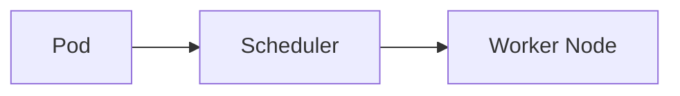

---

# 27. Interview Question: "Where Does ReplicaSet Controller Run?"

Answer:

> **"The ReplicaSet Controller runs as part of kube-controller-manager in the Kubernetes control plane."**

> **Note:** Good follow-up points to add: it runs as one of ~40 loops in that single process; it watches ReplicaSets and Pods through the API Server's shared informers (never etcd); with `--use-service-account-credentials` it acts as the `kube-system:replicaset-controller` ServiceAccount; and in an HA control plane only the KCM replica holding the `kube-controller-manager` Lease is active. On AKS you can't see this process — it lives in the managed control plane. Full detail: [`architecture.md` §5](./architecture.md#5-kube-controller-manager).

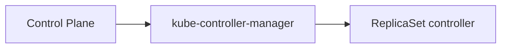

---

# 28. Final Mental Model

Remember this chain:

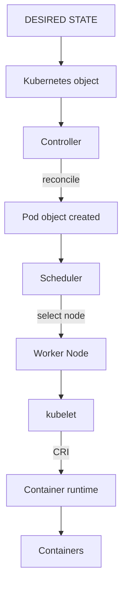

For a Deployment:

```mermaid
flowchart LR
    D["Deployment"] --> DC["Deployment controller"] --> RS["ReplicaSet"] --> RSC["ReplicaSet controller"] --> P["Pod object"] --> S["Scheduler"] --> W["Worker Node"] --> K["kubelet"] --> R["containerd / CRI-O"] --> C["Container"]
```

## The four questions to always separate

```text
WHO DECIDES WHAT SHOULD EXIST?
        ↓
Controller

WHO CREATES THE POD API OBJECT?
        ↓
Controller through API Server
(or direct API request for a standalone Pod)

WHO DECIDES WHERE IT RUNS?
        ↓
Scheduler

WHO ACTUALLY RUNS THE CONTAINERS?
        ↓
kubelet + Container Runtime
```

> **This separation is the key to understanding Pod creation in Kubernetes.**
