# Kubernetes — Resources, Objects & Controllers

This note builds on `architecture.md` and focuses on the concepts discussed afterward:

- Where Deployment, StatefulSet, Job, CronJob, etc. fit
- Resource vs Object
- API Server vs Controller
- How workload controllers govern resources
- Deployment → ReplicaSet → Pod flow
- StatefulSet, Job, and CronJob flows
- Complete control-plane-to-worker flow

---

# 1. Kubernetes Architecture — Where Workload Resources Fit

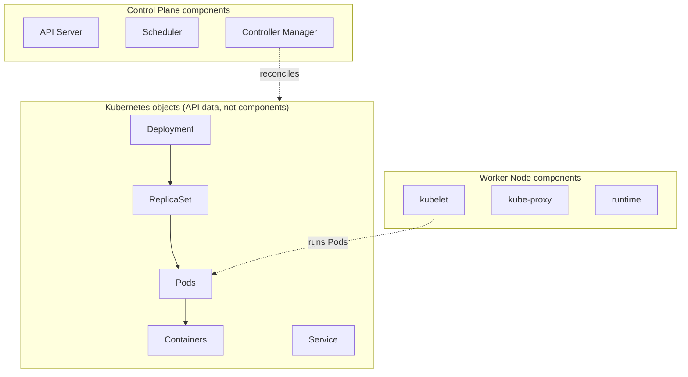

The important distinction is:

- **Control Plane components** are Kubernetes system components.
- **Deployment, ReplicaSet, Pod, Service, etc.** are Kubernetes API resources/objects.
- **Controllers** implement the behavior that makes the desired state become reality.

---

# 2. What Is a Kubernetes Object?

A Kubernetes **object** is a concrete instance representing some desired/current state in the cluster.

Example:

```yaml
apiVersion: apps/v1
kind: Deployment

metadata:
  name: nginx

spec:
  replicas: 3
```

After applying this manifest:

```bash
kubectl apply -f deployment.yaml
```

Kubernetes has a Deployment object:

```text
Deployment Object
    |
    +-- name: nginx
    +-- replicas: 3
```

You can have multiple Deployment objects:

```text
Deployment Objects
|
+-- nginx
+-- frontend
+-- backend
```

Think:

> **Object = actual instance**

---

# 3. What Is a Kubernetes Resource?

A **resource** is an API-defined type/category through which Kubernetes exposes objects.

For example:

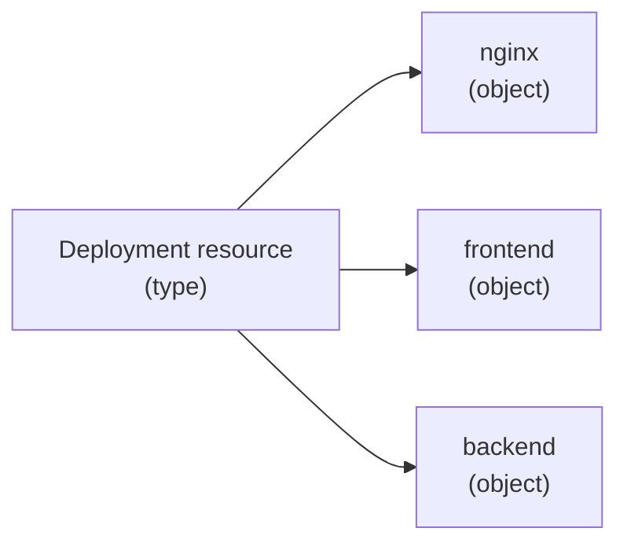

Similarly:

```text
Pod Resource
        |
        +-- nginx-abc object
        +-- nginx-def object
        +-- frontend-xyz object
```

A useful analogy is a database:

```text
Database Table / Type
        |
        +-- Row 1
        +-- Row 2
        +-- Row 3
```

In Kubernetes:

```text
API Resource
        |
        +-- Object
        +-- Object
        +-- Object
```

Another programming analogy:

```text
class Deployment:       # Type
    pass

nginx = Deployment()    # Object
frontend = Deployment() # Object
```

### Simple rule

> **Resource = type/category**
>
> **Object = concrete instance of that type**

> **Note — `kind` vs resource, precisely.** They are related but not the same string:
>
> | | Example | Where you see it |
> |---|---|---|
> | **Kind** | `Deployment` (singular, CamelCase) | `kind:` field in YAML, the object's schema |
> | **Resource** | `deployments` (lowercase plural) | URL path, RBAC rules, `kubectl get deployments` |
> | **Group/Version** | `apps/v1` | `apiVersion:` field |
>
> The REST path joins them: `/apis/apps/v1/namespaces/default/deployments/nginx`. Core resources (Pod, Service, ConfigMap…) live in the legacy group with no name: `/api/v1/namespaces/default/pods/nginx`. Some resources are **subresources** with no kind of their own, e.g. `pods/log`, `pods/exec`, `deployments/scale`. See [`../api-server/00-resources-and-objects.md`](../api-server/00-resources-and-objects.md).

---

# 4. What Does `kind` Mean?

In a Kubernetes manifest:

```yaml
kind: Deployment
```

`kind` specifies what type of Kubernetes object you want to create.

Examples:

```text
kind: Deployment
        |
        +-- Deployment object

kind: Service
        |
        +-- Service object

kind: Pod
        |
        +-- Pod object

kind: ConfigMap
        |
        +-- ConfigMap object
```

So:

```text
kind: Deployment
        |
        v
Deployment type
        |
        v
Deployment object
```

---

# 5. API Resources

You can see the API resources available in a Kubernetes cluster with:

```bash
kubectl api-resources
```

Typical examples include:

```text
NAME            SHORTNAMES
pods            po
deployments     deploy
replicasets     rs
statefulsets    sts
jobs
cronjobs        cj
services        svc
configmaps      cm
secrets
```

Conceptually:

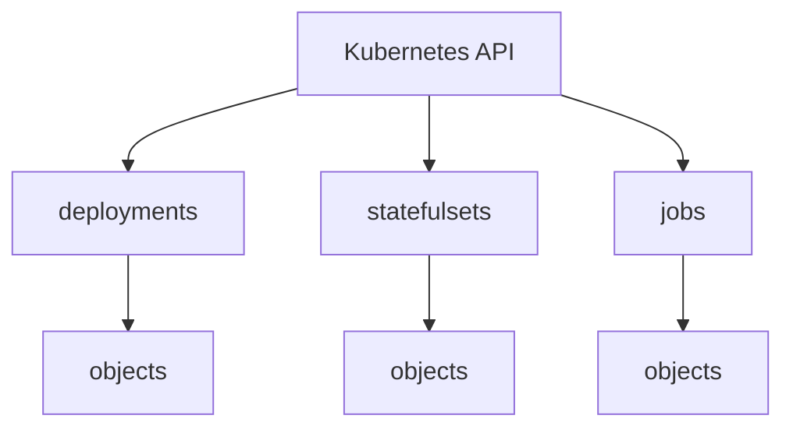

The API Server exposes these API resources.

> **Note:** Useful variations:
>
> ```bash
> kubectl api-resources -o wide              # adds VERBS (get, list, watch, create...)
> kubectl api-resources --api-group=apps     # only one group
> kubectl api-resources --namespaced=false   # cluster-scoped kinds (Node, Namespace, PV, ClusterRole...)
> kubectl explain deployment.spec.strategy   # schema docs for any field
> ```

---

# 6. API Server vs Controller

This is one of the most important distinctions.

Do NOT think:

```text
Deployment is inside API Server
```

Instead think:

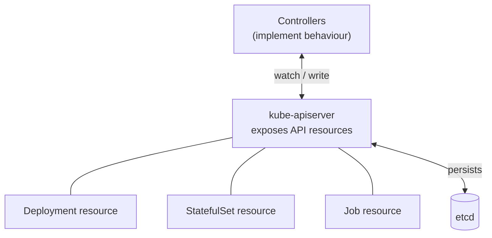

The API Server primarily provides the API and persists/serves Kubernetes state.

The controllers implement behavior.

> **Note:** In the diagram above, `etcd → Controllers` is a simplification. Controllers **never** read etcd. They **watch the API Server**, which serves data that it persisted in etcd:
>
> ```mermaid
> flowchart LR
>     E[("etcd")] <--> A["kube-apiserver"]
>     A <-->|"watch / list / write"| C["controllers, scheduler,<br/>kubelet, kubectl"]
> ```

---

# 7. Controllers

A controller continuously observes Kubernetes state and works to make:

```text
Desired State
      =
Actual State
```

If the states differ, the controller takes action.

Example:

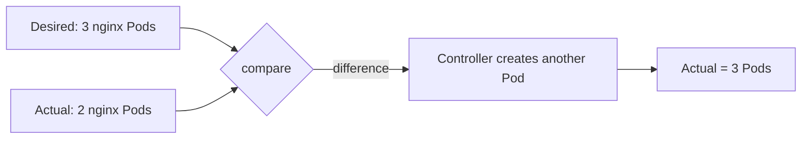

Think:

> **Controller = reconciliation loop**

> **Note:** Reconciliation is **level-triggered**: the controller does not care *which* event happened ("a Pod was deleted"), it recomputes from current state ("3 wanted, 2 exist → create 1"). That's why controllers are robust to missed events and restarts. The internal mechanics (informers, work queue, reconcile) are expanded in [`architecture.md` §5.3](./architecture.md#53-how-a-single-controller-loop-actually-works).

---

# 8. kube-controller-manager

Many built-in Kubernetes controllers run under the control-plane component:

```text
kube-controller-manager
```

Conceptually:

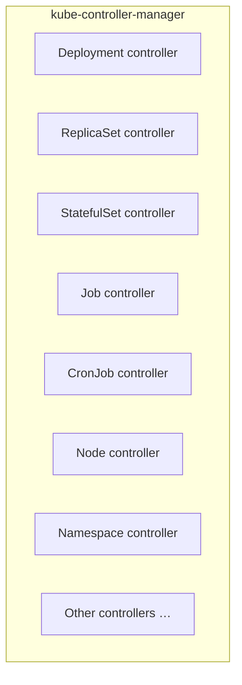

Therefore, workload resources such as Deployment, ReplicaSet, StatefulSet, Job, and CronJob are not themselves control-plane components.

They are API resources/objects, and their corresponding controllers implement their behavior.

> **Note:** The list above is only a sample. KCM also runs the DaemonSet, garbage-collector, node-lifecycle, EndpointSlice, HPA, PersistentVolume, ServiceAccount, ResourceQuota and ~20 more controllers. It runs them in **one process**, talks only to the API Server, and uses leader election so only one replica is active in an HA control plane. Full catalogue, node-failure timeline, and "what breaks if KCM is down": [`architecture.md` §5](./architecture.md#5-kube-controller-manager).

---

# 9. Workload Controllers

Common workload-related resources include:

```text
Workload Resources
|
+-- Pod
|
+-- Deployment
|
+-- ReplicaSet
|
+-- StatefulSet
|
+-- DaemonSet
|
+-- Job
|
+-- CronJob
```

They have different purposes.

```text
Deployment
    |
    +-- Manages application rollout
    +-- Usually manages ReplicaSets
    +-- ReplicaSets manage Pods

StatefulSet
    |
    +-- Manages stateful workloads
    +-- Provides stable Pod identity
    +-- Manages Pods

DaemonSet
    |
    +-- Ensures Pods run on selected nodes

Job
    |
    +-- Runs batch work to completion

CronJob
    |
    +-- Creates Jobs according to a schedule
```

---

# 10. Deployment — API Resource + Controller

A Deployment is an API resource.

Example:

```yaml
apiVersion: apps/v1
kind: Deployment

metadata:
  name: nginx

spec:
  replicas: 3
```

The flow is:

```text
kubectl
   |
   v
API Server
   |
   v
Deployment Object
   |
   v
etcd
```

The Deployment Controller watches the Deployment object:

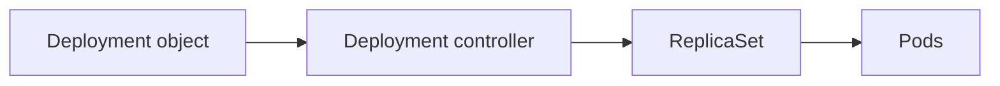

The Deployment Controller does not itself run the containers.

---

# 11. Deployment → ReplicaSet → Pod

This is the key workload hierarchy:

```text
Deployment
     |
     v
ReplicaSet
     |
     v
Pods
     |
     v
Containers
```

For example:

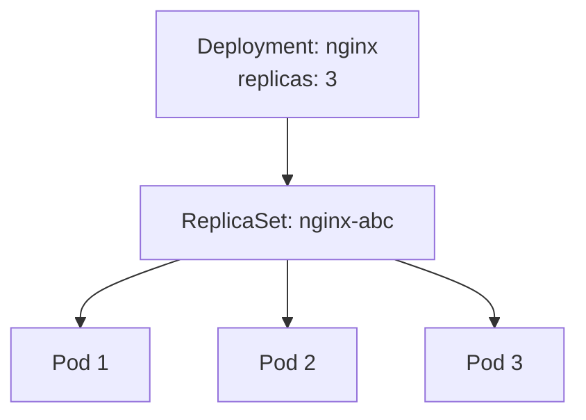

The Deployment generally manages the ReplicaSet.

The ReplicaSet maintains the requested number of Pods.

---

# 12. ReplicaSet Controller

Suppose:

```text
Desired Pods = 3
```

Current state:

```text
Pod 1  ✓
Pod 2  ✓
Pod 3  ✓
```

Everything is correct.

Now suppose Pod 2 crashes:

```text
Desired = 3

Pod 1  ✓
Pod 2  ✗
Pod 3  ✓
```

The ReplicaSet Controller detects:

```text
Desired = 3
Actual  = 2
```

It creates another Pod:

```text
Pod 1  ✓
Pod 2  ✓
Pod 3  ✓
```

> **Note — "crashes" needs care.** If the *container* inside Pod 2 crashes, the ReplicaSet controller does **nothing**: the Pod object still exists, and the **kubelet** restarts the container in place (`restartPolicy: Always`, `RESTARTS` count goes up, possibly `CrashLoopBackOff`). The ReplicaSet controller only creates a replacement when the Pod **object** is gone or terminal — deleted, evicted, its node died, or phase `Failed`. The new Pod has a **new name** (`Pod 2` is not reused).

Conceptually:

```text
ReplicaSet
     |
     | "I need 3 Pods"
     v
+----+----+----+
|    |    |    |
Pod  Pod  Pod
```

---

# 13. Deployment Complete Flow

A simplified end-to-end flow:

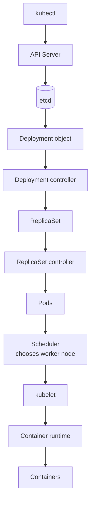

---

# 14. StatefulSet

StatefulSet is also an API resource.

Conceptually:

```text
StatefulSet Resource
        |
        v
StatefulSet Object
        |
        v
StatefulSet Controller
        |
        v
      Pods
```

StatefulSet is designed for workloads where stable identity and/or ordered behavior matters.

Conceptually:

```text
StatefulSet: database
       |
       +-- database-0
       +-- database-1
       +-- database-2
```

The Pods have stable names/identities compared with ordinary Deployment Pods.

---

# 15. StatefulSet Flow

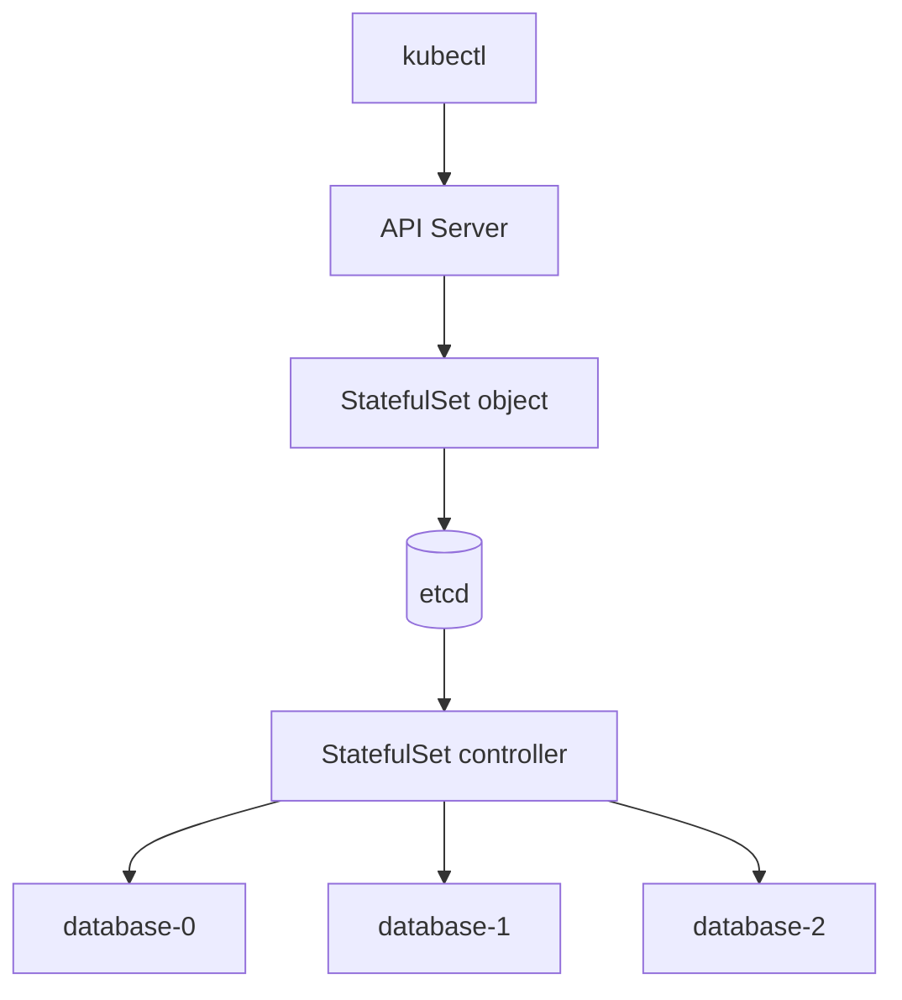

The StatefulSet Controller manages the desired StatefulSet behavior.

---

# 16. Job

Job is also an API resource.

Its purpose is batch work that should complete.

Example:

```yaml
apiVersion: batch/v1
kind: Job

metadata:
  name: data-processing

spec:
  completions: 5
```

Conceptually:

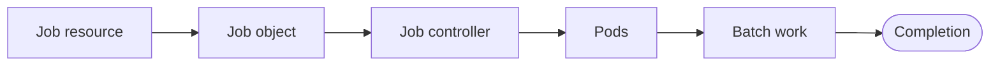

The Job Controller works toward the requested successful completions.

---

# 17. CronJob

CronJob is also an API resource.

Its purpose is to create Jobs according to a schedule.

Example:

```yaml
apiVersion: batch/v1
kind: CronJob

metadata:
  name: nightly-backup

spec:
  schedule: "0 0 * * *"
```

The conceptual hierarchy is:

```text
CronJob
   |
   | schedule fires
   v
 Job
   |
   v
 Pods
   |
   v
 Containers
```

More explicitly:

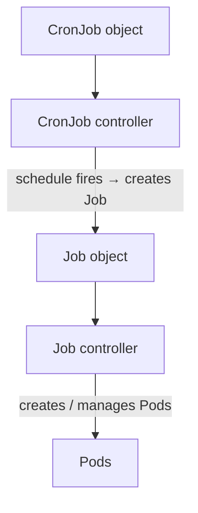

So CronJob does not normally directly manage the application container.

> **Note:** Worth knowing CronJob fields: `concurrencyPolicy` (`Allow` / `Forbid` / `Replace` — what to do if the previous Job is still running), `startingDeadlineSeconds` (how late a missed run may still start), `timeZone` (e.g. `"Asia/Kolkata"`; otherwise the KCM's time zone, normally UTC), and `successfulJobsHistoryLimit` / `failedJobsHistoryLimit`.

---

# 18. DaemonSet

DaemonSet is another workload resource.

Its purpose is to ensure a Pod runs on each selected node.

Conceptually:

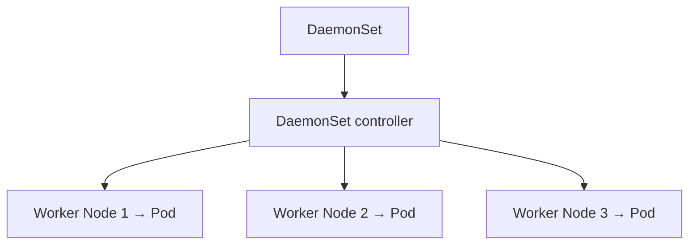

Typical use cases include node-level agents such as:

- Logging agents
- Monitoring agents
- Node-level networking components

> **Note:** The DaemonSet controller decides *which* nodes need a Pod, but it does not bind the Pod itself. It creates one Pod per eligible node with a **node affinity pinned to that node's name**, and the normal kube-scheduler binds it. See `kubernetes_daemonset_complete_guide.md` §17.

---

# 19. Workload Controller Summary

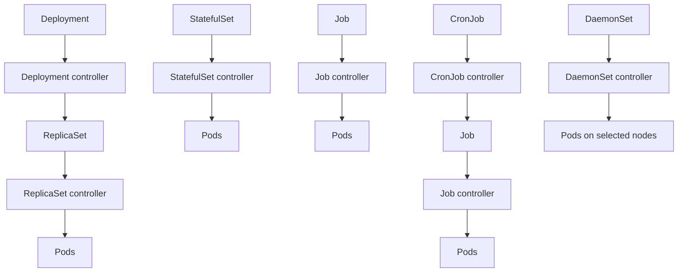

---

# 20. API Server + etcd + Controllers

This is the central mental model.

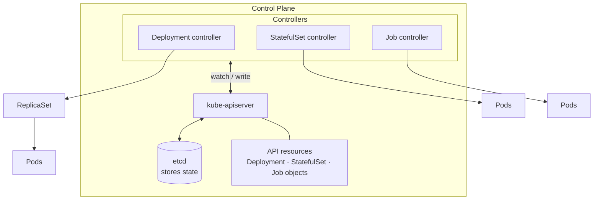

---

# 21. Scheduler Comes After Pods Are Created

A subtle but important point:

The controller does not necessarily choose the worker node.

For example:

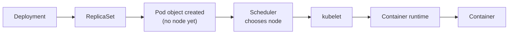

So:

> **Controller creates/manages workload objects. Scheduler decides where unscheduled Pods run. kubelet makes the assigned Pods run on its node.**

> **Note:** Before the scheduler even sees the Pod, the Pod create request from the controller passes through **admission** (ResourceQuota, LimitRanger, PodSecurity, webhooks). If admission rejects it, no Pod object exists at all — the ReplicaSet shows a `FailedCreate` event and the Deployment sits at `0/3` with no Pods listed.

---

# 22. Complete Architecture Mental Model

Put everything together:

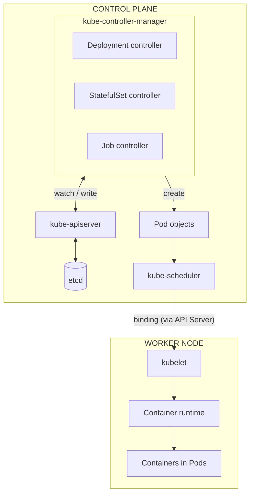

---

# 23. The Most Important Separation

Keep these four layers mentally separate:

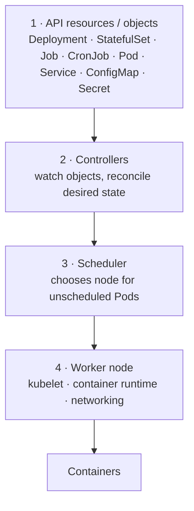

---

# 24. Interview-Level Summary

### What is a resource?

> A Kubernetes API resource is a type/category exposed through the Kubernetes API, such as Deployment, Pod, Service, Job, or StatefulSet.

### What is an object?

> An object is a concrete instance of a Kubernetes resource representing state in the cluster.

### What does the API Server do?

> It exposes the Kubernetes API and handles requests and access to Kubernetes state. Persistent cluster state is stored in etcd.

### What does a controller do?

> A controller watches Kubernetes objects and continuously reconciles actual state toward desired state.

### Where do workload controllers run?

> Built-in controllers are generally run by control-plane components such as `kube-controller-manager`.

### Does the API Server run Deployment?

> No. The API Server exposes/stores the Deployment resource and its objects. The Deployment Controller implements Deployment behavior.

### Does the Deployment Controller run containers?

> No. It manages Deployment state, generally resulting in ReplicaSets and Pods.

### Who decides where a Pod runs?

> The kube-scheduler.

### Who actually manages the Pod on the selected node?

> The kubelet.

### Who actually runs the container?

> The container runtime, such as containerd or CRI-O.

---

# 25. One Final Mental Model

Remember this chain:

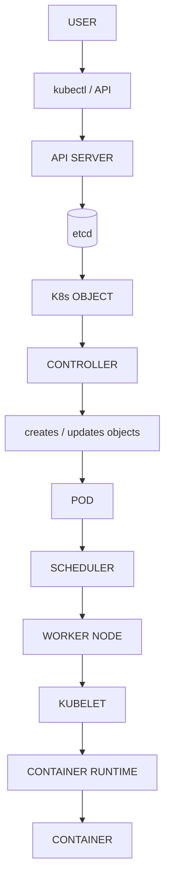

The key idea is:

> **API Server provides the API, etcd stores state, controllers reconcile objects, scheduler places Pods, kubelet manages Pods on nodes, and the container runtime runs the containers.**
