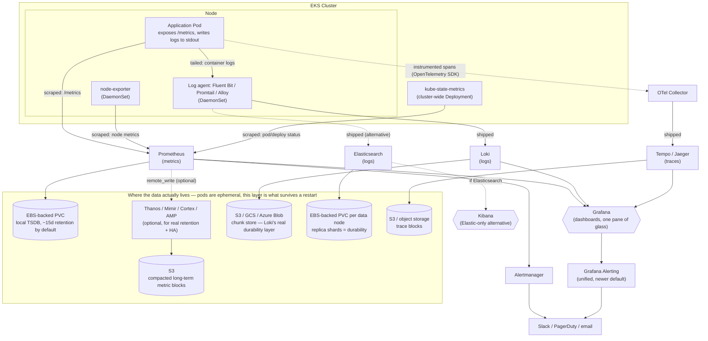
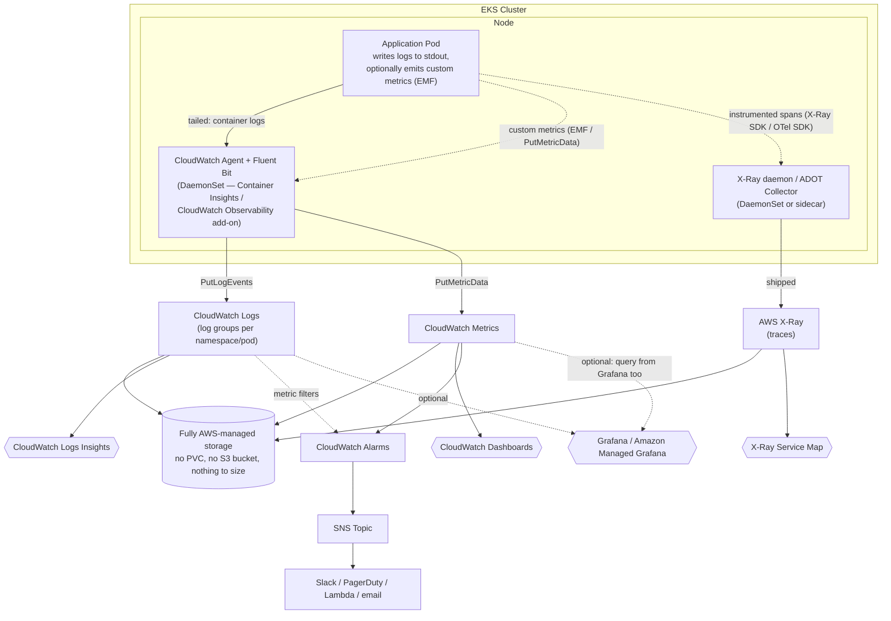

# Observability on EKS: Prometheus, Grafana, Loki, ELK, and the rest

One consolidated map of the observability landscape for a workload running
on EKS — what each tool actually does, how they connect, and what the
realistic alternatives are. Per-tool deep dives already exist for every
tool named below under `tools/`; this doc is the "how it all fits
together" architecture layer above them. For the *vocabulary* underneath
this — what "telemetry," "observability," "span," and "cardinality"
actually mean, with the terms' real origins — see
[`observability-terminology.md`](observability-terminology.md).

## Quick answer: shipping logs, traces, and metrics from an app on EKS

The by-pillar tool for each signal, and the decision that actually
determines which stack to reach for:

| Pillar | Self-hosted tool | What ships it there | Managed/alternative |
|---|---|---|---|
| **Metrics** | [Prometheus](tools/prometheus/README.md) (app exposes `/metrics`, scraped) + `node-exporter` + `kube-state-metrics` | Pull-based scrape, no shipping agent needed | Amazon Managed Service for Prometheus (AMP) |
| **Logs** | [Loki](tools/loki/README.md) (cheap, label-indexed) or Elasticsearch/OpenSearch (full-text) | Fluent Bit / Promtail / Grafana Alloy DaemonSet, tails container stdout | CloudWatch Logs (via Container Insights add-on) |
| **Traces** | [Tempo](tools/tempo/README.md) or [Jaeger](tools/jaeger/README.md) | App instrumented with [OpenTelemetry](tools/opentelemetry/README.md) SDK → OTel Collector | AWS X-Ray |
| **All three, one UI** | [Grafana](tools/grafana/README.md) (Prometheus + Loki + Tempo as data sources) | — | CloudWatch Dashboards, or a commercial all-in-one |

**The one decision that determines the whole stack**: how much of this do
you want to operate yourself?

- **Self-hosted, portable, cheapest at scale** → `kube-prometheus-stack`
  (Prometheus+Alertmanager+Grafana+node-exporter+kube-state-metrics) via
  Helm, add Loki+Fluent Bit for logs, add Tempo+OTel Collector for traces
  once cross-service latency questions start coming up (traces are usually
  added last, after metrics/logs are already in place). See
  [Putting together a concrete stack for EKS](#putting-together-a-concrete-stack-for-eks)
  below.
- **Zero setup, AWS-only, least portable** → CloudWatch Observability EKS
  add-on (Container Insights + Fluent Bit, auto-collects metrics/logs) +
  X-Ray for traces. See [CloudWatch vs. the self-hosted stack](#cloudwatch-vs-the-self-hosted-stack).
- **Commercial, fastest to stand up, ongoing SaaS cost** → Datadog / New
  Relic / Dynatrace — one agent, all three pillars, at a cost that scales
  with hosts/volume. See [Managed / alternative options](#managed--alternative-options).

Observability tooling splits into three signal types, and almost every
tool below exists to collect, store, or visualize exactly one of them:

- **Metrics** — numeric time series (CPU %, request count, latency
  percentile). Cheap to store, cheap to query, good for dashboards and
  threshold alerts, bad at telling you *why* something happened.
- **Logs** — free-text (or structured) event records. Expensive to store
  and index at scale, but they carry the actual detail metrics can't —
  stack traces, request payloads, error messages.
- **Traces** — the path a single request took across services, with
  timing at each hop. The signal that answers "which of these twelve
  microservices added the latency," which neither metrics nor logs alone
  can.

## How it fits together on EKS

Read it as three parallel pipelines (metrics, logs, traces) that all
terminate in one visualization layer, sitting on top of a storage layer
that's easy to leave out of a diagram — and easy to get wrong in a real
cluster, since **every pod's local filesystem is ephemeral by default**.
The only real fork in the road for the pipelines themselves is **logs**:
Loki and Elasticsearch are two different architectures solving the same
problem, and picking one shapes the rest of the stack.

## Where the data actually lives (the part diagrams tend to hide)

Prometheus, Loki, Elasticsearch, and Tempo are themselves running as pods
on EKS — which means, without an explicit persistence layer, their data is
exactly as ephemeral as any other pod's local disk: gone on restart,
reschedule, or node replacement. Each one solves this differently, and
none of them are "just in-memory" once set up correctly, but the *kind* of
durable storage backing each one differs a lot:

- **Prometheus** writes its time-series database to local disk, which on
  EKS means an **EBS-backed PersistentVolumeClaim** — without one, a pod
  restart loses all metric history. Even with a PVC, Prometheus's own
  retention is short by default (~15 days) and doesn't scale horizontally
  on its own. For real long-term retention and multi-replica HA, you add
  **Thanos, Cortex, or Grafana Mimir** in front of/behind it via
  `remote_write`, which then compact and store blocks in **S3** — cheap,
  durable, effectively unlimited retention. (Amazon Managed Service for
  Prometheus handles this part for you if you're using AMP instead of
  self-hosting.)
- **Loki** is designed around object storage (**S3/GCS/Azure Blob**) as
  its primary chunk store from day one — this is one of its core selling
  points, not an afterthought. Ingesters buffer very recent log chunks in
  memory briefly before flushing them to object storage on an interval, so
  there's a small in-memory window, but the durable copy is S3, same as
  Thanos/Mimir for metrics. The index (`boltdb-shipper` or the newer TSDB
  index) typically lives in object storage too.
- **Elasticsearch** has no object-storage tier by default. Durability
  comes from **replica shards written to EBS-backed PersistentVolumes on
  each data node** (run as a StatefulSet) — lose enough replicas/PVCs at
  once and you lose data, the same failure mode as any stateful database.
  Index Lifecycle Management (ILM) plus a snapshot repository *can* target
  S3 for backups/archival of older indices, but that's an opt-in policy
  you configure, not the default behavior the way it is for Loki.
- **Tempo** follows Loki's model: trace blocks land in **S3/object
  storage** as the durable store.

The practical takeaway for an EKS setup: anything backed only by
`emptyDir` or a pod's local disk with no PVC is one reschedule away from
data loss. Anything on a PVC survives pod restarts but is still tied to
that PVC's lifecycle (AZ, size limits, backup policy). Object storage
(S3) is the layer that's actually meant for long-term, cheap, durable
retention — Loki and Tempo build on it natively; Prometheus needs
Thanos/Mimir/Cortex (or a managed service) added on top to get there;
Elasticsearch needs ILM+snapshots configured explicitly if you want it at
all.

## Responsibility matrix

| Tool | Pillar | What it actually does | What it needs on EKS |
|---|---|---|---|
| [**Prometheus**](tools/prometheus/README.md) | Metrics | Scrapes `/metrics` endpoints, stores time series, PromQL queries, alerting via Alertmanager | Apps expose `/metrics`; node-exporter + kube-state-metrics cover infra/k8s-object metrics |
| **node-exporter** | Metrics | Node-level CPU/memory/disk as Prometheus metrics | Runs as a DaemonSet, one pod per node |
| **kube-state-metrics** | Metrics | Kubernetes object state (pod/deployment/replica status) as Prometheus metrics | Cluster-wide Deployment, one instance |
| **Alertmanager** | Metrics (alerting) | Dedupes/routes/silences alerts fired by Prometheus rules | Bundled with `kube-prometheus-stack` |
| [**Loki**](tools/loki/README.md) | Logs | Stores logs, indexes only labels (not full text), queried via LogQL | Needs a shipping agent (below); cheap relative to Elasticsearch |
| **Promtail / Grafana Alloy** | Logs | Tails container logs off each node, ships to Loki | DaemonSet, one per node |
| **Fluent Bit** | Logs | Lightweight, general-purpose log shipper — ships to Loki *or* Elasticsearch *or* both | DaemonSet, one per node |
| **Elasticsearch** | Logs | Full-text-indexed log/document store, powerful ad hoc search, heavier to run | Needs a shipper (Fluentd/Fluent Bit/Logstash) and real resource budget (JVM heap, disk IOPS) |
| **Logstash** | Logs | Heavier-weight log processing/enrichment pipeline, the original "L" in ELK | Increasingly replaced by Fluentd/Fluent Bit in k8s setups — lighter footprint |
| **Kibana** | Logs (viz) | Elasticsearch's own visualization/search UI — logs and Elastic APM traces only | Only relevant if you chose Elasticsearch over Loki |
| **OpenTelemetry (OTel)** | Traces | Vendor-neutral instrumentation SDK + collector for spans/traces (and metrics/logs too, increasingly) | App code instrumented with the OTel SDK; an OTel Collector deployment to receive/export spans |
| **Tempo / Jaeger** | Traces | Stores and queries distributed traces | Receives spans from the OTel Collector |
| [**Grafana**](tools/grafana/README.md) | Viz (all three) | Dashboards/alerting across Prometheus + Loki + Tempo in one UI | Bundled with `kube-prometheus-stack`; add Loki/Tempo as extra data sources |

## Logs: the fork in the road — Loki vs. ELK/EFK

Both solve "collect container logs from every pod and let me search
them," but with opposite philosophies:

| | **[Loki](tools/loki/README.md) + Grafana** | **ELK / EFK** ([Elasticsearch](tools/elasticsearch/README.md) + Fluentd/Logstash + Kibana) |
|---|---|---|
| Indexing | Labels only (namespace, pod, container) — log *content* isn't indexed | Full-text index of every field in every log line |
| Query language | LogQL (label-filter first, then grep-like line filter) | Elasticsearch Query DSL / KQL — can search any field, any word, instantly |
| Storage cost | Low — this is the whole point of Loki's design | High — full-text indexes are expensive to store and to keep fast |
| Best at | High-volume infra/app logs where you mostly filter by pod/namespace/time, occasionally grep | Security/audit logs, business analytics on log content, anywhere you need arbitrary full-text search across fields |
| Operational weight | Light — Loki + a shipper, that's it | Heavy — Elasticsearch cluster sizing, shard management, JVM tuning are real ongoing work |
| Visualization | Grafana (same UI as your metrics) | Kibana (separate UI, Elastic-ecosystem only) |

**Practical rule of thumb**: if you're already running `kube-prometheus-stack`
for metrics, adding Loki keeps everything — metrics and logs — in one
Grafana UI for comparatively little extra operational cost. Reach for
ELK/EFK specifically when you need real full-text/ad hoc search across log
content (security investigations, compliance audit trails, "find every
request where field X contained Y") that label-based filtering genuinely
can't do.

**EFK vs. ELK naming**: "ELK" is the classic name (Elasticsearch, Logstash,
Kibana); in Kubernetes it's usually "EFK" instead, because Logstash's
heavier JVM footprint gets swapped for Fluentd or Fluent Bit as the log
shipper. Same Elasticsearch + Kibana backend either way.

## Traces: the pillar people forget

Metrics tell you *that* p99 latency spiked; logs might tell you an error
occurred somewhere; only a **trace** tells you it was specifically the
payments service's call to the fraud-check service that added 800ms. For
an EKS setup:

- Instrument application code with the **[OpenTelemetry](tools/opentelemetry/README.md)
  SDK** (the vendor-neutral standard now that most tracing formats have converged on it).
- Run an **OTel Collector** (as a Deployment or sidecar) to receive spans
  and export them onward.
- Store/query traces in **[Tempo](tools/tempo/README.md)** (pairs naturally with Grafana,
  same team) or **[Jaeger](tools/jaeger/README.md)** (older, still widely used, its own
  UI).

This is the pillar most teams add last, after metrics and logs are
already in place — reasonable, but worth knowing it's a real gap until
it's there: dashboards and log greps can't answer cross-service latency
questions on their own.

## Alerting layer

- **Alertmanager** — the Prometheus-ecosystem alerting component: rules
  defined in Prometheus, routing/dedup/silencing handled by Alertmanager,
  notifies Slack/PagerDuty/email.
- **Grafana Alerting** — newer, unified alerting built into Grafana itself,
  able to alert off Prometheus, Loki, or any other data source through one
  system instead of Alertmanager being Prometheus-only. Increasingly the
  simpler default if you're already centralizing on Grafana.
- **Elastic Watcher / ElastAlert** — the equivalent alerting layer on the
  Elasticsearch side, only relevant if you went with ELK/EFK for logs.

## CloudWatch vs. the self-hosted stack

[CloudWatch](tools/cloudwatch/README.md) deserves its own comparison rather than one line in a table,
because it changes the trade-off from the previous section in a specific
way: **AWS owns the storage durability question entirely.** There's no
PVC to size, no S3 bucket to wire up, no ILM policy to configure — you
get metrics and logs collection with zero storage-layer decisions, at the
cost of AWS's query languages, retention defaults, and pricing instead of
your own.

**On EKS specifically, CloudWatch shows up as:**

- **CloudWatch Container Insights** — the `amazon-cloudwatch` add-on
  (or the newer **CloudWatch Observability EKS add-on**) runs a
  CloudWatch agent + Fluent Bit as DaemonSets, auto-collecting node/pod/
  container metrics and logs with almost no configuration.
- **CloudWatch Logs** — each pod's stdout/stderr lands in a **log
  group**, queried with **CloudWatch Logs Insights** (a purpose-built
  query language — not full-text search like Elasticsearch, not
  label-first like LogQL, more like a SQL-ish filter/stats pipeline over
  structured or semi-structured log fields).
- **CloudWatch Metrics** — numeric time series, similar role to
  Prometheus, but push-based (agents push metrics to the CloudWatch API)
  rather than Prometheus's pull/scrape model. Default retention is much
  longer out of the box (up to 15 months, at decreasing resolution) with
  no separate long-term-storage component needed.
- **CloudWatch Alarms** — the alerting layer, wired to SNS (and from
  there to Slack/PagerDuty/Lambda/email) — the rough equivalent of
  Alertmanager or Grafana Alerting.
- **AWS X-Ray** — the traces equivalent, if you want to stay fully
  AWS-native instead of OpenTelemetry + Tempo/Jaeger (X-Ray now also
  accepts OTLP directly, so the two aren't strictly either/or anymore).

**How it fits together on EKS — the AWS-native path:**

Compare this shape to the earlier diagram: the whole "Storage" subgraph —
the part that needed PVCs, S3 buckets, and ILM policies — collapses into
one box, because AWS owns it. That's the entire trade-off in one picture:
fewer boxes to operate, in exchange for CloudWatch's query languages and
AWS-only portability instead of PromQL/LogQL/Query-DSL and running the
same stack anywhere.

**Comparison:**

| | **CloudWatch** | **Prometheus + Grafana** | **Loki** | **Elasticsearch / ELK-EFK** |
|---|---|---|---|---|
| Setup effort on EKS | Lowest — one add-on, no infra to size | Helm install + PVC sizing + (optionally) Thanos/Mimir | Helm install + object storage bucket | Highest — cluster sizing, JVM tuning, shard/ILM policy |
| Storage durability | Fully AWS-managed, nothing to configure | Your PVC (short-term) + optional Thanos/Mimir → S3 | Native S3/GCS/Azure Blob by default | Your EBS-backed replica shards; S3 only if you set up ILM+snapshots |
| Query language | CloudWatch Logs Insights (structured filter/stats) | PromQL (metrics), LogQL (if paired with Loki) | LogQL (labels first, then line filter) | Full-text Query DSL / KQL — most powerful ad hoc search |
| Retention | Long by default (metrics up to 15mo), configurable per log group | Short locally; unlimited via Thanos/Mimir/S3 | As long as your object storage retention policy allows — cheap to keep long | Expensive to keep long without ILM tiering |
| Cost model | Pay per metric/log volume + API calls — scales with usage, no idle infra cost | Pay for compute/storage you provision, runs whether busy or idle | Compute + cheap object storage | Compute + storage, generally the most expensive of this group at volume |
| Portability | AWS-only — this is the lock-in trade-off | Fully portable (same stack on any Kubernetes, any cloud) | Fully portable | Fully portable |
| Best fit | Teams that want zero ops overhead and are already all-in on AWS | Teams wanting one open-source, portable, unified UI across metrics+logs+traces | Same portability as Prometheus/Grafana, cheapest logs option | Full-text/security/compliance search needs, worth the extra ops cost |

**Practical note**: these aren't mutually exclusive. A common real pattern
is CloudWatch Container Insights as the always-on, zero-maintenance
baseline (so you're never *without* metrics/logs even if the "real" stack
has an outage or hasn't been set up yet), with Prometheus+Grafana (and
Loki or ELK) layered on top for the dashboards, alerting flexibility, and
query power CloudWatch doesn't match.

## Managed / alternative options

| Option | What it replaces | Trade-off |
|---|---|---|
| **Amazon Managed Service for Prometheus (AMP)** | Self-hosted Prometheus | Still need a scraper agent (e.g. ADOT collector) on EKS; AWS operates the storage/HA |
| **Amazon Managed Grafana (AMG)** | Self-hosted Grafana | Points at AMP/CloudWatch; no Grafana server to operate |
| **Amazon OpenSearch Service** | Self-hosted Elasticsearch | Managed fork of Elasticsearch; same full-text logs use case, AWS operates the cluster |
| **CloudWatch** (Container Insights, Logs, Metrics, X-Ray) | Prometheus + Loki/ELK + Tempo/Jaeger, entirely | See the dedicated comparison above — least setup, least portable, AWS owns storage durability |
| **[Datadog](tools/datadog/README.md) / [New Relic](tools/new-relic/README.md) / [Dynatrace](tools/dynatrace/README.md)** | The entire stack above | Commercial, all-in-one (metrics+logs+traces+APM), fastest to stand up, ongoing SaaS cost scales with volume |
| **Honeycomb** | Metrics+traces, observability-2.0 style | Built around high-cardinality event data rather than the metrics/logs/traces split above; different mental model, worth knowing exists |

## Putting together a concrete stack for EKS

**Cheapest, most unified** (recommended default if starting from scratch):
`kube-prometheus-stack` (Prometheus + Alertmanager + Grafana + node-exporter
+ kube-state-metrics) via Helm, then add Loki + Promtail/Alloy as a second
Grafana data source. One UI, one alerting system, comparatively low
operational weight. Add Tempo + OTel Collector once trace-level questions
start coming up.

**When full-text log search is a hard requirement** (security/compliance/
audit use cases): same Prometheus+Grafana metrics stack, but EFK
(Elasticsearch + Fluent Bit + Kibana) for logs instead of Loki — accept the
extra operational weight of running Elasticsearch in exchange for real
full-text search.

**Least operational overhead, least flexibility**: CloudWatch Container
Insights, or a commercial all-in-one platform (Datadog/New Relic) if the
SaaS cost is acceptable relative to engineering time saved.

## Related docs

- [Prometheus](tools/prometheus/README.md) — full write-up
- [Grafana](tools/grafana/README.md) — full write-up
- [Loki](tools/loki/README.md) — full write-up
- [Elasticsearch (ELK/EFK)](tools/elasticsearch/README.md) — full write-up
- [OpenTelemetry](tools/opentelemetry/README.md), [Tempo](tools/tempo/README.md),
  [Jaeger](tools/jaeger/README.md) — full write-ups for the tracing pillar
- [Amazon CloudWatch](tools/cloudwatch/README.md) — full write-up
- [Datadog](tools/datadog/README.md), [Splunk](tools/splunk/README.md),
  [New Relic](tools/new-relic/README.md) — full write-ups for the commercial platforms
  mentioned above
- [Instrumentation Tradeoffs](observability-instrumentation-tradeoffs.md) — who's
  responsible for producing telemetry (platform vs. developer), and the performance cost of
  instrumenting an application
