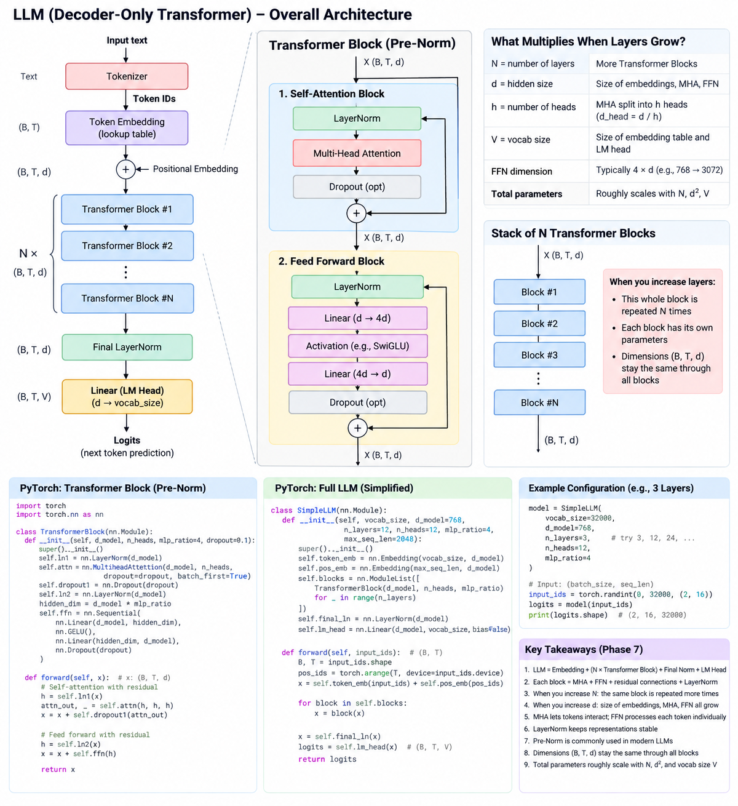

# Phase 7 — Transformer Block



> **Note (added):** the diagram above is the big picture this whole phase builds toward —
> keep it open while reading. Left panel: the full model, top to bottom (tokenizer →
> embeddings → `N ×` Transformer Blocks → final LayerNorm → LM head → logits). Middle
> panel: one Transformer Block zoomed in (exactly what sections 3–8 below derive). Right
> panels: what grows as you scale `N`/`d`/`h`/`V`, and the same architecture stacked. Bottom
> row: runnable PyTorch for a single block, the full model, an example config, and a
> "Key Takeaways" list that mirrors section 16 below almost line for line. One naming
> difference to note: the diagram's Feed Forward Block lists `Activation (e.g., SwiGLU)` —
> SwiGLU is what LLaMA-family models use; this doc (and `mini_llm.py`'s `MLP`) uses plain
> **GELU** instead, which is what the original GPT-2 uses. Both are valid choices for the
> same slot in the block.

## 1. What is a Layer?

A **layer** is a logical building block of a neural network that takes an input and transforms it into an output.

Example:

```python
layer = nn.Linear(4, 3)
```

This means:

```text
4 numbers
   ↓
Linear layer
   ↓
3 numbers
```

A layer can contain one operation, such as `Linear`, but a custom module can also contain multiple operations and be treated as one logical building block.

### `nn.Module`

PyTorch models and layers are built using `nn.Module`.

Examples:

```python
nn.Linear(...)
nn.LayerNorm(...)
nn.MultiheadAttention(...)
```

A complete model can contain many modules/layers.

---

## 2. Dynamic Number of Layers

The architecture can be configured with a parameter such as `n_layers`.

```python
class Model(nn.Module):
    def __init__(self, n_layers):
        super().__init__()

        self.layers = nn.ModuleList([
            nn.Linear(4, 4)
            for _ in range(n_layers)
        ])
```

Then:

```python
Model(3)    # 3 layers
Model(1000)  # 1000 layers
```

`ModuleList` tells PyTorch that these are model modules whose parameters need to be tracked.

The layers do not automatically connect just because they are in a `ModuleList`. The `forward()` method determines how they are used.

For sequential use:

```python
for layer in self.layers:
    x = layer(x)
```

This produces:

```text
Input
 ↓
Layer 1
 ↓
Layer 2
 ↓
Layer 3
 ↓
...
 ↓
Layer N
```

In contrast, MHA heads operate in parallel:

```text
        X
      / | \
     ↓  ↓  ↓
   Head1 Head2 Head3
     ↓  ↓  ↓
      \ | /
       Combine
```

---

## 3. What is a Transformer Block?

A Transformer Block is a larger building block made from several components.

A simplified **Pre-Norm Transformer Block** is:

```text
              X
              │
              ▼
         LayerNorm
              │
              ▼
   Multi-Head Attention
              │
              ▼
       + Original X
              │
              ▼
         LayerNorm
              │
              ▼
          FFN / MLP
              │
              ▼
       + Previous output
              │
              ▼
            Output
```

So:

> **Transformer Block = MHA + FFN + LayerNorm + Residual connections**

---

## 4. Residual / Skip Connection

Instead of replacing the input with the output of a sub-layer:

```text
X → MHA → Output
```

we keep the original input and add it back:

```text
X ─────────────────┐
│                  │
└→ MHA → Output → (+)
                  │
                  ▼
                Result
```

Mathematically:

```python
result = X + MHA(X)
```

The idea is to preserve the original information while adding the new information produced by the sub-layer.

This `X + ...` path is called a **residual connection** or **skip connection**.

---

## 5. What is LayerNorm?

A normalization layer keeps the values in a representation well-scaled/stable.

PyTorch:

```python
nn.LayerNorm(768)
```

If the representation has 768 values:

```text
768 values
    ↓
LayerNorm
    ↓
768 values
```

LayerNorm does **not** change the dimension.

At surface level, LayerNorm uses:

- Mean
- Variance
- Square root
- Learnable scaling parameter γ (gamma)
- Learnable shifting parameter β (beta)

Simple mental model:

> **LayerNorm = normalize the representation, then apply learned scaling and shifting.**

---

## 6. Feed Forward Network (FFN / MLP)

The Feed Forward Network is a small neural network inside each Transformer Block.

Basic structure:

```text
Input
  ↓
Linear
  ↓
Activation
  ↓
Linear
  ↓
Output
```

Example:

```text
768
 ↓
Linear: 768 → 3072
 ↓
GELU
 ↓
Linear: 3072 → 768
 ↓
Output
```

The dimensions expand and then contract.

### MHA vs FFN

A useful mental model:

```text
MHA = communication between tokens

FFN = processing the representation of each token
```

MHA allows tokens to interact with other tokens.

The FFN processes each token's representation independently after the attention operation.

---

## 7. Pre-Norm vs Post-Norm

The main difference is **where LayerNorm is placed**.

### Post-Norm

Normalization comes after the residual addition:

```text
X
 ↓
MHA
 ↓
X + MHA(X)
 ↓
LayerNorm
```

Mathematically:

```python
output = LayerNorm(X + MHA(X))
```

### Pre-Norm

Normalization comes before the sub-layer:

```text
X
 ↓
LayerNorm
 ↓
MHA
 ↓
X + MHA(LayerNorm(X))
```

Mathematically:

```python
output = X + MHA(LayerNorm(X))
```

The same idea is used around the FFN.

### Remember

```text
Pre-Norm:
LayerNorm → MHA/FFN → Residual

Post-Norm:
MHA/FFN → Residual → LayerNorm
```

Modern LLMs commonly use Pre-Norm-style Transformer Blocks.

---

## 8. Complete Pre-Norm Transformer Block

Putting the pieces together:

```text
                    X
                    │
                    ▼
               LayerNorm
                    │
                    ▼
          Multi-Head Attention
                    │
                    ▼
              + Original X
                    │
                    ▼
               LayerNorm
                    │
                    ▼
                 FFN
                    │
                    ▼
            + Previous result
                    │
                    ▼
                  Output
```

In equations:

```python
h = x + MHA(LayerNorm(x))

output = h + FFN(LayerNorm(h))
```

This is the basic Pre-Norm structure.

> **Note (added):** this is exactly `mini_llm.py`'s `Block.forward()`:
> `x = x + self.attn(self.ln1(x))` then `x = x + self.mlp(self.ln2(x))` — line for line the
> same `h = x + MHA(LayerNorm(x))` / `output = h + FFN(LayerNorm(h))` pattern above, just
> with `self.attn` being the hand-written `CausalSelfAttention` instead of
> `nn.MultiheadAttention`.

---

## 9. PyTorch — Small Transformer Block

A simplified implementation:

```python
import torch
import torch.nn as nn


class TransformerBlock(nn.Module):

    def __init__(
        self,
        d_model,
        n_heads,
        mlp_ratio=4
    ):
        super().__init__()

        # LayerNorm before attention
        self.ln1 = nn.LayerNorm(d_model)

        # Multi-Head Attention
        self.attn = nn.MultiheadAttention(
            embed_dim=d_model,
            num_heads=n_heads,
            batch_first=True
        )

        # LayerNorm before FFN
        self.ln2 = nn.LayerNorm(d_model)

        # Feed Forward Network
        hidden_dim = d_model * mlp_ratio

        self.ffn = nn.Sequential(
            nn.Linear(d_model, hidden_dim),
            nn.GELU(),
            nn.Linear(hidden_dim, d_model)
        )


    def forward(self, x):

        # Attention + residual
        h = self.ln1(x)

        attn_out, _ = self.attn(
            h, h, h
        )

        x = x + attn_out

        # FFN + residual
        h = self.ln2(x)

        x = x + self.ffn(h)

        return x
```

> **Note (added) — missing causal mask:** as written, `self.attn(h, h, h)` calls
> `nn.MultiheadAttention` with no `attn_mask`, so this block is **bidirectional** — every
> token can see every other token, including future ones. That's fine for a BERT-style
> encoder block, but this doc (and the attached diagram) is describing a **decoder-only**
> GPT-style block, which needs causal masking. `006_multi_head_attention.md` section 7
> shows the fix (`causal_mask = torch.triu(torch.ones(seq_len, seq_len), diagonal=1).bool()`
> passed as `attn_mask=causal_mask`) — the same fix applies here and to the `SimpleLLM` in
> section 14 below, which reuses this exact `TransformerBlock` and has the same gap.
> `mini_llm.py`'s own `CausalSelfAttention` never has this problem because it builds the
> causal mask into the class itself (`self.register_buffer("causal_mask", ...)`).

---

## 10. Shape Example

Suppose:

```python
batch_size = 2
sequence_length = 16
d_model = 768
n_heads = 12
```

Input:

```text
X shape = [2, 16, 768]
```

After MHA:

```text
[2, 16, 768]
```

After LayerNorm:

```text
[2, 16, 768]
```

After FFN:

```text
[2, 16, 768]
```

The FFN temporarily expands the last dimension:

```text
[2, 16, 768]
        ↓
[2, 16, 3072]
        ↓
[2, 16, 768]
```

The Transformer Block therefore receives and returns the same overall shape:

```text
[B, T, d]
   ↓
Transformer Block
   ↓
[B, T, d]
```

---

## 11. Multiple Transformer Blocks

A Transformer/LLM stacks the same type of block many times.

```text
Input representations
        ↓
Transformer Block 1
        ↓
Transformer Block 2
        ↓
Transformer Block 3
        ↓
       ...
        ↓
Transformer Block N
        ↓
Final LayerNorm
        ↓
Language Model Head
        ↓
Logits
```

If:

```python
n_layers = 3
```

conceptually:

```text
X
↓
Block 1
↓
Block 2
↓
Block 3
↓
Output
```

If:

```python
n_layers = 100
```

the same block architecture is repeated 100 times, with **separate learned parameters for each block**.

---

## 12. What grows when the number of layers grows?

Let:

- `N` = number of Transformer Blocks/layers
- `d` = model/embedding dimension
- `h` = number of attention heads
- `V` = vocabulary size
- FFN dimension ≈ `4 × d`

When you increase **N**:

```text
More N
  ↓
More Transformer Blocks
  ↓
More copies of MHA + FFN + LayerNorm parameters
  ↓
More total parameters
```

The sequence shape generally stays:

```text
[B, T, d]
```

through the Transformer Blocks.

For example:

```text
Block 1 → [B,T,d]
Block 2 → [B,T,d]
Block 3 → [B,T,d]
...
Block N → [B,T,d]
```

The layers are sequential.

---

## 13. Simple Full LLM Architecture

At a high level:

```text
Text
 ↓
Tokenizer
 ↓
Token IDs
 ↓
Token Embedding
 ↓
+ Position information
 ↓
[B, T, d]
 ↓
┌───────────────────────┐
│ Transformer Block 1   │
│  LayerNorm            │
│  MHA                  │
│  Residual             │
│  LayerNorm            │
│  FFN                  │
│  Residual             │
└───────────────────────┘
 ↓
┌───────────────────────┐
│ Transformer Block 2   │
│  LayerNorm            │
│  MHA                  │
│  Residual             │
│  LayerNorm            │
│  FFN                  │
│  Residual             │
└───────────────────────┘
 ↓
          ...
 ↓
┌───────────────────────┐
│ Transformer Block N   │
└───────────────────────┘
 ↓
Final LayerNorm
 ↓
Linear LM Head
 ↓
Logits
 ↓
Next-token probabilities
```

---

## 14. PyTorch — Simplified Full LLM Structure

This is only an architectural example, not a production LLM.

```python
import torch
import torch.nn as nn


class TransformerBlock(nn.Module):

    def __init__(self, d_model, n_heads, mlp_ratio=4):
        super().__init__()

        self.ln1 = nn.LayerNorm(d_model)

        self.attn = nn.MultiheadAttention(
            d_model,
            n_heads,
            batch_first=True
        )

        self.ln2 = nn.LayerNorm(d_model)

        hidden_dim = d_model * mlp_ratio

        self.ffn = nn.Sequential(
            nn.Linear(d_model, hidden_dim),
            nn.GELU(),
            nn.Linear(hidden_dim, d_model)
        )


    def forward(self, x):

        h = self.ln1(x)

        attn_out, _ = self.attn(
            h, h, h
        )

        x = x + attn_out

        h = self.ln2(x)

        x = x + self.ffn(h)

        return x


class SimpleLLM(nn.Module):

    def __init__(
        self,
        vocab_size,
        d_model,
        n_layers,
        n_heads,
        max_seq_len
    ):
        super().__init__()

        self.token_embedding = nn.Embedding(
            vocab_size,
            d_model
        )

        self.position_embedding = nn.Embedding(
            max_seq_len,
            d_model
        )

        self.blocks = nn.ModuleList([
            TransformerBlock(
                d_model,
                n_heads
            )
            for _ in range(n_layers)
        ])

        self.final_ln = nn.LayerNorm(d_model)

        self.lm_head = nn.Linear(
            d_model,
            vocab_size,
            bias=False
        )


    def forward(self, input_ids):

        B, T = input_ids.shape

        token_emb = self.token_embedding(input_ids)

        positions = torch.arange(
            T,
            device=input_ids.device
        )

        position_emb = self.position_embedding(positions)

        x = token_emb + position_emb

        for block in self.blocks:
            x = block(x)

        x = self.final_ln(x)

        logits = self.lm_head(x)

        return logits
```

> **Note (added):** same missing-causal-mask gap as section 9's `TransformerBlock` (this
> class reuses it) — see that note above for the fix. Also worth comparing this
> `SimpleLLM` to `mini_llm.py`'s `MiniGPT`: the overall shape (embed → blocks → final norm
> → LM head) matches exactly, but `MiniGPT` additionally ties `lm_head.weight` to
> `token_emb.weight` (weight tying — see `docs/mini_llm_qa.md` Q1), which this
> `SimpleLLM` does not do.

---

## 15. Example Configuration

```python
model = SimpleLLM(
    vocab_size=32000,
    d_model=768,
    n_layers=3,
    n_heads=12,
    max_seq_len=2048
)
```

If you change:

```python
n_layers=3
```

to:

```python
n_layers=12
```

the model creates 12 Transformer Blocks instead of 3.

The important part:

```python
self.blocks = nn.ModuleList([
    TransformerBlock(...)
    for _ in range(n_layers)
])
```

creates the repeated blocks.

Then:

```python
for block in self.blocks:
    x = block(x)
```

runs them sequentially.

---

## 16. What Phase 7 established

You should now have this mental model:

```text
Layer
 ↓
Building block

Transformer Block
 ↓
MHA + FFN + Norm + Residuals

LLM
 ↓
Many Transformer Blocks stacked sequentially
```

And:

```text
MHA
= communication between tokens

FFN
= processing each token representation

LayerNorm
= keeps representations well-scaled

Residual
= keeps original information and adds new information
```

### Phase 7 complete

Next phase:

**Phase 8 — Stacking Transformer Blocks and understanding how information changes from Block 1 → Block 2 → ... → Block N.**
