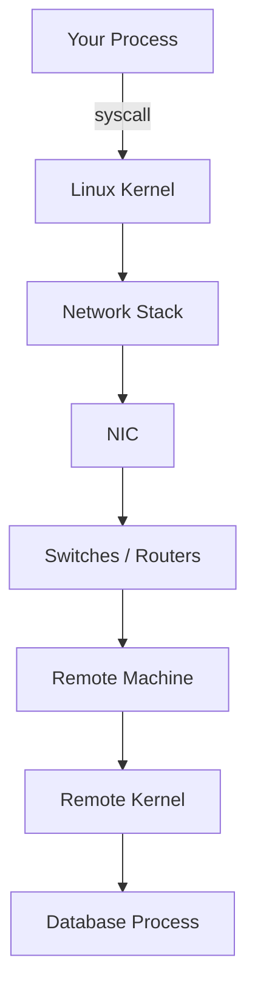
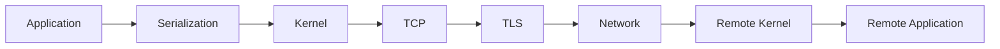
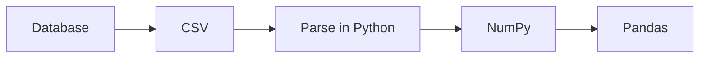
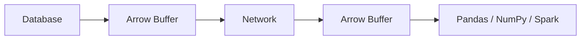
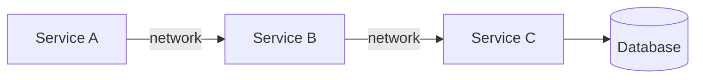

# Prerequisite Concepts, Part 8: The Cost of Communication

[Part 7](07_saturation_amdahls_law_and_hedged_requests.md) covered saturation and the
statistical tricks (hedged requests) that buy back tail latency. This part zooms out to the
idea underneath almost everything in this primer: **a network call is never a function
call, and the gap between how it looks in your source file and what it actually costs is
where most "why is this slow" investigations go to die.** [Part 3](03_communication_and_resilience.md)
already walked through the DNS → TCP → TLS → HTTP sequence and the resilience vocabulary
for when a call fails; [Part 6](06_mechanical_sympathy_and_physics_of_latency.md) already
derived Little's Law and the physical distance/bandwidth model. This part's job is
different: it treats communication as a **stack of taxes** — layers a request pays through
before your application logic ever runs — points back to Parts 3 and 6 for the pieces
already covered in depth, and goes further into the layers they don't: the kernel's
privilege boundary, the CPU cost of encryption and serialization, the protocol evolution
that exists specifically to avoid paying these taxes twice, and the concrete design moves
(batching, coarse APIs, caching, data locality) that reduce how often you pay them at all.

## The Fallacy of Local Code

Consider this code:

```python
def get_user_profile(user_id):
    user = db.fetch_user(user_id)
    preferences = cache.get(f"prefs:{user_id}")
```

Syntactically, it reads like two local function calls — `CPU → Database`, `CPU → Cache`,
done. What actually happens on the first line:



One line of Python may involve a DNS lookup, a TCP handshake, a TLS negotiation,
encryption, a kernel context switch, packet transmission, router hops, remote kernel
scheduling, database execution, response serialization, transmission back, and
deserialization — an entire distributed protocol wearing the syntax of a function call.
This gap between *looks local* and *is actually a WAN round trip* is called the **fallacy
of local code**, and it's a specific instance of a much older, well-known list worth
knowing by name.

**Deutsch and Gosling's Eight Fallacies of Distributed Computing** (Sun Microsystems, the
1990s) names the assumptions programmers unconsciously carry over from writing local code,
each one false the moment a call crosses a process boundary:

1. The network is reliable.
2. Latency is zero.
3. Bandwidth is infinite.
4. The network is secure.
5. Topology doesn't change.
6. There is one administrator.
7. Transport cost is zero.
8. The network is homogeneous.

**Why this list is worth citing by name in an interview**: naming it signals the gap isn't
a personal observation — it's a documented, decades-old failure mode that every distributed
system design has to actively design against, not something a good-enough programming
language eventually fixes. Every section below is really just one of these eight fallacies,
made concrete and given a number.

## The Request Lifecycle as a Stack of Taxes

Every remote call pays a sequence of layered costs before application logic runs:



Most developers only budget for the last box — "database execution time." Architects
budget for everything before it. The table below is the map; the sections after it cover
the entries that Parts 3 and 6 don't already own in depth.

| Tax | What it is | Covered in depth |
|---|---|---|
| DNS resolution | Resolving a hostname to an IP before anything else can happen | [Part 3](03_communication_and_resilience.md#what-actually-happens-when-you-hit-enter), [Part 9](09_dns_bgp_and_the_edge.md#dns-fully-unpacked-the-hierarchy-behind-one-bullet-point) |
| TCP handshake | SYN / SYN-ACK / ACK before any application byte flows | [Part 3](03_communication_and_resilience.md#what-actually-happens-when-you-hit-enter) |
| TLS handshake | Negotiating encryption before any application byte flows | [Part 3](03_communication_and_resilience.md#what-actually-happens-when-you-hit-enter) |
| Kernel / syscall | Crossing the privilege boundary between your process and the NIC | This doc |
| Serialization | Turning language objects into bytes and back | This doc |
| TLS compute | The CPU cost of encrypting/decrypting every byte, *after* the handshake | This doc |
| Reliability / retries | Detecting and recovering from lost packets | This doc, [Part 3](03_communication_and_resilience.md#resilience-vocabulary) |
| Queueing | Waiting for a busy server, governed by Little's Law | [Part 6](06_mechanical_sympathy_and_physics_of_latency.md#littles-law-l-w) |
| Physics | The speed-of-light floor on propagation delay | [Part 6](06_mechanical_sympathy_and_physics_of_latency.md#distance-of-data-one-physical-idea-two-different-scales), worked example below |

## The Kernel Tax: Every Byte Crosses a Privilege Boundary

An application cannot touch the network card directly — hardware access is a privileged
operation, so every send/receive goes `Application → syscall → Kernel → NIC`. Each syscall
costs a **privilege switch**, a register save, a context switch, and kernel scheduling —
individually cheap (illustrative and approximate: low microseconds), but multiplied across
thousands of small requests per second it becomes a real, measurable tax, and it compounds
with the context-switching cost already covered from the CPU-cache side in
[Part 6](06_mechanical_sympathy_and_physics_of_latency.md): each kernel transition
invalidates CPU caches, stalls the pipeline, and resets branch predictors, so the CPU spends
cycles switching contexts instead of computing.

This is precisely the tax that **kernel-bypass technologies** exist to avoid — a strategy
of "stop asking the kernel to mediate every single packet":

- **DPDK** (Data Plane Development Kit) — lets a userspace application drive the NIC
  directly, skipping the kernel's networking stack entirely for latency-critical paths.
- **io_uring** — a Linux kernel interface that batches I/O submission and completion
  through shared ring buffers, sharply cutting the *number* of syscalls needed for a given
  amount of I/O.
- **eBPF** — runs sandboxed code *inside* the kernel at hook points, avoiding a full
  userspace round trip for packet filtering, load balancing, and observability.
- **RDMA** (Remote Direct Memory Access) — lets one machine read/write another machine's
  memory directly, bypassing both machines' kernels and CPUs for the transfer itself.

**Why large cloud providers invest heavily here**: at the scale of a hyperscaler's fleet,
shaving even a few microseconds of kernel overhead per packet compounds into measurable
fleet-wide CPU and cost savings — the same "small constant factor, huge scale" logic behind
most low-level infrastructure investment in this repo.

## The TLS Compute Tax (Distinct From the TLS Handshake)

Part 3 covers the TLS *handshake* — the negotiation that happens once per connection.
There's a second, ongoing TLS cost that's easy to miss: once the handshake is done, **every
byte of the payload still has to be encrypted on send and decrypted on receive**, for the
entire lifetime of the connection. This is real CPU work, not a one-time setup fee, which is
exactly why modern CPUs ship **AES-NI** — dedicated instructions that accelerate AES
encryption/decryption in hardware rather than software, because at the volume a busy service
handles, software-only crypto would visibly tax the CPU budget on every single request.

## The Serialization Tax: Objects Aren't Bytes

Your program holds Python objects, Java objects, Go structs, C++ classes — the network
understands only bytes. Every remote call pays `Object → Serialization → Bytes → Network →
Bytes → Deserialization → Object`, and the *format* chosen for that middle step has a real
performance cost, not just a readability one.

**JSON** — easy for humans, expensive for CPUs:

```json
{"id": 123, "name": "Alice"}
```

Parsing it costs string parsing, UTF-8 decoding, dynamic memory allocation, hash-map
construction, and repeated copies — a CPU spends real, measurable time turning text back
into structured memory on both ends of every call.

**Binary protocols** — Protocol Buffers, FlatBuffers, Cap'n Proto, Avro, MessagePack — skip
almost all of that: a field is a fixed number of bytes at a known offset, no string parsing,
smaller payloads, less CPU, less memory, less bandwidth. **Zero-copy serialization** goes
one step further, arranging memory so data can move `Memory → Network → Memory` without a
copy step at all — copying memory is, itself, surprisingly expensive at volume, for exactly
the mechanical-sympathy reasons Part 6 covers for memory hierarchies generally.

### Apache Arrow: Killing Serialization Between Systems, Not Just Across the Wire

A traditional analytics pipeline pays the serialization tax *repeatedly*, once per hop:



Every arrow in that diagram is a copy-and-reparse step. **Apache Arrow** defines a standard
**columnar in-memory format** that every hop can share directly:



The same memory layout survives the whole trip, giving zero-copy reads, SIMD-friendly
processing, better CPU cache utilization, and cross-language interoperability (Python,
Java, C++, Rust, Go) — a dramatic cut to serialization overhead specifically for analytical
workloads. (Worth flagging explicitly since the two names are easy to conflate: **Apache
Airflow** is a workflow orchestrator — see [Part 8: ML Orchestration](../ml_system_design/08_ml_orchestration.md)
— and has nothing to do with in-memory data layout; Arrow is the one relevant here.)

## Reliability, Retries, and Tail Latency

Networks lose packets. TCP detects a missing one via timeout and retransmits it — which
means a request budgeted for 2 ms can, on a bad packet, suddenly cost 200 ms. Average
latency can stay low while **tail latency explodes**, which is exactly why large-scale
systems optimize P95/P99/P99.9 instead of the mean — Google's own observation is that slow
requests dominate perceived user experience in systems operating at real scale, and Part 7's
hedged-request pattern exists specifically to buy back this tail.

TCP also deliberately **slows itself down under congestion** (algorithms: Reno, Cubic, BBR)
— without this, every sender would keep transmitting into an already-overloaded network,
producing full collapse instead of graceful slowdown. The queueing side of this tax — what
happens when the *server*, not the network, is the busy resource — is exactly Little's Law
territory, fully derived with its feedback-loop failure mode in
[Part 6](06_mechanical_sympathy_and_physics_of_latency.md#littles-law-l-w); the
short version worth repeating here is that **processing time is frequently not where the
latency is** — a 2 ms database query behind an 80 ms queue is an 82 ms request whose
bottleneck has nothing to do with the query.

## Physics Sets the Floor: A Worked RPC Example

Part 6 derives the general distance/bandwidth model; here's what it costs a concrete,
cold cross-region RPC. Light in vacuum travels at 300,000 km/s; in fiber-optic glass, the
refractive index slows it to roughly 200,000 km/s (illustrative and approximate — exact
figures depend on the fiber and route, the relationship is the point). San Francisco to
London is roughly 8,500 km one-way, ~17,000 km round trip — giving a theoretical minimum
RTT of `17,000 / 200,000 ≈ 85 ms` that no engineering effort can beat; it's a property of
the glass and the distance, not the software.

Stack a **cold** connection's taxes on top of that floor (HTTP/1.1, TLS 1.2, illustrative
figures):

| Step | Cost |
|---|---|
| TCP handshake | ~85 ms (1 RTT) |
| TLS handshake | ~170 ms (2 RTTs, TLS 1.2) |
| HTTP request/response | ~85 ms (1 RTT) |
| Database execution | ~5 ms |
| **Total** | **≈345 ms** |

Of that ≈345 ms, the database itself accounts for 5 ms — under 2% of the total. **The
database was never the bottleneck; the connection setup was.** This single number is the
entire argument for everything in the rest of this doc: keep-alive connections, TLS session
resumption, HTTP/2 multiplexing, and QUIC/HTTP/3's 0-RTT resumption all exist because paying
~340 ms of setup tax on every request, when the actual work costs 5 ms, is not a database
performance problem — it's a communication-design problem.

## Protocol Evolution: Paying the Setup Tax Fewer Times

**HTTP/1.1** — one connection per request (or limited keep-alive), head-of-line blocking,
many repeated handshakes.

**HTTP/2** — a single TCP connection, multiplexed so many requests travel concurrently,
binary framing, and header compression (HPACK) to shrink repeated header overhead.

**HTTP/3 (QUIC)** — replaces the layered `TCP → TLS → HTTP` stack with one integrated
protocol running over UDP, so connection setup and encryption negotiate together instead of
sequentially:

| Protocol | Transport | Multiplexing | Handshake cost |
|---|---|---|---|
| HTTP/1.1 | TCP | No | High |
| HTTP/2 | TCP | Yes | Medium |
| HTTP/3 | QUIC | Yes | Lowest |

QUIC also enables **0-RTT**: a returning client that already has a valid session can send an
encrypted request in its very first packet, skipping the handshake round trips entirely —
for the mobile and cross-region cases where every RTT is expensive (per the worked example
above), this is a large, direct performance win rather than a marginal one.

### Version Negotiation: Who Decides, and How to Check

None of the versions above is something either side unilaterally imposes — the version used
on a given connection is **negotiated as an intersection of what both sides support**,
decided once at connection-setup time, not set as some global switch.

**For HTTPS, negotiation happens via ALPN (Application-Layer Protocol Negotiation), inside
the TLS handshake itself**: the client's `ClientHello` carries an ordered list of protocols
it's willing to speak (e.g., `h2, http/1.1`), and the server's response picks the highest one
it also supports. Whatever gets picked is what that connection speaks for its entire
lifetime — a browser that supports HTTP/2 talking to a server that's never had it enabled
falls back to HTTP/1.1 automatically, with neither side needing any explicit configuration
to make that fallback happen.

**HTTP/3 (QUIC) is discovered differently**, since it runs over UDP and can't ride TLS's
ALPN inside an existing TCP connection: a server first responds over HTTP/1.1 or HTTP/2 with
an `Alt-Svc` header advertising that it also speaks HTTP/3 on a given port, and a supporting
client can then opportunistically try QUIC on a subsequent connection to that host.

**Plain, unencrypted HTTP has no ALPN to negotiate through at all** — HTTP/1.1 is the
default, and while an HTTP/2-over-cleartext mode (`h2c`) technically exists in the spec, no
browser implements it, so in practice HTTP/2 is TLS-only outside of internal/service-mesh
traffic where both ends are controlled.

**Who actually decides which versions are even on the table:**

- The **server operator** decides what's enabled — an nginx/Envoy/load-balancer config turns
  HTTP/2 listening on or off; a backend framework decides whether it speaks HTTP/2 at all.
- The **client** decides what it offers to try — a browser offers `h2` by default; a plain
  HTTP client library (`requests`, vanilla `axios`) usually defaults to HTTP/1.1 unless an
  HTTP/2-capable transport is explicitly enabled (e.g., `httpx` with `http2=True`).
- Neither side can force a version the other doesn't support — it's always the best
  mutually-supported option, picked automatically, per connection.

**How to actually check what version a connection used:**

- **Browser DevTools** — Network tab, add the "Protocol" column: shows `http/1.1`, `h2`, or
  `h3` per request.
- **curl** — `curl -Iv https://example.com` shows the ALPN negotiation in its verbose output
  (`ALPN: server accepted h2`) and the response status line's version (`HTTP/2 200`);
  `curl --http1.1` or `--http2` forces a specific version to test what the server actually
  supports.
- **`curl -w '%{http_version}\n' -o /dev/null -s <url>`** — prints just the negotiated
  version, useful for a quick scripted check.

This is worth checking as part of the same "why is this slow" investigations this doc is
about — a service silently falling back to HTTP/1.1 that you assumed was on HTTP/2 (and
therefore paying one handshake for many concurrent calls) is a common, invisible way
concurrency gets more expensive than expected.

### gRPC: Multiplexing the Tax Away at the Application Layer

Plain REST over HTTP/1.1 often pays a fresh `Request → TCP → Close → Repeat` cycle per call.
**gRPC** runs over HTTP/2, so many requests share one already-established, already-encrypted
connection — fewer handshakes, less congestion, lower latency, native streaming, and binary
serialization (Protocol Buffers) instead of JSON. This combination is exactly why Discord,
Google, and most cloud-native service meshes lean on gRPC for internal service-to-service
traffic rather than REST.

## Concurrency and Locality: How Many Handshakes Actually Happen

A common point of confusion: if a client fires N concurrent REST calls at the same server,
does that mean N TCP handshakes and N TLS handshakes? **It depends entirely on whether the
connection is reused, not on the request count itself:**

- **No connection reuse** (a client that opens a fresh socket per call, or a server response
  with `Connection: close`) — every one of the N concurrent requests pays its own TCP
  handshake, and its own TLS handshake if HTTPS, all happening in parallel with each other.
  N requests really does mean N handshakes here.
- **HTTP/1.1 with keep-alive and a connection pool** (the default in most real HTTP client
  libraries — `requests.Session()`, `axios` with an agent, most server-side SDKs) — the
  client maintains a small number of already-open connections and reuses them across
  requests. But HTTP/1.1 allows only one request in flight per connection at a time, so
  *concurrent* requests beyond the pool's size still have to wait for a free connection
  rather than automatically getting a new one — a pool of 6 connections serving 100
  concurrent requests pays roughly 6 handshakes total, with the other 94 requests queued,
  not re-handshaking.
- **HTTP/2 (and gRPC, which runs on it)** — one TCP handshake and one TLS handshake, full
  stop, regardless of concurrency. Every concurrent request rides as an independent
  multiplexed stream over that single already-open connection — the protocol-evolution
  argument above, applied directly to concurrent traffic rather than just sequential reuse.

**The special case of localhost.** A TCP socket connecting to `127.0.0.1` still runs the
exact same three-way handshake — TCP has no concept of "this peer happens to be on the same
machine," so the SYN/SYN-ACK/ACK exchange still happens as a protocol formality. What
changes is the cost: the packets never reach a NIC or a physical wire — they're routed
through the kernel's **loopback interface**, a purely in-memory path, so none of [Part 6's
physical-distance
model](06_mechanical_sympathy_and_physics_of_latency.md#distance-of-data-one-physical-idea-two-different-scales)
or [Part 9's DNS/BGP path-finding](09_dns_bgp_and_the_edge.md) is in play at all, and the
round trip is measured in microseconds instead of milliseconds. It's the same handshake,
paid at a cost close to zero.

If even that formality is worth avoiding for same-host inter-process communication, **Unix
domain sockets** (as opposed to TCP over `127.0.0.1`) skip the TCP handshake and IP-layer
machinery entirely — many databases and local RPC setups default to one for exactly this
reason when the client and server are guaranteed to share a host.

## Microservices: A Communication Tax by Design Choice

Microservices buy independent deployability and team autonomy — genuinely worth having —
but every service boundary drawn on an architecture diagram is also a **network boundary**,
and every hop across it re-pays DNS, TCP, TLS, serialization, retries, monitoring,
authentication, and rate limiting:



versus a monolith's `Function() → Function() → Function()`, which pays none of it. Many
small services compound into a **latency amplification** problem — a single user-facing
request can fan out into a dozen internal RPCs, each carrying its own tail-latency risk
(per the reliability section above), so the *slowest* hop, not the average one, sets the
user-visible latency floor. A **service mesh** (Envoy/Istio-style sidecar proxies) adds yet
another hop — intercepting every call for retries, mTLS, and observability — which buys
real operational value but is itself an additional tax layered on top, worth naming
explicitly when someone proposes adding a mesh "for free."

None of this means microservices are the wrong call. It means **every service boundary
should justify its communication cost** — a boundary drawn along a genuine team/ownership
line is worth the tax; a boundary drawn for its own sake (a "user service" and a "profile
service" that always change together and are always called together) is paying real,
compounding latency for an org-chart preference.

## Paying Less Tax: Data Locality, Batching, Coarse APIs, and Caching

Four concrete design moves, each reducing *how often* or *how far* communication has to
happen, rather than making any single call faster:

**Data locality — move computation to the data, not data to the computation.** Pulling
100 GB out of a database into application code to filter it there pays the full
serialization-and-transfer tax on data that's mostly discarded; pushing a `WHERE` clause
into SQL and pulling back 100 rows pays that tax on only what's kept. Spark, Snowflake,
ClickHouse, and Databricks are all built around this same principle at larger scale.

**Batching — amortize the round trip across many items.** 1,000 individual `GET /user/{id}`
calls pay 1,000 round trips; one `POST /users/batch` call carrying all 1,000 IDs pays one.
The per-item cost of a network round trip is fixed regardless of payload size within
reason, so batching turns a linear cost in *requests* into a roughly constant one.

**Coarse-grained APIs — let the server orchestrate, not the client.** Fetching `Get User →
Get Orders → Get Address → Get Preferences` as four separate calls pays four round trips
from a client that might be on a slow or distant connection; a single `Get Dashboard` call
that performs that orchestration server-side (where the fan-out is likely happening over a
fast, low-latency datacenter network instead) pays one round trip from the client and
absorbs the internal fan-out where it's cheapest.

**Caching — the cheapest network request is the one you never make.** Every step further
from the CPU costs roughly another order of magnitude in latency (illustrative and
approximate — exact figures vary by hardware generation, the *relationship* is the point;
see [Part 6](06_mechanical_sympathy_and_physics_of_latency.md#distance-of-data-one-physical-idea-two-different-scales)
for why distance drives this):

| Storage | Latency |
|---|---|
| CPU register | <1 ns |
| L1 cache | ~1 ns |
| L2 cache | ~4 ns |
| L3 cache | ~10-20 ns |
| RAM | ~100 ns |
| NVMe SSD | ~100 µs |
| Network (same datacenter) | ~100-500 µs |
| Cross-region network | 10-100+ ms |

A local cache hit doesn't just return data faster than a remote fetch — it eliminates an
entire round trip's worth of DNS/TCP/TLS/kernel/serialization tax from the table earlier in
this doc, all at once.

## Designing From First Principles

When designing any distributed system, run through these questions — they matter more, more
often, than the choice of language or framework:

1. Can I avoid the communication entirely?
2. Can I cache the result?
3. Can I batch multiple requests into one?
4. Can I move computation closer to the data?
5. Can I keep the connection open (keep-alive, HTTP/2, gRPC) instead of re-establishing it?
6. Can I reduce serialization cost (a binary format instead of JSON)?
7. Can I reduce kernel crossings (fewer, larger syscalls)?
8. Can I reduce cross-region traffic specifically, given the speed-of-light floor?
9. Can I tolerate eventual consistency to reduce coordination overhead (the trade-off
   [Part 2](02_data_and_consistency.md) covers in depth)?
10. Given the tail-latency risk any single hop carries, does this call even need to be
    synchronous (per [Part 3](03_communication_and_resilience.md#synchronous-vs-asynchronous-communication))?
11. Is my connection pool sized for actual concurrency, or am I assuming keep-alive alone
    means concurrent requests never re-pay the handshake?
12. Have I actually checked (via ALPN/DevTools/`curl`) which HTTP version a given service
    negotiates, or am I assuming HTTP/2 because the server config says it's enabled?

**The mental model that ties it together**: a local function call is handing a note to the
person sitting next to you — instant, no packaging required. A remote call is an
international courier shipment — it must be packaged (serialized), given an address (DNS),
routed (TCP), passed through security (TLS), moved through congested infrastructure
(network, queueing), and possibly resent if lost in transit (retries). The syntax on the
page looks identical either way; the cost is not, and mistaking one for the other is the
fallacy this whole doc is named after.

## Key Takeaways

- Local-looking code can hide an entire distributed protocol's worth of remote cost.
- In distributed systems, latency is usually dominated by communication, not computation —
  the worked example above spent 98% of its time on setup, 2% on the actual query.
- Every request pays some subset of: DNS, TCP, TLS (handshake *and* ongoing compute),
  kernel transitions, serialization, queueing, congestion control, and retries.
- Physics sets an absolute floor via the speed of light — no engineering effort crosses it,
  only shortens the distance that has to be crossed.
- Binary protocols (Protocol Buffers, Arrow) beat verbose text formats (JSON) whenever
  performance, not just human readability, is the goal.
- Reusing connections (HTTP/2, gRPC, HTTP/3/QUIC) amortizes handshake cost across many
  requests instead of re-paying it every time.
- Whether concurrent requests re-pay the handshake depends on connection reuse, not request
  count — no pooling means N requests pay N handshakes; a connection pool caps it at the
  pool size; HTTP/2 caps it at one, period.
- A handshake to `127.0.0.1` still happens structurally (TCP doesn't know the peer is
  local), but costs almost nothing — it never leaves the loopback interface, so none of the
  physical-network taxes apply.
- The HTTP version a connection uses is negotiated, not configured globally — ALPN (inside
  the TLS handshake) picks the best version both client and server support, and either side
  falling back silently (no HTTP/2 enabled server-side, no HTTP/2-capable client library) is
  easy to miss without actually checking.
- Move computation to the data, not the other way around.
- Batch operations and prefer coarse-grained APIs to amortize round-trip cost.
- Cache aggressively — the fastest network request is the one that never happens.
- Optimize tail latency (P95/P99), not just the average, since that's what users feel.

## Quick Self-Check

- A single line of application code calling a database involves DNS, TCP, TLS, kernel
  transitions, and serialization before the query executes. Which of Deutsch and Gosling's
  eight fallacies does each of those correspond to?
- In the worked SF↔London example, why does trimming the database query time have almost no
  effect on total latency, while switching to a resumed/kept-alive connection (or HTTP/3's
  0-RTT) has a large one?
- Why is JSON's *cost* mostly about parsing (string handling, allocation, hash-map
  construction) rather than raw payload size — and why doesn't a smaller JSON payload fix
  that?
- A team proposes splitting one service into five microservices along org-chart lines, with
  no change in which data is usually read together. What communication tax did that
  decision just introduce, and what would justify paying it?
- Why does caching eliminate *more* than just the data-fetch time — what specific taxes
  from the request lifecycle table does a cache hit skip entirely?
- If a client fires 100 concurrent requests at the same server over HTTP/1.1 with a
  connection pool of 6, roughly how many TCP+TLS handshakes actually happen, and what
  happens to the other 94 requests while they wait?
- Why does a TCP connection to `127.0.0.1` still perform a three-way handshake at all, and
  why is its cost negligible compared to the same handshake over a real network?
- Who actually decides whether a given connection speaks HTTP/1.1, HTTP/2, or HTTP/3 — and
  what specifically would make a client that supports HTTP/2 silently fall back to HTTP/1.1
  without either side raising an error?

## Articulate It: Interview Framing & Vocabulary

### Three Ways to Explain This

- **Taxation framing (the default for "why is this slow" or system-design trade-off
  questions):** "I think of every remote call as paying a stack of taxes before any
  application logic runs — DNS, TCP, TLS, kernel transitions, serialization, queueing — and
  in one worked cross-region example, those taxes were 98% of total latency while the
  actual database query was 2%. That's usually where I'd look first, not the query."
- **Fallacies-of-distributed-computing framing (good for signaling this isn't a personal
  observation but a known failure mode):** "This is really Deutsch and Gosling's eight
  fallacies made concrete — the code assumes the network is reliable and free, and it isn't
  either. Naming the specific fallacy in play tells you which fix applies: retries for
  'the network is reliable,' caching or a CDN for 'latency is zero,' mTLS for 'the network
  is secure.'"
- **Amortization framing (good for batching/coarse-API/protocol/concurrency questions):**
  "Almost every fix here is really the same move: pay the fixed cost of a round trip once
  and spread more work across it — batching spreads it across items, a coarse API spreads
  it across what would've been several client calls, and connection reuse spreads it across
  requests, whether those requests are sequential (keep-alive) or concurrent (HTTP/2
  multiplexing over one connection instead of one handshake per in-flight request). Which
  version is even available to multiplex over isn't a setting either side controls alone —
  it's whatever both client and server negotiate via ALPN, so I'd verify it rather than
  assume it."

### Vocabulary Builder

**Technical shorthand — use these instead of over-explaining the concept every time:**

- **fallacies of distributed computing** (n. phrase) — Deutsch and Gosling's canonical list
  of eight false assumptions programmers carry over from local code into distributed
  systems; citing it by name signals the failure mode is well-documented, not anecdotal.
- **kernel bypass** (n. phrase) — techniques (DPDK, io_uring, RDMA) that let an application
  avoid routing every packet through the kernel's networking stack, cutting syscall and
  context-switch overhead.
- **0-RTT** (n. phrase) — a returning client sending an encrypted request in its very first
  packet, skipping connection-setup round trips entirely; a headline feature of QUIC/HTTP/3.
- **coarse-grained API** (n. phrase) — an endpoint that performs server-side orchestration
  across several internal calls so the client pays one round trip instead of several.
- **latency amplification** (n. phrase) — the compounding effect of chaining several
  network hops (as in a microservice fan-out), where the slowest hop, not the average,
  determines user-visible latency.
- **connection pool** (n. phrase) — a client-maintained set of already-open connections
  reused across requests; its size, not keep-alive alone, is what caps how many handshakes
  concurrent traffic actually pays.
- **loopback interface** (n. phrase) — the kernel's purely in-memory network path for
  traffic to `127.0.0.1`/`localhost`; a TCP handshake over it is still real but costs
  microseconds, not milliseconds, since no NIC or physical wire is ever involved.
- **ALPN (Application-Layer Protocol Negotiation)** (n. phrase) — the TLS-handshake
  extension where client and server agree on which application protocol (`h2` vs.
  `http/1.1`) the connection will speak, before any HTTP data is exchanged.
- **Alt-Svc** (n. phrase) — a response header a server uses to advertise that it also
  speaks HTTP/3 on a given port, since QUIC can't be negotiated via TLS ALPN on an existing
  TCP connection the way HTTP/2 is.

**Expressive phrases — for stating a trade-off fluently instead of listing pros/cons:**

- **"…the database was never the bottleneck; the connection setup was"** — a precise way to
  redirect a performance conversation away from query tuning toward connection/protocol
  design when the numbers show setup dominating.
- **"…every service boundary should justify its communication cost"** — a fluent way to
  push back on a microservice split that isn't backed by an actual team or scaling reason.
- **"…the fastest network request is the one you never make"** — a compact, quotable
  argument for caching, batching, or data locality over optimizing the call itself.
- **"…the same handshake, paid at a cost close to zero"** — a precise way to explain
  localhost/loopback traffic without implying it skips the protocol entirely.
- **"…the best mutually-supported option, not something either side can force"** — a
  precise way to describe any negotiated protocol choice (HTTP version, TLS cipher suite)
  without implying the client or server unilaterally decides it.

---

**Previous:** [Part 7: Saturation, Amdahl's Law & Hedged Requests](07_saturation_amdahls_law_and_hedged_requests.md)  |  **Next:** [Part 9: The Anatomy of a Request (DNS, BGP, and the Edge)](09_dns_bgp_and_the_edge.md)
